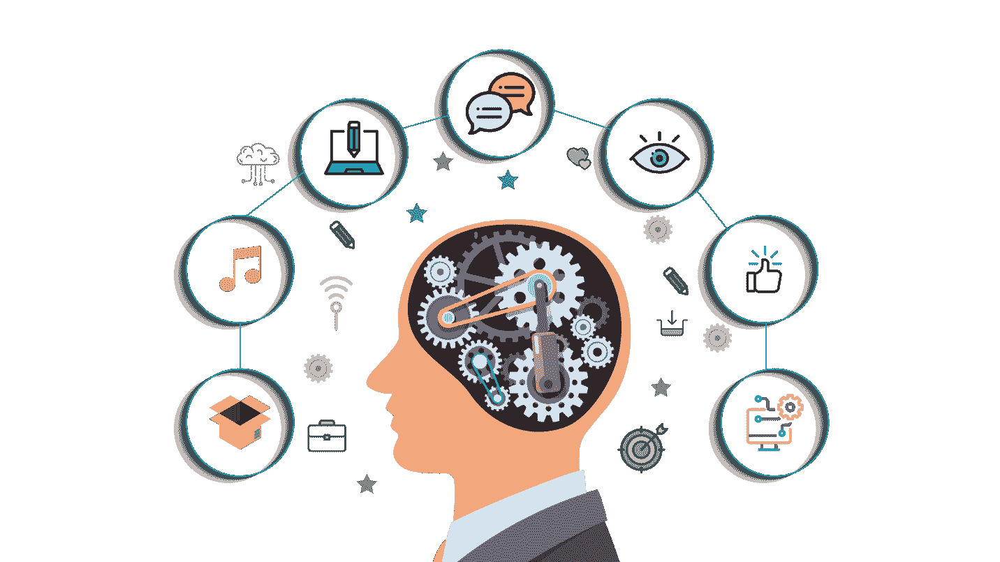
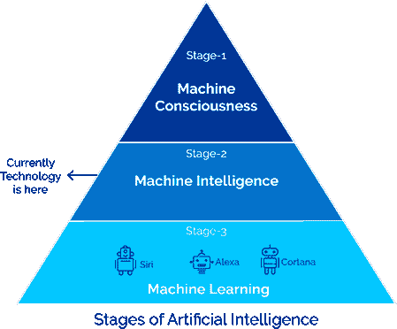
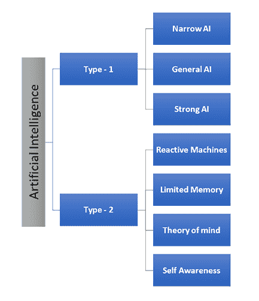
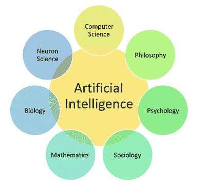
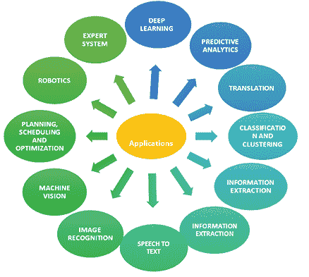

# 人工智能导论

> 原文：<https://learnetutorials.com/artificial-intelligence/artificial-intelligence-tutorials-for-beginners>

人工智能，简称 **AI** ，现在是一项快速发展的技术，也是计算机科学环境中引人入胜的通用领域之一，未来的范围最大。我们生活在一个一切都以这样或那样的方式与人工智能相关的时代。如今，你能想象没有智能手机的一天吗？实际上，对于我们需要的每一件东西，这款简单的手机。当人工智能与这款简单的手机结合在一起时，它变成了一个多功能系统，从“电话”变成了“智能手机”。那么，什么是 AI 呢？

## 什么是 AI？

在这个世界上，我们都被机器和智能设备包围着，其中许多都是基于人工智能原理工作的。
让我们想象一辆自动驾驶汽车，汽车本身是在没有驾驶员的帮助下，从像人脑这样的各种传感器接收到的数据中做出决策的。这怎么可能？答案是 AI。

让我们再举一个象棋的例子。你有没有想过电脑或智能手机是如何像人类对手一样完美地发挥的？同样，答案是人工智能或人工智能。

因此，我们可以将人工智能定义为一台机器，它能够在没有人为干预的情况下，从接收到的数据中独立做出决策。所以，人工智能是被称为人工的人工智能。

让我们试着理解术语**人工智能**的含义，将术语拆分为两个:**人工+智能**。术语“**人造的**指的是由人类产生的东西，而不是自然产生的，更具体地说，是自然事物的复制品。**智力**这个词指的是获得和应用知识和技能的能力。所以，简而言之，**人工智能就是人工创造的智能**。

人类使用大脑(智力)的不可思议的能力使他们有别于其他生物。学习、推理和解决问题是人类智力的关键因素。人类智力是理性思考、有目的地行动、有效应对环境的心理素质。当这种人类智能集成在机器上模仿人类行为时，一种新技术出现了，被称为人工智能。

如果一台机器正在使用人工智能，就不需要像普通机器一样针对不同的情况进行预编程或重新编程。有了人工智能，机器可以理解以前从未发生过的情况或条件，并做出决策。

## 人工智能的定义

我们怎么定义智力，这么难对吧？在人工智能的情况下也是如此，人工智能不仅仅是一种技术，它是一组技术共同作用，使机器能够感知、掌握、行动和学习，并利用智能做出决策。因此很难用一种方式定义人工智能，因此人工智能有一套不同的定义。让我们看看不同的人是如何定义人工智能的:
约翰·麦卡锡，定位为人工智能之父的人之一，在 20 世纪 50 年代创造了人工智能这个术语。他说:“原则上，学习的每个方面或智能的任何其他特征都可以如此精确地描述，以至于可以制造一台机器来模拟它。将试图找到如何让机器使用语言、形成抽象和概念、解决现在留给人类的各种问题，并提高自己。”

英国牛津生活词典给出了这样的定义:
“*能够执行通常需要人类智能的任务的计算机系统的理论和发展，例如视觉感知、语音识别、决策和语言间的翻译*”。

AI 的另一个定义是:“*人工智能是人类智能在人造机器上的刺激，这些机器用一组算法很好地编程，这些算法可以与它们自己的智能一起工作，并表现得像人类*”

## 为什么 AI 很重要？

在深入研究人工智能之前，我们必须了解为什么需要这项新技术？人工智能能为我们的世界提供什么？还有更多。让我们讨论人工智能在现代世界中的一些用途。

*   我们可以在一些基于人工智能的软件的帮助下轻松解决现实生活中的问题，这些软件比人类更精确，比如医疗诊断、交通、天气、股票交易等。
*   我们都使用过我们的虚拟助手，如谷歌、siri 或 alexa 等。都是基于 AI 的。
*   图像处理和模式分析是人工智能的一个应用级程序，现已广泛应用于各个领域
*   我们能够创造出具有自主动态决策能力的机器人，这将在关键任务中帮助人类，而不会造成任何生命损失。

## AI 是如何工作的？

我们已经讨论过 AI 不是单一的技术，一般来说，我们可以把 AI 的工作解释为一台机器，它能够从不同的设备接收大量的数据，并使用不同的智能算法和动态决策来处理和学习这些数据。
AI 让机器使用我们称之为子域的技术的大量组件进行决策。为了理解人工智能实际上是如何工作的，你需要了解人工智能的子域，并理解这些域是如何应用的。

*   **机器学习**:机器学习教机器根据过去的经验进行推理和决策。
*   **深度学习**:ML 技术教机器处理输入来分类、推断和预测结果。
*   **神经网络**:神经网络的工作原理与人类神经细胞相似。一系列算法，捕捉各种变量之间的关系，并像人脑一样处理数据。
*   **自然语言处理**:通过机器阅读、理解、解释语言的技术。
*   **计算机视觉**:算法试图通过分解图像和研究不同的部分来理解图像。
*   **认知计算**:算法试图通过像人类一样分析文本、图像、声音、物体来模仿人脑，并试图产生所需的输出。

## 人工智能的 3 个阶段

现在我们知道了人工智能和对人工智能的需求，以及人工智能是如何工作的。现在让我们检查一下人工智能的生命周期。人工智能有哪些不同的阶段？

**阶段 1: -机器学习**

一组算法，用于教机器根据过去的经验进行推理和决策

**阶段 2: -机器智能**

高级算法被机器用来从经验中学习。深度神经网络就是一个例子。目前，人工智能技术正处于这一阶段。

**阶段 3: -机器意识**

机器从经验中学习，不需要外部数据。

## 人工智能的类型

我们上面提到，人工智能在现代世界中有广泛的应用和功能。有很多领域使用这些人工智能应用程序，从简单的游戏开始，甚至在军事行动中。因此，一般来说，人工智能可以根据人工智能机器的能力和人工智能机器可以完成的功能大致分为两种类型。

基于**能力** AI 分为三类:

1.  **狭义(WEAK) AI** :能够执行自动驾驶汽车、零售亭等单一任务。；
2.  **GENERAL (STRONG) AI** :据说有人类思维一样的能力和功能。例如:游戏中的 AI。
3.  **超级人工智能**:假设的智能体，拥有超越人类智能的能力(并有可能接管世界)。

基于**功能**人工智能分为四类:

1.  **REACTIVE AI** :只对现有的情况做出反应，而不是过去的经历。
2.  **LIMITED MEMORY AI** :从最近的经历中学习，做出决策。
3.  **心灵理论 AI** :机器能够理解情绪，能够区分不同人的各种情绪。
4.  **自我感知人工智能**:系统形成自身的表现。

## 是什么促成了 AI？

人工智能不仅仅是计算机编程，它不仅仅是一种技术。我们已经说过，人工智能正在制造一台机器来分析和学习数据，并根据学习到的数据做出决策。让我们想想人类的智能，我们知道智能是**推理、学习、解决问题、感知、语言智能、**等的组合。就像人工智能包含许多计算机和数学方面一样。要实现机器人工智能的上述因素，需要以下方面的帮助

*   计算机科学
*   哲学
*   心理学
*   社会学
*   数学
*   生物
*   神经系统科学

## 人工智能的目标

现在我们了解了人工智能，是时候讨论一下我们使用人工智能的目标是什么，或者我们将使用人工智能取得什么成就。

*   推理和解决问题。
*   知识表示。
*   人工计划。
*   开发能够自主学习的智能机器。
*   开发能够阅读和理解人类语言的机器。
*   开发机器从传感器获取输入，并做出相应的反应。

## 人工智能的历史

| One thousand nine hundred and forty-three | 第一个人工神经元**阈值逻辑单元(TLU)**或**线性阈值单元**是由神经生理学家**沃伦·麦卡洛**和数学家**沃尔特·皮茨**提出的。该模型被特别定位为大脑中“**神经网络**”的计算模型。 |
| One thousand nine hundred and forty-nine | **唐纳德·赫布**一位心理学家介绍了**赫布边学习**的神经科学概念，也称为**赫布的规则或细胞组装理论**，它反过来试图连接学习的心理和神经基础。 |
| One thousand nine hundred and fifty | 数学家艾伦·图灵提出了一个想象游戏 **(** **】图灵测试** **)** ，用来测试机器表现出与人类相当的智能行为的能力。 |
| One thousand nine hundred and fifty-five | 第一个被刻意设计用来执行自动推理的人工智能程序叫做**逻辑理论家**，它是由计算机科学和认知心理学研究员**艾伦·纽厄尔**、经济学家、政治学家和认知心理学家**司马贺**和系统程序员**克里夫·肖**编写的。逻辑理论家在鲁塞尔的《数学原理》第二章中证明了前 52 个定理中的 38 个。其中一个证明实际上比鲁塞尔手工制作的证明更优雅 |
| One thousand nine hundred and fifty-six | **计算机科学家约翰·麦卡锡**组织了**达特茅斯会议**，会上首次采用了术语“**人工智能”**。 |
| 1956-1959 | 高级计算机语言如**FORTRAN****LISP**或 **COBOL** 被发明出来。 |
| One thousand nine hundred and sixty-six | 第一个名为伊莱扎的聊天机器人是由约瑟夫·韦森鲍姆创建的。 |
| One thousand nine hundred and seventy-one | 第一个专家系统，DENDRAL，是由计算机科学家爱德华·T2·费根鲍姆引入的。 |
| One thousand nine hundred and seventy-two | 世界上第一个名为 **WABOT** 的拟人机器人被研发出来。 |
| 1974- 1980 | 1974-1980 年间的持续时间被称为第一个人工智能冬天。在这段时间里，公众对人工智能的兴趣似乎减弱了，面向在机器中开发人工智能的活动缺乏资金。 |
| One thousand nine hundred and eighty | 第一届全国人工智能大会在加州斯坦福召开。 |
| 1987-1993 | 1987-1993 年间的持续时间是第二个人工智能冬天。由于成本高，资金短缺再次成为一个大问题。像 **XCON** 这样的专家系统非常划算。 |
| One thousand nine hundred and ninety-seven | 一台名为 **IBM 深蓝**的 IBM 电脑在六场比赛后击败了世界象棋冠军 |
| Two thousand and two | **iRobot** 启动 **Roomba** ，它可以导航一个家庭的地板区域并进行清洁。 |
| Two thousand and six | 未来 50 年达特茅斯人工智能大会(AI@50) 召开。 |
| Two thousand and nine | 谷歌打造**自动驾驶** **汽车**。 |
| Two thousand and ten | 微软为第一款追踪人体运动的游戏设备 **Xbox 360** 推出了 dynamic。 |
| 2011-2014 | 苹果的 **Siri** ，谷歌的**谷歌的**，微软的 **Cortana。** |
| Two thousand and fifteen | 谷歌 **Deepmind 旗下的 AlphaGo** 以 5 比 0 击败 3 届欧洲围棋冠军 2 丹职业选手范辉。 |
| Two thousand and eighteen | 一款 AI 程序“ **Duplex** ”由虚拟助手谷歌演示。 |
| Two thousand and twenty | 会议猫头鹰、Kuri 移动机器人等。 |

## 人工智能的优势

以下是人工智能的一些主要优势

*   **高精度** -做出正确决策的能力是 AI 的主要优势之一。人工智能驱动的机器使用认知计算，这使得它们能够实时做出没有任何情绪的逻辑决策。
*   **LESS ERROR** -基于 AI 的机器有助于解决复杂的现实世界问题。由于机器是为完成特定任务而编程的，因此出错的可能性非常小，这取决于我们如何设计和编程机器来执行任务。
*   **高可靠性** -基于 AI 的机器有助于长时间执行重复性任务，而不会出现任何减速。它可以无限期地工作，而不缺乏生产力。
*   **数字辅助** - AI 驱动的应用提供数字辅助。如今，大多数组织利用数字辅助来执行自动化任务。基于人工智能的数字辅助有许多实际应用，如谷歌地图、Grammarly、Alexa 等。
*   **对危险环境有用** -基于人工智能的机器可以用于人类生命可能面临风险的领域，如拆除炸弹、探索海底等。
*   **高速** -人工智能系统可以具有非常高的速度和快速的决策。
*   **作为公共事业有用** -欺诈检测、支付福利金和移民决定等。是 AI 的公用事业应用的一些例子。
*   **24*7 可用性** -人类员工不能 24 小时工作，因为他们需要时间来提神。人工智能可以提供服务，没有任何延迟或缺乏效率。

## 人工智能的缺点

如此有利，人工智能仍然有一些缺点，在创建人工智能系统时必须牢记在心。以下是其中一些:

*   **高成本**-人工智能机器的创造非常昂贵。为了满足这个不断变化的世界的需求，硬件和软件应该定期更新。人工智能驱动的设备由复杂的代码、算法、软件和硬件组成。维护这些需要很大的努力和大量的资金。
*   **失业率上升-AI** 取代低技能员工。由于基于人工智能的机器可以 24*7 工作，准确性提高，因此行业更喜欢人工智能，而不是雇佣人类。
*   **缺乏创造力**-人工智能机器仍然无法击败人类智能的力量来创造或想象新的想法。人工智能只能执行它被编程的任务，并通过经验来提高自己。
*   **laching IMPROVEMENT**-AI 算法旨在让机器从获得的数据中学习。数据中的任何冗余都可能导致学习失败，并可能产生不可预测的结果。他们只能为他们被编程的工作。因此，由于缺乏改进，人工智能生成的结果可能会不准确，并造成巨大损失。
*   **没有感觉和情绪**-人工智能驱动的机器致力于算法、数学计算和认知技术。他们缺乏判断能力，因为他们不知道伦理、道德、对与错。如果我们试图在需要强大判断能力的地方实现人工智能，那将是一个巨大的失败。
*   **增加对机器的依赖性**-随着技术的进步，人们对机器的依赖性越来越强，因此他们失去了心智能力。

## 人工智能的应用

现在我们使用人工智能的领域很多，可以根据人工智能的用途和功能进行分类。请参见下表，了解在应用程序级别使用人工智能的类别及其应用。

| **区域** | **应用程序** |
| **深度学习应用程序** | 欺诈检测。自动驾驶汽车。虚拟助理。超级计算。客户关系管理系统。投资建模。面部识别系统。 |
| **预测分析** | 谷歌流感趋势(GFT)堆亚马孙网飞会跑吗能谱仪犹达 |
| **翻译** | 监护语言姐姐！姐姐 SDL 政府天篷创新文本抓取器伊犁飞行员谷歌翻译脸谱网网络电话 |
| **分类和聚类** | 梦幻足球和体育文件分析识别欺诈或犯罪活动网络流量分类营销和销售垃圾邮件过滤器识别假新闻 |
| **信息提取** | 商业智能金融调查科学研究媒体监控卫生保健记录管理制药研究 |
| **语音转文本** | 龙在哪里谷歌助手转录-语音到文本语音笔记-语音到文本语音笔记脑子里语音文本器-语音到文本 |
| **文字转语音** | 演讲中心语音梦想阅读器马达头朗读者判决穆尔夫网络振动 |
| **图像识别** | 谷歌镜头流动点击查看树叶折断卡路里妈妈他们还活着屏幕上显示程序运行的图片 |
| **机器视觉** | 电子元件分析签名识别光学字符识别手写识别物体识别模式识别材料检验货币检查医学图像分析 |
| **计划、调度和优化** | 顶级规划师运输用半黑盒子规划师 4J 豆丁网计划识别为计划谷歌日历日历英雄 |
| **机器人** | 星舰传送机器人胡椒人形机器人便士餐厅机器人宁博安全机器人影子灵巧手莫利机器人厨房系统机器人厨房助手 |
| **专家系统** | 霉菌素树枝状 PXDES 幼子 |

## 人工智能在我们日常生活中最常用的应用

*   谷歌人工智能驱动的预测(例如:谷歌地图)。
*   拼车应用(例如:优步、莱夫特)。
*   商业飞行中的人工智能自动驾驶。
*   电子邮件上的垃圾邮件过滤器。
*   抄袭检测工具。
*   面部识别。