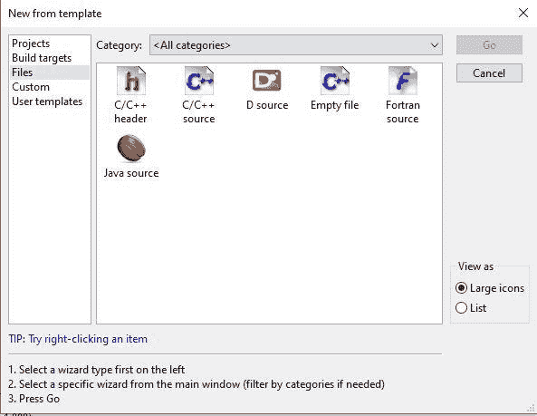
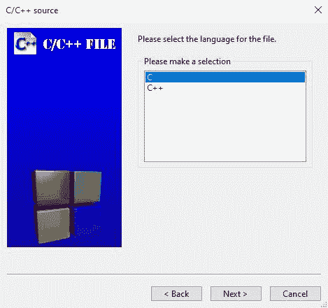
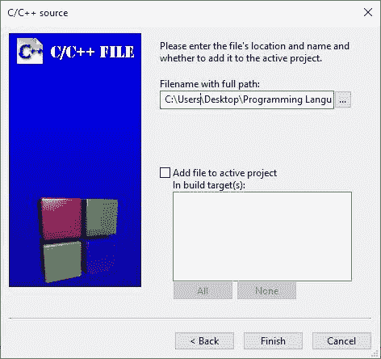
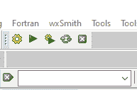

# C 语言中的编译和执行

> 原文：<https://learnetutorials.com/c-programming/compilation-execution>

在本 C 教程中，您将学习启动 IDE 来编写第一个程序。此外，您还将学习以优雅的方式编译和执行程序的各种方法。

## 启动集成开发环境

要开始用 C 语言编写第一个程序，需要启动代码块 IDE。按照以下步骤创建一个新的 C 文件。

1.  打开代码块
2.  转到文件菜单->新建->文件。将弹出如下所示的窗口，询问您想要什么类型的文件。在我们的例子中，我们选择了选项 C/C++源码和 GO。
3.  选择 C，点击【下一步】按钮
4.  指定要创建文件的路径并命名，然后单击“完成”按钮。
5.  代码块 IDE 在完成文件创建后看起来像这样。

在文本编辑器部分，您可以创建所需的程序，然后保存该程序以备将来使用。要保存程序，您可以使用快捷键 Ctrl+S 或工具栏中的保存图标。

## 编译和执行 C 程序

程序创建后，下一个要做的重要动作是 C 程序的编译和执行。编译仅仅意味着检查创建的程序在语法上是否正确。执行意味着运行代码以产生输出。

在这里，我们将逐步讨论如何在 Windows 环境中使用代码块执行编译和执行。

在代码块中，我们有一个**构建**图标来编译程序，还有一个**运行**图标来执行程序。如果我们想一次编译并运行，工具栏上还有另一个名为**构建并运行**的图标。此外，重建和中止图标也可用。所有这些选项都使用户的工作变得无忧无虑。

操作构建和运行的另一种方法是进入菜单栏**构建**，在这里所有选项及其快捷键都可用。

>

保存程序后，您必须使用上述任一选项编译程序，我们使用 **Ctrl+F9** 。编译后的所有消息将出现在文本编辑器区域下方日志窗口的**构建日志选项卡**中。你会看到这样的东西:

这里你可以看到没有错误，但有两个警告。错误可以是语法错误或导致程序停止编译的异常。一旦我们遇到错误，我们需要先解决它，然后再继续。当警告告诉你你做错了什么，你可以现在改正，或者保持现状，以后再改正。警告永远不会停止编译。

现在你可以**运行你的程序**，它会给你一个如下图所示的窗口。您的所有输出都将显示在此窗口中。

注意:确保按键盘上的任意键关闭此窗口。保持这个打开状态会禁用代码块中的构建和运行活动。