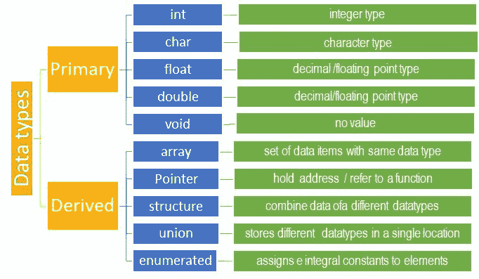

# C 语言中的数据类型

> 原文：<https://learnetutorials.com/c-programming/data-types-modifiers>

在本教程中，您将通过示例程序掌握 C 语言中使用的基本数据类型，如字符、整数和小数。此外，您还将了解在 C #中用来改变数据类型的修饰符。

## 如何用 C 语言定义数据类型？

与任何其他编程语言相比，C 语言具有更简单和紧凑的数据类型。数据类型可以定义为一种变量或对象可以保存并基于该数据执行操作的数据。它还有助于确定程序员打算编译或解释的数据的类型和大小。根据数据类型，可以分配内存，这意味着我们可以在内存中分配数据及其操作所需的空间。

C 处理器接收的所有类型的数据输入主要包括三种类型-

*   性格；角色；字母
*   整数
*   小数。

在 C 语言中，这三种类型分别表示为“ **char** ”、“ **int** ”、“ **float** ”，称为**主数据类型**。例如:

1.  int a，int b，int c；/* a、b、c 是数据类型整数的变量。*/
2.  char x，y，z；/* x，y，z 是数据类型字符的变量。*/
3.  float pi = ' 3.14/*pi 是数据类型 float*/的变量

事实上，这种语言中数据类型的数量是无限的，因为用户可以根据自己的需要定义新的数据类型。在下一节中，我们将详细讨论这些主要数据类型。



### C 语言中的数据类型

正如我们已经看到的，数据类型有各种类型，因此有不同的规范。下表给出了 32 位体系结构系统中每种数据类型对应的格式说明符、内存大小和值范围。

| 数据类型 | 格式规范 | 存储容量 | 数值范围 |
| 茶 | %c | 1 字节 | -128 到 127 |
| （同 Internationalorganizations）国际组织 | %d | 2 字节 | -32，768 至 32，767 |
| 漂浮物 | %f | 4 字节 | 1.2E-38 至 3.4E+38 |
| 两倍 | %lf | 8 字节 | 2.3E-308 至 1.7E+308 |
| 空的 | - | - | - |

## 什么是 C 语言中的修饰语

修饰符是用于改变原始数据类型当前特征的关键字。前缀为基本数据类型的修饰符可以增加或减少数据类型的大小或符号。基本上在 c 语言中有两种类型的修饰语

*   符号修饰符-有符号或无符号
*   尺寸修饰-短或长

### 符号修饰符

当使用无符号修饰符时，数字总是**正**，当使用有符号修饰符时，数字可以是**正或负**。如果没有提到修饰符，那么默认情况下会分配一个带符号的限定符。当我们事先知道数字总是正数时，我们通常使用无符号修饰语。此外，这些修饰符只能用于 int 和 char 类型。

### 尺寸修改器

**大小修改器**帮助增加或减少数据类型的大小。当使用短修饰符时，它减少了数据类型的范围，而长修饰符则相反，即增加了数据类型的范围。需要考虑的重要一点是，这些大小修饰符对 int 数据类型很有效，double 只能使用 long。char 和 float 都不使用这些修饰符。

正如在 C 语言中，数据类型的大小取决于所使用的机器，对于 16 位机器，类型的大小是 2 字节，而对于 32 或 64 位机器，类型的大小是 4 字节。

## 整数数据类型

数据类型“int”表示特定范围内的任何正整数或负整数。范围因编译器而异，例如:在 16 位编译器(如 Turbo C/C++)的情况下，范围为-32768 到 32767，而 32 位编译器(如 Visual C++)的范围为- 2147483648 到 2147483647。一般来说，像英特尔奔腾这样的 32 位处理器可以成功运行 16 位编译器，但反之则不允许。

| 数据类型 | 格式规范 | 存储容量 | 范围 |
| 短整数/短符号整数 | %d | 2 字节 | -32，768 至 32，767 |
| 无符号短整型 | %hu | 2 字节 | 0 至 65，535 |
| 整数/有符号整数 | %d | 4 字节 | -2147483648 到 2147483647 |
| 无符号整数 | %d | 4 字节 | 0 到 4294967295 |
| 短整型 | %hd | 2 字节 | -32，768 至 32，767 |
| 长整型/有符号长整型 | %ld | 8 字节 | -2，147，483，648 至 2，147，483，647 |
| 无符号长整型 | %lu | 8 字节 | 0 至 4，294，967，295 |

“int”可以定义为两个不同的子集:short 和 long。它们可以分别声明为“短整型”或“短整型”和“长整型”或“长整型”。前者的范围是-32768 到 32767，后者是 2147483648 到 2147483647。在适用的情况下，使用“短”数据类型可以显著提高处理速度。' int '也可以分为有符号和无符号两个子类别。将数据类型从' int '更改为' unsigned int '会使其数字存储容量翻倍(0 到 65535)，并省略所有负数。

```c
#include <stdio.h>
#include <stdlib.h>
void main()
{

int a;
int short b;
short c;
int long d;
long e;
 printf(" Size of  a is %d\n",sizeof(a));
 printf(" Size of  b is %d\n",sizeof(b));
 printf(" Size of  c is %d\n",sizeof(c));
 printf(" Size of  d is %d\n",sizeof(d));
 printf(" Size of  eis %d\n",sizeof(e));

 printf(" Signed int - INT_MAX     :   %d\n", INT_MAX);
 printf(" Signed int - INT_MIN     :   %d\n", INT_MIN);
 printf(" Unsigned int - UINT_MAX    :   %u\n", (unsigned int) UINT_MAX);

}

```

**输出:**

```c
Size of  a is 4
 Size of  b is 2
 Size of  c is 2
 Size of  d is 4
 Size of  e is 4

 Signed int - INT_MAX     :   2147483647
 Signed int - INT_MIN     :   -2147483648
 Unsigned int - UINT_MAX    :   4294967295 
```

## 浮点数据类型:

如果需要使用任何小数或十进制数，必须声明浮点数据类型。它在内存中分配 4 字节的内存，其值在-3.4e38 到 3.4e38 之间。对于更大的数字，还有另一种数据类型“double”，它占用 8 字节的内存。它的值在-1.7e308 到 1.7e308 之间。如果所需的数字更大，您可以使用“long double ”,它占用 10 个字节的内存，范围为-1.7e4932 到 1.7e4932。下面显示了一个表格表示。

| 类型 | 格式规范 | 存储容量 | 数值范围 | 精确 |
| 漂浮物 | %f | 4 字节 | 1.2E-38 至 3.4E+38 | 小数点后 6 位 |
| 两倍 | %lf | 8 字节 | 2.3E-308 至 1.7E+308 | 小数点后 15 位 |
| 长双 | %Lf | 10 字节 | 3.4E-4932 至 1.1E+4932 | 小数点后 19 位 |

这些天类型声明的说明如下:

```c
#include <stdio.h>
#include <stdlib.h>
#include <limits.h>
#include <float.h>
void main()
{

float x;
double y;
long double z;

 printf(" Size of  x is %d\n",sizeof(x));
 printf(" Size of  y is %d\n",sizeof(y));
 printf(" Size of  z is %d\n\n",sizeof(z));

 printf(" Float Minimum Range     :   %g\n", (float) FLOAT_MIN);
 printf(" Float Maximum Range     :   %g\n", (float) FLOAT_MAX);
 printf(" Double Maximum Range    :   %g\n", (double) DBL_MAX);

}

```

**输出:**

```c
Size of  x is 4
 Size of  y is 8
 Size of  z is 16

Float Minimum Range     :   1.17549e-038
Float Maximum Range     :   3.40282e+038
Double Maximum Range    :   1.79769e+308 
```

## 字符数据类型

简单地说，数据类型“char”被设计成通过 a、b、c 等键盘进行单次输入(单次按键)。虽然看起来有点混乱，但是也有两种类型的“字符” **-有符号的和无符号的**。实际上键盘的每个字符都对应一个特定的 ASCII 值。一个简单的程序就会显示出来。

```c
#include <stdio.h>
#include <stdlib.h>
#include <limits.h>
#include <float.h>

void main()
{

char c;
         printf("Enter any character -->");
         scanf("%c", &c);
         printf("ASCII value of %c is %d\n", c, c);
         printf("Size of  c is %d\n\n",sizeof(c));

         printf("Character Minimum Range   :   %d\n", CHAR_MIN);
         printf("Character Maximum Range   :   %d\n", CHAR_MAX);

} 

```

在这个程序中，' %c '将显示精确的字符，而%d 将显示相应的 ASCII 值。例如，如果输入“C”，输出将是“C 的 ASCII 值是 67”。

```c
Enter any character -->C
ASCII value of C is 67
Size of  c is 1

Character Minimum Range   :   -128
Character Maximum Range   :   127 
```

有符号和无符号字符的概念来了。顾名思义，前者的数值范围是-128 到+127，而后者的数值范围是 0 到 255。稍后我们将不得不处理字符的数值。在这些情况下，将数据类型指定为“无符号字符”会有很大帮助，因为计算正整数要容易得多。下表显示了 C 编程中字符数据类型的大小和范围。

| 类型 | 格式规范 | 存储容量 | 数值范围 |
| 漂浮物 | %c | 1 字节 | -128 到 127 |
| 两倍 | %c | 1 字节 | 0 到 255 |

## 无效数据类型

C 中的“Void”表示“nothing”或“null”。它完全不同于任何其他数据类型，如“int”或“char”，它们对应于具有特定属性的实体。它主要用于指针相关的操作，在这些操作中，我们需要在地址级别更改变量值。为了理解这一点，我们必须了解“指针”，这将在后面讨论。

通过分析函数返回类型，将更容易理解“void”。如果函数被定义为“int check()；”或者 char check()；，这意味着返回值将分别是整数或字符。这里有一个简单的例子:

```c
int check();
{
int a; 
a = 5;
return  a; 
} 

```

但是当一个函数不得不什么都不返回时，可以使用像打印一个语句 void 这样的简单任务。例如:

```c
void check_it();
{
printf(" Void is printing a statement ");
} 
```

* *因此 void 告诉编译器不要接受任何参数。