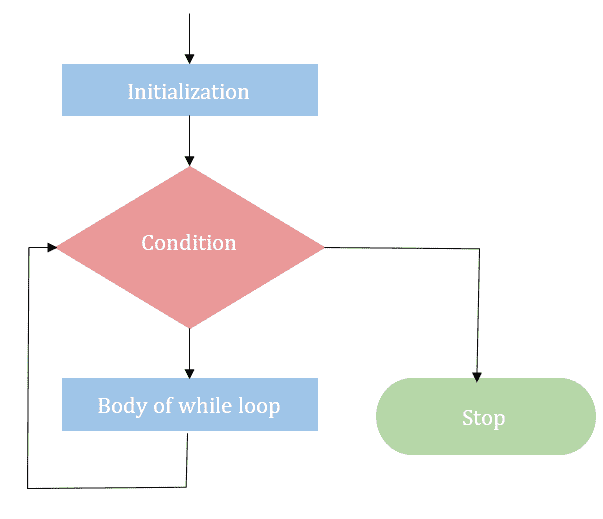
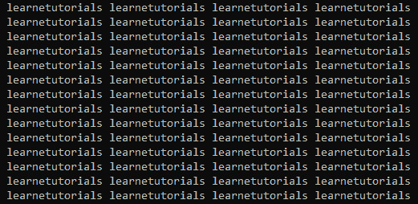

# C 语言中的循环

> 原文：<https://learnetutorials.com/c-programming/loops>

在本教程中，您将掌握 C 语言中循环的所有方面。C 编程语言使用 for 循环、while 循环和 do-while 循环以三种独特的方式支持循环。此外，您将看到 c 语言中的无限循环是如何工作的。

很多时候，我们会遇到特定代码块需要重复执行的情况。当我们计算一个数的阶乘，比如 7，乘法继续发生在下一个较小的数(6，5，4..)并且循环继续，直到它达到 1。如果我们可以只写一次乘法的通用代码，并重复执行它，直到达到所需的值(这里是 1)，那就太好了。这组被重复的公共代码在编程语言中被统称为“循环”。

## 在编程中使用循环的主要好处是

*   循环支持代码重用
*   循环减少了代码的复杂性和冗余
*   循环有助于非常容易地遍历数组、链表等数据结构。

## C 语言中循环的类型

在 C 编程中，循环基本上分为三类:

1.  for 循环
2.  while 循环
3.  边做边循环

## 对于 C 中的循环:

C 语言中的“for”关键字可以使循环执行看起来简单易懂。for 循环是 C 程序中经常使用的循环，也称为预测试循环。这是因为条件是在执行循环体之前评估的。For 循环用于迭代次数事先已知的情况。
for 循环的结构以关键字‘for’开头，后面跟一个括号()，在括号中你要写三个用分号操作的东西

一、初始化 **(i=1)**
二。条件 **(i < =5)**
iii。增量 **(i=i+1 或++i 或 i++)**

### for 循环的语法

```c
for (initialization; condition test; increment or decrement)
{
       //loop body contains statements to be executed
} 

```


### FOR 循环的流程图

**步骤 1** :第一步也是最重要的一步是初始化计数器变量。

**第二步**:第二步评估条件，测试计数器变量是否符合指定条件。

*   如果条件返回 true，则执行 for 循环体中的代码。
*   如果条件返回 false，则 for 循环终止，控制退出循环。

**第 3 步**:在最后一步，根据操作(+或-)，计数器变量递增或递减。

```c
 #include<stdio.h>
void main()
{
    int i;
      for(i=1;i<=10;++i)
       {
         printf("%d\n",(i*i));
       }

} 

```

**输出:**

```c
1
4
9
16
25
36
49
64
81
100 
```

这个例子可以解释如下。

**步骤 1** :最初计数器变量 I 用值 1 初始化。
**第二步**:条件 **i < = 10** 求值，即检查 1 小于等于 10，条件返回真。
**第三步**:控制转移到循环内的语句，打印 **(i*i)** ，表示 1*1。打印结果 1。
**第 4 步**:当操作为**I+**时，计数器变量值增加到 2，并重复上述步骤，直到条件失败。即当计数器变量值达到 11 时，它将终止循环并退出循环。

### 循环本体

大括号{}中的语句构成 for 循环的主体(循环主体)。如果循环只包含一条语句，那么就没有必要用大括号把它们括起来。大括号决定了主体的范围，因此被称为块分隔符。life 是在 for 循环中声明的变量，只限于该循环，而不在循环之外。

```c
#include<stdio.h>
void main()
{
    int i;
      for(i=1;i<=10;++i)
       {
         int j = 5;
         printf("%d , %d\n",i,j);
       }

} 

```

**输出:**

```c
1 , 5
2 , 5
3 , 5
4 , 5
5 , 5
6 , 5
7 , 5
8 , 5
9 , 5
10 , 5 
```

## C 语言中循环的嵌套

c 语言也支持“for 循环”的嵌套。循环中的循环通常称为嵌套循环。嵌套可以在任何级别进行，但是在编写脚本时保持简单和复杂是更好的选择。嵌套 for 循环通常用于表示二维数组。

### 循环的嵌套语法

```c
for (initialization; condition; increment/decrement)   
{  
    for(initialization; condition; increment/decrement)  
    {  
           // body of inner loop.  
    }  
    // body of outer loop.  
} 

```

下面简单的代码片段展示了如何使用嵌套 for 循环打印乘法表。

```c
#include<stdio.h>
void main()
{
    for (int i=1; i<2; i++)
   {
 for (int j=1; j<=10; j++)
 {
    printf("%d x %d = %d\n",i ,j,(i*j));
 }
   }

}

```

**输出:**

```c
1 x 1 = 1
1 x 2 = 2
1 x 3 = 3
1 x 4 = 4
1 x 5 = 5
1 x 6 = 6
1 x 7 = 7
1 x 8 = 8
1 x 9 = 9
1 x 10 = 10 
```

## 在 C 中循环时

C 语言中另一种可用的循环是 while 循环。就像 for 循环一样，while 循环也称为预测试循环，因为在执行之前会检查条件。当我们事先不知道迭代次数时，通常使用循环。

### while 循环的语法

```c
while(condition){  
//body of while loop 
} 

```

在这种循环体系结构中，while 后面跟一个条件，如果满足这个条件，循环就开始执行。在每个循环执行之后，编译器将检查 while 下的条件是否仍然满足。如果是，循环将一次又一次地执行，否则不会。



### WHILE 循环流程图

### While 循环示例

让我们看看我们是如何改变前面打印数字方块的例子的。

```c
#include<stdio.h>
void main()
{
    int i;
      i=1;
      while (i<=10)
       {
          printf("%d\n",(i*i));
          i=i+1;
      }

}

```

**输出:**

```c
1
4
9
16
25
36
49
64
81
100 
```

请注意，我们给了“I”一个初始值 1。在第一个循环中,“while”检查它是否小于或等于 10。当 1<10 时，代码执行并将 1 的平方打印为 1。语句“i=i+1”将“I”的值从 1 增加到 2。现在“while”再次检查，发现 2<10，因此打印 2 的平方，即 4。类似地，3，4，....直到 10 点被打印出来。但是在最后一个循环的最后一个语句中，I 变成了 11。所以“while”发现 11 既不小于也不等于 10，循环终止。

## 嵌套边循环

像 for 循环一样，我们也可以将一个 while 循环嵌套在另一个 while 循环中。

### 嵌套 while 循环的语法

```c
while(condition)  
{  
    while(condition)  
    {  
         // body of the inner loop.  
    }  
// body of outer loop. 

```

### 嵌套 while 循环示例

参见下面的例子，使用嵌套 while 循环打印乘法表。

```c
#include<stdio.h>
void main()
{
    int i=1;
 while(i<2)
 {
     int j =1;
     while(j<=10)
     {
        printf("%d x %d = %d\n",i ,j,(i*j));
        j=j + 1;
     }
     i=i + 1;
 }

}

```

**输出:**

```c
1 x 1 = 1
1 x 2 = 2
1 x 3 = 3
1 x 4 = 4
1 x 5 = 5
1 x 6 = 6
1 x 7 = 7
1 x 8 = 8
1 x 9 = 9
1 x 10 = 10 
```

## 做..而洛普在 C

C 语言中的另一种循环类型是 do-while 循环，它类似于 while，只是条件评估只在 do-while 主体中的语句执行之后进行。因此，do-while 循环也称为条件后循环。do-while 循环主要用于我们需要像菜单驱动程序一样至少执行一次体内语句的地方。

为了清楚地理解它，让我们考虑一个电视遥控器的情况，其中您有多个选择(菜单驱动)来观看电视:如果您想通过电视上的频道冲浪，您必须至少观看一个频道，当您达到无聊的状态时，您可以冲浪到其他频道。

### do 的语法..while 循环

```c
do{  
//body of do-while loop   
} while(condition); 

```

*   在这个循环中，首先进行值的初始化。
*   然后关键字“do”后面跟大括号{}，在大括号中写入语句和增量。
*   紧接着，要评估的条件被写在关键字“while”之后。

### 做..while 循环示例

下面的代码举例说明了边做边循环。

```c
#include<stdio.h>
#include <stdlib.h>void main()
{
int channel,cursor;
    char c;
    do{
    printf("\n1.TLC\n2.CNN\n3.GEO\n4.Exit\n");
    scanf("%d",&choice);
    switch(channel)
    {
        case 1 :
        printf("I am Watching TLC\n");
        break;
        case 2:
        printf("I am watching CNN\n");
        break;
        case 3:
        printf("I am watching GEO\n");
        break;
        case 4:
        exit(0);
        break;
        default:
        printf("Watching default channel - BBC");
    }
    printf(" \n Do you want to surf another channel?");
    scanf("%d",&cursor);
    scanf("%c",&c);
    }while(c=='y');
}</stdlib.h>

```

**输出:**

```c
1.TLC
2.CNN
3.GEO
4.Exit
2
I am watching CNN

Do you want to surf another channel?y

1.TLC
2.CNN
3.GEO
4.Exit
1
I am Watching TLC

Do you want to surf another channel?n 
```

## 嵌套 do..while 循环

像其他两个循环一样，do-while 循环也支持嵌套

### 嵌套 do 的语法...while 循环

```c
do  
{  
   do  
  {   
      //  body of inner do-while loop.  
   } while(condition);  
   //  body of outer do-while loop.   
} while(condition); 

```

### 嵌套 do..虽然示例

参见下面的示例，使用嵌套的 do-while 循环打印乘法表。

```c
#include<stdio.h>
void main()
{
   int i =1;
 int j=1;
 do
 {
     do
     {

         printf("%d x %d = %d\n",i ,j,(i*j));
         j=j+1;
     }while(j<=10);
     i=i+1;
 }while(i<2);
}

```

**输出:**

```c
1 x 1 = 1
1 x 2 = 2
1 x 3 = 3
1 x 4 = 4
1 x 5 = 5
1 x 6 = 6
1 x 7 = 7
1 x 8 = 8
1 x 9 = 9
1 x 10 = 10 
```

## C 语言中的无限循环

在 C 语言中，无限循环是一种循环构造，它永远执行，而不会终止循环。这种类型的循环产生无限数量的输出，也称为无限循环或无限循环。

### 无限循环的使用:

在用户需要应用程序无限期执行直到用户需要手动退出应用程序的情况下，无限循环非常有用。使用无限循环的日常应用程序是所有的操作系统、所有的服务器和游戏。所有这些应用程序持续工作，直到用户关闭或退出。我们可以使用所有三个循环来定义无限循环，分别是 for 循环、while 循环或 do-while 循环。此外，goto 语句，您将在下一个教程中学习，可以用来创建无限循环。

### 无限循环示例:

这里有一个简单的例子:

```c
 #include<stdio.h>
void main()
{
    int i;
      for(i=1;;++i)
       {
         printf("%d\n",(learnetutorials\t);
       }

} 

```

for(I = 1；i++)

在这里，I 的值会像 1，2，3 一样变化....但永远不会小于“0”，从而导致无限循环。输出将如下所示:

