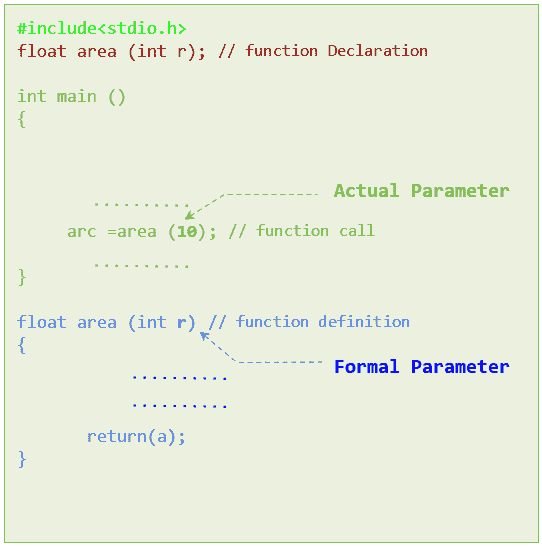
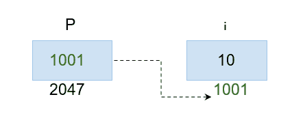

# C 语言按值调用与按引用调用

> 原文：<https://learnetutorials.com/c-programming/call-by-value-and-call-by-reference>

在本教程中，您将了解关于将参数传递给函数的两种不同方式(按值调用和按引用调用)的一切，以及它们是如何有用和不同的。

## 函数参数

C 语言中的函数参数是调用函数时使用的一组变量。通常，参数接受输入值，并将它们传递给函数定义中相应的参数。通常有两种方法可以将参数传递到函数中:

*   按值调用
*   引用调用

在讨论这两种方法之前，让我们先了解一下传递参数时使用的另外两个重要术语。它们是:

*   **实际参数** -函数调用中使用的参数
*   **形式参数** -函数定义中使用的参数。

当我们定义函数时，使用形式参数。而当函数被调用执行时，实际参数就起作用了。因此，形式参数设置规则，实际参数将值放入其中以产生结果。为了清楚起见，请参见下面的可视化:



### C 语言中的一个函数调用

## 什么是 C 语言中的值调用

按值调用是一种参数传递方法，在编程语言中用来将实际参数传递给形式参数。顾名思义，参数值在这里传递。具体来说，实际参数的值在传递时被复制到形式参数。因此，对函数定义中的形式参数所做的任何更改或调整都不会影响函数调用中的实际参数。这是因为为实际参数和形式参数创建了两个独立的内存，很明显，我们正在寻址两个不同的存储位置。

考虑以下程序:

```c
 #include <stdio.h>
int tot( int a, int b)
{
     int c;
      c=a+b;
     printf("Before modification in function definition: a = %d and b = %d  \n",a,b);
     printf("Before modification in function definition : Total of a and b  - is :%d\n\n",c);

     a = a + 5;
     b = b + 5;
     c = a+b;
     printf("After modification in function definition: a = %d and b = %d  \n",a,b);
     printf("After modification in function definition : Total of a and b  - is :%d\n\n",c);

     return 0;
}

int main()
{
    int p =10;
    int q= 20;
    printf("Before function call in main():p = %d and q = %d  \n\n",p,q);
    int z = tot(p, q);
    printf("After function call in main():p = %d and q = %d  \n",p,q);
    return 0;
}

```

在这个节目中，

1.  **a** 和 **b** 是形式参数，其职责是定义公式，即 **a+b=c** 。
2.  另一方面，**p****q**将被视为实际参数。他们的工作是将值 10 和 20 传递给形式参数

输出将如下所示:

```c
 Before function call in main():p = 10 and q = 20

Before modification in function definition: a = 10 and b = 20
Before modification in function definition : Total of a and b  - is :30

After modification in function definition: a = 15 and b = 25
After modification in function definition : Total of a and b  - is :40

After function call in main():p = 10 and q = 20 
```

当您观察输出时，很明显，当通过值调用来传递参数时，形式参数值是可变的，而实际参数是可变的。

## 什么是 C 语言中的引用调用

引用调用是 C 语言中使用的另一种参数传递方法，用于将参数传递给函数定义中的参数。在这个函数调用过程中，实际参数的地址不是值，而是传递给形式参数。这意味着实际参数和形式参数使用相同的存储位置，因此形式参数的任何更改都将立即反映在实际参数中。

为了理解这一点，我们必须熟悉可以存储另一个变量地址的指针变量。假设

int i = 10
int * p；
p =&I；



我们可以看到那些指针变量与一个' * '相关联。这里 p 是一个指针变量，它存储了“I”所在的地址。下面是交换程序，演示了通过引用或地址调用的用法。

```c
 #include <stdio.h>

void swap_add(int * i, int * j);
void main(void) {
    int p = 5, q = 10;
    printf("\n In main() before swapping: p=%d, q=%d", p, q);
    swap_add( & p, & q);
    printf("\n In main () after swapping: p=%d q=%d", p, q);
}
void swap_add(int * i, int * j) {
    int temp;
    temp = * i;
    * i = * j;
    * j = temp;
    printf("\n Inside function definition after swapping:i=%d, j=%d", * i, * j);
} 

```

在上述程序中*i 和*j 分别处理存储在 p 和 q 地址中的值。所以这里的地址交换导致了实际值的交换。因此，程序的输出将如下所示:

```c
 In main() before swapping: p=5, q=10
Inside function definition after swapping:i=10, j=5
In main () after swapping: p=10 q=5 
```

## 按值调用和按引用调用之间的区别。

| SL NO | 按值调用 | 引用调用 |
| one | 重视价值 | 重视解决 |
| Two | 值的副本被传递给函数 | 地址被传递给函数 |
| three | 形式参数和实际参数都使用单独的内存 | 形式参数和实际参数都指向相同的内存 |
| four | 对函数中的值所做的更改不会反映在主函数中 | 对函数中的值所做的更改确实反映在主函数中 |