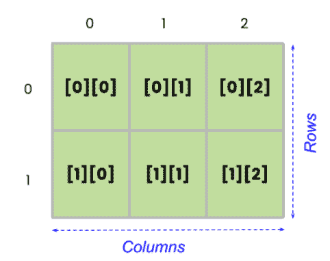
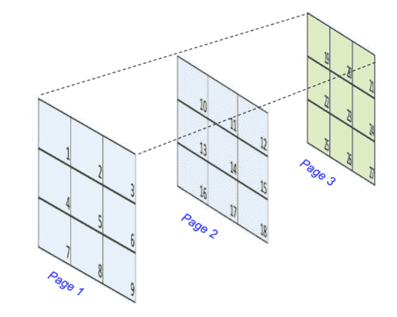

# C 语言中的数组

> 原文:[https://learnetutorials.com/c-programming/array](https://learnetutorials.com/c-programming/array)

在本教程中，您将学习关于称为数组的数据结构的一切。借助简单的示例，您将了解如何从数组中声明、初始化和访问变量。

## 什么是阵列？

C 程序设计中的数组是一种特殊的数据结构，它按顺序存储相同数据类型的有限元素集。更清楚的是，我们可以将数组定义为存储相同数据类型的多个元素的变量。


也被称为结构化数据类型的数组属于**派生数据类型**的范畴，因为它能够存储诸如 int、char、float、double 等基本数据类型和诸如指针、struct 等派生数据类型。上图显示了一个包含 6 个元素的数组。

## 如何用 C 语言声明数组？

定义数组的一般原型就像-

```c
 data_type array_name[size of array in numbers]; 

```

请参见下面的示例:

```c
int age[];
float sal[6]; 

```

这里数据类型为`int `为数组**年龄【】**数组大小未提及。

在第二种情况阵列中， **sal[6]** 在存储器中创建六个相邻的单元，它们是 sal[0]、sal[1]、sal[2]、sal[3]、sal[4]和 sal[5]，用于存储`float `类型值。

数组的分配以“null”开始，因此序列的最后一个变量将以[size -1]存储。在我们的示例中，数组的第一个元素将在 sal[0]分配，最后一个元素将在 sal[5]分配。

注意:一旦声明，数组的大小和类型是永久的。

## 如何用 C 语言初始化数组

数组声明后的下一步是数组初始化，可以在编译时或运行时完成。如果一个数组没有初始化，它将在内存中包含任何称为垃圾值的随机值。

### 数组的编译时初始化

初始化数组最方便的做法是在声明语句本身中定义每个元素的值。数组初始化语法为

```c
 data_type array_name[size ] = {value_1st_element,value_2nd_element,3rd.....}; 

```

例如，

```c
 int age[] =  {25,27,29,30,35,37};   # integer array initialization
float sal[6] = {2500,2700,2900,3000,3500,3700}; #float array initialization 

```

### 数组的运行时初始化

数组的运行时初始化意味着用户可以在程序执行期间输入值。这可以借助`scanf` 函数来实现，该函数是 c 语言中的内置函数。这种方法在需要大数组初始化的情况下也很有用。

```c
 #include<stdio.h>

main() {
    int i;
    int sal[5];
    for (i = 0; i < 5; i++) {
        printf(" \n Enter the amount of salary -->[%d]:", i);
        scanf("%d", & sal[i]);
    }
} 

```

#### 初始化后的一维数组可以最好地可视化如下。


如果我们不定义任何元素的值，编译器会认为它是空的。

例如 **int i[5]={12，52 }；**

这是一个有效的说法。但这意味着:

i[0]=12

i[2]=0

i[1]=52

i[3]=0

i[4]=0

## 如何用 C 语言访问数组元素

要访问数组中的元素，我们可以使用它们的索引，因为我们使用相同的初始化策略。

借助`scanf `函数和 for 循环，我们可以将值输入到数组中。类似地，我们利用`printf` 函数，在循环的帮助下，使用数组的索引打印从数组访问的值。

### 示例 1:如何打印数组并将其反转。

```c
 #include <stdio.h>int main() {

    int n;
    int arr[100];
    int i;

    printf("Enter the number of elements in array :\n");
    scanf("%d", & n);

    printf("\nEnter the elements in array :\n");
    for (i = 0; i < n; i++) {
        scanf("%d", & arr[i]);
    }

    printf("\nThe array is :\n");
    for (i = 0; i < n; i++) {
        printf("%d\t", arr[i]);
    }

    printf("\n\nThe array in reversed order is:\n");
    for (i = n - 1; i >= 0; i--) {
        printf("%d\t", arr[i]);
    }
    return 0;
}</stdio.h> 

```

**输出:**

```c
 Enter the number of elements in array :
6

Enter the elements in the array :
10
20
30
40
50
60

The array is :
10      20      30      40      50      60

The array in reversed order is:
60      50      40      30      20      10 
```

**说明**:

在上面的程序中，声明了整数数据类型的数组 arr[100]。这个声明通知内存为 100 个元素分配空间。在`scanf` 函数的帮助下，数组大小已经初始化为变量 **n** 。类似地，数组的元素被初始化。首先，我们使用`printf`函数和 for 循环显示数组。稍后打印反转的阵列。唯一的区别在于 for 循环声明。

### 示例 2:如何对数组中的元素进行排序

```c
 include < stdio.h >
    int main() {

        int n;
        int arr[100];
        int i, j, temp;

        printf("Enter the number of elements in array :\n");
        scanf("%d", & n);

        printf("\nEnter the elements in array :\n");
        for (i = 0; i < n; i++) {
            scanf("%d", & arr[i]);
        }

        printf("\nThe unsorted array is :\n");
        for (i = 0; i < n; i++) {
            printf("%d\t", arr[i]);
        }

        for (i = 0; i < n; ++i) {

            for (j = i + 1; j < n; ++j) {

                if (arr[i] > arr[j]) {

                    temp = arr[i];
                    arr[i] = arr[j];
                    arr[j] = temp;

                }

            }

        }

        printf("\nThe sorted array is : \n");
        for (i = 0; i < n; ++i)
            printf("%d\t", arr[i]);

    } 

```

**输出:**

```c
 Enter the number of elements in array :
8

Enter the elements in array :
4
44
35
19
76
28
16
46

The unsorted array is :
4       44      35      19      76      28      16      46
The sorted array is :
4       16      19      28      35      44      46      76 
```

上面的程序说明了数组中元素的排序。排序是通过比较第一个元素和第二个元素来完成的。如果条件满足，则使用临时变量 **temp** 进行元素交换，并重复这一过程，直到所有元素完全按升序排序。要在数组中练习更多程序，请参考我们的[示例程序](programs)。

## 什么是二维(2D)阵列？

在 C 编程中，二维数组包括行和列，就像矩阵一样。所以 2D 阵列可以被认为是阵列的阵列。

### 2D 阵列宣言

声明语句有两个连续的索引，一个表示行数，另一个表示列数，如图所示:

```c
data_type array_name [row] [column];
int table [2] [3];

```

这里，该表是一个二维数组，在 2 行 3 列中保存 6 个整数值。声明二维数组时，行大小和列大小都必须用方括号括起来。每个元素的分配如下:



### 2D 阵列的初始化:

初始化 2D 数组的过程有两种类型。

**2D 数组的编译时初始化**

如前所述，初始化可以在声明过程中完成，其形式如下

```c
data_type array_name [row] [column]= {value_1st_element,value_2nd_element,3rd.....};

```

例如，

**int table [2] [3]={
{10，20，30 }；
{40，50，60 }；
}**

同样可以用一行定义如下，这样更方便简单。

**int table[2][3]={10，20，30，40，50，60 }；**

c 提供了一种方法，通过将第一个索引(行)留空来声明数组，而强制指定第二个索引(列)。下面的示例显示，在二维数组表中，行大小为空，而列大小为空。

**int table[][3]={10，20，30，40，50，60 }；**

编译器不会产生任何错误，因为这个语句是有效的，并且意味着可以用 c 语言初始化任意数量的行。但是如果没有提到列的大小，编译器将会产生一个错误。

**初始化后的二维数组**最好可视化如下。


**2D 阵列运行时初始化**

借助`scanf` 函数，我们可以完成二维数组的运行时初始化。这可以通过检查以下程序来查看。

```c
 #include<stdio.h>

void main()
{
    int table[3][4];
    int i, j;
    printf("Enter array elements :");
    for(i = 0; i < 3;i++)
    {
        for(j = 0; j < 4; j++)
        {
            scanf("%d", &table[i][j]);
        }
    }
} 

```

从上面的代码片段中，很明显，要将值输入到二维数组中，我们需要将[嵌套为循环](loops)和`scanf`函数。

```c
 // Print an 3 x 3 matrix
#include <stdio.h>

int main()
{
    int i, j, r, c;
    int M[5][5];

    printf("Enter number of rows : ");
    scanf("%d", &r);
    printf("Enter number of columns :");
    scanf("%d", &c);
    printf("\n");
    /* Input data to matrix */
    for (i = 0; i < r; i++)
    {
        for (j = 0; j < c; j++)
        {
            printf("Data in M[%d][%d] = ", i, j);
            scanf("%d", &M[i][j]);
        }
 printf("\n");

    }

    /* Display the matrix */
    for (i = 0; i < r; i++)
    {
        for (j = 0; j < c; j++)
        {
            printf("%d\t", M[i][j]);
        }
        printf("\n");
    }

    return 0;
}

```

**输出:**

```c
Enter number of rows : 3
Enter number of columns : 3

Data in M[0][0] = 1
Data in M[0][1] = 2
Data in M[0][2] = 3

Data in M[1][0] = 4
Data in M[1][1] = 5
Data in M[1][2] = 6

Data in M[2][0] = 7
Data in M[2][1] = 8
Data in M[2][2] = 9

1       2       3
4       5       6
7       8       9 
```

这个程序让你清楚地了解 2D 阵列。数组 M[5][5]包含 25 个元素，5 行 5 列。由于程序要显示一个 3 x3 的矩阵，所以行和列的数量被称为 3。分配每个位置的下一个元素，最后使用`printf` 功能显示矩阵，并嵌套循环。

## C 语言中的多维数组

在 C 语言编程中，我们可以使用二维以上的数组。三维数组采用以下语法

```c
data_type array_name [row][column][pages]= {value_1st_element,value_2nd_element,3rd.....};

```

例如，

**int arr[10][10][10]；**

这个数组将在编译器的内存中分配 10X10X10=1000 个元素。

3D 阵列可以如下所示查看。


### 三维阵列的初始化

3D 阵列的初始化更类似于 2D 阵列。观察以下示例:

```c
 int test[3][3][3] = {
    {{1, 2, 3}, {4, 5, 6}, {7, 8, 9}},
    {{10, 11, 12}, {13, 14, 15}, {16, 17, 18}},
    {{19, 20, 21}, {22, 23, 24}, {25, 26, 27}}
}; 

```

这可以在下面的展开形式中可视化。



## 如何将数组传递给函数

在 C 语言中，所有类型的数组都可以通过一个函数来执行特定的任务。让我们看看如何在将数组传递给函数之前传递数组元素。

### 将单个数组元素传递给函数

将单个数组元素传递给函数的工作方式类似于我们在函数内部传递值的方式。

这里有一个简单的例子**将一个单独的元素**传递给一个函数:

```c
 #include <stdio.h>
void display_arr(int a);

int main()
{
    int m_arr[] = { 20, 30, 40 };
    display_arr(m_arr[1]);        
    return 0;
}

void display_arr(int a)
{
    printf("%d", a);
}

```

**输出:**

```c
30 
```

在这个代码片段中，位置 1 的数组元素只被传递给函数`display_arr`。

### 将数组传递给函数

传递数组时要始终记住的关键点是，它只需要在函数中传递数组的名称作为参数，不需要方括号。

将数组传递给函数的语法如下:

```c
functionname(array_name); //passing array

```

#### 接收数组作为参数的不同函数声明方式。

要接收数组作为参数，我们必须以这两种方式之一声明函数:

*   返回类型函数(类型数组名称[大小])，其中大小是可选的
*   return_type 函数(type *arrayname)

### 示例 2:将一维数组传递给函数

```c
 #include <stdio.h>
float Average(int marks[]);

int main() {
    int result, marks[] = {48, 38, 45, 46, 40, 36};
    float avg;

    // age array is passed to calculateSum()
    avg = Average(marks);
    printf("Average = %f", avg);
    return 0;
}

float Average(int marks[]) {

  float sum = 0.0;

  for (int i = 0; i < 6; ++i) {
  sum += marks[i];
  }

  return sum/6;
} 

```

**输出:**

```c
Average = 42.166668 
```

在本例中，我们通过仅提及 array_name (marks)向函数传递了一维数组(marks[])，而没有使用方括号。但是，在函数定义中，我们提到了这个 array_name 以及方括号，它告诉编译器传递的参数是一维数组。

同样，我们可以将多维数组传递给函数。

## 从函数返回数组(指向数组的指针)

在 c 语言中，直接通过函数返回整个数组是不可能的。解决方法是返回一个指向数组的指针。但是我们必须将数据类型声明为静态的。否则，编译器将把它们作为局部变量，并限制程序使用数组的地址值。这个的架构会是这样的

```c
return _type * Function_name() {  
//some statements;   
return array_name;  //array_name as in function definition  
}

```

我们将在下一个教程中详细学习指针。