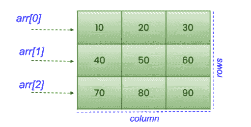

# 指针和数组

> 原文：<https://learnetutorials.com/c-programming/pointers-and-arrays>

在本教程中，您将学习使用指针操作数组的方法，即如何使用指针访问数组中的元素，以及如何在一些简单示例的帮助下遍历数组等。

要理解数组和指针之间的联系，最好事先了解 [C 指针](../c-programming/pointers)和 [C 数组](../c-programming/array)的基础知识。

## 指针和一维数组

让我们先来看一个简单的例子，它展示了如何打印一维数组中每个数组元素的地址。

```c
 #include<stdio.h>

int main() {
    int arr[5] = {
        10,
        20,
        30,
        40,
        50
    };
    for (int i = 0; i < 5; i++) {
        printf("The address of element %d in position arr[%d]: %d\n", arr[i], i, & arr[i]);
    }
    return 0;
} 

```

**输出:**

```c
 The address of element 10 in position arr[0]: 6422016
The address of element 20 in position arr[1]: 6422020
The address of element 30 in position arr[2]: 6422024
The address of element 40 in position arr[3]: 6422028
The address of element 50 in position arr[4]: 6422032 
```

在本例中，我们声明了一个包含 5 个元素的数组:10、20、30、40 和 50。声明时，编译器分配足够的内存来存储数组的元素。这里，每个元素连续存储在存储器中，连续元素之间有 4 个字节的差异，这表示整数的字节大小。参见下面内存中数组元素的可视化。


当你仔细观察图像时，你可以得到问题的答案“数组`arr` 和`arr[0]`的地址是否相同？”。答案是肯定的，因为数组 arr 总是指向第一个元素`arr[0]`，所以数组的名字是指向第一个元素地址的常量指针。更准确地说，


### 访问数组地址的指针

通常为了获得数组元素的地址，我们使用**符号(& )** 符号。我们也可以使用**指针(*)** 来获取数组元素的地址。让我们看看如何修改上面的程序，使用指针获取数组元素的地址，并产生相同的结果。

```c
 #include<stdio.h>

int main() {
    int arr[5] = {
        10,
        20,
        30,
        40,
        50
    };
    int * p;

    p = & arr[0];
    for (int i = 0; i < 5; i++) {
        printf("The address of element %d in position arr[%d]: %d\n", * p, i, p);
        p++;
    }
    return 0;
} 

```

**输出:**

```c
 The address of element 10 in position arr[0]: 6422016
The address of element 20 in position arr[1]: 6422020
The address of element 30 in position arr[2]: 6422024
The address of element 40 in position arr[3]: 6422028
The address of element 50 in position arr[4]: 6422032 
```

我们知道指针的每个元素都有一个特定的地址。这里我们使用了指针，并逐渐增加其地址值(用于循环)来存储它们。在我们的例子中，我们有一个数组 arr[5]和一个指针 p。我们可以像这样使用它们:
p =&arr[0]；
p+1 =&arr[1]；
p+2 =&arr[2]；
p+3 =&arr[3]；
p+4 =&arr[4]；
p+5 =&arr[5]；
同样，我们可以通过打印值“ ***p”、“*(*p+1)”来使用其中存储的值。*(*p+2)** 等。
在使用带数组的指针时，我们需要记住以下几点:

1.  数组和指针的数据类型必须相同。
2.  **Arrayname** 可以用来初始化指针，因为 Arrayname 指向数组第一个元素的地址。

## 指针算法(递增和递减)

指针支持算术运算，但仅支持加法(增量)和减法(减量)。在整数的情况下，当我们将一个数增加一个单位时，存储变量的值就像

4+1=5.

但是在指针的情况下，递增意味着让指针指向下一个地址位置。也就是说，单元格的地址值发生了变化，而不是存储变量的值，如下图所示。


一个整数数据类型需要 4 个字节的内存，所以在这些情况下指针的增量最终会将指针移动 4 个单位。同样，浮点指针将地址值增加 4 个单位，因为每个单位需要 4 字节的空间来分配。
当指针递减时，它会将地址值减少相应数据类型的字节数。指针立即指向前一个地址位置。

由于指针作用于地址，乘法和除法的机会完全超出了范围。

## 指向数组的指针

到目前为止，我们已经讨论了指向数组单个元素的指针。但是当指针指向整个数组时，这是一个不同的概念。在 C 语言中，引用整个数组的指针称为指向数组的指针。参见下面指向数组的指针的声明。

```c
 datatype (*p)[n] 

```

其中数据类型表示数组的类型，

*   p 是指向整个数组的指针。
*   n 是数组中的元素数量。

示例:

```c
 int (*p)[5]
float (*p)[10] 

```

需要考虑的重点是“ **p** ”周围的圆括号或圆括号是必不可少的，因为 int*** p【5】**和**int(* p)【5】**是不同的。 **int *p[5]** 表示具有 5 个整数指针的数组，而 **int (*p)[5]** 表示指向具有 5 个整数的数组的指针。

```c
 #include<stdio.h>

int main() {
    int arr[5];
    int * p;
    int( * pa)[5];

    p = arr;
    pa = arr;

    printf("Address of p = %d\n", p);
    printf("Address of pa = %d\n", pa);

    p++;
    pa++;

    printf("\n...After incrementing p and pa...\n\n");
    printf("Address of p = %d\n", p);
    printf("Address of pa = %d\n", pa);

    return 0;
} 

```

**输出:**

```c
 Address of p = 6422000
Address of pa = 6422000

...After incrementing p and pa...

Address of p = 6422004
Address of pa = 6422020 
```

**工作理念**

当你检查这个例子时，你可以看到 **p** 是一个指向数组第一个元素 **arr** 的指针，因此它的基类型是一个指向 int 的指针。另一方面， **pa** 是指向整个数组 **arr** 的指针，因此它的基类型是指向包含 5 个整数元素的数组的指针。当两个指针递增时，它们相对于基本类型工作，因此 **p** 递增 **4** 字节，pa 递增 **20 字节(5×4 = 20)**。

## 指针和二维数组

到目前为止，我们已经看到了一维数组上指针的工作。现在让我们观察指针如何在二维数组上工作。为了更好地理解二维数组，请参考我们之前的教程 ARRAGES。



我们知道二维数组可以简单地想象成一个有行和列的矩阵。但说到内存的情况，**二维数组可以认为是一维数组，每个元素本身就是一维数组**。这是因为在内存中，一切都是以线性方式存储的。上图展示了 2 行 3 列的二维数组的概念视图，下图展示了内存中 3 行 3 列的二维数组的实际视图。


从图中可以清楚地看出，在二维数组中，

arr[0] == arr:是第零个一维数组 arr[1] == arr + 1:是第一个一维数组

arr[2] == arr +2:是第二个一维数组，以此类推。总的来说，

arr[i] == arr + i:表示第 I 个一维数组，以此类推。

总的来说，

**arr[i] == arr + i:表示第 ith 个一维数组。**

### 如何使用指针访问二维数组的地址

以下示例显示如何打印二维数组中每个元素的地址。

```c
 #include<stdio.h>

int main() {
    int arr[3][3]={10,20,30,40,50,60,70,80,90};
    int * p;

    p = arr;
    for (int i = 0; i < 3; i++) {
        printf("\n\nThe address of arr[%d]: %d\n", i, p);
        for (int j = 0; j < 3; j++) {
            printf("The address of element %d in position arr[%d][%d]: %d\n", * p, i, j, p);
            p++;
        }
    }
    return 0;
} 

```

**输出:**

```c
 The address of arr[0]: 6421984
The address of element 10 in position arr[0][0]: 6421984
The address of element 20 in position arr[0][1]: 6421988
The address of element 30 in position arr[0][2]: 6421992

The address of arr[1]: 6421996
The address of element 40 in position arr[1][0]: 6421996
The address of element 50 in position arr[1][1]: 6422000
The address of element 60 in position arr[1][2]: 6422004

The address of arr[2]: 6422008
The address of element 70 in position arr[2][0]: 6422008
The address of element 80 in position arr[2][1]: 6422012
The address of element 90 in position arr[2][2]: 6422016 
```

在这个例子中，为了获得二维数组中每个元素的地址，我们使用了指针变量 p。所以在屏幕后面，指针变量 p 实际上是如何工作的如下所示。

假设我们的数组是 arr，并且(arr + i)表示第一维数组。为了得到地址，我们可以直接用(arr+i)作为取消引用运算符(*)的前缀，即，

***(arr+i)给出第一个一维数组的地址。**

更简洁地说，
*(arr + 0)第 0 个一维数组的地址
*(arr + 1)第 1 个一维数组的地址
*(arr + 2)第 2 个一维数组的地址

现在要访问每个数组中元素的地址，我们需要执行如下指针算法

*(arr + 0)+0 第 0 个一维数组第 0 个元素的地址
*(arr + 0)+1 第 0 个一维数组第 1 个元素的地址
*(arr + 0)+2 第 0 个一维数组第 2 个元素的地址
*(arr + 1)+0 第 1 个一维数组第 0 个元素的地址
*(arr + 1)+1 第 1 个元素的地址

这可以概括为

***(arr + i)+j 第一个一维数组的 jth 元素的地址**

还可以访问数组中每个元素的值。这可以通过取消引用*(arr + i)+j 来实现

***(*(arr + i)+j)第一个一维数组的 jth 元素的值**

以上程序可以更改如下。

```c
 #include<stdio.h>

int main() {
    int arr[3][3]={10,20,30,40,50,60,70,80,90};

    for (int i = 0; i < 3; i++) {
        printf("\n\nThe address of arr[%d]: %d\n", i, *(arr + i));
        for (int j = 0; j < 3; j++) {
            printf("The address of element %d in position arr[%d][%d]: %d\n", *( * (arr + i) + j), i, j, *(arr + i) + j);

        }
    }
    return 0;
} 

```

这里，我们没有使用指针变量，而是使用数组本身的指针来访问地址和值。