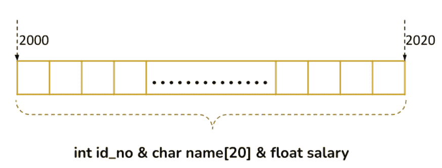

# C 语言联合

> 原文：<https://learnetutorials.com/c-programming/unions>

在本教程中，您将掌握 C 语言中与结构非常相似的并集的所有知识。在超级简单的例子的支持下，你将会覆盖像如何定义和访问联合，联合如何不同于结构等主题。

## 联合

Union 是 C 语言中用户定义的数据类型，就像 struct 一样，它收集单个或不同的数据类型。像 struct 一样，联合也有一个特定的名称，数据元素是它的成员。

**语法**:

定义的原型是

```c
 union union_name
{
    data_type member_1;
    data_type member_2;
    ...
    ...
    data_type member_n;
}; 

```

其中`union`是一个关键字，通知编译器在程序中定义了一个并集。`union_name`代表用于声明该特定类型的基本变量的联合的特定名称。`member_1`、`member_2`、...，`member_n`是相同或不同数据类型的联合成员。联合成员必须在大括号`{}`内声明，并以分号(`;`结束。最后但同样重要的是，联合定义必须在右大括号后以分号结束。

以下是联合定义的示例:

```c
 union employee  
{  
 int id_no;  
   char name[20];  
   float salary;  
}; 

```

这就是我们定义联合的方式。这里的`employee`是包含 3 个不同成员的并集，即整数数据类型的`id_no`、字符数据类型的`name`和浮点数据类型的`salary`。

## 如何宣布联合

记住这样一个事实:仅仅定义并不能为联合保留任何记忆。为了使联合变得活跃并与之合作，我们需要声明它的变量。变量声明可以通过两种方式完成:

1.  ### 在联合定义期间

    ```c
     union union_name
    {
        data_type member_1;
        data_type member_2;
        ...
        ...
        data_type member_n;
    }var_1, var_2; 

    ```

    这是一个例子

    ```c
     union employee  
    {  
     int id_no;  
       char name[20];  
       float salary;  
    }emp_1,emp_2; 

    ```

2.  ### 在`main()`函数中使用关键字 union

    ```c
     union union_name var_1,var_2; 

    ```

    这是一个例子

    ```c
     int main()
    {
    union employee emp_1,emp_2;
     } 

    ```

在这两种情况下，我们都声明了两个变量 emp_1 和 emp_2。

## 联合变量的内存分配

联合看起来与结构非常相似，但关键的区别在于联合的多个成员变量不能同时使用。这是因为联合的所有成员变量共享同一个空间。更具体地说，当联合变量被声明时，编译器将为消耗最大空间的变量分配空间。其余的变量将在需要时共享这个空间。

这是一个简单的演示



当`emp_1`被声明时，编译器将为变量`name[20]`分配空间，因为它获得了更多的空间，即 20 字节的内存。剩余的`id_no`和`salary`将从这 20 个字节中共享所需的 4 个字节的空间。

## 如何接触联合成员

就像结构一样，联合的成员变量由成员访问运算符或点运算符(。)并使用箭头指针(->)访问联合的指针变量。成员变量的名称写为下标，方法是在联合变量名称后面加上一个句点。

```c
 var_1.member_1;
var_1.member_2; 

```

访问成员变量时要记住的关键点是，我们一次只能访问一个成员。让我们看看如果我们试图一次访问多个变量会发生什么。

```c
 #include <stdio.h>
#include <string.h>

union Employee
{
            char name[20];
            int id;
            float salary;
};

int main()
{
    union Employee emp_1,emp_2;

    // assigning values to emp_1 union variable at a time
       strcpy(emp_1.name, "TOM");
       emp_1.id = 1001;
       emp_1.salary = 8000;

       printf("Employee 1 Details \n");
       printf("----------------------\n");
       printf(" Name       : %s \n", emp_1.name);
       printf(" ID   : %d\n", emp_1.id);
       printf(" Salary : %f \n\n", emp_1.salary);

    // assigning values to emp_2 union variables one after other
       printf("Employee 2 Details\n");
       printf("----------------------\n");
       strcpy(emp_2.name, "Jerry");
       printf(" Name       : %s \n", emp_2.name);

       emp_2.id = 1002;
       printf(" ID    : %d\n", emp_2.id);

       emp_2.salary = 9000;
       printf(" Salary : %f \n", emp_2.salary);
       return 0;
} 

```

输出将是:

```c
 Employee 1 Details
----------------------
 Name   :
 ID     : 1174011904
 Salary : 8000.000000

Employee 2 Details
----------------------
 Name   : Jerry
 ID     : 1002
 Salary : 9000.000000 
```

说明:当您观察输出时，您可以看到 emp_1 union 变量只产生薪资作为正确的输出，其余成员产生损坏的输出。这种损坏背后的原因是，由于成员共享一个公共内存空间，最后分配的成员值将存储在内存中，从而产生正确的输出。另一方面，emp_2 联合变量为其成员打印了正确的值，因为我们在赋值后立即打印了每个成员。

## 联合与结构

下表列出了 C 语言中联合和结构之间的主要区别

| **UNION** | **结构** |
| 使用关键字**“联合**”来定义联合。 | 使用关键字“ **struct** 定义结构。 |
| 联合对象的大小将始终等于其最大数据成员的大小。 | 结构对象的大小将是其数据成员大小的总和。 |
| 联合成员共享一个公共内存位置。 | 结构成员有自己独特的内存位置。 |
| 联合内存更具内存效率 | 结构的内存效率较低 |
| 初始化为最后一个成员的值将存储在共享内存中 | 初始化为所有成员的值将存储在它们不同的内存中。 |
| 一次只能访问一个成员。 | 一次可以访问所有成员。 |
| **语法:**

```c
 union union_name
{
    data_type member_1;
    data_type member_2;
    ...
    ...
    data_type member_n;
}; 

```

 | **语法:**

```c
 struct struct_name
{
    data_type member_1;
    data_type member_2;
    ...
    ...
    data_type member_n;
}; 

```

 |
| **例:**

```c
 union Employee
{
   char name[20]; // 20 bytes
   int id;        // 4 bytes
   float salary;  // 4 bytes
};
//union object size is 20 bytes 

```

 | **例:**

```c
 struct Employee
{
   char name[20]; // 20 bytes
   int id;        // 4 bytes
   float salary;  // 4 bytes
};
// structure object size is 28 bytes. 

```

 |