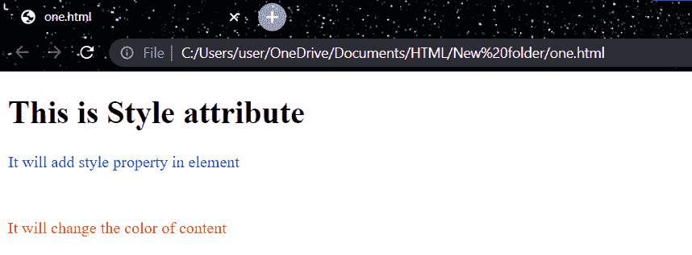

# HTML 属性

> 原文：<https://learnetutorials.com/html/attributes>

在本 HTML 教程中，您将了解 HTML 中的所有属性。我们还将讨论 HTML 中最常用的属性。

## 什么是超文本标记语言属性？

属性定义元素的额外特征或属性，例如图像的宽度和高度。属性总是在开始标记(或开始标记)中提供，并且通常由名称/值对组成，如 name =“value”。属性值必须始终用引号括起来。

*   HTML 属性是传达关于元素更多信息的特殊词语，或者属性是 HTML 元素的修饰语。
*   每个元素或标签都可以具有指定该元素行为方式的特征。
*   属性应该总是与开始标记结合使用。
*   属性应该总是与其名称和值组合一起使用。
*   属性的名称和值区分大小写，W3C 建议它们仅用小写表示。
*   可以将多个属性添加到单个 HTML 元素中，但是它们之间必须有一个空格。

**语法**

```html
 <element attribute_name="value">content</element> 

```

例子

```html
 <!DOCTYPE html> 
<html> 
<head> 
</head> 
<body> 
    <h1>This is Style attribute</h1> 
    <p style  &equals; " height: 50px; color: blue " > It will add style property in element</p> 
    <p style  &equals; " color: red " > It will change the color of content</p> 
</body> 
</html> 

```



## HTML 中最常用的属性

*   **href Attribute**

    使用

    ```html
     <a href=”url of target”> content<a>
    ```

*   **src Attribute**

    若要在 HTML 页面中嵌入图像，请使用元素。src 属性指定将要显示的图片的位置。

    ```html
     
    ```

*   **width and height Attributes **

    指定图片或其他内容的宽度和高度的宽度和高度属性也应该包含在标签中。

    ```html
     
    ```

*   **style Attribute** 

    style 属性用于将样式应用于元素，例如颜色、字体、大小和其他选项。

    ```html
     <p  red”>Sample text</p>

    ```

*   **id Attribute** 

    id 属性用于为文档中的元素提供唯一的名称或标识。这使得使用 CSS 或 JavaScript 选择元素变得容易。

    ```html
     <p id="infoText">This is a paragraph.</p>

    ```

*   **class Attribute** 

    类属性用于标识项目的方式与 id 属性相同。但是，与 id 不同，类属性在文档中不必是唯一的。这意味着您可以将同一个类应用于文档中的许多组件。

    ```html
     <p class="infoText">This is a paragraph.</p>

    ```

*   **title Attribute** 

    title 属性用于提供关于元素或其内容的描述性文本。

    ```html
     <abbr title="World Wide Web Consortium">W3C</abbr

    ```

## 全局属性是什么意思？

HTML 全局属性是所有 HTML 元素共享的属性。标准和非标准元素都支持全局特性。全局特性可以应用于所有组件；然而，它们可能对其中一些没有影响。

## 有哪些 HTML 事件属性？

当浏览器对用户活动做出反应时，就会发生事件。例如，如果您单击提交按钮，浏览器将显示一个信息框。HTML5 中有几个可用的事件特征，可以使用计算机语言(如 JavaScript)激活。

### 窗口事件属性

窗口事件与窗口对象相关联，只能与标签一起使用。常用的窗口事件有:

*   **on afterprint**–只会在文档打印后执行脚本。
*   **onbeforeprint**–只会在文档打印前执行脚本。
*   **on beforeunload**–它只会在卸载文档之前执行脚本。
*   **one error**–它只会在出现错误时执行脚本。
*   **onhashchange**–它只会在网页 URL 中的锚点部分发生变化时执行脚本。
*   **on load**–它只会在网页完全加载时执行脚本。
*   **on message**–它只会在消息事件发生时执行脚本。
*   **on offline**–只会在网络连接断开，浏览器开始离线工作时执行脚本。
*   **在线**–只有当浏览器开始在线工作时，才会执行脚本
*   **on pagehide**–只有当前网页隐藏时才会执行脚本，比如用户已经离开当前网页。
*   **on pageshow**–它只会在当前网页聚焦时执行脚本。
*   **on opstate**–它只会在窗口的活动历史发生变化时执行脚本。
*   **on resize**–它只会在调整窗口大小时执行脚本。
*   **on storage**–它只会在网页存储更新时执行脚本。
*   **on unload**–只会在当前网页卸载，或者窗口关闭时执行脚本。

### 表单事件属性

当用户在表单中执行操作时，例如提交表单或选择输入字段，就会发生表单事件。表单事件可以与任何元素一起使用，尽管它们通常与 HTML 表单元素相关联。

*   **on bulr:**它只会在表单元素失去焦点时执行脚本。
*   **onchange :** 它只会在元素的值改变时执行脚本。
*   **onfocus :** 只有当元素获得焦点时，它才会触发事件。
*   **oninput :** 它只会在用户向元素输入输入时执行脚本。
*   **oninvalid :** 它只会在元素不满足其预定义的约束时执行脚本。
*   **onreset :** 只有当用户重置表单元素值时，它才会触发事件。
*   **onsearch :** 只有当搜索字段收到一些输入时，它才会触发事件。
*   **onselect :** 只有当用户选择了一些文本时，它才会触发事件。
*   **onsubmit :** 只有提交表单时才会触发事件。

### 键盘事件属性

当用户与键盘交互时，会发生键盘事件。

*   **onkeydown :** 只有当用户按下键盘上的一个键时，它才会触发事件。
*   **onkeypress :** 只有当用户按下显示某个字符的按键时，才会触发事件。
*   **onkeyup :** 只有当用户释放当前按下的键时，它才会触发事件。

### 鼠标事件属性

*   **onclick :** 只有当鼠标点击元素时才会触发事件。
*   **ondblclick :** 只有当鼠标双击元素时才会触发事件。
*   **onmousedown :** 只有在元素上按下鼠标按钮时才会触发事件。
*   **onmousemove:** 只有当鼠标指针在元素上移动时，它才会触发事件。
*   **onmouseout :** 只有当鼠标移出元素时才会触发事件。
*   **onmouseover :** 只有当鼠标移动到元素上时，才会触发事件。
*   **onmouseup :** 只有松开鼠标按钮才会触发事件。
*   **滚轮:**只有当鼠标滚轮在元素上上下滚动时，它才会触发事件

### 剪贴板事件属性

*   **oncopy :** 只有当用户将内容复制到系统剪贴板时，才会触发事件。
*   **oncut :** 只有当一个元素的内容被剪切并复制到剪贴板时，它才会触发事件。
*   **onpaste :** 只有当用户在元素中粘贴一些内容时，才会触发事件。