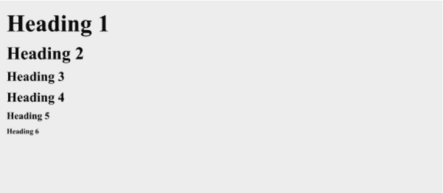

# HTML 标题

> 原文：<https://learnetutorials.com/html/heading-tags>

在这个 HTML 教程中，你将学习到所有关于 HTML 标题的知识。我们还将讨论 HTML 中最常用的标题标签。

## HTML 中的标题标签是什么意思？

您希望在网页上显示的标题或副标题可以定义为 HTML 标题或 HTML h 标记。当您添加包含在标题标签内的文本时

# ...

，在浏览器上以粗体显示，文字大小取决于标题数量。

`<h1>`到`<h6>` 元素建立了六个独立的 HTML 标题，从最高级别 h1(主标题)到最低级别 h6(最不重要的标题)。按照惯例，浏览器会以比普通文本更大更粗的字体显示标题。

最大的航向标签是 h1，最低的是 h6。因此，h1 用于最重要的航向，而 h6 用于最不重要的航向。

## HTML 中的标题标签有什么重要性？

1.  HTML 标题通过识别重要主题和页面结构来提供重要信息；因此，它们有助于适当优化网页以提高用户参与度。
2.  使用标题让你的内容看起来更大或更醒目，但我们不应该这样做。使用它们只是为了强调文档的标题和显示文本的结构。
3.  因为像谷歌这样的搜索引擎利用标题来索引网页的结构和内容，所以在你的网站上要谨慎使用它们。
4.  使用`<h1>`标题作为网页的主要标题，然后是< h2 >标题，然后是不太重要的`<h3>`标题，依此类推。

### HTML 中的标题标签

```html
 <!DOCTYPE html>
<html>
<body>
<h1>Heading 1</h1>
<h2>Heading 2</h2>
<h3>Heading 3</h3>
<h4>Heading 4</h4>
<h5>Heading 5</h5>
<h6>Heading 6</h6>
</body>
</html> 

```

