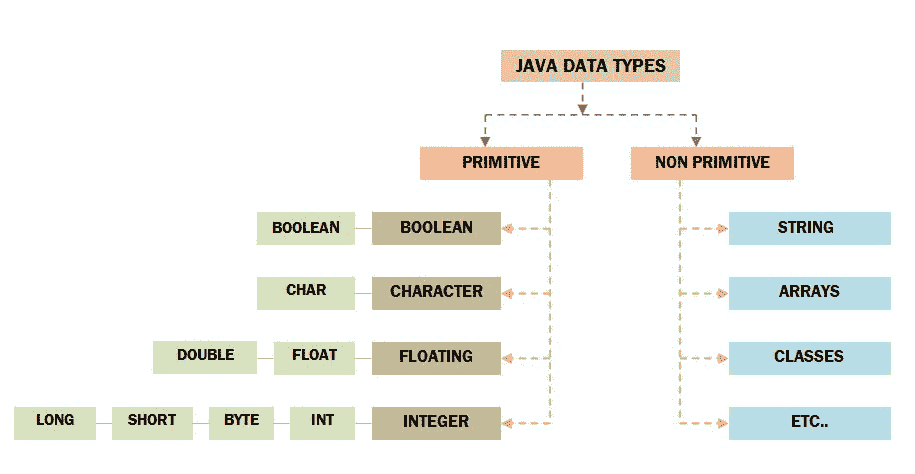
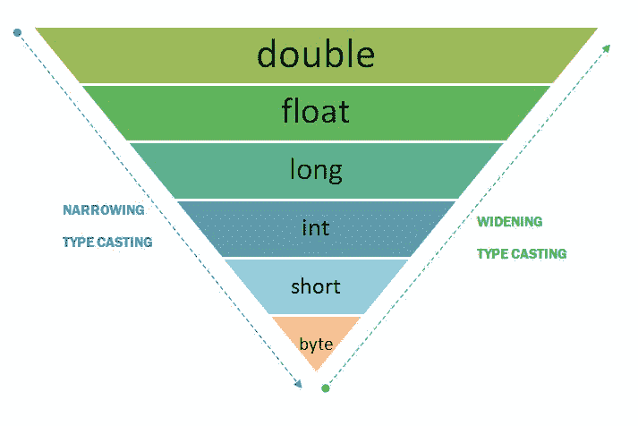

# Java 中的数据类型

> 原文：<https://learnetutorials.com/java/data-types>

本教程是为初学者和中间人员设计的，目的是掌握 Java 编程语言中数据类型的概念和数据类型的分类。除此之外，您还将探索与数据类型相关的一个重要过程 java 类型转换或数据类型转换。

## JAVA 数据类型

任何编程语言中的数据类型都规定了程序员需要的数据的**行为。数据类型告诉编译器要存储在变量或标识符中以执行特定操作的数据的类型或大小。所以从某种意义上来说，定义变量的数据类型限制了变量取任何值的自由。**

由于 java 是一种静态类型的编程语言，所以在使用前用适当的数据类型声明一个变量的重要性是非常显著的。让我们举个例子

```java
 int age; 

```

这里`age`是数据类型为 int 的变量，表示变量`age`应该只保存整数值。

现在让我们探索不同类型的 java 数据类型。

## Java 数据类型的分类

在 java 中，数据类型大致分为两类:

1.  **原始数据类型**:这些是 java 中预定义的数据类型。Java 有 8 种基本数据类型，即布尔型、字符型、字节型、短整型、整型、长整型、浮点型和双精度型。
2.  **非原始数据类型**:这些是程序员创建的数据类型，不是预定义的。因为它们引用对象，所以也被称为引用数据类型或对象数据类型。这包括字符串、数组、类、接口等。



## 原始数据类型

从上图中，我们看到了 java 中的 8 种原始数据类型。这些**数据类型是内置数据类型，无法进一步划分**。因此被称为原始数据类型。让我们详细探讨每一种数据类型。

### 整数数据类型

数学上，一个整数就是**一个不包含任何小数部分的数。**整数可以是正数，也可以是负数，甚至可以是`0`，合起来就是整数。例如，`-20`、`0`、`99`等是整数，`8.5`、`¾`等不是整数。

像`byte`、`short`、`int`和`long`这样的数据类型是整数数据类型的一部分。

1.  **字节**是 8 位有符号二进制补码整数数据类型，其值范围在-128 到 127 之间。默认情况下，java 将字节值取为 0。这种数据类型用于需要大量节省内存的情况。
2.  **short** 是 16 位有符号二进制补码整数数据类型，其取值范围在-32，768 到 32767 之间，默认值为 0。
3.  **int** 是 32 位有符号二进制补码整数数据类型，其取值范围在-2 到 2 -1 之间。其默认值为 0。
4.  **long** 是值范围在-2 之间的 64 位有符号二进制补码整数数据类型？？到 2？？-1.长数据类型的默认值为 0。长数据类型用于 int 不足以容纳值的情况。要区分一个`long`变量和一个`int`变量，始终以字母“L”结束长的**变量值。例如，1000000000 升。**

 **查看下面的示例，了解整数数据类型在程序中是如何工作的。

### 示例:说明整数值

```java
 public class DatatypeEx {

    public static void main(String[] args) {

        byte bnum = 126;
        System.out.println(bnum); // prints 126

        short snum = -32768;
        System.out.println(snum); // prints -32768

        int inum = 999999999;
        System.out.println(inum); //prints 999999999

        long lnum = 9999999990 L;
        System.out.println(lnum); //prints 9999999990

    }

} 

```

### 浮点数据类型

浮点数是那些有小数部分的**数**，如 3.14，6/7 等。在 java 中，我们有两种接受带小数点的数字的原始数据类型。它们是:

1.  float:是一个单精度 32 位浮点。它的默认值是 0.0 或 0.0f。
2.  double:是一个双精度 64 位浮点。其默认值为 0.0 或 0.0d。

| 数据类型 | 数据大小(位) | 数据大小(字节) | 缺省值 |
| 漂浮物 | 32 位 | 4 字节 | 0.0f |
| 两倍 | 64 位 | 8 字节 | 0.0d |

### 示例:说明浮点值

```java
 public class DatatypeEx {

    public static void main(String[] args) {

        float num1 = 9.9 f;
        System.out.println(num1); // prints 9.9

        double num2 = -3.14;
        System.out.println(num2); // prints -3.14

        float num3 = 9.999990000000000009990;
        System.out.println(num3); //prints error message      

    }

} 

```

### 字符数据类型

字符数据类型**处理字符**。与其他编程语言不同，Java 使用 Unicode 系统，因此`char`数据类型代表 16 位 Unicode 字符。字符类型的默认值是“`\u0000`”，这是 Unicode 系统的最小值。字符类型可以接受的最大值是“`\uffff`”。

| 数据类型 | 数据大小(位) | 数据大小(字节) | 缺省值 |
| 茶 | 16 位 | 2 字节 | u0000 ' |

如果您有兴趣了解更多关于 java 为什么使用 unicode 系统的信息，请访问 java 的 unicode 系统。

### 示例:说明字符值

```java
 public class DatatypeEx {

 public static void main(String[] args) {

     char ch1 = '\u0045';
     System.out.println(ch1); // prints E

     char ch2 = '\u0065';
     System.out.println(ch2); // prints e

 }

} 

```

### 布尔数据类型

布尔是一种特殊的数据类型，它保存任何一个可能的值，要么是**真**要么是**假**。这种数据类型通常在评估条件或比较或逻辑或关系运算时使用。

| 数据类型 | 数据大小(位) | 数据大小(字节) | 缺省值 |
| 布尔 | 1 位 |   | 错误的 |

### 示例:说明布尔数据类型

```java
 public class DatatypeEx {

 public static void main(String[] args) {

      boolean b1=(6>9)?True:False;
  System.out.println("Is 6 greater than 9: "+b); // prints False

         boolean b2=(9>3)?True:False;
  System.out.println("Is 9 greater than 3: "+b); // prints True

 }

} 

```

## 非原始数据类型

如前所述，非原始数据类型不是基本数据类型，它们是基于程序需求从原始数据类型派生的数据类型。换句话说，我们可以说**非原始数据类型是用户创建的数据类型**。由于非原始数据类型不是由 java 定义的，所以数据类型的大小不是固定的，它可以是任何长度。与基本数据类型不同，非基本数据类型以大写字母开头。比如`String`、`Array`、`Class`等。区分基元数据类型和所谓的引用数据类型的另一个特征是，非基元数据类型可以保存空值。

在接下来的教程中，您将了解这些非原始数据类型，如字符串、数组、类、接口等。

## java 中的类型转换/转换

像许多其他编程语言一样，java 也支持数据类型转换。顾名思义，一般我们可以将状态类型转换或类型转换**作为一种数据类型转换为另一种数据类型**的过程。例如，我们可以将整数数据类型转换为浮点数，反之亦然。转换可以由程序员手动完成，也可以由编译器自动完成。

基于转换策略，在 Java 中，我们有 13 种类型的类型转换。在 13 种类型中，我们将在这里讨论两种重要的铸造类型，即:

1.  加宽型铸造
2.  窄型铸造



如果您有兴趣了解更多关于类型转换的知识，请访问 java 中不同类型转换的。

### 加宽型铸件

扩大类型转换是将较低的数据类型(`int`)自动转换为较高的数据类型(`double`)的过程。由于该转换是由编译器自动完成的，因此也被称为**自动转换**或**隐式转换**。


```java
 public class DatatypeConv {

 public static void main(String[] args) {

      // creating integer type variable 
  int inum = 36;
  System.out.println("Integer Value :"+ inum);

  //converting integer to float type variable
  float fnum = inum;
  System.out.println("Float Value :"+fnum);

 }

} 

```

**输出:**

```java
Integer Value :36
Float Value :36.0 
```

**说明**:

上面的代码片段显示了整数到浮点数的转换。由于`float`是`int`的较高数据类型，转换时不需要具体的数据类型声明。编译器自动将该值转换为更高的数据类型，在我们的例子中为`float`。

由此，我们可以推断，在数据类型相互兼容并且目标数据类型的大小高于源数据类型的情况下，会发生扩展类型转换。加宽型铸造确保数据没有任何损失。

### 窄型铸造

缩小类型转换是将较高数据类型(`double`)转换为较低数据类型(`int`)的过程。由于这种转换是由程序员手动完成的，因此也被称为**显式转换或转换**。


```java
 public class DatatypeConv {

 public static void main(String[] args) {

      // creating float type variable 
  float fnum = 14.7f;
  System.out.println("Float value :" +fnum);

  //Converting float value to int value
  int inum = (int)fnum;
  System.out.println("Integer value :" +inum);

 }

} 

```

**输出:**

```java
Float value :14.7
Integer value :14 
```

**说明**:

这里，我们将较高的数据类型值转换为较低的数据类型值，这意味着缩小数据类型。因此，我们需要明确指定它需要转换成的数据类型，在我们的例子中是`int`。

窄型铸造正好与宽型铸造相反。由于目标数据的大小小于源数据，因此丢失数据的几率非常高。因此，类型转换必须手动完成，否则编译器会报告编译时错误。**