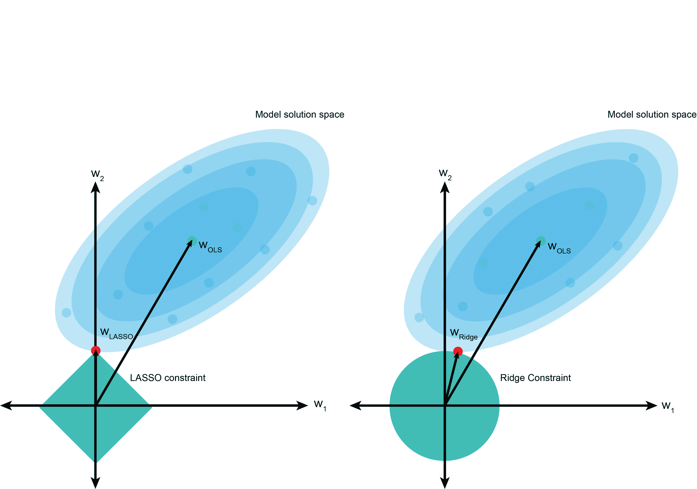

# 正则化

> 原文：<https://learnetutorials.com/machine-learning/regularization>

我们已经讨论了机器学习模型的过拟合问题，这使得模型预测不准确。会影响模型的效率。

## 什么是正则化？

正则化是过拟合问题的答案。我们可以说，正则化通过向模型中添加更多的信息来防止模型过拟合问题。

## 什么是机器学习模型的过度拟合？


在继续之前，我们需要知道什么是过度拟合问题。当机器学习模型在训练数据集上表现良好，并且在我们使用测试数据集时失败或导致错误时，就会出现这种情况。我们无法使用该模型来预测实值输入变量的输出。为了解决这个问题，我们可以使用正则化。

## 正则化方法有什么帮助？

在正则化方法中，我们使用模型中的所有特征，但是我们减少的是特征的大小，以便它可以是更精确和更一般化的模型，从而给出好的结果。换句话说，正则化减少了更复杂模型的使用，从而减少了过度拟合的机会。

**正则化**方法增加了额外的约束来做两件事:

1.  解决不适定问题(没有唯一稳定解决方案的问题)
2.  防止模型过度拟合

在机器学习中，正则化问题对代价函数施加了额外的**惩罚**。这种惩罚控制了模型的复杂性——更大的惩罚等于更简单的模型。这使得模型不会过度拟合数据，并遵循**奥卡姆剃刀**:简单的模型通常是最正确的。

正则化问题的一般形式如下所示:


其中 **f(x)** 是损失函数(类似于残差平方和) **λ** 是控制模型复杂度的**正则项**，而 **g(x)** 是回归系数的函数。

不同的 **g(x)** 函数本质上是不同的机器学习算法。

## 正则化技术

我们已经讨论了正则化中使用的两种主要技术，它们是

1.  L2 正则化或岭回归
2.  L1 正则化或套索回归
3.  辍学正则化

## 里脊回归

**岭回归**是一种灵活而强大的回归分析，用于输入变量之间相关性较高的情况。如果共线性很高，我们将在岭回归方法中加入一些偏差。我们在偏差中加入的量称为岭回归中的惩罚。岭回归对过拟合问题不太敏感。

Ridge 将有助于解决具有大量参数并且它们之间具有高度相关性的问题。岭也被用来降低我们称之为 L2 正则化的模型的复杂性。

岭回归是一种减少数据集中相关要素影响的正则化形式。它通过惩罚较大的系数，缩小非信息特定特征的系数来做到这一点。

### 富马酸盐及其解释

岭回归的数学公式如下所示:


左边的项是残差平方和——模型误差相对于实际值的度量。右边的项是惩罚项。注意，惩罚是β^2 的函数，它作为线性模型的约束。

岭回归的要点是，该模型更喜欢采用接近 0 的较小β估计，这减少了惩罚项。

### 关于调整正则化参数λ的注意事项

正则化项λ对模型性能有深远的影响，应谨慎选择。一种方法是简单地查看λ模型性能的不同值。

我们将使用[交叉验证](https://scikit-learn.org/stable/modules/cross_validation.html)编写一个方法来完成这个任务，这是评估超出本教程范围的模型的一个基本策略。

### 模型训练

我们将使用线性回归教程中描述的波士顿数据来预测房价中位数。

首先，加载波士顿数据集。

```
 # Import the dataset
from sklearn.datasets import load_boston

data = load_boston() 
print(data)

# Import general-use data science libraries
import pandas as pd
import numpy as np

# Import features
df = pd.DataFrame(data=data.data, 
                  columns=data.feature_names)
print(df)

# Import target (median housing prices)
target = pd.DataFrame(data=data.target, 
                      columns=["MEDV"])
print(target) 

```

然后分成训练集和测试集。

```
 from sklearn.model_selection import train_test_split
Xtrain, Xtest, Ytrain, Ytest = train_test_split(df, target, test_size=0.8, random_state=1)

print("Dataset sizes after train_test_split()")
print("Xtrain size: ", str(np.shape(Xtrain)))
print("Xtest size: ", str(np.shape(Xtest)))
print("Ytrain size: ", str(np.shape(Ytrain)))
print("Ytest size: ", str(np.shape(Ytest))) 

```

用超参数调整拟合岭模型

```
 # Fit the model
from sklearn.linear_model import RidgeCV
import numpy as np
lambdas = np.array([1.e-06, 1.e-05, 1.e-04, 1.e-03, 1.e-02, 1.e-01, 1.e+00, 1.e+01,
      1.e+02, 1.e+03, 1.e+04, 1.e+05, 1.e+06])
ridge_mdl = RidgeCV(alphas=lambdas).fit(Xtrain, Ytrain) 

```

## 套索回归

像岭回归一样，拉索回归也通过增加一些惩罚来降低模型的复杂性。唯一的区别是我们在 Lasso 中把实际的金额加到一个罚金上，就像在 ridge 中我们使用金额的平方一样。

最小绝对收缩和选择操作(LASSO)是正则化的另一种形式。它允许回归系数一直缩小到 0。这使得模型更加稀疏，计算效率更高。。套索回归也称为 L1 正则化

此外，LASSO 执行特征选择:系数为 0 的特征基本上被忽略。

## 富马酸盐及其解释

LASSO 的数学公式如下所示:


唯一不同于里奇公式的是惩罚项的绝对值。

### 从几何角度看山脊和拉索的直觉



上图是 LASSO(左)和 Ridge(右)回归的可视化表示。蓝云表示最小二乘运算，中心值为 **β** 的最小二乘估计。

然而，惩罚条款迫使我们不要取这个值，而是选择绿松石边界的值。岭回归中的平方项如果我们考虑一个二维问题就会得到一个圆(**β<sub>1</sub>T3【2】T4+β<sub>2</sub>T7】2T9】)。相比之下，LASSO 中的绝对值项会创建一个菱形约束。**

使用相同的最小二乘模型，岭回归中的圆约束使得有可能将系数 **w <sub>2</sub>** 收缩为接近 0 的小值(以红色显示)，但不一定达到 0。相比之下，LASSO 更有可能更严厉地惩罚系数 **w <sub>2</sub>** ，如果它不提供信息，则将它设置为 0。

### 模型训练

正如我们对线性回归和岭回归模型所做的那样，我们将在波士顿数据集上用超参数调整来训练 LASSO。

```
 # Fit the model
from sklearn.linear_model import LassoCV
import numpy as np
lambdas = np.array([1.e-06, 1.e-05, 1.e-04, 1.e-03, 1.e-02, 1.e-01, 1.e+00, 1.e+01,
      1.e+02, 1.e+03, 1.e+04, 1.e+05, 1.e+06])
lasso_mdl = LassoCV(alphas=lambdas).fit(Xtrain, Ytrain) 

```