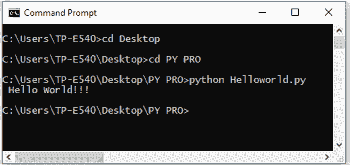

# python 语法、注释和缩进

> 原文：<https://learnetutorials.com/python/syntax-comments>

从前面的教程中，我们已经学会了在系统中成功安装 python。现在让我们开始，学习用 python 编写我们的第一个程序，以及如何运行它。除此之外，我们将掌握一些基础知识，比如什么是注释和缩进，以及它们在 python 中的意义。如果你希望成为一名熟练的代码编写人员，那么本教程就是为你准备的。

## 第一个面向初学者的 Python 程序

我们可以从一个简单而容易的程序开始，这个程序叫做“Hello World”python 程序，它一直被认为是任何编程语言的初学者程序。我们可以用三种方式执行一个程序。它们是:

### a)以交互模式运行 python

交互模式始终是初学者轻松学习 python 语言的最佳选择。在交互模式下，只要按下回车键，代码就会立即执行。因此，交互模式更倾向于 python 的独特特性，即代码的逐行执行。对于关注较少代码行和即时结果的人来说，交互模式是理想的。
要打开交互式解释器提示，您需要首先打开命令提示符，然后键入 python。屏幕上将出现以下提示。


现在输入下面显示 python 打印函数语法的例子。

### 示例:在命令提示符下打印“Hello World”程序

```py
>>> print("Hello, World !!!") 

```

```py
 Hello, World !!! 
```

*   ” **> > >** 的意思是准备运行和解释命令。
*   **print()** 是一个用来打印大括号内给出的消息的函数。始终将消息包含在单个('…….. '中)或双引号("……").
*   一按**回车键**输出就会出现在后续行。

如果代码中出现任何错误，将输出语法错误，而不是结果。

语法错误:扫描字符串文字时终止

```py
>>> print('Hello World!!!)
  File "<stdin>", line 1
    print('Hello World!!!)
                         ^</stdin> 

```

注意:使用`exit()`函数使 python 处于交互模式。

* * *

### b)在脚本模式下运行 Python

执行 python 程序的另一种基本模式是使用脚本模式，在这种模式下，我们需要在一个文件(helloworld.py)中编写代码，并且稍后将执行该文件。

在脚本模式下编写程序的步骤:

1.  打开记事本编辑器，输入“你好世界！！!"程序如下所示。

    
2.  将文件另存为 helloworld.py

3.  现在打开命令提示符，并使用命令“cd”建立路径。在上面的例子中，python 程序保存在一个名为“PY PRO”的文件夹中，该文件夹位于桌面上。使用 cd(更改目录)命令，我们已经更改了目录并建立了运行程序的路径。
4.  执行程序的语法是
5.  点击输入键，结果将打印在下面一行。

与其他编程语言不同， **Python 对执行顺序**的影响很大。为了清楚地证明逐行执行的重要性，让我们考虑下面的例子，不管模式如何，打印一些几何形状及其变化。

### 示例:打印几何形状-倒三角形

```py
print("__________")
print("\        /")
print(" \      / ")
print("  \    /  ")
print("   \  /   ")
print("    \/    ") 

```

**输出**

```py
__________
\        /
 \      / 
  \    /  
   \  /   
    \/ 
```

从上面的例子中，我们可以理解 python 以有序的方式运行它的代码，因此 Python 非常重视它的指令。为了说明上面的例子可以稍微修改一下，看看区别。

### 示例:打印几何形状–逐行执行图解

```py
print("\        /")
print(" \      / ")
print("__________")
print("  \    /  ")
print("   \  /   ")
print("    \/    ") 
```

**输出**

```py
\        /
 \      / 
__________
  \    /  
   \  /   
    \/ 
```

脚本模式的主要缺点是编译需要更多的时间。

* * *

### c)使用 IDE 运行 Python

我们可以用另一种方式执行 python，即使用集成开发环境。集成开发环境比纯文本编辑器工作得更好，因为它启用了一些功能。集成开发环境允许快速编辑、执行和更多能够提高代码速度和生产率的特性。下面列出了一些可供选择的集成开发环境。

*   路径
*   spyder python(python 语言)
*   崇高的文本 3
*   黯然失色

如果您的系统中有这些集成开发环境，您可以使用它们来学习 python 编程语言，如果没有，您可以下载并使用它们以方便您。

## Python 注释

到目前为止，我们已经了解了用 python 执行程序的不同方法。现在让我们掌握书写干净和精确的代码。一个人应该提高他们的注释技巧，让每个人都能读懂代码。

### 如何用 python 写注释？

为了提高代码的透明度，开发人员使用 python 注释。 **Python 注释**通常在一些语句或文本后面写有一个散列(#)字符。注释可以放在行首或行内。开头的注释用于描述程序或 python 脚本。如果代码复杂或难以理解，内联注释会给出代码的含义。考虑到注释是为了阐明代码，python 不会解释注释，并且在整个代码中保持不活动。

### 示例:如何用 python 创建注释

```py
 #program to find the sum and difference of two numbers
A = 5       #A is a variable 
B = 3          #B is a variable
print("A+B = ",A+B) #prints the sum of A and B
print("A-B = ",A-B) #prints the difference of A and B 

#programs ends 

```

* * *

### Python 注释的重要性

不仅在 python 编程语言中，而且在其他编程语言中，注释都被认为是必不可少的一部分。这是因为以下原因。

*   它使代码清晰明了
*   注释有助于其他开发人员和开发人员自己轻松地理解 python 代码及其工作流程。

* * *

### 多行注释

我们现在已经熟悉了前面例子中的单行注释。但是如果我们需要多行评论呢。实际上，python 没有多行注释的特定格式。但总会有这样或那样的方法。一种方法是在每个连续的行前添加一个散列字符，如下所示。

### 示例:多行注释

```py
# this is 
#one way of
#writing multi line comment 

```

python 语言的另一种注释方式是将所需的文本封装在一个三引号集合中，如下所示。

### 示例:使用三重引号的多行注释

```py
"""
this is 
one way of
writing multi line comment
 """

```

## python 中缩进的意义是什么？

缩进是我们在开始编写代码之前必须学习的一个关键特性。在 python 中，缩进扮演着重要的角色，就好像你不知道如何在 python 中正确地缩进序列，那么你会得到一个缩进错误，你的程序会在没有被编译的情况下卡住。

### 什么是 python 缩进？

**缩进**是指在 python 代码中使用空格和 tab，使它们成为一个块。通过缩进，我们将序列分成块，这有助于编译器或解释器理解代码序列必须执行的顺序。

像 C、C++、Java 等编程语言使用花括号来显示代码块的开始和结束。同样，python 使用缩进来指定块的开始和结束。块是语句和声明的集合。如果两个或多个语句遵循相同的缩进(垂直线)，则它们属于一个块。

压痕的图形表示


在上面的图片中

*   块 1 包含语句 1、2 和 7
*   块 2 包含语句 3、5 和 6
*   块 3 包含语句 4

* * *

### python 代码如何缩进？

下面的例子是缩进的例子。下面的程序显示了 if 语句的工作原理。

### 示例:如何使用缩进

```py
if  A==10      #block 1  begins
 Print(“A  contains value 10”)    #block 2 begins         
else :       #block 1 continues
 Print(“A  does not contain value 10 ”)   #block 2 continues
Print(“All done!”)     #block 1 ends 

```

**输出**

```py
A contains value 10
All done 
```

从上面的程序中可以很清楚地看出缩进在 python 编程语言中是如何工作的。压痕的密度取决于用户，但必须在整个特定区块保持一致。因此，python 中的缩进很重要，它提高了代码的结构简单性和可读性。

注意:默认情况下，python 使用 4 个空格进行缩进。