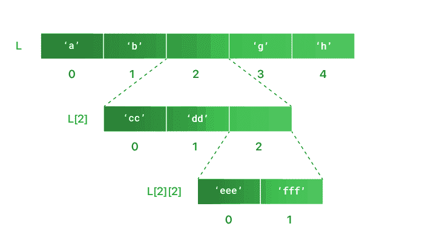
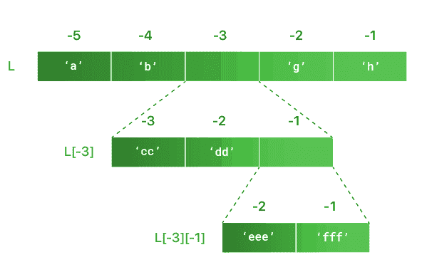

# Python 列表

> 原文：<https://learnetutorials.com/python/python-lists>

在本教程中，我们将借助示例掌握 python list 的所有知识、list 的重要特性、list 的创建、使用切片操作符的 list 操作、各种 list 操作等。此外，我们将了解嵌套列表。

在 python 的复合数据类型中，List 是最通用和最常用的数据类型。**列表是基于序列的数据类型，包含一组对象**。对象可以是任何类型。

## Python 列表的关键特性

*   列表本质上是可变
*   列表维护对象的顺序
*   列表支持索引
*   该列表可以是异构的
*   列表是动态的
*   该列表允许重复值
*   列表可以嵌套

* * *

## 如何定义 Python 列表

在 python 中，列表是通过在方括号 **[ ]** 中封装一系列元素来定义的。每个元素用逗号分隔。该列表可以包含任意数量的元素，并且可以是任意类型。以下示例将帮助您理解列表是如何在 python 中定义的。

**空列表:**没有元素或长度为 0 的列表。

### 示例:定义空列表

```py
emp_list =[] 

```

**同质列表:**具有相同数据类型元素的列表。

### 示例:用整数元素定义同构列表

```py
int_list =[10,20,30] 
.
```

**异构或混合列表:**包含不同数据类型元素的列表

### 示例:定义包含字符串、整数和浮点类型元素的混合列表。

```py
mix_list =['Tom',25,5.9] 

```

**嵌套列表:**包含另一个列表的列表。

### 示例:定义嵌套列表

```py
Nest_List = [['Apple', 'Apricot'],['Banana','Blueberry'],"Cherry"] 

```

## 索引和切片以访问列表项

与字符串一样，列表中的项目可以使用`index []`运算符或切片运算符 `[:]`来访问。我们可以将列表视为一个动态数组，因此索引和切片在 python 列表中工作得很好。

## python 列表中的索引

索引是为列表中的项目分配一个编号以便于访问的过程。索引总是从零开始，并且必须是整数。
python 列表中的两种索引类型是:

*   **正向步进**–步进从 0 开始，从头到尾向前移动。
*   **负步进**–步进从-1 开始，从尾部到头部向后移动。

为了彻底理解索引，让我们考虑一下这个例子及其可视化。“LIST”是一个 python 列表，由元素“RED”、“BLUE”、“GREEN”和 PINK 组成。列表中的每个元素都根据正索引和负索引分配了一个与其位置相对应的数字，如下所示。


1.  ### 通过正索引获取元素

    可以通过参考索引号来访问列表中的各个项目。下面的代码显示了如何使用正索引来访问项目。

    ### 示例:通过正索引获取项目

    ```py
    List = ['Red','Blue','Green','Pink']
    print("List[0]=",List[0])
    print("List[3]=",List[3]) 
    Output:
    ```

    ```py
    List[0]= Red
    List[3]= Pink 
    ```

2.  ### 通过负索引获取元素

    Python 列表还支持从列表尾部访问项目的负索引。负索引总是从索引为-1 的列表末尾开始。

    ### 示例:通过负索引获取项目

    ```py
    List = ['Red','Blue','Green','Pink']
    print("List[-1]=",List[-1])
    print("List[-3]=",List[-3])
    Output:
    ```

    ```py
    List[-1]= Pink
    List[-3]= Blue
    ```

* * *

## Python 列表中的切片

Python List 也能很好地与范围切片操作符`[:]`配合使用。在这里，使用切片操作符，我们可以根据需要从列表中切片项目块。简而言之，我们可以使用 slice 操作符创建一个子列表。范围切片的语法是

`L [ m:n]`

其中 L 是包含项目的列表
**m** :起始索引
**n** :结束索引
**L【m:n】**返回从索引 m 到 n 的子列表，但不包括索引 n，
切片本身可以通过各种方式进行，有正索引和负索引。切片可以通过将项目放在索引中间来最好地表达，如下所示。


1.  ## List slicing by positive index

    *   对表单进行切片:`L[m:n]`返回从位置 m 到 n 的子列表，但不包括索引 n。

        ```py
        L = ['Red','Blue','Green','Pink','Grey']
        print("L[1:3] =",L[1:3]) 

        ```

        **输出:**

        ```py
        L[1:3] = ['Blue', 'Green'] 
        ```

    *   表单切片:`L[:n]`默认从起始位置返回子列表为 n，但不包括索引 n.

        ```py
        L = ['Red','Blue','Green','Pink','Grey']
        print("L[:2] =",L[:2]) 

        ```

        **输出:**

        ```py
        L[:2] = ['Red', 'Blue'] 
        ```

    *   表单切片:`L[m:]`返回从位置 m 到结束索引的子列表。

        ```py
        L = ['Red','Blue','Green','Pink','Grey']
        print("L[2:] =",L[2:]) 

        ```

        **输出:**

        ```py
        L[2:] = ['Green', 'Pink', 'Grey']
        ```

        * * *

2.  ## List slicing by negative index

    *   对表单进行切片:`L[-m:-n]`返回从位置 m 到 n 的子列表，但不包括索引 n。

        ```py
        L = ['Red','Blue','Green','Pink','Grey']
        print("L[-4:-2] =",L[-4:-2]) 

        ```

        **输出:**

        ```py
        L[-4:-2] = ['Blue', 'Green'] 
        ```

    *   表单切片:`L[:n]`默认从起始位置返回子列表为 n，但不包括索引 n

        ```py
        L = ['Red','Blue','Green','Pink','Grey']
        print("L[:-2] =",L[:-2]) 

        ```

        **输出:**

        ```py
        L[:-2] = ['Red', 'Blue', 'Green'] 
        ```

    *   表单切片:`L[-m: ]`返回从位置 m 到结束索引的子列表。

        ```py
        L = ['Red','Blue','Green','Pink','Grey']
        print("L[-4:] =",L[-4:]) 

        ```

        **输出:**

        ```py
        L[-4:] = ['Blue', 'Green', 'Pink', 'Grey'] 
        ```

## 如何修改 Python 列表

使列表成为 python 编程语言中通用数据类型的一个突出特征是“列表是可变的”。这意味着列表可以在创建后更改。Python List 可以根据需要通过添加、删除或更改项目进行修改。Python 提供了多种改变列表的方法。

1.  ## 如何替换 Python 列表中的项目？

    与字符串不同，Python 列表可以通过用其他项目替换现有项目来修改。通过简单地使用赋值运算符=，将新项目重新分配到我们需要更改的位置，索引使替换项目变得容易。替换列表中项目的两种可能方式是:

    *   **单项更换** -我们只更换清单上的一项。在下面的例子中，红色被黄色代替。

        ```py
        L = ['Red','Blue','Green','Pink','Grey']
        L[0]= 'Yellow'
        print('Modified List is :',L) 
        ```

        **输出:**

        ```py
        Modified List is : ['Yellow', 'Blue', 'Green', 'Pink', 'Grey'] 
        ```

    *   **多项目替换** -我们可以替换列表中的一系列项目。这里，在这个例子中，绿色和粉色分别被橙色和黑色所取代

        ```py
        L = ['Red','Blue','Green','Pink','Grey']
        L[2:4]= ['Orange','Black']
        print('List after modificaiton is',L) 
        ```

        **输出:**

        ```py
        List after modificaiton is ['Red', 'Blue', 'Orange', 'Black', 'Grey'] 
        ```

2.  ## 如何向计算机编程语言列表添加项目？

    修改列表的另一种方法是向现有列表添加元素。为了向列表中添加项目，python 有两种方法:
    *   `append()` 该方法用于向 python 列表中添加一个项目。语法是`list_name.append(item)`

        ```py
        LF =['Daisy','Rose']
        LF.append('Tulip')
        print("List after appending:",LF) 

        ```

        **输出:**

        ```py
        List after appending: ['Daisy', 'Rose', 'Tulip'] 
        ```

    *   `extend()`方法用于向 python 列表中添加一系列项目。语法是`list_name.extend([item1, item2,…])`

        ```py
        LF =['Daisy', 'Rose', 'Tulip']
        LF.extend(['Orchid','Poppy'])
        print("Extend List is:",LF) 
        ```

        **输出:**

        ```py
        Extend List is: ['Daisy', 'Rose', 'Tulip', 'Orchid', 'Poppy'] 
        ```

    *   Moreover, an existing list can be modified by inserting items at a specific location. `insert()` method is used to insert a particular item at a distinct position in a list. The insert method takes two parameters one for specifying the position and the other for the item. The syntax of insert() is `list_name.insert(index, item)`

        在下面的例子中，项目 20 被插入位置 LN[2]。

        ```py
        LN =[ 10,30]
        LN.insert(2,20)
        print(LN) 

        ```

        **Output:**

        ```py
        [10, 30, 20] 
        ```

3.  ## 如何从计算机编程语言列表中删除项目？

    到目前为止我们已经看到了列表中项目的替换和添加，相似性我们可以从列表中删除项目。下面列出了从列表中删除项目的两种常见方法。
    *   **使用关键字** `**del**` :从现有列表中删除已知项目或删除整个列表本身。语法为`del variable_name`

        ```py
        L = ['Red','Blue','Green','Pink','Grey']
        del L[2];
        print(" List after deleting item at index 2 is:",L) 

        ```

        **输出:**

        ```py
        List after deleting item at index 2 is: ['Red', 'Blue', 'Pink', 'Grey'] 
        ```

    *   **使用`remove()`方法**:从现有列表中删除一个项目。语法为`List_name.remove(item_name)`。

        ```py
        L = ['Red','Blue','Green','Pink','Grey']
        L.remove('Blue')
        print("List after removing item : Blue is:",L) 

        ```

        **输出:**

        ```py
        List after removing item  Blue is: ['Red', 'Green', 'Pink', 'Grey'] 
        ```

    *   **使用`pop()`方法**:如果给定了索引，则移除所提供索引处的项目，否则默认移除并返回最后一个项目。语法为 `List_name.pop(index)`。

        ```py
        L=[10, 20, 30, 40, 50]
        L.pop(1);
        print("List after removing item at index 1 is :",L)
        L.pop();
        print("List after removing the last item is:",L) 

        ```

        **输出:**

        ```py
        List after removing item at index 1 is : [10, 30, 40, 50]
        List after removing the last item is: [10, 30, 40] 
        ```

## Python 嵌套列表

到目前为止，我们已经研究了该列表及其特征。列表的另一个重要特征是它的嵌套能力。你说的筑巢是什么意思？

**嵌套**是指将某物储存在另一个里面。在 python 中，嵌套列表是包含列表作为其元素的列表，而列表又包含另一个列表。

嵌套列表的创建方式和我们创建列表的方式一样，唯一的区别是在嵌套列表中，一个或多个元素可以是一个列表。

### 定义嵌套列表

```py
Nest_List = [['Apple', 'Apricot'],['Banana','Blueberry'],"Cherry"] 
```


为了更好地理解，嵌套列表可以用如下分层结构表示。



## 如何访问嵌套列表中的项目

从嵌套列表中访问项就像引用多个索引一样简单。我们可以使用正索引或负索引来访问项目。

### 使用正索引从嵌套列表中访问项目

```py
NL = ['a',['bb','cc'],'d',['e',['fff','ggg']],'h','i']
print(NL[3])
print(NL[3][1])
print(NL[3][1][0])
print(NL[4]) 
```

**输出:**

```py
['e', ['fff', 'ggg']]
['fff', 'ggg']
fff
h 
```

### 使用负索引访问项目

让我们参考嵌套列表的负索引的图形表示。



### 使用负索引从嵌套列表中访问项目

```py
NL = ['a',['bb','cc'],'d',['e',['fff','ggg']],'h','i']
print(NL[-3])
print(NL[-3][-1])
print(NL[-3][-1][-1])
print(NL[-4]) 
```

**输出:**

```py
['e', ['fff', 'ggg']]
['fff', 'ggg']
ggg
d 
```

## 如何修改嵌套列表

同样，我们可以通过以下方式修改嵌套列表

1.  ### Change the value

    ### by using index technology to change the item

    ```py
    NL = ['a',['bb','cc'],'d',['e',['fff','ggg']],'h','i']

    NL[1][0]= 0
    print(NL) 
    ```

    **Output:**

    ```py
    ['a', [0, 'cc'], 'd', ['e', ['fff', 'ggg']], 'h', 'i'] 
    ```

2.  ### Use the append () or insert () or extend () methods.

    ### Add the item

    ```py
    NNL = ['a',['bb','cc'],'d',['e',['fff','ggg']],'h','i']

    NL[1].append('xx')
    NL[1].insert(0,'yy')
    NL[3][1].extend([1,2,3])
    print(NL) 
    ```

    **Output:**

    ```py
    ['a', ['yy', 'bb', 'cc', 'xx'], 'd', ['e', ['fff', 'ggg', 1, 2, 3]], 'h', 'i'] 
    ```

3.  ### Use pop (), or remove () or del keywords to remove items.

    ### Remove the item

    ```py
    NL = ['a',['bb','cc'],'d',['e',['fff','ggg']],'h','i']

    NL[1].pop(0)
    print(NL)  #removed items bb

    del NL[3][1][0]
    print(NL)  #removed item fff

    NL[3][1].remove('ggg')
    print(NL) 

    ```

    **Output:**

    ```py
    ['a', ['cc'], 'd', ['e', ['fff', 'ggg']], 'h', 'i']
    ['a', ['cc'], 'd', ['e', ['ggg']], 'h', 'i']
    ['a', ['cc'], 'd', ['e', []], 'h', 'i'] 
    ```

* * *

## Python 列表函数

Python list 有一些内置函数来执行一些常见的顺序操作。基本功能列表如下，便于参考。

| 功能 | 描述 |
| --- | --- |
| 镜头(列表) | 返回列表的长度 |
| 最大值(列表) | 返回列表中最大的值 |
| 最小值(列表) | 返回列表中的最小值 |
| 比较(L1、L2) | 将 L1 列表中项目与 L2 列表中的项目进行比较 |
| 列表(序列) | 将元组转换为列表 |

## Python 列表运算符和操作

正如在字符串中了解到的，Python List 也有操作符来执行一些特定的操作。为了更好地理解，下面给出了最常见的操作。

1.  ## 使用成员操作符检查子列表

    成员操作符用于验证列表中某个项目或子列表的存在。相应的结果将是真值或假值。python 中的两个成员操作符是:

    *   中的**:如果项目或子列表出现在提供的列表中，则返回真**
    *   **不在**中:如果提供的列表中没有项目或子列表，则返回真

    ```py
     L =[1,2,3,5,6,8]
    print("Validation 3 in List is ",3 in L)
    print("Validation 4 not in List is",4 not in L) 

    ```

    **输出:**

    ```py
     Validation 3 in List is True
    Validation 4 not in List is True 
    ```

2.  ## 列表的串联和重复

    It is also possible to combine two or more separate lists in python. Combining two or more separate lists is termed as concatenation whereas repeating a list multiple times is termed as repetition. The two operators used for concatenation and repetition are:
    *   **加号运算符(+)** 也称为用于连接列表的连接运算符
    *   **星号运算符(*)** 也称为重复运算符，用于重复列表。

    ```py
     L1= ['Red','Orange']
    L2= ['Blue','Green']
    print("Concatenated List is :",L1+L2)
    print("Repeated List is:",L1*3) 

    ```

    **输出:**

    ```py
     Concatenated List is : ['Red', 'Orange', 'Blue', 'Green']
    Repeated List is: ['Red', 'Orange', 'Red', 'Orange', 'Red', 'Orange'] 
    ```

## Python 列表–内置方法

我们现在熟悉一些内置的方法，比如 `insert()`、`remove()`、`pop()`等。在 python 编程语言中，很少有其他方法可以很好地处理列表对象。方法使用点操作符访问，如`list_name. method_name(parameters)`。

为了便于参考，表格中给出了基本方法。

| 方法 | 描述 |
| --- | --- |
| 计数(p) | 返回作为参数传递的列表中某项的出现次数 |
| 指数 | 返回作为参数传递的项的最低索引 |
| 追加(p) | 将作为参数传递的项追加到列表中；在列表尾部添加一项 |
| 扩展(列表) | 通过添加另一个列表来扩展列表。 |
| 插入(I，p) | 将特定项目插入指定的索引，其中 I 是索引值，p 是特定项目 |
| 移除(p) | 从列表中移除作为参数传递的项 |
| 流行音乐() | 默认情况下，移除列表中的最后一项并返回列表。 |
| 清除() | 从列表中移除所有元素 |
| 排序() | 默认情况下，列表项按升序排序。 |
| 反向() | 颠倒列表中项目的顺序 |
| 复制() | 返回现有列表的浅层或虚拟副本。 |