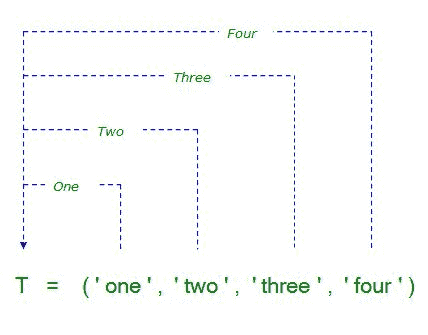
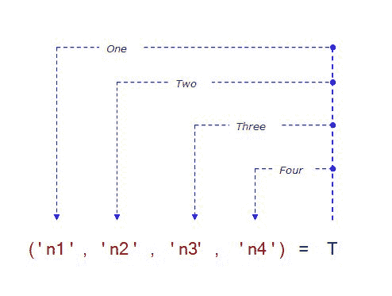

# python 元组

> 原文：<https://learnetutorials.com/python/python-tuples>

在本 python 教程中，您将掌握 Python 元组、元组创建、元组索引和切片、各种元组运算符以及您应该熟悉的方法。

元组是本质上不可变的有序对象的集合。元组与列表非常相似，都遵循一个序列，但是元组不支持对象的可变性，而列表支持可变性。更具体地说，一旦元组被创建，我们就不能改变它的对象，尽管我们可以很容易地改变列表中的对象。

## Python 元组的关键特性

*   元组本质上是不可变的
*   元组维护对象的顺序
*   元组支持索引
*   元组可以包含异构对象
*   元组是静态的
*   元组允许重复值

## 如何定义 Python 元组

在 python 中定义元组就像定义列表一样简单明了。Python 元组是通过在括号或一个**圆括号** `()`中包含一组有序对象来定义的。每个对象用**逗号** `,`隔开。虽然括号是可选的，但为了更好的编码和可读性，建议使用括号。下面的例子将有助于理解如何以不同的方式定义 python 元组。

**空元组:**没有元素或长度为`0`的元组。

### 示例:定义一个空元组

```py
emp_tuple =() 

```

**单元组:**具有单个元素的元组。单元组是通过在括号中包含一个后跟逗号的元素来定义的。在定义单个元素时，尾随逗号是必需的，以确定这是一个元组，而不是表达式。

### 示例:定义单元组

```py
Sin_tuple =(10,) 

```

**同质元组:**具有相同数据类型元素的元组

### 示例:定义同质元组

```py
str_tuple =('a','b','x','y') 

```

**异构元组**:包含不同数据类型元素集合的元组。

### 示例:用整数、字符串和浮点数据类型定义异构元组

```py
mix_tuple= (6,'Sixty',6.5)
```

**嵌套元组**:包含另一个元组的元组

### 示例:定义嵌套元组

```py
nest_tuple=('prime',(1,2,3,5,7))
```

## 索引和切片来访问元组元素

从前面的教程中，我们熟悉 python 中的索引和切片方法。在元组中，索引和切片以与列表中相同的方式完成。我们可以使用索引和切片非常容易地访问元组中的元素。

## Python 元组中的索引

索引是为元组中的元素分配数字以便于访问的过程。索引总是从零开始，并且必须是整数。

python 列表中有两种类型的索引:

*   **正向索引**–索引从 0 开始，从头到尾向前遍历。
*   **负步进**–步进从-1 开始，从尾部到头部向后移动。

为了彻底理解索引，让我们考虑一下这个例子及其可视化。“t”是一个 python 元组变量，由元素“猫”、“牛”、“狗”和“鼠”组成。元组中的每个元素都根据正索引和负索引被分配一个对应于它们的位置的数字，如下所示。


1.  ### 通过正索引获取元素

    It is possible to access individual elements from a python tuple by referring to its index number. The below code shows how to access an item using positive indexing.

    ### 示例:通过正索引获取单个元素

    ```py
    T= ('Cat','Cow','Dog','Rat')
    print('Element accessed at index 1 is:',T[1])
    print('Element accessed at index 3 is:',T[3]) 

    ```

    **输出:**

    ```py
    Element accessed at index 1 is: Cow
    Element accessed at index 3 is: Rat 
    ```

2.  ### 通过负索引获取元素

    Like the python list, the python tuple also supports negative indexing to access items from the tail. Negative indexing always starts from the end of the tuple with the index starting at -1.

    ### 示例:通过负索引获取元素

    ```py
    T= ('Cat','Cow','Dog','Rat')
    print('Element accessed at index -2 is:',T[-2])
    print('Element accessed at index -3 is:',T[-3]) 

    ```

    **输出:**

    ```py
    Element accessed at index -2 is: Dog
    Element accessed at index -3 is: Cow 
    ```

## Python 元组中的切片

Python Tuple 与范围切片运算符`[:]`配合使用也很好。这里，使用切片操作符，我们可以根据需要从元组中切片子序列。简而言之，我们可以使用 slice 运算符创建一个子耦合。范围切片的语法是

```py
 T [ m:n] 

```

其中 T 是包含项
**m** 的元组:起始索引
T5【n】T6:结束索引
T【m:n】返回从索引 m 到 n 的子元组，但不包括索引`n`。
切片本身可以通过各种方式进行，有正索引和负索引。切片可以通过将项目放在索引中间来最好地表达，如下所示。


* * *

1.  ### Tuple slicing by positive index

    *   表单切片:T `[m:n]`返回从位置 m 到 n 的子元组，但不包括索引 nT4】示例：如何切片元组以获取从 m 到 n-1 的元素；

        ```py
        T= ('Cat','Cow','Dog','Rat','Bat')
        print("T[1:4] =",T[1:4]) 

        ```

        **输出:**

        ```py
        T[1:4] = ('Cow', 'Dog', 'Rat') 
        ```

    *   表单切片:T `[:n]`默认将起始位置的子元组返回到 n，但不包括索引 n

        ### 示例：如何将元组从起始位置切片到第 n 个位置

        ```py
        T= ('Cat','Cow','Dog','Rat','Bat')
        print("T[:4] =",T[:4]) 

        ```

        **输出:**

        ```py
        T[:4] = ('Cat', 'Cow', 'Dog', 'Rat') 
        ```

    *   表单切片:T `[m:]`返回从位置 m 到结束索引的子偶。

        ### 示例：如何将元组从第几个位置切片到尾部

        ```py
        T= ('Cat','Cow','Dog','Rat','Bat')
        print("T[2:] =",T[2:]) 

        ```

        **输出:**

        ```py
        T[2:] = ('Dog', 'Rat', 'Bat') 
        ```

2.  * * *

    ### Tuple slicing by negative index

    *   Slicing of the form :T[-m:-n] returns the subtuple from position m to n, but excluding index n.

        ### 示例:如何使用负索引将元组从 m 切分到 n

        ```py
        T= ('Cat','Cow','Dog','Rat','Bat')
          print("T[-4:-2] =",T[-4:-2])
        ```

        **输出:**

        ```py
        T[-4:-2] = ('Cow', 'Dog') 
        ```

    *   表单切片:T[:n]默认返回从起始位置到 n 的子元组，但不包括索引 n

        ### 示例：如何使用负索引将元组从起始位置切割为 n

        ```py
        T= ('Cat','Cow','Dog','Rat','Bat')
          print("T[:-2] =",T[:-2])
        ```

        **输出:**

        ```py
        T[:-2] = ('Cat', 'Cow', 'Dog') 
        ```

    *   对表单进行切片:T[-m: ]返回从位置 m 到结束索引的子对。T3】示例：如何使用负索引将元组从第几个位置切割到尾部

        ```py
        T= ('Cat','Cow','Dog','Rat','Bat')
          print("T[-4:] =",T[-4:])
        ```

        **输出:**

        ```py
        T[-4:] = ('Cow', 'Dog', 'Rat', 'Bat') 
        ```

## 如何修改 Python 元组

不变性是 python 编程语言中数据类型元组的独特特性之一。更具体地说，一旦创建了元组，我们就不能更改或修改元组中的元素。这意味着不可能在元组中添加、替换或移除元素。如果我们试图修改一个元组，我们将得到一个类型错误而不是输出。

### 示例:说明元组不变性的属性

```py
 NT=('prime',[1,2,3,5,7])
NT[0]='ODD'
print(NT) 

```

**输出:**

```py
 TypeError: 'tuple' object does not support item assignment 
```

但是当元组中的元素是可变的时，情况就不同了。例如，元组可以包含列表作为其元素。该列表是可变的，因此可以修改该元素。如果您想在列表中再添加一个质数，我们可以添加它，如下例所示。输出将是一个附加列表，其中还有一个质数 11。

### 示例:如何用元组中的修改可变元素

```py
 NT=('prime',[1,2,3,5,7])
NT[1].append(11)
print("Modified List in NT is :",NT) 

```

**输出:**

```py
 Modified List in NT is : ('prime', [1, 2, 3, 5, 7, 11]) 
```

## 如何删除元组元素

考虑到元组是不可变的这一事实，不可能从元组中删除或移除元素。但是，我们可以使用关键字 del 删除整个元组。如果我们试图在删除名称后打印元组，将会引发错误。

示例:如何删除元组

```py
OT=(1,3,5,7,9)
del OT;
print(OT) 

```

**输出:**

```py
 print(OT)
NameError: name 'OT' is not defined 
```

 <h2how and="" pack="" pyth="" to="" tuples="" unpack="">## 如何打包和解包 python 元组

从字面上看，一个 python 元组是一组不同或相同的条目，按照一种很好的顺序排列。我们通常使用赋值运算符=将右侧的项赋给左侧的变量。Python 提供了特殊功能，将赋值运算符提升到了另一个层次。

它们是:

## 元组的打包

### 示例:如何打包元组

```py
T=('One','Two','Three','Four')
print("T[0] = ",T[0])
print("T[2] = ",T[2]) 

```

**输出:**

```py
 T[0] =  One
T[2] =  Three 
```

顾名思义，Packing 表示将项目集合打包到一个变量中。现实生活中把衣服装进包里的例子和元组的打包有很大关系。包装可以很好地可视化如下。



## 元组的解包

解包正好与打包相反，在打包中，分配给元组变量的每个项都被解包为新的元组。让我们再一次考虑现实生活中从包里拿出衣服的例子，每件衣服都会放在指定的架子上。拆包可以说明如下。



### 示例:如何解包元组

```py
(n1,n2,n3,n4) = T
print("n1 contains :",n1)
print("n2 contains :",n2)
print("n3 contains :",n3)
print("n4 contains :",n4) 

```

**输出:**

```py
 n1 contains : One
n2 contains : Two
n3 contains : Three
n4 contains : Four 
```

Python 允许通过将打包和解包合并成一条语句来进行复合赋值。示例中显示了该格式。

### 示例:元组的复合赋值

```py
(n1,n2,n3,n4)= ('One','Two','Three','Four') 
print("n2 contains :",n2)
print("n3 contains :",n3) 

```

**输出:**

```py
 n2 contains : Two
n3 contains : Three 
```

解包时要考虑的一个要点是，左侧的变量对象的数量必须等于元组中的值的数量。如果失败，将输出值错误而不是结果。

值解包元组时出错

```py
 (n1,n2,n3) = T
(n1,n2,n3,n4,n5) = ('One','Two','Three','Four') 

```

**输出:**

```py
 ValueError: too many values to unpack (expected 3)
ValueError: not enough values to unpack (expected 5, got 4) 
```

## 什么是 python 中的嵌套元组？

像列表一样，元组也可以是嵌套的，这意味着一个元组可以包含另一个元组作为其元素，该元素内部还可以包含另一个元组。我们可以通过将逗号分隔的元素放在()括号内来定义嵌套元组。

### 示例:定义嵌套元组

```py
 nest_tuple=('prime',(1,(2,(4,8)),3,5,7)) 

```

### 如何从嵌套元组中访问元素

我们可以使用正索引或负索引从嵌套元组中访问元素。下面的例子给出了从嵌套元组中获取元素的想法。

### 示例:从嵌套元组中访问元素

```py
 nest_tuple=('prime',(1,(2,(4,8)),3,5,7))
#Positive indexing
print(nest_tuple[1])
print(nest_tuple[1][1])
print(nest_tuple[1][1][0])

#Negative indexing 
print(nest_tuple[-1])
print(nest_tuple[-1][-4])
print(nest_tuple[-1][-4][-1]) 

```

**输出:**

```py
 i = 10
f = 10.55 
C = -5-6i 
```

## Python 元组成员资格验证

成员运算符用于验证元组中元素或子元组的存在。相应的结果将是真值或假值。python 中的两个成员操作符是:

*   中的**:如果元素或子元组出现在提供的列表中，则返回真**
*   **不在**中:如果提供的列表中没有元素或子元组，则返回真。

```py
 T =('prime',1,3,5,7)
print("Validation 3 in tuple is ",3 in T)
print("Validation 8 not in List is",8 not in T) 

```

**输出:**

```py
 Validation 3 in List is True
Validation 8 not in List is True 
```

## Python 元组函数

Python tuple 有一些内置函数来执行一些常见的顺序操作。基本功能列表如下，便于参考。

| 功能 | 描述 |
| --- | --- |
| 透镜(元组) | 返回元组的长度。 |
| 最大值(元组) | 返回元组中最大的值。 |
| 最小值(元组) | 返回元组中的最小值 |
| 比较(T2 T1) | 将元组 T1 中的项目与元组 t2 中的项目进行比较 |
| 列表(序列) | 将列表转换为元组 |

## Python 元组与 Python 列表

我们已经学习了元组和列表。现在让我们总结一下 python 元组和列表的重要异同。

### 类似

*   元组和列表都属于顺序数据类型
*   元组和列表都可以包含任何类型的元素
*   两者都可以使用索引来访问。

### 差异

*   元组是不可变的，而列表是可变的
*   元组通常包含异构元素，而列表通常包含同构项
*   元组是可散列的，因此可以用作集合中的元素，而列表是不可散列的，不能用作集合中的元素
*   元组可以用作字典的关键字，但列表不能。
*   元组不能是副本，而列表可以。
*   元组的执行速度比列表快</h2how>