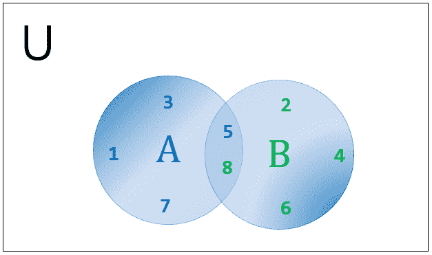
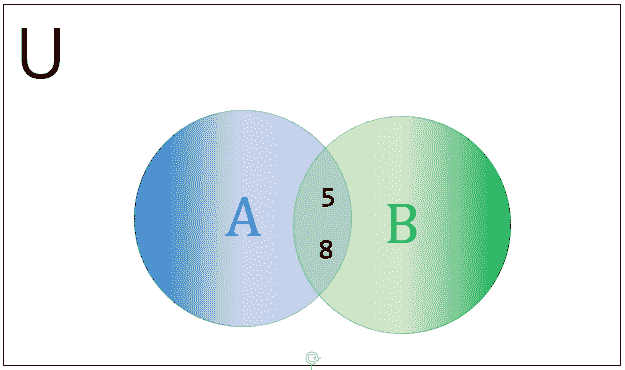
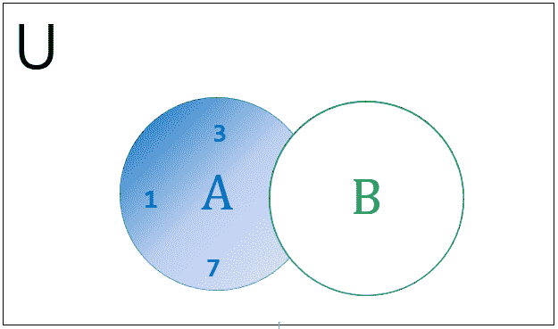
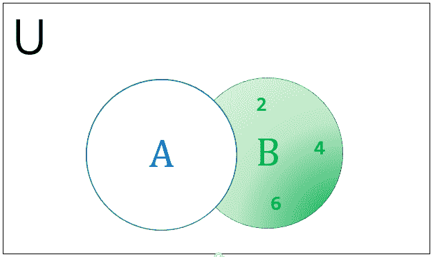
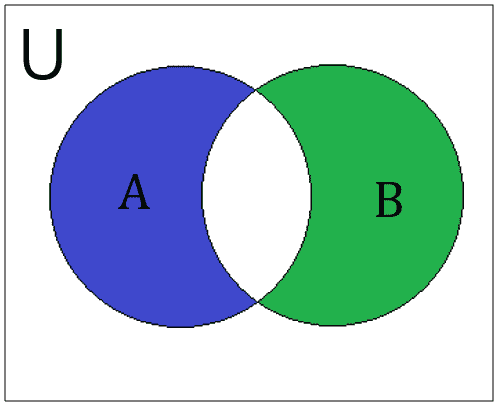

# Python 集

> 原文：<https://learnetutorials.com/python/python-sets>

在本教程中，您将掌握所有关于 Python 集的知识；如何编写集合，集合如何在 python 中工作，如何对集合执行标准操作，如并集、交集和差集。除此之外，我们将学习操纵集合的方法。

数学上，一个集合可以被定义为无序的不同对象的集合。同样，在 python 中，**集合是独特元素的无序集合**。要清楚的是，集合中的元素不是按照它们在集合中出现的顺序存储在内存中的。集合中的所有元素都必须是不可变的。但是集合本身是可变的，所以我们可以通过添加或移除元素来修改集合。

另一个变体，叫做冻结集，正如它的名字所指的，是静态的，是不可变的。

## Python 集的关键特性

*   集合中的元素是唯一的，这意味着不允许有重复的元素。
*   Set 是无序的，这意味着元素不遵循任何顺序。
*   Set 不支持索引。
*   集合是可变的，而集合中的元素是不可变的

## 如何用 Python 写集合

可以通过两种方式定义集合，一种是用花括号括住逗号分隔的元素，另一种是使用`set()`函数。

不变性在集合中比在其他数据类型中更重要，因为集合是可变的，而集合中的元素是不可变的。这意味着一旦元素被创建，我们就不能改变它。更准确地说，像整数、浮点、字符串、元组等不可变数据类型可以是集合中的一个元素，但永远不应该是列表、集合或字典，因为它们是可变的(可变的)。一个集合可以包含任意数量的元素。

**空集合:**通常使用带有零参数的`set()`函数来定义空集合，以避免使用空花括号 **{}** 时引起的歧义。Python 将空花括号 **{}** 作为字典，这是 python 中的另一种数据类型，您将在下一个教程中学习。

### 示例:定义空集合

```py
emp_set=set()
print(type(emp_set))

emp_set={}
print(type(emp_set)) 
```

**输出:**

```py
<class 'set'>
<class 'dict'> 
```

**同质集合:**具有相同不可变数据类型的元素的集合。

### 示例:如何编写同构集

```py
int_set = {1,2,3,4}
print("Homogenous set with integer elements:",int_set)
str_set = {'red','blue','green'}
print("Homogenous set with string elements:",str_set)
```

**输出:**

```py
Homogenous set with integer elements: {1, 2, 3, 4}
Homogenous set with string elements: {'green', 'blue', 'red'}

```

**混合集:**包含不同不可变数据类型元素的集

### 示例:如何编写混合集

```py
mix_set={3.14,'prime',(1,2,3,5,7)}
print("Mixed set is ",mix_set)
```

**输出:**

```py
Mixed set is {3.14, 'prime', (1, 2, 3, 5, 7)}

```

## python 中的集合是如何工作的？

在 python 中，集合通常用于验证元素的成员资格，并消除序列中的重复。我们已经了解到 python 集合不计算重复元素和可变元素。如果集合中存在任何重复元素，那么它将自动从序列中消除重复元素，类似地，如果集合中包含任何可变元素，Python 将引发`TypeError` ，如下所示

### 示例:重复值

```py
S={1,2,3,1,2,3} # duplicate elements are automatically eliminated 
print (S)

```

**输出:**

```py
{1, 2, 3} 
```

示例:集合中的可变元素

```py
S={ 'odd',[1,3,5]}
print(S)

```

**输出:**

```py
TypeError: unhashable type: 'list' 
```

从上面的例子中，我们可以理解这个列表是不可删除的。你说的 hashable 是什么意思？Hashable 意味着能够散列，这反过来告诉对象或数据类型是固定的，一旦创建就不能更改。如果元素是不可变的，则该元素是可散列的。例如字符串，元组是不可变的，因此是可散列的。相比之下，作为可变元素的 Python List 是不可修改的。

注意:不可变对象是可散列的，而可变对象不是。

* * *

## 如何访问集合

我们现在熟悉的是，集合是独特的元素的无序集合。集合成员的存储方式与它们在集合中出现的方式不同。为了理解，让我们检查下面的例子。

```py
 A=set('Green')
print(A)

```

**输出:**

```py
{'e', 'G', 'n', 'r'} 
```

此外，我们可以发现它从集合(“绿色”)中消除了重复值“e”，并返回具有四个唯一元素的集合，

### `{'e', 'G', 'n', 'r'}`。

由此，我们可以推断，不可能像对字符串和元组等其他数据类型那样，使用索引和切片来访问列表中的元素。

## 如何修改 Python 集

集合的可变行为使得通过添加单个或组元素来修改集合成为可能。向列表中添加元素的两种常用方法是:

1.  **add()**: used to a single element to a set.

    ### 如何向集合添加元素

    ```py
    str_set = {'red','blue','green'}
    str_set.add("Black")
    print("New set after addition :",str_set) 

    ```

    **输出:**

    ```py
    New set after addition : {'blue', 'green', 'red', 'Black'} 
    ```

2.  **update()**: used to add multiple elements to a set

    ### 如何添加多个元素进行设置

    ```py
    str_set = {'royal blue'}
    str_set.update((65,105,225))
    print("New set after addition :",str_set) 

    ```

    **输出:**

    ```py
    New set after addition : {65, 'royal blue', 225, 105} 
    ```

* * *

## 如何从集合中移除元素

要从集合中移除元素，python 集合中有两种方法。分别是`discard()`和`remove()`。区别`discard()`和`remove()`的唯一行为是，如果元素在集合中不可用，`discard()`保持集合不变，但是 remove()会引发`KeyError`。这可以在下面的例子中说明。

### 如何从集合中移除元素–丢弃和移除方法

```py
A= {1,2,3,4,6,8}
A.discard(3)
print(A)
A.remove(4)
print(A)

A.discard(5)
print(A)
A.remove()
print(A) 

```

**输出:**

```py
{1, 2, 4, 6, 8}
{1, 2, 6, 8}
{1, 2, 6, 8}
KeyError: 3 
```

要从集合中移除整个元素，我们可以使用`clear()`方法。我们也可以使用`pop()`方法移除集合中的最后一个元素。由于布景无序，我们无法预测`pop()`之后的结果。要删除整个集合，我们可以使用`del` 关键字。

### 示例:pop()，clear() & del 关键字

```py
A= {1,2,3,4,6,8}
A.pop()
print("Set after using pop method is",A)
A.clear()
print(A)
del A 

```

**输出:**

```py
Set after using pop method is {2, 3, 4, 6, 8}
set() 
```

注意:pop()方法的返回值是不可预测的，因为集合是无序的。

## Python 集合运算和操作数

集合可以用于数学计算，除了其他用途，如重复消除和成员资格验证。四种常见的集合运算是并、交、差和对称差。我们也可以通过使用方法在 python 中执行这些操作。

## 如何在 python 中添加/连接两个集合？

在 python 中添加两个集合仅仅意味着将两个不同的集合组合成一个集合。可以使用称为并集的集合操作来连接两个集合。顾名思义，union 将两个不同的集合合并成一个新的集合。python 中使用的并集操作数是`“|”`。如果 A 和 B 是两组，那么`A & B`的并集表示为`A|B`。

**让我们的设定成为**


A 和 B 的并集将是一个包含 A 和 B 中所有唯一元素的新集合。重复的元素将从集合中排除。下图显示了 A|B 的维恩图



### 集合的并集:A|B

在 python 中，集合的并集可以通过多种方式完成。它们列在下面

*   使用集合操作数(|)–用唯一的元素组合两个集合
*   使用 union()方法–返回包含集合中所有元素的新集合。

### 示例:集合并集

```py
 A = {1,3,5,7,8}
B = {2,4,5,6,8}

print("A|B = ",A|B)
print("A.union(B) = ",A.union(B))
print("B.union(A) = ",B.union(A)) 

```

**输出:**

```py
 A|B = {1, 2, 3, 4, 5, 6, 7, 8}
A.union(B) =  {1, 2, 3, 4, 5, 6, 7, 8}
B.union(A) =  {1, 2, 3, 4, 5, 6, 7, 8} 
```

## python 中集合的交集是什么？

在两个集合的 python 交集中，A 和 B 是由两个集合的公共元素组成的集合。两个集合的交集可以表示为`A&B`，其中&是交集操作数。


`A`和`B`的交集返回 A 和 b 中有公共元素的新集，换句话说，我们可以说重复的值作为公共元素。下图为`A&B`的文氏图。



### 集合的交集:A&B

Python 通过使用交集操作数或使用`intersection()`方法来完成集合的交集。

### 示例:集合交集

```py
 A = {1,3,5,7,8}
B = {2,4,5,6,8}

print("A&B =",A&B)
print("A.intersection(B) = ",A.intersection(B))
print("B.intersection(A) = ",B.intersection(A)) 

```

**输出:**

```py
 A&B = {8, 5}
A.intersection(B) =  {8, 5}
B.intersection(A) =  {8, 5} 
```

## 如何在 python 中找到集合的差异？

集合的差异比通常的数学差异是一个相当棘手的概念。然而，在这两种情况下，我们使用相同的操作数`(-)`来表示差异。要理解这个概念，无疑要把 A 和 B 看作是两个具有不同元素的集合。集合 A 和集合 B 的差可以用两种方式表示，但它们可能不相等。

*   **A-B** :解读为 B 与 A 的集合差给出了 A 中的集合元素，而不是 B 中的集合元素
*   **B-A** :解读为 A 与 B 的集合差给出了 B 中的一组元素，而不是 A 中的一组元素。


下图是表示集合差异的维恩图。



### 设定差异:A-B



### 设置差异:B-A

集合差可以在 python 中使用操作数或`difference()`方法执行，如下例所示。

### 示例:设置差异

```py
A = {1,3,5,7,8}
B = {2,4,5,6,8}

print("A-B = ",A-B)
print("B-A = ",B-A)

print("A.difference(B) = ",A.difference(B))
print("B.difference(A) = ",B.difference(A)) 

```

**输出:**

```py
A-B =  {1, 3, 7}
B-A =  {2, 4, 6}
A.difference(B) =  {1, 3, 7}
B.difference(A) =  {2, 4, 6} 
```

## python 中的对称差异是什么？

python 中的对称差是一个集合运算，用来求两个集合的对称差。设 A 和 B 是两个集合，它们的对称差是 A 和 B 中的元素组成的集合，但不是两者都有。换句话说，这是`A-B`和`B-A`的结合，也就是说，

#### `A^B =(A-B) |(B-A)`

集合 A 和 B 的对称差可以表示为`A^B`，其中`^`是操作数。使用的方法是`symmetric_difference()`。


使用文氏图可以最好地说明对称差异



### A^B 集的对称差

下面的例子展示了对称差分的工作原理。

### 示例:设置对称差

```py
 A = {1,3,5,7,8}
B = {2,4,5,6,8}

print("A^B = ",A^B)
print("A.symmetric_difference(B) = ",A.symmetric_difference(B)) 

```

**输出:**

```py
 A^B =  {1, 2, 3, 4, 6, 7}
A.symmetric_difference(B) =  {1, 2, 3, 4, 6, 7} 
```

## 用于验证成员资格的 Python 集

集合中的另一个重要操作是成员资格验证。这意味着我们可以使用成员操作符轻松检查元素子集的存在。python 中的两个成员操作符是:

*   中的**:仅当集合中存在子集或元素时返回真**
*   **不在**中:仅当集合中不存在子集或元素时返回真。

### 示例:设置对称差

```py
 A = {1,3,5,7,8}

print(3 in A)
print(8 not in A) 

```

**输出:**

```py
 True
False 
```

## Python 内置函数

Python 集有一些内置函数来完成各种任务。下面是一组内置函数的列表。

| 功能 | 描述 |
| 镜头(组) | 返回集合中元素的数量。 |
| 最大值(设置) | 返回集合中最大的元素。 |
| 心态 | 返回集合中最小的元素。 |
| 已排序(集合) | 返回元素按升序或降序排序的新集合。 |
| 总和() | 返回集合中元素的总和。 |
| 枚举() | 返回一个枚举对象，它是集合中所有元素的一对索引和值。 |
| 任何() | 如果集合中的任何元素为真，则返回真；对于空集合，则返回假。 |
| 全部() | 如果集合中的所有元素都为真或为空集合，则返回真。 |

## 集合中的方法

Python 集有很多方法来执行一些特定的任务。其中一些我们在上一节已经熟悉了。你可以参考下表来了解器械包的使用方法。

| 方法 | 描述 |
| 添加() | 向集合中添加元素 |
| 清除() | 从集合中移除整个元素 |
| 复制() | 返回集合的副本 |
| 差异() | 返回包含两个或多个集合的差的新集合 |
| 差异 _ 更新() | 通过移除集合中的公共元素来更新第一个集合 |
| 丢弃() | 如果元素存在于集合中，则移除该元素，否则不执行任何操作 |
| 交叉点() | 返回包含两个集合的公共元素的新集合。 |
| 交集 _ 更新() | 用两个或多个集合的公共元素更新第一个集合 |
| isdisjoint() | 如果两个集合没有公共元素，则返回 True。 |
| issubset（） | 如果父集中存在集合，则返回真。 |
| issuperset() | 如果此集合包含另一个集合，则返回真。 |
| 流行音乐() | 移除集合中的最后一个元素。 |
| 移除() | 移除特定元素。 |
| 对称 _ 差异() | 返回两组对称差的集合 |
| 对称 _ 差异 _ 更新() | 用自身和其他的对称差更新第一个集合 |
| 工会() | 返回一个由两个或多个集合组成的新集合。 |
| 更新() | 用现有集合和其他集合的并集更新集合。 |

## 冻结集

集合的另一个变体是冻结集合，因为它的名称表明集合的所有元素都是冻结的。与集合不同，冻结集合中的所有元素都是固定的，并且在其整个生命周期中都是不可变的。因此，冻结集是可散列的，这意味着它们的元素在创建后不能更改。冻结集合的哈希值可以作为[字典](../python/python-dictionaries)的关键字，也可以作为另一个集合的集合元素。

## 如何创建一个数据集

使用 `frozenset()`功能创建冻结集。参数可以是集合或任何可变对象。如果参数为空，那么 frozenset 函数将返回一个空 frozenset。以下示例为您提供了如何创建 frozenset 的想法。

### 冻结集创建

```py
 Fset=frozenset(['prime',1,2,3,5,7])
print(Fset)
Emp_Fset=frozenset()
print(Emp_Fset) 

```

**输出:**

```py
 frozenset({1, 2, 3, 5, 7, 'prime'})
frozenset() 
```

Frozenset 执行几乎所有在一个集合中工作的方法，如 `copy()`、`difference()`、`intersection()`、 `symmetric_difference()`、`union()`、`issubset()`、 `issuperset()`和`isdisjoint()`。由于 frozenset 是不可变的，添加或移除元素的方法不适用，如果试图改变 frozenset，结果将是`TypeError`。

注意:如果我们试图修改 frozenset，将会引发类型错误。