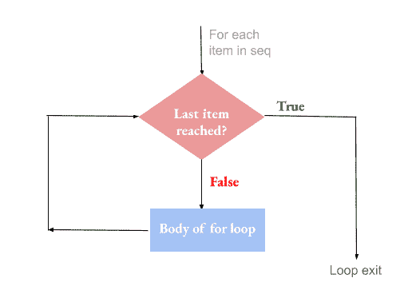
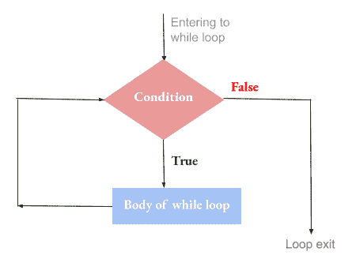
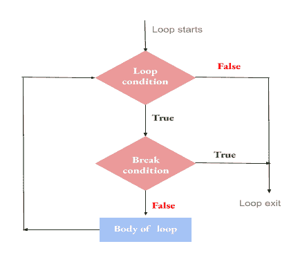
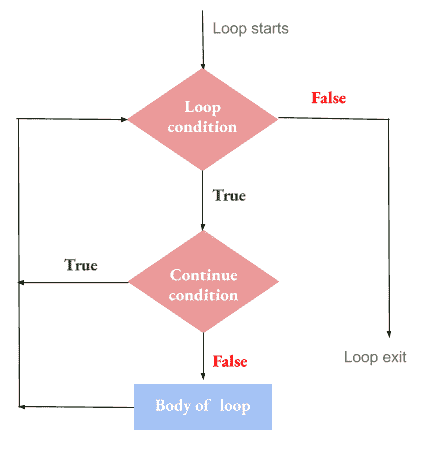

# Python 循环

> 原文：<https://learnetutorials.com/python/python-loop-tutorials>

在本教程中，您将通过示例掌握 python 中所有关于循环的知识；比如 for 循环和 while 循环，它们的语法和流程图，以及如何嵌套循环。此外，我们还将通过示例学习如何使用中断、继续和传递等关键词来控制循环流，以及如何在“for loop”中使用 range 函数。

## 什么是 python 中的迭代？

迭代是为多个实例重复一组代码或直到它们满足条件的过程。与迭代相关的两个重要因素是:

*   **迭代器**是指在迭代中保存可数值的对象。
*   **可迭代对象**是指可以重复或迭代的对象。

迭代也称为循环。这是因为一个指令序列会一个接一个地重复执行，直到它满足条件，从而形成一个循环。

迭代被广泛地分为不同的类型。

1.  循环的确定迭代
2.  无限迭代- While 循环

## 什么是 python 中的确定迭代？

考虑这样一个场景:您有一组代码，并且想要执行它六次。执行它的一种方法是将这组代码写 6 次并执行 6 次。但是它消耗了大量的时间和空间。

所以这里有一个简单得多的方法。，确定迭代。在确定的迭代中，迭代的次数在循环体执行之前是已知的。由于迭代次数是已知的，我们需要在循环开始时明确指定它。我们可以用“ **For 循环**来说明确定迭代的方法。

## python 中的 For 循环

**“for 循环”**通常被称为**“计数控制循环”**用于迭代字符串、列表、元组、集合和字典等序列。迭代的次数取决于序列的长度。

### for 循环的语法

```py
 For  <var>  in  <iterables>:
     <...........loop body…...> 

```

在哪里

*   `var` 是在每次迭代中取 iterables 内的值的变量。
*   Iterables 是字符串、列表、元组等序列。

当变量到达序列的最后一项并且使用缩进指定循环体时，迭代停止。

注意:在 python 中，循环不需要索引变量初始化。



### for 循环示例

下面的例子显示了循环是如何在列表和字符串上工作的。

```py
 #List is iterable
L = ['Red','Green','Blue']
for i in L:
 print(i)

#String is iterable
Str ='RGB'
for x in Str:
 print(x)

#integer is not iterable
int = 8999
for i in int:
 print(i) 

```

**输出:**

```py
Red
Green
Blue
R
G
B

TypeError: 'int' object is not iterable 
```

在上面的例子中，List `L`和 String `Str`是可选项，`i`是变量。在每次迭代中，变量`i`取`L`和`Str`中的连续项目并打印结果。

像列表和字符串这样的顺序数据类型执行并输出结果。另一方面，非顺序输出的整数类型对象是`TypeError`，这意味着整数类型对象是不可迭代的。

注意:在 python 中，作为集合或序列的所有数据类型都是可迭代的。

## 范围()函数和索引

另一种迭代序列的建设性方式是索引。for 循环中的索引并不像我们在字符串和列表中所学的那样简单。在跳转到索引之前，我们先来认知一下`len()`功能和`range()`功能。

1.  ### len()函数

    **len()** 是 python 中的内置函数，用于确定给定序列的长度。换句话说，len()函数返回序列中的项目总数。

    **语法**:

    ```py
     len(seq) 

    ```

    “RGB”是长度为 3 的字符串，[“红色”、“绿色”、“蓝色”是长度为 3 的列表。

2.  ### 范围()函数

    range()函数通常用于生成一系列数字。

    **语法**:

    ```py
     range( start,stop,step) 

    ```

    其中，开始表示序列的开始位置，默认为`0`停止表示序列的结束位置，不包含在序列中。步长表示增量，默认为`1`。

    ### 示例:以 3 种不同的方式列出范围函数

    ```py
    print(list(range(6)))
    print(list(range(2,6)))
    print(list(range(2,6,2))) 

    ```

    **输出:**

    ```py
    [0, 1, 2, 3, 4, 5]
    [2, 3, 4, 5]
    [2, 4] 
    ```

    #### 如何在 for 循环中使用 range()函数？

    Range()函数可以在 for 循环中使用，使用索引遍历序列中的项。下面的例子将阐明这个概念。

    ### 示例:for 循环中的 range()函数

    ```py
    L = ['Red','Green','Blue','Black']
    for i in range(1,len(L),2):
        print(L[i]) 

    ```

    **输出:**

    ```py
    Green
    Black 
    ```

## 不定迭代

不定迭代用于我们事先不知道执行次数的情况。在这里，只要条件满足，代码就会执行。而循环是无限迭代的。

## python 中的 While 循环

也称为**条件控制循环**用于迭代一组代码，只要它满足条件。如果不满足条件，循环终止，控制转移到外部语句。

## While 循环语法

```py
 while <condition>:
     <body of while></condition> 

```

## 当循环流程图



### while 循环的示例:

```py
 count = 0
while(count<5):
   count=count+1
   print(count) 

```

**输出:**

```py
 1
2
3
4
5 
```

在这个例子中，

*   索引变量被初始化为零
*   接下来是检查计数变量的值是否小于 5 的条件。只要条件保持为真，while 的主体就会执行。
*   之后控制切换到包含两个语句的 while 循环体。
    *   increment 语句递增计数变量的值。如果我们跳过这一步会发生什么？显然，循环的执行一直在继续，永远不会结束。所以在使用 while 循环时，这一步是必须的。
    *   接下来是打印计数变量值的 print 语句。
*   循环继续，直到它们的条件失败并退出循环。

注意:在 python 中使用循环时，请记住使用缩进。

## 循环中的中断和继续语句

在 python 中，可以使用关键字“break”或“continue”在任何时候中断循环。break 语句用于终止循环，而 continue 语句用于通过跳过循环中的一些代码来继续循环。

## 中断声明

break 语句，正如它的名字所表明的，当它满足一个特定的条件时，会在某个时候中断程序流。换句话说，break 语句一旦满足给定条件就终止循环，并将控制转移到循环外的下一条语句。

以下是循环中 break 语句的语法。

### for 循环中 break 语句的语法

```py
 For  <var>  in  <iterables>:
     <...........loop body…...>
     If <condition>:
        break 

```

### while 循环中 break 语句的语法

```py
 While <condition 1>:
 <body of while loop>
   If <condition 2>:
        break 

```

## 循环中中断语句的流程图。



### 示例:说明循环内部的 break 语句

```py
 L = ['Red','Green','Blue','Black','White']
for i in range(len(L)):
 if L[i]=='Blue':
  break
 print(L[i])
print('Program Ends Here') 

```

**输出:**

```py
 Red
Green
Program Ends Here 
```

### 示例:说明 while 循环中的 break 语句

```py
 count = 0
while(count<5):
 count=count+1
 if count==3:
  break
 print(count) 

```

**输出:**

```py
 1
2 
```

## 继续语句

顾名思义，continue 语句通过跳过一些满足所提供条件的代码集来继续循环。Continue 语句从不像 break 语句那样终止循环。

以下是循环中 Continue 语句的语法

### for 循环中 Continue 语句的语法

```py
 For  <var>  in  <iterables>:
     <...........loop body…...>
     If <condition>:
        continue 

```

### while 循环中 Continue 语句的语法

```py
 While <condition 1>:
 <body of while loop>
   If <condition 2>:
        continue 

```

## 继续语句流程图



### 示例:演示在 for 循环中使用 continue 语句。

```py
 L = ['Red','Green','Blue','Black','White']
for i in range(len(L)): 
 if L[i]=='Blue':
  continue
 print(L[i]) 
print('Program Ends Here') 

```

**输出:**

```py
 Red
Green
Black
White
Program Ends Here 
```

### 示例:演示在 while 循环中使用 continue 语句。

```py
 count = 0
while(count<5):
 count=count+1
 if count==3:
  continue
 print(count) 

```

**输出:**

```py
 1
2
4
5 
```

## 循环中的“否则”块

python 允许的一个独特特性是在循环结束时使用可选的 else 块。else 块的语法在下面给出，用于 for 循环和 while 循环。

### for 循环中 Else 块的语法

```py
 For  <var>  in  <iterables>
     <...........loop body…...>
    else:
       <Statement(s)> 

```

### while 循环中的 Else 块的语法

```py
 While <condition >
 <body of while loop>
  else:
       <Statement(s)> 

```

放置在 else 子句中的<statement>只有在循环“耗尽”结束时才会被执行——这意味着循环迭代，直到控制条件评估为假，else 部分仅在此之后被执行。如果循环被 break 语句终止，那么 else 子句将无法执行。</statement>

### 示例:循环中的否则块

```py
 Str ='RGB'
for i in Str:
 print(i)
else:
 print('loop exits as string reaches its last character') 

```

**输出:**

```py
 R
G
B
loop exits as string reaches its last character 
```

### 示例:否则在 while 循环中阻塞

```py
count = 0
while(count<5):
 count=count+1
 print(count)
else:
 print('Loop exits as count is no longer less than 5') 

```

**输出:**

```py
 1
2
3
4
5
Loop exits as count is no longer less than 5 
```

## Python 嵌套循环

Python 编程语言也允许循环嵌套的原理。嵌套循环是包含另一个循环的循环。嵌套可以进行到任何级别，但是嵌套到 2 或 3 个级别很方便，因为级别越高，复杂性越高，容易出错。

### for 循环中嵌套循环的语法

```py
 For  <var>  in  <iterables>:
    For  <var>  in  <iterables>:
        <loop body>
     <loop body> 

```

### while 循环中嵌套循环的语法

```py
 While <condition 1>:
    While <condition 2>:
        <body of while loop>
    <body of while loop> 

```

在上面的语法中，我们看到一个 for 循环在另一个 for 循环内部，而 while 循环在另一个 while 循环内部。这种嵌套概念如下所示

### 示例:嵌套循环

```py
 L1 = ['Red','Green','Blue']
L2 = ['Car','Colour','Stone']
for i in L1:
 for j in L2:
  print(i,j)
  print('\n') 

```

**输出:**

```py
 Red Car
Red Colour
Red Stone

Green Car
Green Colour
Green Stone

Blue Car
Blue Colour 
```

### 示例:嵌套 While 循环

```py
 i=1
while(i<=3):
 j=0
 while(j<3):
  j=j+1
  print(i,'*',j,'=',i*j)
 i=i+1
 print('\n') 

```

**输出:**

```py
 1 * 1 = 1
1 * 2 = 2
1 * 3 = 3

2 * 1 = 2
2 * 2 = 4
2 * 3 = 6 
```

同样，我们可以在 while 循环中包含一个 for 循环，在 for 循环中包含一个 while 循环。但是你需要记住的事实是缩进的使用。下面的示例显示了 for 循环如何嵌套在 while 循环中。

### 例如:while 循环中的循环

```py
 i=1
while(i<=3):
 L2 = ['Car','Colour','Stone']
 for j in L2:
  print(i,j)
 i=i+1 

```

**输出:**

```py
 1 Car
1 Colour
1 Stone

2 Car
2 Colour
2 Stone

3 Car 
```

## Python 传递语句

python 中的 pass 语句是用于实现存根的 null 语句。pass 语句通常在 python 程序中充当占位符。

Python 不允许循环为空。为了避免在这种情况下出错，我们使用了 pass 语句。与注释不同，python 解释器不会忽略 pass 语句，而是由解释器执行 pass 语句。pass 语句的结果将是无操作，因为在执行 pass 语句时不会发生任何事情。

### **示例**:说明传递语句在循环中充当占位符

```py
 Str ='RGB'
for i in Str:
    pass 

```