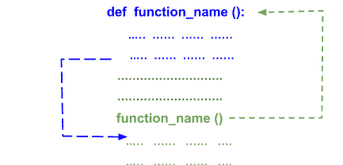
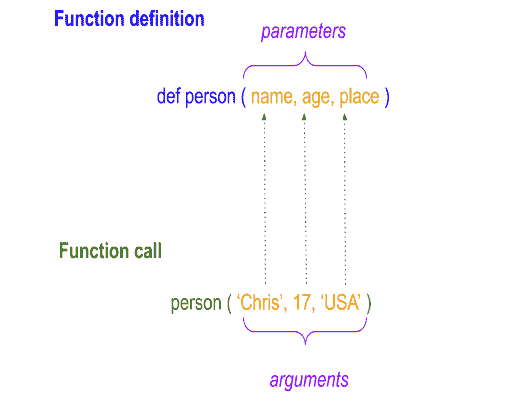
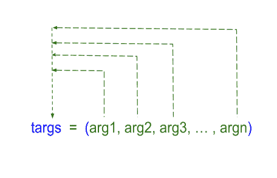

# Python 函数

> 原文：<https://learnetutorials.com/python/python-functions-tutorials>

在本教程中，您将通过 python 中的示例掌握所有关于函数的知识；什么是函数，函数在程序中的重要性是什么，不同类型的函数，如何定义和调用函数，不同类型的参数等。除此之外，从初学者到专家，您还将学习 python 中变量范围和递归的概念。

## 什么是函数？

函数必然是一个独立的代码块，用于执行特定的任务或相关的任务集。该功能主要分为两种类型。他们是

1.  内置功能
2.  用户定义的函数

在之前的教程中，您已经看到了许多内置函数的例子，即`len()`、`max()`等。内置函数是为 python 构建的函数，最终用户可以访问它来执行他们想要的特定任务。另一方面，用户定义的功能是用户为执行特定任务而定义的功能。

展望未来，你将学会创建和执行自己的功能。在此之前，让我们讨论一下在 python 程序中使用函数的好处。

## 程序中函数的重要性

函数在所有编程语言中扮演着重要的角色，原因如下。

*   程序可读性增加
*   允许以紧凑的方式重用代码
*   模块化-复杂的程序被分成更小的块
*   避免冗余
*   最大限度地减少出错的机会

## 如何定义函数？

### 该函数的基本语法如下。

```py
 def < function_name >(< parameter(s) >):
  “ “ “ Doc_String ” ” ”
   < function _body >
   return(< expression >) 

```

上述功能定义的组成部分如下表所示。

| 成分 | 描述 |
| 极好的 | 关键字 def 定义函数头的开头 |
| < function_name > | 应该是有效的标识符。(参考标识符规则) |
| < parameter(s) > | 用于向函数传递值。可选择的 |
| ： | 指示函数头的结尾 |
| " " "文档 _ 字符串" " " | 用于提供函数文档。可选择的 |
| < function _body > | 遵循相同缩进级别的有效 python 语句 |
| 返回 | 返回该函数的值。可选择的 |

### 一个函数示例说明了如何打印圆的面积:

```py
 def area_calc():
 """this function gives the area of different shapes"""
pi =3.14
r = 10
print('Area is :',a) 

```

在上面的例子中，我们定义了一个函数来打印圆的面积。在进行函数调用之前，这不会执行。函数定义保持不活动，直到解释器找到函数调用。

## 如何调用函数？

函数调用是 python 函数的另一个重要组成部分。一旦一个函数的创建完成，我们需要通过从另一个函数、程序或 python 提示符中调用它来执行该函数。要调用函数，请使用以下语法:

### Python 函数调用语法

```py
 < function_name >(< argument(s) >) 

```

这里，在函数调用中，参数是指传递给函数的值。函数调用中的参数与函数定义中的参数同义。我们可以将参数部分留空，但是在函数调用和函数定义中，圆括号都是必须的。

### 函数调用示例:

```py
 # this is the function definition
def area_calc(r):
 """this function gives the area of circle"""
 pi = 3.14
 a = pi*r*r
 print('Area is :',a)

#This illustrates function call
area_calc(10)
area_calc(20) 

```

**输出:**

```py
 Area is : 314.0
Area is : 1256.0 
```

在本例中，area_calc(10)和 area_calc (20)是带有参数 10 和 20 的函数调用。

## python 中函数的工作原理

到目前为止，在本教程中，我们已经详细讨论了 python 函数中使用的所有组件。现在让我们学习函数的整体工作和执行顺序。



程序中的一个函数只有在调用了一个函数时才变为活动的。函数调用将控制传递给函数，函数在函数中通过执行函数体来执行特定任务。当遇到 return 语句时，最终结果将返回给函数调用，否则它将在函数中输出结果并立即终止函数。

注意:在 python 中，参数通常表示为 arg 或 arg。

## Python 函数参数

函数的另一个重要组成部分是参数。参数在括号内的 function_ name 后面定义。参数应使用逗号分隔，参数的数量不限于任何数字。

在前面的例子中`area_calc(10)`和`area_calc(20)`介绍了在函数调用中使用单个参数。这些参数在每次函数调用时被传递给函数定义中的参数“r”，并接受值 10 和 20 来完成任务。

论点大致分为 4 种类型。

1.  ### 必需的参数

    必需参数，也称为**位置参数**是 python 中向函数传递参数的最简单方式。由于函数调用中的参数对应于函数定义中的参数，因此应该充分考虑传递的参数的数量和位置(顺序)。

    ```py
    #this is function definition
    def person(name, age, place):
     print(' Hi ,Iam',name ,age,'years old lives in ',place)

    # this is function call
    person('Chris',17,'USA') 

    ```

    **输出:**

    ```py
     Hi,Iam Chris 17 years lives in  USA 
    ```

    在上例中，函数调用`person(‘Chris’,17,’USA’)`有 3 个参数，函数定义`person(name,age,place)`有 3 个参数。这里，函数定义中的参数充当变量来保存函数调用的值。参数是在函数的本地定义的，当调用函数时，参数按照与它们的位置相同的顺序传递给参数。因此被称为位置参数。

    下面给出的可视化让这个概念变得清晰。

    

    注意:传递参数的顺序必须对应于函数中参数的顺序。

    如果你无序地传递位置参数，会发生什么？显然，函数按原样执行，但是结果可能不像您预期的那样正确。例如，`person(‘USA’,17,’Chris’)`产生的结果是嗨，我是美国 17 岁的克里斯，这不是预期的结果。

    考虑到要传递多个参数的情况，例如顺序，多个参数应该绑定到函数中的多个参数。以下示例解释了该参数如何获得 name required 参数的事实。

    例子:一个额外的参数

    ```py
     def person(name, age, place):
     print(' Hi ,Iam',name ,age,'years old lives in ',place)

    person('Chris','Jake',17,'USA',) 

    ```

    **输出:**

    ```py
     person('Chris','Jake',17,'USA',)
    TypeError: person() takes 3 positional arguments 
    but 4 were given 
    ```

    示例:缺少一个参数

    ```py
     def person(name, age, place):
     print(' Hi ,Iam',name ,age,'years old lives in ',place)

    person('Chris',17) 

    ```

    **输出:**

    ```py
     person('Chris',17)
    TypeError: person() missing 1 required positional argument: 'place' 
    ```

    这里的两个例子意味着传递给函数的参数数量必须与函数定义中的参数相匹配。如果我们增加或遗漏一个参数，那么结果将是一个错误。

    简而言之，当调用函数时，python 中的必需参数或位置参数必须指定要传递的适当数量的参数，与函数定义中的参数顺序完全相同。

    注意:传递的参数数量必须与函数中的参数数量相匹配。

2.  ### 关键字参数

    python 中引入关键字参数是为了放宽对所需参数的一些限制。当我们调用函数时，关键字参数采用 <keyword>`<keyword>=<value></value></keyword>` <value>的形式。这里每个关键字必须对应函数定义中的一个参数。让我们看看如何使用关键字参数修改前面的示例。</value></keyword>

    ### 示例:为了说明关键字参数在 Python 中的使用:

    ```py
     #this is function definition
    def person(name, age, place):
     print(' Hi ,Iam',name ,age,'years old lives in ',place)

    # this is function call
    person(name='Chris',age=17,place ='USA')
    person(age=17,place ='USA',name='Chris') 

    ```

    **输出:**

    ```py
     Hi ,Iam Chris 17 years old lives in  USA
    Hi ,Iam Chris 17 years old lives in  USA 
    ```

    在上面的示例中，您可以注意到突出显示的函数调用中的参数是无序的。尽管如此，它还是会输出正确的答案。这表明，当在函数调用中指定关键字参数时，顺序不是问题，这意味着调用者函数通过名称来标识指定给参数的适当参数。

    示例:引用未声明参数的关键字

    ```py
     def person(name, age, place):
     print(' Hi ,Iam',name ,age,'years old lives in ',place)

    person(name='Chris',age=17,country ='USA') 

    ```

    **输出:**

    ```py
     person(name='Chris',age=17,country ='USA')
    TypeError: person() got an unexpected keyword argument 'country' 
    ```

    该示例显示了当关键字引用函数中未声明的参数时会发生什么。它会生成一个异常。因此，参数和关键字使用相同的名称是至关重要的。

    关键字参数只允许按照要传递的参数顺序进行简化，而不允许按照要传递的参数数量进行简化。当函数调用中的参数数量与参数数量不匹配时，就会出现异常，如位置参数。

3.  ### 默认参数

    顾名思义，默认参数假定函数参数的默认值在函数调用过程中缺少参数值。默认参数在函数定义中定义，其中参数采用 <name>= <value>的形式，其中<value>是该参数的默认值。以下示例阐明了默认参数的概念:</value></value></name>

    ```py
     #this is function definition
    def person(name='Tom', age=20, place ='UK'):
     print(' Hi ,Iam',name ,age,'years old lives in ',place)

    # this is function call
    person('Chris',17,'USA')
    person('Chris') 

    ```

    **输出:**

    ```py
     Hi ,Iam Chris 17 years old lives in  USA
     Hi ,Iam Chris 20 years old lives in  UK 
    ```

    在这个例子中

    由此，我们可以推断，默认参数通过允许在函数调用期间省略参数来解除对参数数量的限制。

    *   在函数调用 person('Chris '，17，' USA ')期间，所有参数值都被传递给函数参数，因此它会产生结果“嗨，我是 Chris，17 岁，住在美国”。

    *   第二个函数调用 person('Chris ')，只将一个参数值传递给函数，缺少另外两个参数值。即使这样，它也会通过将默认值设置为函数中的参数来生成结果“嗨，我是克里斯，20 岁，住在英国”。

4.  ### 任意参数/可变长度参数

    Python 允许在函数定义中使用可变长度参数(任意参数)来处理一些我们不太确定函数需要的参数数量的情况。根据参数的类型，它分为两种类型:

    *   ### 非关键字任意参数

        任意参数通常通过在参数前放置一个(*)星号来定义，例如，*args。* args 也称为非关键字任意参数。

        每当一个参数以星号为前缀时，它就表示参数的元组打包。函数调用中的参数被打包成一个元组，函数通过其参数名引用该元组。下图给出了参数元组打包的可视化。标记是函数定义中的参数，arg1、arg2、arg3、…、argn 是函数调用期间传递的参数

        

        ### 具有可变长度参数的函数定义示例如下所示:

        ```py
         def fn(*names):
         print(names ,' belongs to',type(names) )
         for i in names:
          print(i)

        fn('Red','Green','Blue')
        print('\n')
        fn('Bike','Car','Bus','Train') 

        ```

        **输出:**

        ```py
         ('Red', 'Green', 'Blue')  belongs to <class>Red
        Green
        Blue

        ('Bike', 'Car', 'Bus', 'Train')  belongs to <class>Bike
        Car
        Bus
        Train</class></class> 
        ```

        在上面的例子中

        *   *names 是任意参数，它在每次函数调用期间接受任意长度的参数。
        *   fn(“红色”、“绿色”、“蓝色”)和 fn(“自行车”、“汽车”、“公共汽车”、“火车”)是分别具有 3 个和 4 个参数的两个函数调用。这些参数在传递给函数之前存储为元组，函数内部的 for 循环检索每个参数并生成结果。
    *   ### 关键字任意参数(**kwargs)

        现在我们已经了解了*args 是什么以及它是如何有用的，让我们检查一下 python 函数中的**kwargs 是什么以及它是如何有用的。

        **kwargs 用于将关键字参数传递给函数。**kwargs 的工作方式与*args 相同，但它会占用关键字参数，而不考虑位置参数。函数通过在参数前加双星号(**)来表示关键字任意参数的使用。* *星号表示关键字:值形式的参数字典打包。

        下面给出了**kwargs 的工作示例:

        ```py
         # **Kwargs example
        def fn(**names):
         print(names ,' belongs to',type(names) )
         for key, value in names.items():
          print("{} = {}".format(key,value))

        fn(Colour_1='Red',Colour_2= 'Green', Colour_3 ='Blue')
        fn(Vehicle_1= 'Bike',Vehicle_2 ='Car',Vehicle_3='Bus',Vehicle_4 ='Train') 

        ```

        **输出:**

        ```py
         {'Colour_1': 'Red', 'Colour_2': 'Green', 'Colour_3': 'Blue'}  belongs to <class>Colour_1 = Red
        Colour_2 = Green
        Colour_3 = Blue

        {'Vehicle_1': 'Bike', 'Vehicle_2': 'Car', 'Vehicle_3': 'Bus', 'Vehicle_4': 'Train'}  belongs to <class>Vehicle_1 = Bike
        Vehicle_2 = Car
        Vehicle_3 = Bus
        Vehicle_4 = Train</class></class> 
        ```

        在本例中，我们调用了两个任意长度的函数来调用名为 fn(* * name)的函数，其中* * name 是关键字参数。* * names 接受键值对形式的关键字，这意味着作为字典。函数内部的“for 循环”检索每一项并产生结果。

## 退货声明

返回语句的语法是

```py
 return (< [removed]s) >) 

```

python 函数中的 return 语句是一个可选语句，有两个合理的用途:

1.  return 语句快速退出函数，并将控制转移回调用方。
2.  return 语句可选地将一些表达式或值传递给调用方。

该函数在两种情况下传递无对象

*   当它发现没有参数的返回语句时
*   当函数中没有提到 return 语句本身时。

以下示例说明了 return 语句在函数中的使用:

```py
 def area_calc(x,y):
 return(x*y)

a = area_calc(10,15)
print('Area is :',a) 

```

**输出:**

```py
 Area is : 150 
```

## 什么是匿名函数

python 中的匿名函数是一个没有名字的函数。匿名函数是使用 Lambda 关键字定义的。因此，匿名函数在 python 中也被称为 Lambda 函数。

匿名函数的语法是:

```py
 lambda arg(s) : expression 

```

匿名函数可以接受任意多的参数，但必须只有一个表达式。它们不能接受多个表达式和命令。Lambda 函数在需要函数对象的地方很有用。

例如，让我们以 lambda 函数的形式改变前面的例子；

```py
 area_calc =lambda x ,y : x*y

print('Area is ',area_calc(10,20)) 

```

**输出:**

```py
 Area is  200 
```

在这个例子中，

*   λx，y : x*y 是λ函数
*   x 和 y 是 lambda 函数的参数
*   x*y 是表达式

表达式被求值，值作为分配给标识符 area_calc 的函数对象返回。现在匿名函数变成了普通函数。

## 函数中变量的范围

变量的范围是学习编程语言时要解决的最重要的问题之一。变量的作用域指定变量在函数、类或程序中的访问权限。根据变量的范围和生存期，python 将变量分为两种类型

1.  **全局变量** -全局变量是在函数外声明的、在全局范围内的变量。具体来说，可以在函数内部和函数外部访问一个全局变量。该变量在整个程序中处于活动状态。
2.  **局部变量** -另一方面，局部变量在函数内部和局部范围内声明。更准确地说，我们可以说局部变量的可访问性仅限于局部函数，不能在函数外访问。

以下示例说明了函数中变量的范围:

```py
 a = 0  # a is the global variable
def area_calc(x,y):  # x and y are local variables
 a=x*y
 print('Area is ',a)  # inside function

area_calc(10,20)
print('Area is ',a)  #outside function
print (x*y)        #outputs error as x and y are declared inside function 

```

**输出:**

```py
 Area is  200
Area is 0

print (x*y)
NameError: name 'x' is not defined 
```

## Python 递归

递归是单独调用函数的过程。如果一个函数调用它自己，并且这种调用被称为递归调用，那么这个函数就是递归的。更具体地说，一个函数将重复调用该函数，直到它到达基本情况。递归的常见结构有两个组成部分:

*   **基本情况**:停止递归的递归函数的最终情况。
*   **递归情况**:是进行递归调用的情况

下面的程序说明了 python 中寻找一个数的阶乘的递归过程。在进入程序之前，让我们回忆一下如何找到数字 5 的阶乘。

| 寻找阶乘的一般方法 | 例:5！ |
| n！= n x (n-1)！ | 5!= 5 x 4！ |
| n！= n x (n-1) x (n-2)！ | 5!= 5 x 4 x 3！ |
| n！= n x (n-1) x (n-2) x (n-3)！ | 5!= 5 x 4 x 3 x2！ |
|   | 5!= 5 x 4 x 3 x2 x1！ |
| n！= n x (n-1) x (n-2) x (n-3) ….3！ | **5！= 5 x 4 x 3 x2 x1 = > 120** |
| n！= n x (n-1) x (n-2) x (n-3) ….3 x 2！ |   |
| n！= n x (n-1) x (n-2) x (n-3) ….3 x 2 x1！ |   |

寻找阶乘的一般方法

从上表中，我们了解到一个大问题被分解成同一个问题的更小的块，并重复这个过程，直到我们达到一个基本情况。在这个例子 1 中！值为 1 的基本案例。