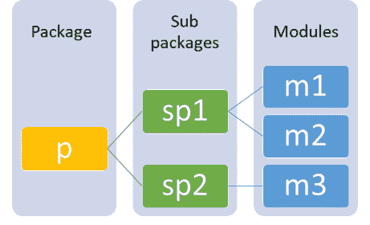
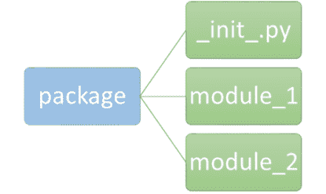
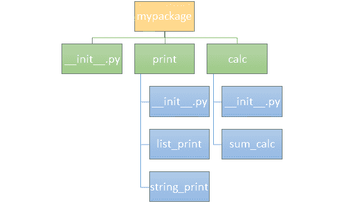

# Python 模块和包

> 原文：<https://learnetutorials.com/python/python-modules-packages>

在本教程中，您将掌握 **python 模块**和 **python 包**的全部知识，这两种编程技术可以简化模块化编程。还将包括如何重新加载模块，如何从包中导入模块等主题的例子。

模块化编程是软件编程中使用的一种设计技术。它强调将一个大程序分割成离散的、微小的、兼容的子程序或模块的技术。模块化方法为程序提供了下列好处。

*   简化程序
*   易于维护和调试
*   允许代码的重用
*   避免代码冗余

提升模块化的 Python 构造是**函数**、**模块、**和**包**。在上一个教程中，我们已经学习了 python 中[函数的所有知识。](../python/python-functions-tutorials)

## python 中有哪些模块？

模块是由定义和可执行语句组成的简单文件。创建 python 模块并不是一项困难的任务。你要做的就是:

*   创建 python 文件
*   命名文件并在前面加上**。py** 分机。

例如，在下面的例子中 **mymod.py** 是一个具有一个变量 L 和两个函数 `prt()`和``sum()``的模块。

```py
L=['Red','Green','Blue']
print('Colour List is',L)

def prt(name):
 print('Hello',name)

def sum(a,b):
 total = a+b
 print(total) 

```

一个模块可以包含几个对象，如变量、函数、类等。

## 如何在 python 中导入模块？

可以使用关键字`import`将一个模块访问到另一个模块或交互式解释器。下面的例子展示了如何导入我们之前定义的模块。

```py
import mymod  #imports the module mymod.py 

```

相应地，我们也可以导入 python 中的内置模块。在此之前，让我们学习如何查看 python 中可用的内置模块列表。要获取内置模块列表，请使用下面示例中的两种方法中的任何一种。

```py
>>> import sys
>>> print(sys.builtin_module_names)

Or 

>>> help('modules') 

```

输出将是 python 中内置模块的列表，如下所示。

```py
 ('_abc', '_ast', '_bisect', '_blake2', '_codecs', '_codecs_cn', '_codecs_hk', '_codecs_iso2022', '_codecs_jp', '_codecs_kr', '_codecs_tw', '_collections', '_contextvars', '_csv', '_datetime', '_functools', '_heapq', '_imp', '_io', '_json', '_locale', '_lsprof', '_md5', '_multibytecodec', '_opcode', '_operator', '_pickle', '_random', '_sha1', '_sha256', '_sha3', '_sha512', '_signal', '_sre', '_stat', '_statistics', '_string', '_struct', '_symtable', '_thread', '_tracemalloc', '_warnings', '_weakref', '_winapi', '_xxsubinterpreters', 'array', 'atexit', 'audioop', 'binascii', 'builtins', 'cmath', 'errno', 'faulthandler', 'gc', 'itertools', 'marshal', 'math', 'mmap', 'msvcrt', 'nt', 'parser', 'sys', 'time', 'winreg', 'xxsubtype', 'zlib') 
```

要访问模块中的内容或对象，我们使用**点运算符(。)**。现在让我们看看如何使用**点运算符**从我们以前定义的模块 **mymod.py** 导入内容。

```py
>>> import mymod      #imports the module mymod
>>> mymod.prt('Chris')  #imports the function prt in module mymod
Hello Chris
>>> mymod.sum(10,20)    #imports the function sum in module mymod
30

```

接下来，我们将学习其他几种导入模块及其内容的方法。

1.  ### 进口声明

    使用关键字**导入**和**点运算符**我们也可以导入 python 中的内置函数，就像我们导入用户定义函数一样。下面给出了一个例子来说明 import 语句的用法。

    ```py
    import math
    print('Factorial of 5 is :',math.factorial(5)) 

    ```

    ```py
    Factorial of 5 is : 120 
    ```

    在本例中，导入内置模块`math` ，并使用**点运算符**访问其对象`pi`。

2.  ### 通过重命名导入

    也可以在模块导入后对其进行重命名，并使用该名称访问其内容。以下示例显示了模块的重命名。

    ```py
    import math as X
    print('Factorial of 5 is :',X.factorial(5))

    ```

    ```py
    Factorial of 5 is : 120 
    ```

    这里模块数学被重新命名为`X` ，我们使用`X` 来访问对象`pi`。

3.  ### 从...导入语句

    另一种导入内容的方法是在一行中指定内容和模块的名称。这里我们不需要点运算符来导入内容。

    ```py
    from math import factorial
    print('Factorial of 5 is :',factorial(5)) 

    ```

    ```py
    Factorial of 5 is : 120 
    ```

    这个例子告诉我们模块对象 pi 是从模块数学导入的。

4.  ### 从...导入*语句

    假设您需要从同一个模块导入多个内容。在这样的情况下**从...导入*** 是完美的解决方案。在这里，我们可以访问模块中的所有定义。*表示访问模块中所有可用的内容或定义。

    ```py
    from math import *
    print('Factorial of 5 is :',factorial(5))

    ```

    ```py
    Factorial of 5 is : 120 
    ```

    尽管这是一种导入定义的简单方法，但它并不是最佳的编程实践，因为它限制了代码的可读性

## Python 模块搜索路径

我们现在已经熟悉了从模块中导入内容的各种方法，那么一旦模块被导入，解释器会做什么呢？解释器将首先检查该模块在内置模块中是否可用。如果没有找到，python 将搜索`sys.path`中定义的系统搜索路径，该路径包含目录列表。
下面的例子给了你`sys.path`的概念

```py
import sys
print(sys.path) 

```

```py
['', 'C:\\Users\\Programs\\Python\\Python38-32\\Lib\\idlelib', 'C:\\Users\\Programs\\Python\\Python38-32\\python38.zip', 'C:\\Users\\Programs\\Python\\Python38-32\\DLLs', 'C:\\Users\\Programs\\Python\\Python38-32\\lib', 'C:\\Users\\Programs\\Python\\Python38-32', 'C:\\Users\\Programs\\Python\\Python38-32\\lib\\site-packages'] 
```

搜索遵循下面列出的顺序。

1.  当前目录
2.  环境变量，PYTHONPATH
3.  依赖于安装的默认路径

有时，您可能会在尝试导入用户定义的模块时出错。原因是文件位置不正确。因此，您必须确保模块文件位于上述三个路径中的任何一个(当前目录、python 路径或默认路径)。

导入模块后，您还可以使用文件属性发现模块的位置:

```py
import mymod
mymod.__file__

```

```py
'C:\\Users\\Programs\\Python\\Python38-32\\mymod.py' 
```

## `dir()`函数

`dir()`是一个 python 内置函数，它返回一个命名空间中已定义名称的字母排序列表。该列表包括模块中包含的所有模块(内置和用户定义)、变量和函数。以下示例给出了使用`dir()`函数的实例。

```py
import mymod
dir(mymod)

```

```py
['L', '__builtins__', '__cached__', '__doc__', '__file__', '__loader__', '__name__', '__package__', '__spec__', 'prt', 'sum'] 
```

这里，以下划线开头的名称是模块中的默认属性。例如，__name__ 属性提供模块的名称。l，prt，sum 是模块 mymod 中的对象或用户定义的属性。

## 重新加载模块

关于该模块的一个重要注意事项是，python 在每个解释器会话中只导入一次模块。让我们理解下面的例子

```py
import mymod
Colour List is ['Red', 'Green', 'Blue']
import mymod
import mymod

```

在上面的示例中，您可以发现可执行语句只执行一次，后续导入中的 print 语句不会被忽略。这表示模块只导入一次。

如果您对模块内容进行了任何更改，或者如果您想要重新执行该语句，那么您可以重新启动 python 解释器或者使用函数`reload()`。重载函数位于**模块导入库中**，因此您需要首先导入它。

语法非常简单，如下所示:

```py
reload(module_name) 

```

其中`module_name`是您希望重新加载的模块的名称。打印语句在重新加载后执行，如下例所示

```py
import importlib
importlib.reload(mymod) 

```

```py
Colour List is ['Red', 'Green', 'Blue']
```

## python 中的包是什么

到目前为止，您已经了解了什么是模块，以及如何导入模块和其中的对象。现在，我们将使用软件包来帮助我们以一种结构良好的方式组织应用程序的代码。

用简单的语言来说，包是模块或包本身的集合。包中的包称为子包。包有助于以有组织的方式存储目录和模块，最好是分层结构。当应用程序的大小随着大量模块的使用而变大时，这将实现高效的导入。

我们可以在一个包中存储类似类型的模块，而在另一个包中存储不同的模块。这样做有助于避免包中模块之间的冲突以及模块内全局变量之间的冲突。

创建包就像在计算机上创建文件夹一样简单。我们会有包含子文件夹和文件的主文件夹。类似地，包包含子包和模块。下面的可视化是带有两个子包 sp1 和 sp2 的包“P”的层次结构的示例。sp1 包含两个模块 m1 和 m2，而 sp2 包含模块 m3。



### 包的层次结构

下面显示了从包中导入子包和模块的不同方法。我们只需要使用**点符号**来导入包内的模块或子包。

```py
import p   # imports package P
import p.sp1,p.sp2 # imports  subpackages from package P
import p.sp1.m1,p.sp2 # imports modules in subpackages 
import p.sp1.m2 as X  
from p.sp1.m2 import object  # imports contents in a module 

```

## 包初始化

当目录包含名为 `_init_`的文件时，Python 会将其视为一个包。字面上，a _init_。py 用于初始化包对象或全局变量。这个文件也可以保留为空。包装的一般形式如下图所示。



### 包装的一般形式

## 如何从包中导入模块

我们已经看到了从包中导入模块的一般语法。让我们详细说明一下，给你一个清晰的概念。为此，我们已经将 mymod 模块示例修改为一个包，并让我们看看包如何帮助模块化编程。

我们有一个名为“mypackage”的包，它包含 __init__。py 文件和两个子文件夹-打印和计算。每个子包都包含模块。打印子包包含两个模块，

*   list_print -打印列表。
*   string_print -打印字符串。

而 calc 子包包含 __init__。py 文件和一个名为 sum_calc 的函数，该函数执行两个数字的相加。

下面给出了上述例子的可视化。



现在让我们看看这些模块里面有什么。

### list_print.py

```py
L=['Red','Green','Blue']
print('Colour List is',L) 

```

### string_print.py

```py
def prt(name):
 print('Hello',name) 

```

### sum_calc.py

```py
def sum(a,b):
 total = a+b
 print('Total is :',total) 

```

## 不同的导入方法举例说明

1.  使用导入语句

    ```py
    import mypackage.print.list_print.L 

    ```

    ```py
    Colour List is ['Red', 'Green', 'Blue']
    ```

2.  ```py
    import mypackage.print.String_print as X
    X.prt(‘Chris’) 
    ```

    ```py
    Hello,Chris
    ```

    导入
3.  使用来自...导入语句

    ```py
    from mypackage.print import sum_calc
    sum_calc.sum(10,20) 

    ```

    ```py
    Total is :30
    ```

我们遇到了模块*这表明我们可以访问模块中的所有定义。类似地，我们可以使用*符号访问包中的所有模块，但要记住的是，它应该包含一个名为 **__init__** 中的 **__all__** 的列表。py 文件。当遇到来自<package_name>**导入*** 的语句时，_all_ attribute 会获取一个应该导入的模块列表。</package_name>

注意:当 __all__ 未定义时，import *不会从包中导入任何内容，而会从模块中导入所有内容。