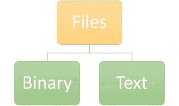
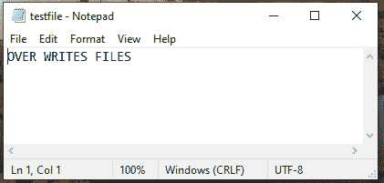

# Python 文件

> 原文：<https://learnetutorials.com/python/file-operations>

在本教程中，您将通过示例掌握所有关于 python 文件和文件操作的知识。您将学习什么是文件，如何打开和关闭文件，以及 python 中读写文件的一些基本方法。

## python 中的文件是什么？

文件是系统存储器上的一个命名位置，用于存储相关数据以备将来使用。数据可以是简单的文本文件、视频或音频文件，也可以是任何复杂的可执行程序。我们使用文件系统在硬盘等非易失性存储器中实现持久存储。文件由以下三个重要部分组成。

*   **文件头**保存文件的元数据，即文件的名称、大小、类型等细节。
*   **数据**是文件中的文本、图片、音频等内容。
*   **EOF** 表示文件结束。

接下来，在访问一个文件时，我们必须知道文件存储在哪里。为此，我们使用**文件路径**，它给出了文件的路径或位置。文件路径包含 3 个部分，如下所示。

*   **文件夹路径**表示文件所在文件夹的位置。
*   **文件名**表示文件的实际名称。
*   **文件扩展名**显示文件类型。

## python 中的文件类型

python 中有两种类型的文件。它们是:



### python 中的文件类型

1.  **二进制文件**是包含图像、音频等非文本值的文件。通常，二进制文件包含 0 和 1 形式的对象。
2.  **文本文件**是包含结构化为行的文本值的文件。简而言之，文本文件包含多行文本值。每一行都以一个特殊的字符结束，称为行尾。

当您想要处理文件时，您需要执行以下按处理顺序列出的 3 个基本操作。

1.  **打开文件**
2.  **读或写操作**
3.  **关闭文件**


### 文件处理流程图

上面的流程图给出了 python 中文件处理的工作流程。最初，我们需要创建一个文件。这可以由用户在任何需要的地方手动完成，并用有效的文件名和扩展名保存。另外，python 支持文件创建，这将在以后的会话中遇到。

## 如何用 python 打开文件

文件的首要操作是打开文件。一个文件可以通过调用 python 内置函数`open()`打开。open 函数返回文件对象，以后可以用来读取或写入文件。

###### open()函数的基本语法是:

```py
File object = open(file_name [,access_mode] [,buffersize])

```

哪里，

*   **文件名**是给出文件名的强制字符串参数。
*   是可选参数。它决定了文件的打开方式(读、写、追加)。除此之外，我们还可以以文本模式或二进制模式打开文件。二进制模式用字母“b”表示。默认情况下，该模式被设置为作为返回字符串的文本读取。相反，二进制模式返回字节，因为它用于读取非文本文件，如图像或可执行文件。
*   是另一个可选的论点。默认情况下，缓冲值设置为 0。当缓冲区值为 1 时，在文件访问期间会发生行缓冲。如果大于 1，缓冲将发生在缓冲区的大小中。

### 例子

```py
open("testfile.txt")
open("testfile.txt",'r') 

```

下表显示了文件的不同打开模式。

| 模式 | 意义 | 描述 |
| r | 阅读 | 默认模式。打开文件阅读。如果文件不存在，则出现错误 |
| w | 写 | 以只写模式打开文件进行覆盖。如果文件不存在，则创建一个文件 |
| a | 附加 | 在文件末尾追加文件，而不修剪现有的。创建一个不存在的文件。 |
| x | 创造 | 创建定义的文件。如果文件已经存在，则出现错误。 |
| b | 二进制的 | 以二进制模式打开文件 |
| t | 文本 | 以文本模式打开文件。默认模式。 |
| r+ | 直读式记录 | 打开文件进行读取和写入 |
| 元素铷的符号 | 二进制读取 | 以读取和二进制模式打开文件 |
| rb+ | 二进制读写 | 以二进制模式打开文件进行读写 |
| w+ | 直读式记录 | 以读写模式打开文件 |
| 世界银行 | 二进制写入 | 以写入和二进制模式打开文件 |
| wb+ | 二进制读写 | 以二进制模式打开文件进行写入和读取 |
| a+ | 追加读写 | 以附加模式打开文件进行读写。 |
| 腹肌 | 二进制追加 | 以追加模式和二进制模式打开 |
| ab+ | 二进制追加读写 | 以读写二进制模式打开文件进行附加 |

创建文件对象后，您可以使用几个属性来获取文件的详细信息。下面列出了一些属性。

*   **<file_object>。关闭</file_object>** :当文件关闭时返回真，否则返回假
*   **<file_object>。模式</file_object>** :返回打开文件的文件模式。
*   **<file_object>。名称</file_object>** :返回文件的名称。
*   **<file_object>。软空间</file_object>** :如果 print 语句不需要显式空间，则返回 true，否则返回 false

注意:在文本模式下处理文件时，指定编码总是一种好的做法。

## 如何在 python 中关闭文件

关闭一个文件根本不是一个大任务，但是一旦工作完成，用户就有责任正确地关闭文件。Python 支持两种关闭文件的方法，下面将通过示例进行描述。

1.  ### 使用 close()方法

    我们可以使用 python 中可用的 close()方法关闭打开的文件。这将释放文件保护的资源。

    ```py
    f_obj = open(“testfile.txt”)
    ,.......................
    ,.......................
    f_obj.close()

    ```

    尽管这是一种简单的方法，但它有一个缺点，即仅使用 close 方法不能解决任何错误或异常。遇到异常时，它会立即退出代码，而不会正确关闭文件。那么我们下一步该怎么做呢？

    **try...finally, block**

    要解决上述问题，我们可以尝试..最后，块，每当它引发异常时处理异常，从而确保文件的正确关闭。

    ```py
    try:
      f_obj = open(“testfile.txt”)
      ,.......................
      ,.......................
    finally:
    f_obj.close()

    ```

2.  ### 使用 with 语句

    在 python 中，使用“with 语句”被认为是关闭文件的最佳方式。with 语句在退出“with 块”时会不自觉地控制关闭文件。所以我们不需要在代码中显式指定 close()方法。换句话说，使用“with 语句”提高了处理异常的容易程度，并允许代码完美无缺。

    ```py
    with open(“testfile.txt”) as f_obj:
      ……………………………………
      …………………………………...
    finally:
    f_obj.close()

    ```

## 如何读取文件

一旦我们打开一个文件，我们就可以对它执行所需的操作。一个文件可以做的两个操作是**读**和**写**操作。首先，我们可以看看如何读取文件。要读取文件，我们首先要做的是在读取模式下打开文件 **(r)** 。假设我们在 python 中的相同位置有名为 testfile.txt 的文件中的以下内容。

**测试文件. txt**

```py
Hello World
Welcome to Programming Tutorials
We Love Python
See You..Bye 
```

下面给出了可以在文件对象上调用来读取文件的三种方法。

* * *

### 真实(尺寸)法

使用这种方法，我们可以读取指定大小字节的文件。

```py
f_obj=open("testfile.txt",'r')
print(f_obj.read(6))  #reads the first 6 characters(Hello ) in the file
print(f_obj.read(4))  #reads the next 4 characters(Worl) in the file
f_obj.close()

```

在上面的例子中，大小被指定为`6`，所以它只读取第一个`6`字符并返回相同的值。下一次提到大小为`4`，则读取文件中 Hello 之后的下一个`4`字符(第一个`6`字符)。这表明 read()方法在每次函数调用后都会返回一个换行符。
`read()`方法在以下情况下读取整个文件:

*   没有一个作为参数传递
*   -1 被指定为参数的大小
*   该参数未被传递

下面的例子清楚地说明了这个概念。

```py
f_obj=open("testfile.txt",'r')
print(f_obj.read(-1)) 

```

**输出:**

```py
Hello World
Welcome to Programming Tutorials
We Love Python
See You..Bye 
```

* * *

### 读取线(尺寸)方法

此方法用于读取文件中的每一行，并将逐行返回输出。让我们在下面的例子中看看 readline 方法是如何工作的。

```py
f_obj=open("testfile.txt",'r')
print(f_obj.readline())  #reads first line in the file 
print(f_obj.readline())  #reads second line in the file 
print(f_obj.readline())  #reads third line in the file 
f_obj.close() 

```

**输出:**

```py
Hello World

Welcome to Programming Tutorials

We Love Python 
```

类似地，当传递的参数为无或-1 时，函数返回每一行。然而，当我们指定大小时，会发生一些不同的事情。它不返回行，而是像 read 方法一样将字符返回到指定的大小。

```py
f_obj=open("testfile.txt",'r')
print(f_obj.readline(6))
print(f_obj.readline(4))
print(f_obj.readline(-1))
f_obj.close() 

```

**输出:**

```py
Hello
Worl
d 
```

* * *

### readlines()方法

`readlines()`方法以列表的形式返回所有行。对于每一行，行尾表示为\n。上面的示例可以更改为:

```py
f_obj=open("testfile.txt",'r')
print(f_obj.readline(6))
print(f_obj.readline(4))
print(f_obj.readlines())  #returns remaining lines as a list
f_obj.close()

```

**输出:**

```py
Hello
Worl
['d\n', 'Welcome to Programming Tutorials\n', 'We Love Python\n', 'See You..Bye'] 
```

注意:当遇到电渗流时，所有读取模式将返回空值。

* * *

### 循环文件中的行

另一种逐行读取文件的方法是遍历每一行。这可以使用 for 循环或 while 循环和读取线方法来完成。以下示例将说明打印文件中的行的两种不同方式。

```py
with open("testfile.txt",'r') as f_obj:
 for line in f_obj:
  print(f_obj.readlines()) 

```

**输出:**

```py
(['Hello World\n', 'Welcome to Programming Tutorials\n', 'We Love Python\n', 'See You..Bye'] 
```

```py
 with open("testfile.txt",'r') as f_obj:
 for line in f_obj.readlines():
  print(line ,end =' ') 

```

**输出:**

```py
Hello World
 Welcome to Programming Tutorials
 We Love Python
 See You..Bye 
```

但是，可以将上面的示例更改为另一种形式来简化它。这里，我们迭代文件对象，而不是循环方法。

```py
with open("testfile.txt",'r') as f_obj:
 for line in f_obj:
  print(line ,end =' ') 

```

**输出:**

```py
Hello World
 Welcome to Programming Tutorials
 We Love Python
 See You..Bye 
```

## 如何写入文件

要写入文件，我们需要使用两种模式——写入模式和追加模式。我们已经讨论过，以写模式打开的文件会通过擦除所有现有行而被覆盖。而当文件以追加模式打开时，它会将新文本追加到文件中，而不会截断以前的文本。写入文件的内置方法是 write()方法。

以下示例显示了写入模式和追加模式之间的区别:

```py
with open("testfile.txt",'w') as f_obj:
 f_obj.write('OVER WRITES FILES')

```

当我们执行上面的代码时，发生的事情是 textfile.txt 被覆盖，如下图所示。



### 覆盖的文件

现在我们以追加模式打开同一个文件，并在文件中添加一些文本，如下例所示。

```py
with open("testfile.txt",'a') as f_obj:
 f_obj.write('Here iam opened the file in append mode and appends this statment') 

```

输出显示出显著的差异。这里，文件不会被覆盖，而是在现有文本的末尾追加文本。


### 以追加模式打开文件

在写入或追加后找到文件差异的另一种可能方法是再次使用，并以读取模式打开文件并打印文件。

## 如何创建文件

要在 python 中创建新文件，请使用以下任一模式打开该文件。

"`x` "= **创建**:创建一个文件，当存在同名文件时返回错误。
" `a` "= **追加**:当定义的文件不存在时创建一个文件。
" `w` "= **写**:当定义的文件不存在时创建一个文件

```py
open('New_file_x.txt','x')
open('New_file_a.txt','a')
open('New_file_w.txt','w')

```

**输出:**


从上面的例子中，很明显 Python 已经在您的系统中使用上述模式创建了 3 个文本文件。现在让我们检查一下当我们试图创建一个现有文件时会发生什么。显然 python 会产生一个错误，即[文件存在错误](../python/errors-exceptions-tutorial)，如下所示。

```py
open('New_file_a.txt','x') 

```

**输出:**

```py
 open('New_file_a.txt','x')
FileExistsError: [Errno 17] File exists: 'New_file_a.txt'
```

为了避免这个错误，我们可以将文件重命名为新的名称，或者删除现有的文件，如果它不是一个重要的文件

## 如何重命名或删除文件

可以重命名或删除现有文件。对于重命名，我们使用内置方法`os.rename()`，对于从系统中移除文件，使用方法`os.remove`。这两种方法都位于操作系统模块中。因此，在执行这些任务之前，有必要导入操作系统模块。Python 标准实用程序模块下的操作系统模块帮助我们与操作系统交互，从而提供使用操作系统相关功能的方法。

## 重命名文件

重命名方法用新名称更改现有文件的名称。重命名方法的基本语法是:

```py
os.rename(‘Current_File_name’,’New_File_name’) 

```

### 例子

```py
import os
os.rename('New_file_x.txt','New.txt') 

```

结果将通过更改文件名反映在您的系统中。

## 删除文件

我们可以通过两种可能的方式删除文件。一种方法是在系统中手动搜索文件并删除该文件。另一种方法是站在交互式外壳中，使用 python 方法删除文件。

要删除一个文件，我们使用内置方法`os.remove()`，语法是

```py
os.remove(‘File_name’) 

```

在尝试删除一个文件之前，我们需要检查它是否存在，以避免任何不想要的错误。我们可以使用`os.path.exists()`方法检查文件的存在，如下例所示:

```py
import os
if os.path.exists('New_file_a.txt'):
 os.remove('New_file_a.txt')
 print('Removed file')
else:
 print('File doesnot exist') 

```

## Python 文件方法

在本教程中，我们遇到了一些用于操作文件的方法。下表给出了 python 中使用的文件方法的完整列表。

| 方法 | 描述 |
| 关闭() | 关闭打开的文件。 |
| 文件（） | 返回文件描述符的数量。 |
| 齐平() | 刷新文件流的写缓冲区。 |
| isatty() | 当文件流是交互式的时返回真，否则返回假 |
| 已读() | 读取整个文件。 |
| 可读() | 检查文件是否可读 |
| 读行（） | 读取文件中的个别行。 |
| 读取线() | 读取整个文件并作为列表返回 |
| seek() | 更改文件的位置 |
| 可查找() | 检查位置是否可变 |
| tell() | 返回文件的当前位置 |
| 截断() | 将文件调整到指定的大小。如果未指定，将调整到当前位置。 |
| 可写() | 当文件可写时返回真 |
| 写入() | 将定义的字符串写入文件。 |
| writelines() | 将字符串或行列表写入文件。 |