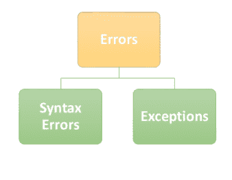
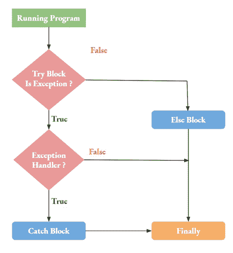

# Python 错误和异常

> 原文：<https://learnetutorials.com/python/errors-exceptions-tutorial>

在本教程中，您将通过示例掌握 python 中关于错误和异常的一切。您还将学习如何引发和断言异常。除此之外，您还将看到关于关键字 try、except、else 以及最后的异常处理用法的演示。

到目前为止，在我们的系列教程中，我们遇到了编写代码时出现的各种类型的错误。一般来说，python 中存在两种可区分的错误类型:语法错误**和**异常**。**

**

### Python 中的错误类型

## 什么是语法错误

语法错误是 python 在编写程序时导致的结构错误。在 python 中，一切都是用一种叫做 [**的特定结构定义的**](../python/syntax-comments) 语法。当这个语法不满足时，解析器将把它检测为一个错误。因此语法错误也被称为**解析错误**。看看下面的例子:

```py
print('Hello ,World) 

```

**输出误差:**

```py
File "exception_ex.py", line 1
    print('Hello ,World)
                       ^
SyntaxError: EOL while scanning string literal 
```

在本例中，解析器检测到一个错误，并在控制台中显示该错误。让我们看看如何仔细检查错误。

*   第一行给出检测到错误的文件名和行号。
*   第二行显示错误声明，在这种情况下，在打印功能中检测到错误。语句末尾的“小箭头(^)”定位解析器遇到语法错误的位置。
*   第三行给出了错误的线索。在这里，字符串文字后面缺少一个 EOL，这意味着我们错过了 Hello World 后面的结束单引号。

现在添加单引号并再次运行它，它给你的输出是**你好，世界**。

## python 中有哪些异常？

异常是在程序执行过程中出现的错误类型，即使程序在语法上是正确的。这种类型的错误通过显示异常错误来中断程序的正常流程。下面的例子展示了 python 中一些不同类型的标准异常:

在这个例子中，我们遇到了 4 种异常错误，即`**TypeError**`、`**NameError**`、**、`ZeroDivisionError`、**和`**FileNotFoundError**`。可以按如下方式检查错误消息:

与语法错误不同，异常依赖于由于逻辑故障而出现的错误。

1.  ```py
    >>> 1+'2' 
    ```

    **输出误差:**

    ```py
      Traceback (most recent call last):
      File "<pyshell>", line 1, in <module>1+'2'

    TypeError: unsupported operand type(s) for +: 'int' and 'str'</module></pyshell> 
    ```

2.  ```py
    >>> 1+two

    ```

    **输出误差:**

    ```py
    Traceback (most recent call last):
      File "<pyshell>", line 1, in <module>1+two
    NameError: name 'two' is not defined</module></pyshell> 
    ```

3.  ```py
    >>> 2/0

    ```

    **输出误差:**

    ```py
    Traceback (most recent call last):
      File "<pyshell>", line 1, in <module>2/0
    ZeroDivisionError: division by zero</module></pyshell> 
    ```

4.  ```py
    >>> open('Newfile' 

    ```

    **输出误差:**

    ```py
    Traceback (most recent call last):
      File "<pyshell>", line 1, in <module>open('Newfile')
    FileNotFoundError: [Errno 2] No such file or directory: 'Newfile'</module></pyshell> 
    ```

*   第一行给出文件名和行号
*   第二行显示了违规的语句
*   最后一行指定了错误及其详细信息

与语法错误不同，异常依赖于由于逻辑故障而出现的错误。

## Python 内置的异常

例外情况可分为两组，即

*   内置异常
*   用户定义的例外

内置异常是在程序中发生非法操作时引发的标准异常。要查看 python 中可用的所有内置异常，我们可以使用内置函数 local()，如下所示

```py
print(dir(locals()['__builtins__'])) 

```

哪里，

**(locals()[' _ _ buildings _ _ '])**返回系统中的异常模块、函数等，dir 将其列为字符串。

下面列出了 python 中用于处理运行程序时常见错误的内置异常。

| 例外 | 异常原因 |
| 断言错误 | assert 语句失败时引发。 |
| 属性错误 | 当属性赋值或引用失败时引发。 |
| 欧费罗 | 当 input()函数遇到文件结束条件时引发。 |
| 浮动指针错误 | 浮点运算失败时引发。 |
| GeneratorExit | 调用生成器的 close()方法时引发。 |
| 导入错误 | 找不到导入的模块时引发。 |
| 索引错误 | 当序列的索引超出范围时引发。 |
| 键错误 | 在字典中找不到键时引发。 |
| 键盘中断 | 当用户点击中断键(Ctrl+C 或 Delete)时引发。 |
| 存储器错误 | 当操作耗尽内存时引发。 |
| 名称错误 | 当在局部或全局范围内找不到变量时引发。 |
| notimplemontederror | 由抽象方法引发。 |
| 操作系统错误 | 当系统操作导致系统相关错误时引发。 |
| OverflowError | 当算术运算的结果太大而无法表示时引发。 |
| 报错 | 当弱引用代理用于访问垃圾回收引用时引发。 |
| 运行时错误 | 当错误不属于任何其他类别时引发。 |
| 停止迭代 | 由 next()函数引发，指示迭代器不再返回任何项。 |
| 句法误差 | 遇到语法错误时由解析器引发。 |
| 内建 Error | 当缩进不正确时引发。 |
| TabError | 当缩进由不一致的制表符和空格组成时引发。 |
| 系统误差 | 当解释器检测到内部错误时引发。 |
| 系统退出 | 由 sys.exit()函数引发。 |
| 类型错误 | 当函数或操作应用于不正确类型的对象时引发。 |
| unboundlocalherror | 当引用函数或方法中的局部变量，但没有值绑定到该变量时引发。 |
| UnicodeError 错误 | 发生与 Unicode 相关的编码或解码错误时引发。 |
| unicodeencodererror | 编码过程中出现与 Unicode 相关的错误时引发。 |
| unicodedecodererror | 解码过程中出现与 Unicode 相关的错误时引发。 |
| unicode 翻译错误 | 翻译过程中出现与 Unicode 相关的错误时引发。 |
| 值错误 | 当函数获得类型正确但值不正确的参数时引发。 |
| 零分割错误 | 当除法或模运算的第二个操作数为零时引发。 |

我们还可以定义自己的异常，这些异常被称为用户定义的异常。在掌握了类的概念之后，我们将在接下来的教程中讨论用户定义的异常。

## 如何引发异常

现在我们熟悉了当条件失败时会出现的内置异常。如果某些条件失败，也可以手动抛出异常。我们可以使用关键字 raise 来抛出这样的异常。这里有一个例子:

### 示例:如何引发异常

```py
age= 15
if age<18:
 raise Exception('Age must be greater than or equal to 18' 

```

**输出误差:**

```py
Traceback (most recent call last):
  File "Exception_ex.py", line 67, in <module>raise Exception('Age must be greater than or equal to 18')
Exception: Age must be greater than or equal to 18</module> 
```

我们还可以指定要引发的错误类型以及需要向用户提供什么信息。

### 示例:如何引发异常

```py
age=int(input('Enter your age:'))  
if age<0:
 raise ValueError("Invalid age given as input!") 

```

**输出误差:**

```py
<blue>Enter your age: -2</blue>
Traceback (most recent call last):
  File "Exception_ex.py", line 72, in <module>raise ValueError("Invalid age given as input!")
ValueError: Invalid age given as input!</module> 
```

## 如何断言异常

Assert 语句用于调试。所以它测试一个条件并检查条件是否为真。如果是真的，那么程序正常执行。但是万一断言条件失败，那么结果将是一个带有可选错误消息的 AssertionError 异常。参见以下示例:

### 示例:如何断言异常

```py
age = 18

# True Condition 
assert age ==18
print(' Age is Valid')

#False condition
assert age ==15 

```

**输出错误:**

```py
<blue>Age is Valid</blue>

Traceback (most recent call last):
  File "Exception_ex.py", line 81, in <module>assert age ==15
AssertionError</module> 
```

在这个例子中，当条件计算为假时，程序终止并产生一个回溯声明断言错误。与 raise 一样，这里也可以将错误定义为参数。观察以下示例以了解变化。

```py
 age=int(input('Enter your age :'))

assert (age>=18),'Age must be above or equal to 18'
print(' Age is Valid') 

```

**输出误差:**

```py
<blue>Enter your age :15</blue>

Traceback (most recent call last):
  File "Exception_ex.py", line 78, in <module>assert (age>=18),'Age must be above or equal to 18'
AssertionError: Age must be above or equal to 18</module> 
```

简而言之，我们可以说断言语句，尽管处理异常，被用作调试辅助。断言语句处理程序中不可恢复的错误，并通知开发人员，这意味着它们旨在为程序中途出现的意外错误发出信号。当断言错误发生时，程序将停止，并保持沉默，直到我们修复错误。

## python 如何处理异常

现在我们可以学习如何用 python 处理异常。内置异常和用户定义异常都可以使用 try、except、else 和 finally 语句来处理。在编写代码时，最好使用异常语句来避免任何不必要的错误。

## 异常处理流程图

为了理解异常期间的程序流程，下面显示了一个基本流程图。



### Python 异常处理流程图

## 尝试...除了块

如果您在执行过程中怀疑某些错误或异常情况，最好的方法是将代码块放在“try”语句中。try 语句之后的代码块照常执行，如果它检测到任何错误，那么控件将迅速转移到“except”语句。except 语句充当异常处理程序，捕捉错误并进行管理。换句话说，except 语句响应 try 语句中出现的异常。

**尝试的语法。除外区块为:**

```py
try:
 …  ….. ….. ...
    Run this code
    …  ….. ….. …

except  exception_1:
    …  ….. ….. ...
    Executes on detecting exception_1
    …  ….. ….. ... 

```

现在我们可以查看下面的例子来了解更多关于 try 的工作...除了布洛克。

### 该示例显示了如果没有异常，try 语句是如何工作的。

```py
try:
 fo = open('New.txt','r')
 print(fo.read())
 fo.close()
except FileNotFoundError:
 print('File does not exist in the system!') 

```

在上面的例子中没有异常，因此像往常一样执行程序并打印它在文件中读取的内容。现在考虑例外情况以及将会发生什么。

```py
try:
 fo = open('File.txt','r')
 print(fo.read())
 fo.close()
except FileNotFoundError:
 print('File does not exist in the system!') 

```

在本例中，File.txt 是一个不在系统中的文件，因此它引发了一个异常，并且程序流程转移到了一个 except 语句，在该语句中，当遇到**文件而不是** **查找错误**时，我们已经处理了要打印的内容。因此打印用户友好的输出。

如果怀疑放置在 try 语句中的关键代码中存在多个异常，也可以添加尽可能多的 except 语句。

```py
Try:
 print(2/0)
 fo = open('File.txt','r')
 print(fo.read())
 fo.close()
except ZeroDivisionError:
 print('Mathematically,division by zero is not defined!')
except FileNotFoundError:
 print('File does not exist in the system!') 

```

从这个例子中，很明显，try 语句一直执行到遇到第一个异常。

## 尝试...除...之外...否则阻止

我们可以继续尝试..通过在末尾包含一个可选的 else 子句来阻止进入下一个级别。这就明确了如果 try 语句没有任何异常，应该执行什么。显然，如果没有异常，try 块也能很好地工作。**的句法试试看。除...之外...否则**采用以下形式:

```py
try:
 …  ….. ….. ...
    Run this code
    …  ….. ….. …

except  exception_1:
    …  ….. ….. ...
    Executes on detecting exception_1
    …  ….. ….. ...
else  :
    …  ….. ….. ...
    Executes when there is no exception
    …  ….. ….. ... 

```

观察下面给出的例子:

```py
try:
 print(2/1)
except ZeroDivisionError:
 print('Mathematically,division by zero is not defined!')
else:
  try:
   fo = open('New.txt','r')
   print(fo.read())
   fo.close()
  except FileNotFoundError: 

```

从输出中，我们可以理解 else 部分在这里执行，因为在初始 try 语句中没有发现异常。由于文件存在于系统中，解释器试图打开文件并将文件内容打印为输出。

## 尝试...最后封锁

最后，您可以添加一个 finally 子句来在执行后清除代码。语法是:

```py
try:
        …  ….. ….. ...
        Run this code
         …  ….. ….. …

except  exception_1
         …  ….. ….. ...
         Executes on detecting exception_1
         …  ….. ….. ...
else  :
         …  ….. ….. ...
         Executes when there is no exception
         …  ….. ….. …
finally  :
       Executes always 

```

让我们看看“finally”子句是如何在程序中实现的。

```py
#File.txt is not available in system, raises an exception
try:
 fo = open('File.txt','r')
 print(fo.read())
 fo.close()
except FileNotFoundError:
 print('File does not exist in the system!')
else:
 print('File exist in the system!')
finally:
 print('Always executes,irrespective of execution') 

```

让我们更改文件名，看看当文件在系统中可用时会发生什么。

```py
#New.txt is available in system 
try:
 fo = open('New.txt','r')
 print(fo.read())
except FileNotFoundError:
 print('File does not exist in the system!')
else:
 print('File exist in the system!')
Finally:
 fo.close()
 print('Always executes,irrespective of execution') 

```

**输出:**

```py
Hi Welcome To Learn eTutorial
File exist in the system!
Always executes,irrespective of execution 
```

在示例中，您可能会注意到 `fo.close()`被放置在 finally block 中，这是因为 finally 构造确保了文件的关闭，即使我们在这两者之间遇到了异常。

与其他语句不同的是，`finally` 子句总是执行，不管是否遇到执行。`finally` 条款有助于执行应该始终运行的代码块，无论是否检测到异常。**