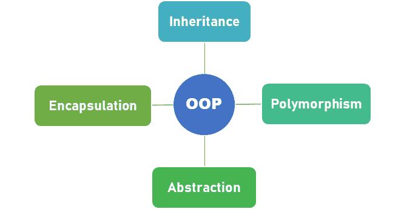
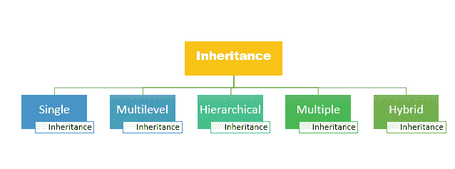
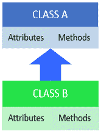
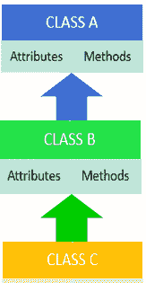
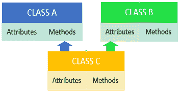
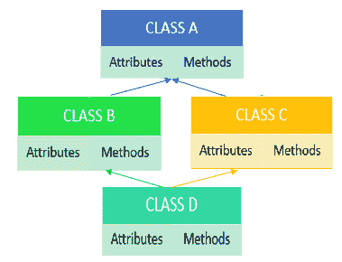

# Python 继承

> 原文：<https://learnetutorials.com/python/inheritance-tutorial>

在本教程中，您将掌握面向对象编程的基本概念，如继承、封装等，以及它们的语法和示例。此外，您将在 OOPs 中浏览不同类型的继承。

面向对象编程方法是最重要和普遍接受的编程方法，因为它完全依赖于对象和类，这有助于模块化和软件可重用性。

面向对象编程的四个组成部分是:

1.  遗产
2.  包装
3.  多态性
4.  抽象



### 面向对象编程的四个组成部分

本教程将详细介绍每种方法。让我们从继承开始我们的旅程。

## 什么是继承

继承可以被定义为一个过程，通过这个过程，一个类获得了一个现有类的特性(属性和方法)，而不需要修改它。继承特征的类称为子类或派生类，继承特征的类称为父类或基类。换句话说，新形成的类是子类，而现有的类被称为父类。

例如，在现实世界中，父亲和母亲代表父母阶层，而他们的孩子代表孩子阶层。一个孩子从父母那里获得了一些特征，同时，这个孩子也获得了一些父母可能没有的独特特征。在编程术语中，我们可以说一个子类获得了父类的所有属性和方法，但同时子类拥有自己独特的特性。

**继承的语法如下:**

```py
class Parent_class:
    Body of parent_class
class Child_class(Parent_class):
    Body of Child_class 

```

## python 中不同类型的继承

在 python 中，继承分为五种类型。它们是:

*   单一继承
*   多级继承
*   分级继承
*   多重继承
*   混合遗传



### Python 继承类型

## Python 中的单一继承

单一继承是最简单和最容易的继承类型之一。在单一继承中，子类继承父类中的所有属性和方法。这实现了代码的可重用性和模块化。



### 单一继承

在这种情况下，A 类是父类，B 类是子类。B 类有自己独特的属性和方法，即使它继承了 a 类的属性和方法。

**单继承的语法如下**:

```py
class A:
    pass
class B(A):
    pass 

```

观察这个例子，找出矩形的面积。这里， **Shape** 是父类， **Rect** 是子类。在父类中，我们有一个函数`display()`，它显示矩形的长度和宽度。而在子类中，我们已经定义了函数`area()`来查找矩形的面积并打印输出。

```py
class Shape: #Parent Class

    def __init__(self,name,length,breadth):
        self.name=name
        self.l=length
        self.b=breadth

    def display(self):
        print("Length is :",self.l)
        print("Breadth is :",self.b)

class Rect(Shape): #Child Class

    def area(self):
        a=self.l*self.b
        print("Area of",self.name,"is",a)

ob = Rect('Rectangle',10,20)
ob.display()
ob.area() 

```

p> **输出:**

```py
Length is : 10
Breadth is : 20
Area of Rectangle is 200 
```

观察示例时，您会注意到以下情况:

*   **ob = Rect('Rectangle '，10，20)** 表示已经创建了一个子类的实例。
*   **ob.display()** :显示子类继承父类中的函数。display()函数是父类 Shape 中的一个方法。
*   **ob.area()** :告诉子类 Rect 自己调用函数。

## Python 中的多级继承

多级继承是一种继承类型，其中一个类是从继承基类的派生类创建的。多级继承显示了从派生类或子类继承的可能性。因此，最小多级继承是一个 3 层结构，子类从派生类继承特性，而派生类又从超类继承特性。



### 多级继承

这里，A 类是超类，B 类是派生类，C 类是子类。C 类可以继承 B 类和 A 类的所有属性，而 B 类只能继承 A 类的特征。

**语法如下**:

```py
class A:
    pass
class B(A):
    pass
class C(B):
    pass 

```

让我们看看前面的例子是如何变化的。这里我们创建了一个名为 **Square** 的新类，它是 **Rect** 类的子类。

```py
 class Shape: #Superclass

    def __init__(self,name,length,breadth):
        self.name=name
        self.l=length
        self.b=breadth

    def display(self):
        print("Length is :",self.l)
        print("Breadth is :",self.b)

class Rect(Shape): #Derived Class

    def area(self):

        a=self.l*self.b
        print("Area of",self.name,"is",a)

class Square(Rect): #Child Class

    def peri(self):
        p =4*self.l 
        print("Perimeter of",self.name,"is",p)

obs = Square('Square',20,20)
obs.display()
obs.area()
obs.peri() 

```

**输出:**

```py
Length is : 20
Breadth is : 20
Area of Square is 400
Perimeter of Square is 80 
```

您将从示例中注意到以下几点:

*   **obs** 是类 Square 的实例，它是子类
*   **obs.display()** 表示子类 Square 调用了父类 Shape 中的函数`display()`。
*   **obs.area()** 告诉类 Square 已经从派生类 Rect 继承了`area()`函数。
*   **obs.peri()** 说明`peri()`函数是类广场内部的一个方法。

注意:一个子类可以访问一个超类，而反过来是不可能的。

## Python 中的层次继承

层次继承是一种继承类型，其中从基类创建多个子类。


### Python 中的层次继承

上图说明了等级结构，其中 B 类和 C 类继承了 A 类的属性，尽管两者都有自己独特的特征。

**语法如下**:

```py
class A:
    pass
class B(A):
    pass
class C(A):
    pass 

```

现在让我们改变类的形状，看看层次继承是如何工作的。在这种情况下，我们有一个名为 **Shape** 的基类和两个子类，即 **Rect** 和 **Tri** 。两个类都继承了 Shape 类的`display()`函数来打印长度和宽度。在矩形类中，我们找到矩形的面积，而在三类中，我们使用两个不同的函数`R_area()`和``T_area()``找到三角形的面积。

```py
class Shape:

    def __init__(self,name,length,breadth):
        self.name=name
        self.l=length
        self.b=breadth

    def display(self):
        print("Length is :",self.l)
        print("Breadth is :",self.b)

class Rect(Shape):
    def R_area(self):
        a=self.l*self.b
        print("Area of",self.name,"is",a)

class Tri(Shape):
    def T_area(self):
        a=0.5*self.l*self.b
        print("Area of",self.name,"is",a)

obr = Rect('Rectangle',10,20)
obr.display()
obr.R_area()

obt = Tri('Triangle',10,20)
obt.display()
obt.T_area() 

```

**输出:**

```py
Length is : 10
Breadth is : 20
Area of Rectangle is 200

Length is : 10
Breadth is : 20
Area of Triangle is 100.0 
```

这里，因为我们使用两个独立的子类，所以我们需要创建两个对象。 **obr** 是类 **Rect** 的对象， **obt** 是 **Tri** 的对象。使用 obr，我们调用了函数`display()`，这是基类形状的一个特性。同样，对象 obt 调用函数`display()`。所以这里两个不同的对象继承了它们基类的相同特性。除此之外，使用这些对象，两个类都调用了它们自己的函数`R_area()`和`T_area()`，分别在类 Rect 和 Tri 中定义。

## Python 中的多重继承

当一个子类由两个基类创建时，它被称为**多重继承**。顾名思义，派生类继承了两个不同类的特性。



### Python 中的多重继承

图中描绘了 C 类对 A 类和 B 类属性的继承，这里 A 类和 B 类是 C 类的基类，可以获取两个类的属性和方法。在现实世界中，孩子继承了母亲和父亲的特征。

**语法如下**:

```py
class A:
    pass
class B:
    pass
class C(A , B):
    pass 

```

## 没有超级的多重继承

下面的例子展示了在 python 中不使用`super()`的情况下多重继承的工作方式。在这个例子中，我们有两个基类，即**妈妈**类和**爸爸**类，我们的孩子类是 Kid。Kid 类可以使用其对象 obk 继承 **Mom** 类和 **Dad** 类的特性，如示例所示。每个类都有定义为`feature_m`、`feature_d` 和`feature_k`的独特方法。

```py
class Mom:
    def feature_m(self):
        print("Iam your mom")

class Dad:
    def feature_d(self):
        print("Iam your dad")

class Kid(Mom,Dad):

    def feature_k(self):
        print("Iam the Kid")

obk = Kid()
obk.feature_m()
obk.feature_d()
obk.feature_k() 

```

**输出:**

```py
Iam your mom
Iam your dad
Iam the Kid 
```

## 具有超级()的多重继承

多重继承使子类可以自由地继承尽可能多的基类。因此，当使用多个继承时，如果多个基类使用相同的方法名称会发生什么。让我们看看这个例子来明智地理解它。

```py
class Mom:
    def feature(self):
        print("Iam your mom")

class Dad:
    def feature(self):
        print("Iam your dad")

class Kid(Mom,Dad):

    def feature(self):
        print("Iam the Kid")

obk = Kid()
obk.feature() 

```

**输出:**

```py
Iam the Kid 
```

这里我们对前面的例子做了一个小小的改变。所有方法都有相同的名称。我们收到的输出是“我就是孩子”，这是在子类“孩子”的特征方法中定义的。为什么会这样？这是因为子类的对象是在这里创建的，它总是先调用自己的方法。

那么我们应该如何访问它的父类的特性呢？Python 提供了一个名为 super 的关键字来对这个问题进行排序。以下程序将阐明这一点:

```py
class Mom:
    def feature(self):
        print("I am your mom")

class Dad:
    def feature(self):
        print("I am your dad")

class Kid(Mom,Dad):

    def feature(self):
        super().feature()
        print("I am the Kid")

obk = Kid()
obk.feature()

```

**输出:**

```py
 I am your mom
I am the Kid 
```

程序中的一个小变化会给你一个新的结果。超级()。feature()调用超类 Mom 中的方法。你有没有想过为什么它没有在它的另一个超类中调用这个方法，爸爸？接下来的课程会给你一个合适的答案。

## 什么是方法解析顺序

方法解析顺序，在 python 中通常称为 MRO，是一组用于搜索 python 在类层次结构中查找方法的顺序的规则。派生类的顺序。这些方法的调用顺序被称为**线性化**。

在处理多级继承场景时，MRO 扮演着至关重要的角色，尤其是涉及到多重继承时。这样做的原因是，当层次结构中的多个类拥有相同的方法时，python 首先在当前类中搜索给定的方法或属性，如果找不到，则按照深度优先、从左到右的顺序搜索其父类。层次结构中的每个类被搜索一次，直到它到达它的最终基类，即对象类。这意味着在 python 中，任何用户定义或内置类的基类都是对象类。在下面的例子中，你会得到一个清晰的图像。

Python 提供了两种可能的方法来查看类的 MRO:

1.  使用返回列表的`mro()`方法
2.  使用返回元组的 MRO 属性(_mro_)

```py
class Mom:
    def feature(self):
        print("I am your mom")

class Dad:
    def feature(self):
        print("I am your dad")

class Kid(Mom,Dad):

    def feature(self):
        super().feature()
        print("I am the Kid")

obk = Kid()
obk.feature()

print(Kid.mro())  
print(Kid.__mro__)

```

**输出:**

```py
I am your mom
I am the Kid

[<class '__main__.Kid'>, <class '__main__.Mom'>, <class '__main__.Dad'>, <class 'object'>]

(<class '__main__.Kid'>, <class '__main__.Mom'>, <class '__main__.Dad'>, <class 'object'>)
```

MRO 的顺序是**孩子- >妈妈- >爸爸- >对象类**为类孩子。

注意:MRO 总是确保孩子班级在父母面前的形象。

## Python 中的混合继承

混合继承是 python 中的一种继承，它结合了一种或多种形式的继承，例如，多级继承和多重继承，因此它可以在超类和子类之间包含尽可能多的中间级别的类。随着水平的提高，复杂性也在增加。



### Python 中的混合继承

在我们的混合结构中，类 D 是由基类为 a 的两个派生类 B 和 C 创建的。这显示了多级和多继承的混合。

观察以下示例:

```py
class Shape:
    def __init__(self,name,length,breadth):
        self.name=name
        self.l=length
        self.b=breadth

    def display(self):
        print("Length is :",self.l)
        print("Breadth is :",self.b)

class Rect(Shape):
    def R_area(self):
        a=self.l*self.b
        print("Area of",self.name,"is",a)

class Square(Shape):
    def peri(self):
        p =4*self.l 
        print("Perimeter of square is",p)

class Quad(Rect, Square):
     def prt(self):
        print('Rectangle and Square are quadrilaterals')
obq = Quad('Rectangle',10,20)
obq.display()
obq.R_area()
obq.peri()
obq.prt()
print(Quad.mro()) 

```

**输出:**

```py
 Length is : 10
Breadth is : 20
Area of Rectangle is 200
Perimeter of square is 40
Rectangle and Square are quadrilaterals
[<class '__main__.Quad'>, <class '__main__.Rect'>, <class '__main__.Square'>, <class '__main__.Shape'>, <class 'object'>] 
```

类四边形的 MRO 顺序是四边形->矩形->正方形->形状->对象。

## Python 内置继承方法

Python 提供了两种内置的继承方法来检查继承方法。它们是:

1.  **isinstance()** :如果给定的对象是类或类型，则返回 true，否则返回 false。语法如下:

    ```py
    isinstance( object, type) 

    ```

2.  **issubclass()** :如果给定对象是类的子类，则返回 true 否则返回 false

    ```py
    issubclass( object, class) 

    ```

对于前面的例子，让我们检查一下内置方法如何检查 python 中的继承。

```py
x = isinstance(obq, Quad)
print(x)

x = issubclass(Rect,Shape)
print(x) 

```

**输出:**

```py
True
True 
```