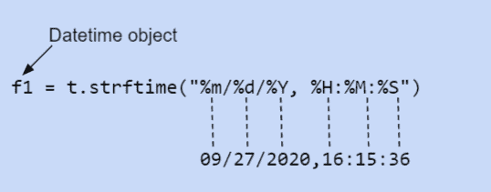
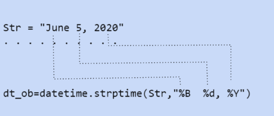

# Python 日期和时间

> 原文：<https://learnetutorials.com/python/date-time>

在本教程中，您将借助示例掌握如何在 python 中处理日期和时间。您将浏览用于操作日期和时间的不同模块，如何以特定格式读取和打印时间等。

## 关于日期和时间的事实

在深入研究日期和时间之前，让我们先回顾一下过去的日子，了解一下计算机是如何计算时间的。直指事实，几乎所有的电脑都是基于 **Unix Epoch time** 来计时的，也就是 1970 年 1 月 1 日 00:00:00 UTC。UTC(协调世界时)，通常被称为 GMT(格林威治标准时间)是指经度在 0 的时间。

像其他编程语言一样，python 也包含 Unix 时间概念，其标准库包含一个名为时间的流行模块。时间模块获得了一个名为 time()的函数，该函数输出自 unix 纪元以来的秒数。

```py
>>> import time
>>> time.time()
1599329118.616698 

```

这种 Unix 时间表示对人类来说难以置信地难以解析，因此它需要另一种方式向用户传达时间。这可以通过将 Unix 时间转换为 UTC 来实现，UTC 在**时区偏移**的帮助下再次转换为当地时间。时区偏移量的所有值的数据库由**互联网分配号码管理局**维护，简称为 **IANA** 。

## 日期和时间标准化

由于人类很难用秒来确定时间，所以时间格式是以年、月、日、小时等来计算的。我们生活的世界在地理、语言、文化等各个方面都充满了多样性。因此，有必要对时间格式进行标准化，以避免所有不必要的复杂性和沟通错误。国际标准组织提出了 ISO -8601，它规定了数据格式应该按照最重要到最不重要数据的顺序。要明确的是，标准化的日期格式如下:

```py
YYYY-MM-DD HH:MM:SS 

```

其中 YYYY 用四位数表示年份，MM 和 DD 用两位数表示月和日。同样，HH、MM 和 SS 代表小时、分钟和秒的两位数形式。

这样做的主要好处是避免了日期格式的模糊性。例如，当月份值是一个有效数字时，月-日-年或日-月-年经常被误解。

## Python 日期和时间模块

Python 提供了三个不同的模块来处理日期和时间。它们如下所示:

1.  日历模块
2.  日期时间模块
3.  时间模块

让我们从模块 **datetime** 开始学习，它有助于在 python 中操作日期和时间。

## Datetime 模块中的常数

使用日期时间模块中的两个常量 **MINYEAR** 和 **MAXYEAR** 可以导出系统中表示的最小和最大年份。
**MINYEAR**返回日期和日期时间对象中允许的最小年数，即`1`，而 **MAXYEAR** 给出日期和日期时间对象中允许的最大年数表示，即`9999`。

```py
import datetime

#constants in datetime Module
import datetime
print(datetime.MINYEAR)
print(datetime.MAXYEAR) 

```

```py
1
9999 
```

## Datetime 模块中的类

为了操作日期和时间，Python datetime 模块包含下面的类，这些类在这里制成表格。

| 班级 | 返回或描述 | 属性 |
| --- | --- | --- |
| 日期时间.日期 | 理想化的约会 | 年、月和日 |
| 日期时间.时间 | 理想化的时间 | 小时、分钟、秒、微秒和 tzinfo |
| datetime.datetime | 日期和时间组合 | 年、月、日、小时、分钟、秒、微秒和时间信息 |
| datetime.timedelta | 两个实例之间的持续时间 | 周、天、小时、分钟、秒、微秒、毫秒， |
| datetime.tzinfo | 时区信息 | 无 |
| 日期时间.时区 | 实现 tzinfo 抽象基类 | 无 |

类的对象日期、时间、日期时间和时区是不可变的，因此是可以修改的。所以这些对象可以作为字典的关键字。

## Python 日期对象

python 中的日期对象处理理想化的 Gerogian 日历中的日期。它代表标准格式的日期。

```py
datetime.date(year,month,day) 

```

这里的参数必须且应该是一个整数，其规定范围如下:

*   年份必须介于 1 和 9999 之间(含 1 和 9999)
*   月份必须介于 1 和 12 之间(含 1 和 12)
*   日期必须介于 1 和 31 之间，包括，取决于年和月。

如果任何参数未能满足这些范围规格，则它会遇到**值错误**。

## 如何获取日期

1.  ### 使用 today()方法

    方法`today()`用于获取当前本地日期。在这个例子中，我们已经导入了模块 **datetime** ，并为类 datetime.date 创建了一个对象`d_ob` ，该对象调用方法`today()`。

    ```py
    import datetime

    #Current date
    d_ob = datetime.date.today()
    print(d_ob) 

    ```

    ```py
    2020-09-06 
    ```

    结果为您提供了当前的本地日期。

2.  ### 使用 fromtimestamp()方法

    Unix 时间戳是以特定日期和 1970 年 1 月 1 日之间的秒数表示的时间。例如，1599468233 是时间戳。借助于名为 fromtimestamp()的方法，可以将时间戳转换为实际日期。

    ```py
    from datetime import date
    ts = date.fromtimestamp(1599468233)
    print('Date from Timestamp is',ts) 

    ```

    ```py
    Date from Timestamp is 2020-09-07 
    ```

3.  ### 使用 fromisoformat()方法

    以字符串形式给出的日期可以使用`fromisoformat()`方法转换为标准格式。这是一个非常酷的方法，它总是以 YYYY-MM-DD 格式输出日期。

    ```py
    from datetime import date
    str = date.fromisoformat('2020-02-14')
    print(str) 

    ```

    ```py
    2020-02-14 
    ```

4.  ### 使用 fromisocalendar()方法

    方法`fromisocalendar` 给出年、周、日作为参数传递的日期。

    ```py
    from datetime import date
    cal_date = date.fromisocalendar(year=2020,week=20,day=5)
    print(cal_date)

    ```

    ```py
    2020-05-15 
    ```

## Python 日期时间对象

现在假设如果你想得到当前日期和时间，你可以使用`datetime` 模块中的另一个类，也就是`datetime.datetime`。日期时间对象是与日期对象和时间对象一起工作的单个对象。

```py
 datetime.datetime(year,month,day,hour=0,minute = 0,sec = 0,tzinfo = None) 
```

常用的方法如下:

1.  ### 当前日期和时间的现在()方法

    Datetime 类调用如下例所示的 now()方法获取当前的本地日期和时间。

    ```py
    import datetime

    #Current date
    dt_ob = datetime.datetime.now()
    print(dt_ob) 
    ```

    ```py
    2020-09-06 15:39:27.272038 
    ```

2.  ### 当前日期和时间的 today()方法

    ```py
    import datetime

    #Current date
    dt_ob = datetime.datetime.today()
    print(dt_ob) 
    ```

    ```py
    2020-09-06 15:39:27.272038 
    ```

    您还可以通过传递示例中给出的关键字参数来实例化日期时间类:唯一的区别是，这里我们没有调用任何特定的方法，而是提供了日期和时间。

    ```py
    from datetime import datetime
     dt_ob3 = datetime(year = 2020,m = 29,hour = 6,minute = 30,sec
    print(dt_ob3) 
    ```

    ```py
    2020-10-29 06:30:45 
    ```

    也有可能检索单独的实体，如单独的年或单独的月或单独的小时。这可以用点符号来完成。

    ```py
    from datetime import datetime
     dt_ob = datetime(year = 2020,m = 29,hour = 6,minute = 30,sec
    print('Current Year is',dt_ob.year)
    print('Current time is ',dt_ob.hour)
    print('Timestamp of the date is',dt_ob.timestamp()) 
    ```

    ```py
    Current Year is  2020
    Current Minute is 6
    Timestamp of the date is 1603938645.0

    ```

3.  ### 使用 fromtimestamp()方法

    ```py
    from datetime import datetime
    ts = datetime.fromtimestamp(1599468233)
    print('Date from Timestamp is',ts) 
    ```

    ```py

    Date from Timestamp is 2020-09-07 12:43:53 
    ```

## 什么是 python 中的 timedelta 类

时间增量类是一个通常在`datetime`模块中与前述类一起使用的类，用于查找两个日期或时间的差异，即持续时间。在下面的示例中，我们创建了两个日期对象 d1 和 d2，它们的差异存储在 d3 中。这里，d3 属于`timedelta`类。类似地，两个日期时间对象的不同会给你一个`timedelta`对象。

```py
from datetime import date,time,datetime

from datetime import date,time,datetime
d1= date(2020,9,2)
d2=date(2019,9,7)
d3 =d1-d2
print('Difference is ',d3)
print("Type is ",type(d3))

t1=datetime(2020,9,2,11,45,30)
t2=datetime(2018,9,7,10,50,40)
print('time Difference is ',(t1-t2)) 

```

**输出:**

```py
 Difference is  361 days, 0:00:00
Type is  <class 'datetime.timedelta'>
time Difference is  726 days, 0:54:50 
```

## 如何操作两个时间增量对象

要操作`timedelta`对象，我们首先需要从`datetime`模块导入`timedelta`类。

```py
#timedelta objects difference
from datetime import timedelta
td1 = timedelta(weeks=2,days=3)
td2 = timedelta(weeks=1,days=5)
td3 = td1-td2
print(td3) 
```

```py
5 days, 0:00:00 
```

### 负时间增量对象

```py
#timedelta objects difference
from datetime import timedelta td5 = timedelta(sec
td  = timedelta(sec
td7 = td5-td6
print(td7)
print(abs(td7)) 
```

```py
-1 day, 23:59:30 
```

### 以秒为单位的时间增量对象

要以秒为单位获取 timedelta 对象，我们可以使用名为 total_seconds()的方法，该方法以秒为单位表示持续时间。

从日期时间导入时间增量

```py
td1 = timedelta(weeks=2,days=3)
print(td1.total_seconds()) 
```

```py
1468800.0 
```

## Python 日期时间格式

我们之前讨论过，在不同的国家，日期和时间的格式是不同的。例如，在美国，他们所依赖的常用日期格式是年月日，而在英国，该格式是年月日。如果月份是一个有效的数字，就会产生歧义。因此，python 中需要一种方法来处理这种模糊性，所以这里有两种格式化方法:

## strftime（）

Strftime 方法()是在所有三个类(日期、时间、日期时间)中定义的格式化方法，用于将给定的日期、时间和日期时间表示为可读的字符串，它只包含一个名为 format 的参数，在该参数中我们指定需要日期的格式。

下面的可视化让您更清楚地了解概念。



### strftime()方法示例

```py
 from datetime import datetime

t = datetime.today()
print(t)

f1 = t.strftime("%m/%d/%Y, %H:%M:%S")
# MM/DD/YYYY H:M:S format
print("Format 1:", f1)

f2 = t.strftime("%d/%m/%Y, %H:%M:%S")
# DD/MM/YYYY H:M:S format
print("Format 2:", f2) 

```

**输出:**

```py
 2020-09-27 16:15:36.913768
Format 1: 09/27/2020, 16:15:36
Format 2: 27/09/2020, 16:15:36 
```

## strptime（）

这是另一种仅由 datetime 对象支持的格式化方法，与 strftime()方法正好相反。这里，datetime 对象是从给定的字符串创建的。它包含两个参数

1.  日期和时间的字符串(' 02-14-2020 ')
2.  字符串的格式(%d/%m/%Y)

基于以上两个参数，它生成一个 datetime 对象作为结果。下面的可视化澄清了这个想法。



### strptime()方法示例

```py
from datetime import datetime

Str = "June 5,2020"
print(Str)

dt_ob=datetime.strptime(Str,"%B %d,%Y")
print(dt_ob) 
```

**输出:**

```py
June 5,2020
2020-06-05 00:00:00 
```

### strptime()中的值错误

当传递给 strptime()方法的字符串和格式代码不匹配时，python 将引发 ValueError。例如，

```py
 from datetime import datetime

Str = "June 5,2020"

dt_ob=datetime.strptime(Str,"%d %B ,%Y")
print(dt_ob) 
```

**输出:**

```py
ValueError: time data 'June 5,2020' does not match format '%d %B ,%Y' 
```

## str time()和 strptime()的格式代码。

| 管理的 | 意义 | 例子 |
| --- | --- | --- |
| %a | 工作日的缩写版本。 | 珊，老兄，Sat |
| %A | 工作日的完整版本。 | 星期天，星期一，…，星期六 |
| %w | Weekday 为十进制数，其中 0 为星期日，1 为星期一，6 为星期六。 | 0, 1, …, 6 |
| %d | 以零填充的十进制数表示的一个月中的某一天。 | 01, 02, …, 31 |
| %b | 月份的缩写 | 一月，二月，…，十二月 |
| %B | 月份的完整版本 | 一月，二月，…，十二月 |
| %m | 月是一个用零填充的十进制数。 | 01, 02, …, 12 |
| %y | 不包括世纪的年份的简短版本 | 00, 01, …, 99 |
| %Y | 年的完整版本，包括世纪 | 0001, 0002, …, 2013, 2014, …, 9998, 9999 |
| %H | 小时作为零填充的十进制数。- 24 小时 | 00, 01, …, 23 |
| %I | 小时作为零填充的十进制数- 12 小时 |   01, 02, …, 12 |
| %p | 上午或下午。 | 上午，下午 |
| %M | 分钟是一个用零填充的十进制数。 | 00, 01, …, 59 |
| %S | 第二个是用零填充的十进制数。 | 00, 01, …, 59 |
| %f | 微秒为十进制数，左边用零填充。 | 000000, 000001, …, 999999 |
| %z | HHMM[SS []形式的世界协调时偏移量。ffffff]] | (空)、+0000、-0400、+1030、+063415、-030712.345216 |
| %Z | 时区名称 | (空)、UTC、EST、CST |
| %j | 以零填充的十进制数表示的一年中的某一天。 | 001, 002, …, 366 |
| %U | 一年中的周数(周日是一周的第一天)作为零填充的十进制数。 | 00, 01, …, 53 |
| %W | 一年中的周数(星期一为一周的第一天)为十进制数。 | 00, 01, …, 53 |
| %c | 日期和时间本地表示。 | 1988 年 8 月 16 日 21:30 |
| %x | 当地代表的日期。 | 88 年 6 月 8 日(无)；1988 年 16 月 8 日(en_US) |
| %X | 时间局部表示。 | 21:30:00 |
| %% | 文字“%”字符。 | % |