# python 中的正则表达式

> 原文：<https://learnetutorials.com/python/regular-expressions>

在本教程中，您将学习什么是正则表达式，它在编程中如何有用，以及如何借助一些简单的例子和图形来实现模式匹配。此外，您将学习导入模块“re ”,它涵盖了一些有用的功能，如匹配、搜索、查找等。

在讨论正则表达式之前，让我们想一想我们在日常生活中有意无意使用的特定功能，即使用“查找”搜索字符串，使用“查找和替换”查找和替换字符串，在文字处理器和文本编辑器中，以及验证电子邮件和密码等输入。这些是如何发生的？答案在本教程中。

什么是正则表达式？

正则表达式是定义某种搜索模式的字符序列。在编程环境中，正则表达式起着至关重要的作用，因为它定义了一系列字符的搜索模式。正则表达式缩写为 Regex。

例如，

```py
a*b = {b,ab, aab,aaab,aaaab,.......}

ab* = { a,ab, abb, abbb, abbbb,.....} 

```

这里，a*b 和 ab*是具有语言{a，b}的正则表达式，并且*表示零或更多。

## python 中 re 模块

现在让我们开始学习 Python 中正则表达式的实现，从哪里开始，如何开始。在 python 中，正则表达式的函数和方法存放在一个名为 re 的模块中。因此，要执行任何 Regex 功能，必须导入 re 模块。下图显示了导入 re 模块的原型:

```py
import re 

```

## 元字符

正则表达式的能力随着称为元字符的特殊字符的出现而增强。在正则表达式中，元字符是对计算机程序有特殊意义的字符。左右方括号([])、carat^、美元($)、句号(。)、竖线(|)、星号(*)、加号(+)、问号(？)、左右花括号({})、括号()、反斜杠(\)等是 Regex 中使用的一些元字符。

根据操作，元字符可以分为以下几类:

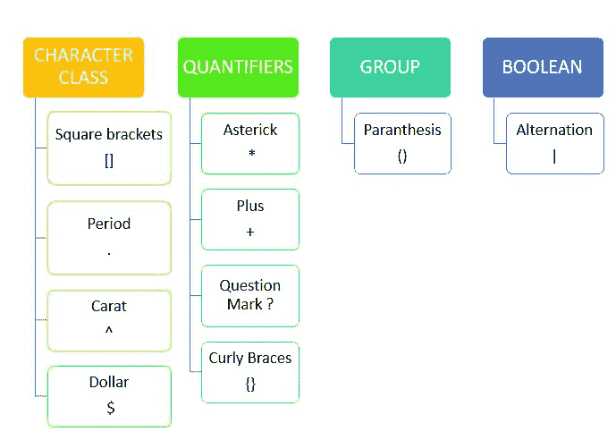

### 元字符

## 字符类的元字符

1.  ### [] -方括号

    方括号是正则表达式中的元字符，用于定义字符集。换句话说，方括号内的字符构成字符集，并试图匹配方括号内的任何单个字符。

    示例:

    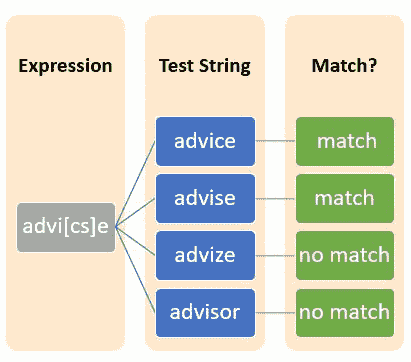

    ### 方括号示例

    为了更好地理解，正则表达式可以可视化为

    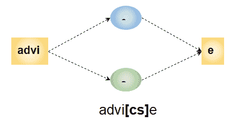
    1.  **Square brackets for Character set range:**

        使用方括号[]我们还可以表示一系列字符。**“-”(连字符)**用于表示一系列字符。例如，

        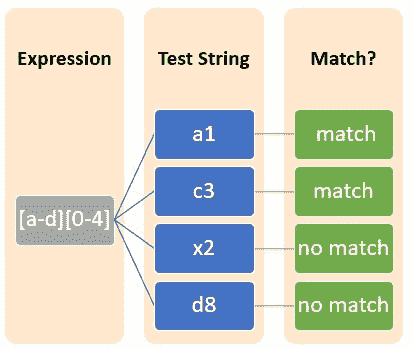

        在这个例子中，

        [a-d]是类似于[abcd]的正则表达式

        [0-4]也是类似于[01234]的正则表达式

        *   [a-z] -表示所有字母(a 到 z)都可以在 regex 中使用。
        *   [0-9] -表示 regex 中可以使用从 0 到 9 的所有数字。
    2.  **Negation of set range**

        也可以反转字符集范围。这可以通过在方括号打开后立即放置 caret(^符号来实现。这可以被视为:

        *   [^aeiou]:这将会给你除了元音以外的所有字母
        *   [^0-5]:匹配除 0、1、2、3、4 和 5 以外的所有数字。
2.  ### 。-句号

    指定通配符的点或句点匹配除换行符以外的任何单个字符。点的数量表示可以包含的字符数量。

    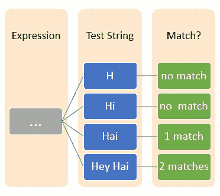

    ### 周期符号示例

3.  ### ^ -脱字符

    元字符，^(caret 符号)通常以字符作为前缀，表示正则表达式以该特定字符开始。

    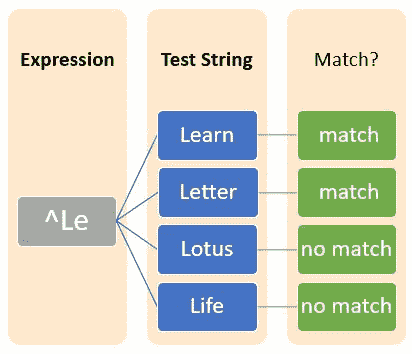

    ### ^(caret 符号的例子)

4.  ### 美元

    元字符$(美元符号)通常以字符作为后缀，表示以该特定字符结尾的正则表达式。

    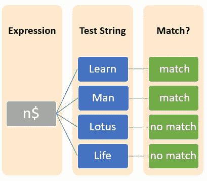

    ### 美元示例(美元符号)

## 量词的元字符

正则表达式中的量词代表字符、元字符或字符集的出现。*,+,?和{}属于量词。

1.  ### * -星号:

    星号或星号(*)表示字符串中某个模式的出现次数为零或更多。

    

    ### 星号示例

2.  ### + - Plus

    加号(+)表示字符串中模式的一次或多次出现**。**

    **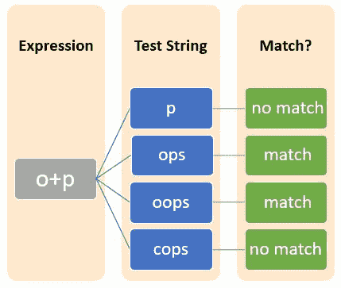

    ### 加号(+)的示例** 
***   ### ？-问号

    问号(？)表示字符串中某个模式的 0 或 1 次出现**。**

    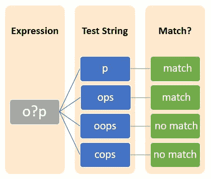

    ### 问号(？)

    *   ### {} -大括号

    花括号也属于量词的范畴，用于表示某些字符或元字符或字符集的重复。大括号可以采用以下形式:

    | {n} | 前面的字符正好重复 n 次。 |
    | {n，} | 前面的字符至少重复 n 次 |
    | {，m} | 前面的字符最多重复 m 次 |
    | {n，m} | 前面的字符重复 n 到 m 次，包括 n 次和 m 次。 |

    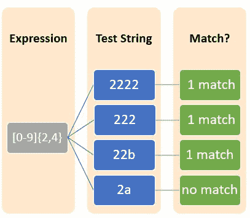

    ### 大括号示例** 

 **## 布尔元字符

1.  ### | -交替

    交替通常用于通过表示这个或那个来完成逻辑或运算。这可以通过管道符号(|)来实现，它将单个正则表达式与任何可能的正则表达式进行匹配。

    形式`<regex-1>|<regex-2>|....|<regex-n>`的正则表达式与最大值`<regex-i>`相匹配。

    

    ### 变更示例

## 分组结构

1.  ### 括号()

    分组结构将正则表达式分成小的子表达式组。分组可以用括号()符号来完成。

    

    ### 括号()的示例

### 分组的应用有:

1.  ##### It is easy to apply quantifiers to subexpressions or groups.

    | Regular expression | Explanation | Example/Match |
    | (Hi) + | +Applicable to the whole character set | Hi-hi-hi |
    | Hi+ | +Applicable only to the characters "I" | Hi-hi-hi-hi-hi-hi-three |

2.  ##### Allow the substitution term to be limited to a part of the regular expression

    | Regular expression | Explanation | Example/ Match |
    | This is a car | &#124; Applicable to "This is a car" and "Bus" | This is a car bus |
    | This is a car | &#124; Applicable to "This is a car" and "This is a bus" | This is a car and this is a bus |

3.  ##### 有助于捕获搜索字符串中与组匹配的部分

    借助一个组构造，我们还可以提取一些匹配子表达式或子模式的字符串。与用于捕获字符串的组构造相关联的两种方法是 group()和 group()，您将在本教程的后面部分学习这两种方法。

## 转义的元字符

1.  ### \ -反斜杠

    正则表达式中的反斜杠(\)用于转义特殊字符，包括元字符。通过在元字符前放置一个反斜杠，将删除元字符的特殊含义，并将它指定为文字字符本身。例如，元字符(？)问号可以被认为是一个文字字符，在它前面加一个(\)字符。

    此外，反斜杠在您不确定某些字符含义的情况下很有用，可以通过将反斜杠放在字符前面来验证。

## 特殊序列

在正则表达式中，特殊序列是以反斜杠为前缀的字符序列。为了便于理解，下面列出了特殊序列及其含义和示例

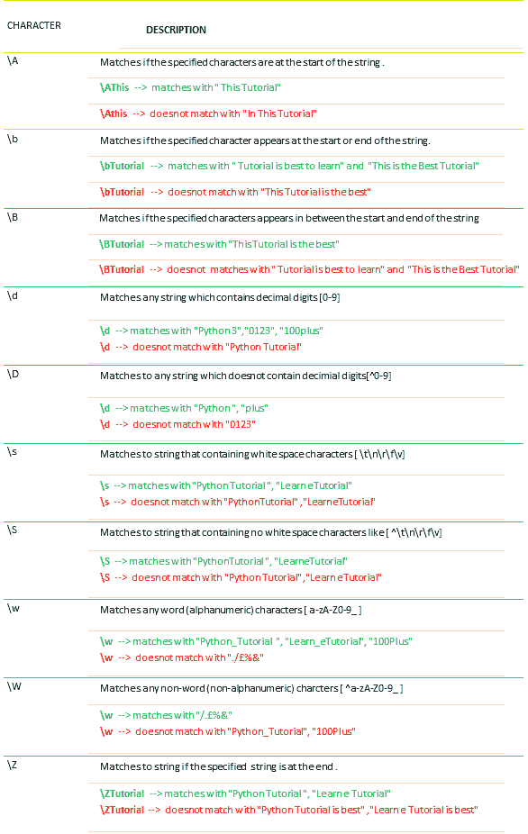

## 正则表达式函数

现在，您已经非常熟悉正则表达式中使用的元字符和特殊字符了。本节将教您使用一些常见且经常使用的正则表达式函数来实现它们。下面列出了与 **re** 模块相关的常用功能。

1.  Match() -成功时返回匹配对象，否则返回无。
2.  Search() -如果找到匹配项，则返回匹配对象，否则返回 None。
3.  Findall() -返回一个包含所有匹配项的列表
4.  Split() -返回发生拆分的字符串列表
5.  Sub() -替换一个或多个匹配项

下面用简单易懂的例子详细解释了每个功能。

## <small>re</small> 。匹配( <small>*图案、字符串、旗帜=0*</small> )

检查下面给出的使用 match()函数验证电子邮件格式的代码。

```py
import re

string = 'userName123@yahoo.com'

pattern = '^[a-zA-Z0-9+_.-]+@[a-zA-Z0-9.-]+$'

result = re.match(pattern, string)

if result:
  print("Valid email format")
else:
  print("Invalid email format") 

```

**输出:**

```py
Valid email format 
```

在这个例子中，我们使用了一个匹配函数来检查模式是否与提供的字符串匹配。在这里，我们使用正则表达式验证电子邮件格式，如果测试字符串不符合模式，将打印一个无效的电子邮件格式作为输出。

## <small>re</small> 。搜索( <small>*图案、字符串、旗帜=0*</small> )

与 re 模块相关联的另一种操作正则表达式的方法是 search()方法，它接受两个参数——一个模式和一个字符串。顾名思义，该方法搜索模式与字符串匹配的初始位置。如果它找到一个完美的匹配，那么 re。search()将返回一个匹配对象，否则将生成一个 None 作为结果。以下是示例:

```py
import re

string = 'Python is a universal programming language developed by a Dutch Programmer called Guido Van Rossum in 1989 and released in 1991'

pattern ='\d'

result = re.search(pattern, string)

if result:
  print("search successful")
else:
  print("search unsuccessful") 

```

**输出:**

```py
search successful 
```

这里，结果包含一个匹配对象。

## <small>re</small> 。findall( <small>*图案、字符串、旗帜=0*</small> )

此方法从左到右扫描字符串，并按照找到的顺序返回所有匹配项的列表。

```py
import re

string = 'Python is a universal programming language developed by a Dutch Programmer called Guido Van Rossum in 1989 and released in 1991'

pattern ='(\d+)'

result = re.findall(pattern, string)

if result:
  print(result)
else:
  print("search unsuccessful") 

```

**输出:**

```py
['1989', '1991'] 
```

如果没有找到匹配，那么结果将是一个空列表。

## <small>re</small> 。拆分( <small>*模式，字符串，maxsplit=0，flags=0*</small> )

这种方法与我们所学的上述方法略有不同。在此方法中，字符串根据模式匹配进行拆分，结果将是发生拆分的字符串列表。观察以下示例:

```py
string = 'Python is a universal programming language developed by a Dutch Programmer called Guido Van Rossum in 1989 and released in 1991.'
pattern = '\d+'

result = re.split(pattern, string) 
print(result) 

```

**输出:**

```py
['Python is a universal programming language developed by a Dutch Programmer called Guido Van Rossum in ', ' and released in ', '.'] 
```

在上面的代码片段中，当遇到数字时，字符串会拆分。当没有找到匹配项时，spit()方法返回一个包含原始字符串的列表。split 方法的另一个特点是能够通过为参数 max split 指定一个值来限制拆分的数量。

```py
import re

string = 'Python is a universal programming language developed by a Dutch Programmer called Guido Van Rossum in 1989 and released in 1991.'
pattern = '\d+'

result = re.split(pattern, string,1) 
print(result) 

```

**输出:**

```py
['Python is a universal programming language developed by a Dutch Programmer called Guido Van Rossum in ', ' and released in 1991.'] 
```

注意:默认情况下，maxsplit 的值为零(所有可能的拆分)

## re.sub(模式，repl，字符串，计数=0，标志=0)

此方法用所需选择的字符串替换匹配项

```py
import re

string = 'abc 123 def 456 ghi 789'
pattern = '[a-z]'
replace = '0'

result = re.sub(pattern,replace,string) 
print(result) 

```

**输出:**

```py
000 123 000 456 000 789 
```

像 split()一样，您可以通过将值设置为可选参数 count 来限制替换次数。默认情况下，count 的值为零，这意味着所有可能的替换都将发生。

```py
import re

string = 'abc 123 def 456 ghi 789'
pattern = '[a-z]'
replace = '0'

result = re.sub(pattern,replace,string,4) 
print(result) 

```

**输出:**

```py
000 123 0ef 456 ghi 789 
```

在上面的方法中，您已经看到了一个名为 flags 的可选参数，它是用于控制匹配的各个方面的修饰符。默认情况下，标志被指定为零。

## 匹配对象

正则表达式中的匹配对象是包含搜索和结果信息的对象。匹配对象总是包含真值或假值。如果没有匹配，则返回无，而不是匹配对象。观察以下代码的输出:

```py
import re

string = 'I am 18 years old.'
pattern = '\d+'

result = re.search(pattern, string) 
print(result) 

```

**输出:**

```py
span=(5, 7), match='18'<re.match object=""></re.match>
```

match 对象具有以下属性和方法来获取搜索和结果信息:

**span()** :返回一个元组，包含匹配的开始和结束索引。

**group()** :返回字符串中与模式匹配的部分

**字符串**:返回传递的字符串

```py
 import re

string = 'I am 18 years old.'
pattern = '\d+'

result = re.search(pattern, string) 
print(result.span())
print(result.group())
print(result.string) 

```

**输出:**

```py
 (5, 7)
18
I am 18 years old. 
```

要了解更多与 match 对象相关的属性和方法，请访问 python 的文档页面。**