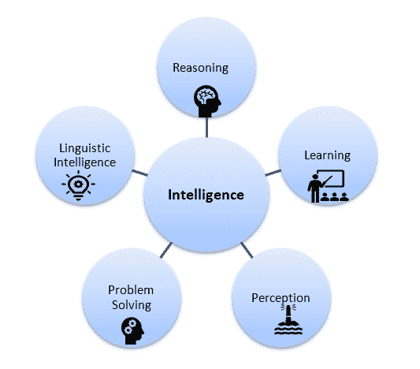
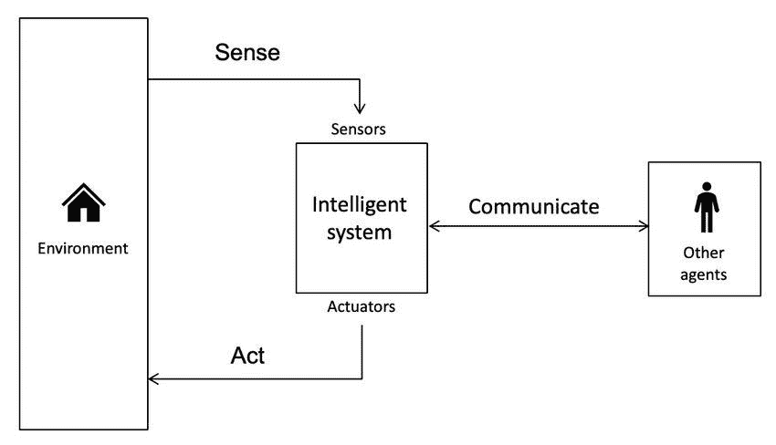
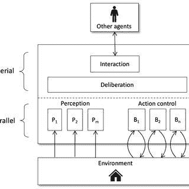

# 智能系统

> 原文：<https://learnetutorials.com/artificial-intelligence/artificial-intelligence-systems>

学习人工智能的同时，一定要了解什么是智能？

## 什么是智力？

用一句话定义智力很难，对不同的人来说，它意味着不同的东西。智力有这么多方面。一般来说，智力可以被定义为做出决定、解决问题、创造力和适应新情况以在多样化环境中生存的能力。

一个人从环境中学习，对环境做出决定，解决环境中的问题，调整或尝试新情况的能力被称为人类智能。它可以被定义为一个人的力量或智力。人类智慧的一个例子是远离火的人。

## 智力是由什么组成的？

智力是由

*   论证
*   学问
*   问题解决
*   感觉
*   语言智能

*   **推理**-使我们能够提供预测、构建解释和得出结论的一组过程被称为推理。
*   **学习**学习是一个通过学习、实践、被思考或体验，从获得知识或技能中增强学习主体意识的过程。
*   **解决问题**-一个人试图从目前的情况中获得想要的解决方案。它还涉及决策过程，在这个过程中，从多个备选方案中选择最合适的备选方案，以得出期望的结论。
*   **感知**-感知意味着意识到某事..传感器用于帮助感知。
*   **语言智能**-使用、说、写口头和书面语言的能力。

当人类的智能被机器拥有时，不是全部，而是某些方面，它可以被称为**机器智能**。用机器智能设计的系统被称为**智能系统**。现在

## 什么是智能系统？

当推理、学习、解决问题和感知的能力与人造机器结合在一起时，我们称之为智能系统，或者根据定义，具有感知和响应周围世界的先进技术的机器被称为智能系统。系统的智能可以定义为系统执行以下操作的能力

*   计算
*   理由
*   从经验中学习
*   从内存中存储和检索信息
*   解决问题
*   流利地使用自然语言
*   推广
*   适应新情况

智能系统可以称为互连的智能设备、网络、其他大型系统和软件的集合。智能系统可以从环境中收集信息，分析数据，并与其他系统通信。

## 为什么智能系统很重要？

智能系统对某些领域有大量的知识。它们是技术先进的机器，能够对周围的世界做出反应。它在决策过程中具有高度的复杂性，也能解释其行为。智能系统最重要的特征是它能够与人类互动，为复杂的信息处理提供有效的教学或帮助。

智能系统应用于专业领域，如医疗诊断(识别肿瘤)、机场管理(空中交通流量管理)以及单调的工作(自动驾驶汽车或软管清洁)和危险任务，如水下勘探。

## 智能系统的特性

1.  **在可用资源有限的复杂世界中运营。**
    系统的信息处理能力不及世界的复杂程度。关于世界的全部信息不能完全在智能系统的记忆中表现出来。世界由两部分组成，环境和代理。该系统通过传感器观察环境，并使用执行器启动动作。例子:恒温器说明了在环境中运行的系统的概念。它使用温度计来感测房间(环境)的温度，并通过启动或停止加热器来执行动作。系统通过建立期望的温度与用户交互。传感器和执行器的使用将系统主体与环境的其余部分分开。智能代理被放置在环境中。
2.  **拥有初级认知能力**。智能系统拥有四种主要认知能力
    1。**感知**:从环境中提取信息。
    2。**深思熟虑**:推理世界，决定行动。
    3。**互动**:与代理人沟通
    4。**动作控制**:控制动作的执行。
    感知和动作控制被分成多个独立的组件，它们以高频率并行运行，推理所必需的深思熟虑和互动依次运行。
    **示例**:自动驾驶汽车是说明 4 种主要认知能力的智能系统的示例。汽车借助摄像头、加速度计、声学传感器等感知世界。感知是在专门识别物体(行人、交通信号、其他车辆)的感知组件的帮助下实现的。动作控制由转向、制动、油门等执行。深思熟虑与生成到达最终目的地的路径的能力有关。通过向用户呈现到达目的地所遵循的路径来执行交互，并且呈现关于环境的信息也有助于用户正确地执行旅行。
3.  **展示复杂的智能行为**。理性行动、通过学习调整决策和自省是描述系统复杂智能行为的能力。
    1.  **理性行动** :-拥有理性行动的智能系统，为了以最佳的可能方式获得最大的性能，利用其认知能力。例如:在医疗诊断系统中，疾病被正确诊断的次数被视为绩效的衡量标准。智能系统无法获得准确的性能度量，但可以对预期性能进行评估。这可以用决策算法(如决策理论)明确编程。认知能力，如感知、互动、深思熟虑和激励，被用来执行理性决策。
    2.  **通过学习适应** :-智能系统通过学习获得适应变化世界的能力。感知和动作控制等认知能力可以通过学习来提高。智能系统可以使用内部方法或外部方法来进行价值判断，以评估其行为。对系统行为的这种评估有助于改变内部模型，以修改其未来的行为。
    3.  **内省** :-这是分析自身认知能力如何运作的能力。具有内省的模型可以用作算法的输入，以模拟自我意识过程。这种能力允许系统向外部代理执行解释。

## 两种类型的智能系统

两个智能系统是智能教学系统和专家系统。

### 1.智能教学系统

顾名思义，智能教学系统向用户(学生)提供类似于人类导师的指导。智能交通系统为用户提供个性化的指导和反馈。借助于针对个体的深度学习算法，系统提出了一些学习策略。它持续跟踪用户的进度，并提供下一步提示，选择有助于用户提高或学习新技能的练习问题。智能交通系统将使用户能够努力达到成功解决问题的目的。它在解决问题的背景下提供指导，也有助于理解解决问题的知识。

智能交通系统示例

*   追踪导师
*   斯多葛派导师
*   意大利语 2 学习
*   多林戈聊天机器人
*   Thinkster 数学

### 2.专家系统

专家系统包含某个领域(核工业、会计等)的专家知识。知识库是专家系统中最重要的部分，它包含了专家所拥有的所有专业和技术知识。来自多个专家的知识被集成到专家系统的知识库中，因此可以使解决方案更加高效。
专家系统的五种基本类型是

*   **基于规则的专家系统**:从人类专家那里获取知识，并将这些知识转化为若干条硬编码的规则。
*   **基于框架的专家系统**:是一个槽的集合的概念。在这里，框架用来表示知识，规则起次要作用。
*   **模糊专家系统**:基于逻辑。规则是根据专家知识的模糊偏好建模的。
*   **神经专家系统**:结合了基于规则的专家系统的优势和神经网络的优势，如学习、泛化、鲁棒性和并行信息处理。
*   **神经模糊专家系统**:将神经网络与模糊专家系统相结合，提供了一种更强大的技术，称为神经模糊系统。

专家系统通常由四个部分组成

1.  **知识库**:存储来自不同专家的关于任何特定领域或主题的知识的集合。
2.  **搜索或推理系统**:专家系统的主要处理单元，因此被称为专家系统的大脑。从知识库中提取知识，并将推理规则应用于知识库，为用户查询产生无错误的解决方案。
3.  **知识获取系统**:对领域知识进行提取、组织和结构化，从各种专家那里获取知识
4.  **用户界面或通信系统**:用户通过用户界面与专家系统进行交互。它将用户查询作为输入，并将它们传递给推理引擎，并将输出显示给用户。

#### 专家系统示例

*   霉菌素
*   树枝状
*   PXDES

## 智能系统的应用

在当今社会，智能系统正准备扮演越来越多的角色。其中一些是

*   娱乐
*   字符电子识别
*   视觉监控
*   智能交通
*   使用生物特征参数的人体识别。
*   教育
*   医疗护理
*   军事应用
*   机器人学
*   工厂自动化

## 智能系统的挑战。

*   **动态世界**:-不断变化的物理世界要求快速做出决策，以适应环境的变化。
*   **映射** : -计算机视觉必须应对挑战，包括背景运动、照明和比例的变化，将具有类内/类间变化的项目分组。从 3D 世界到 2D 世界，有很多机会丢失信息。
*   **不确定性** : -智能系统采取的任何行动都可能由于传感器中的噪音和执行行动的限制而不正确。
*   **耗时的计算** : -为了搜索到一个目标的最佳路径，需要昂贵的计算或搜索非常大的状态空间。

## 人和机器智能的区别

| 

**人类智能**

 | 

**机器智能**

 |
| Humans become aware or conscious or understand by patterns.Humans recall information by patterns.Even if some part of an object is missing or distorted, Humans can figure out the object completely | Machines understand or become aware of a set of rules and data.Machines recall information by searching algorithms.Machines cannot figure out an object completely without errors with distorted information. |