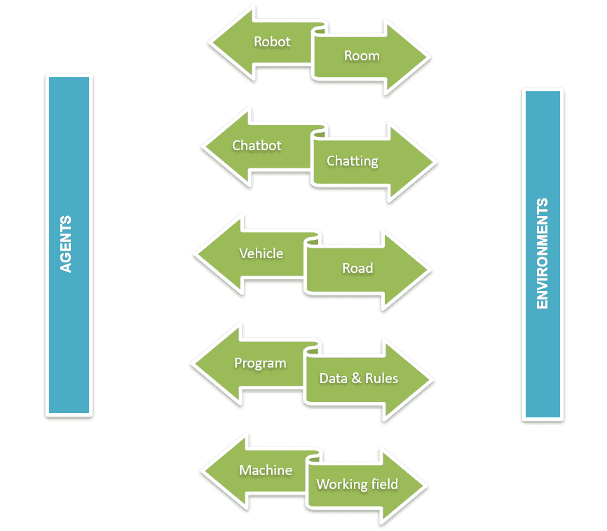
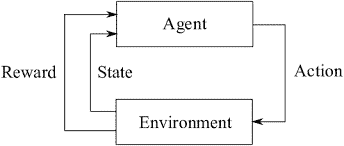

# 人工智能中的代理环境

> 原文：<https://learnetutorials.com/artificial-intelligence/agent-environment-in-ai>

在本人工智能教程中，我们旨在了解什么是代理环境，以及代理环境在人工智能中的重要性。还将讨论人工智能中各种类型的代理环境。

**环境**这个名词大家都很熟悉。根据牛津词典的定义:“*环境是人、动物或植物生活或活动的环境或条件。*“但说到计算，就是计算设备工作或运行的环境。在人工智能的背景下，环境只是代理的周围，是代理运行的地方。要了解更多关于代理的信息，请访问我们之前的教程-[AI](../artificial-intelligence/intelligent-agents-in-ai)中的代理。

现在，让我们考虑一个在路上驾驶汽车的真实例子。你能猜到谁将是代理人和环境吗？是的，阿根将是汽车，环境将是道路。驾驶员是感知所有警报并在危险环境中操作汽车以获得所需输出的人——安全驾驶。

类似地，在人工智能中，我们有一个包含代理、传感器和执行器的环境。

上图显示了代理环境交互的最简单的图形表示。代理在环境中。有传感器来感知环境，它们向代理提供感知输入。然后，代理对相应的输入采取行动，并将输出提供回环境。

对于人工智能来说，要解决的问题本身就带来了巨大的挑战。理解给定的问题本身对人工智能来说是一项具有挑战性的任务。除了推理，人工智能问题最具挑战性的方面是环境。

代理和环境可以说是 AI 挂在哪里的两个钩子。或者更简单地说，环境被认为是问题，那么代理是问题的解决方案，或者“代理”是在地面上玩的游戏“环境”。

### 人工智能中的代理及其环境示例

上面显示了代理及其环境的一些示例，以便清楚地理解。对于给定的驾驶任务，车辆是代理，道路是驾驶的环境。像照相机、雷达、激光雷达等传感器设备将收集关于道路的信息，如行人的存在、道路上其他车辆的数量、交通信号等。然后，车辆将根据该信息采取行动，如是否必须踩下制动踏板或加速踏板或必须转弯等。

如果一台机器是一个代理，那么它的工作场所就是它的环境。如果我们将冷却系统视为代理，那么它所服务的行业就是环境。然后，冷却液温度传感器将收集信息，机器将根据该信息采取行动。

## 为什么代理环境很重要？

人工智能也可以称为对理性主体及其环境的研究。从这句话本身，就可以清楚一个代理和代理环境对于 AI 有多重要。人工智能系统的工作可以用最简单的语言来描述。通过不同类型的传感器，代理将感知环境，通过执行器，代理将作用于其环境。代理环境的结构将影响整个人工智能系统本身。

代理不能完全控制其环境，但可以部分控制。这意味着环境受到代理的影响。但是代理的性能直接受到环境变化的影响。即一个代理在两个不同的环境中执行相同的任务将导致完全不同的结果。代理被预编程了一组能力，这些能力可以应用于其环境中可能面临的不同情况。这些预编程的能力被称为**效应能力**。代理的传感器受到环境的严格影响。代理使用其有效能力和来自传感器的信息来执行决策。每一个行动都不适合每一种情况。前提条件必须适合执行特定任务。例如，代理必须打开一扇门，并且它可以这样做。但只有在车门解锁的情况下才能执行(前提条件)。因此，决定在给定实例上执行什么操作来实现目标，或者至少朝着目标努力，是环境中代理的最大问题。环境的属性直接影响决策过程的复杂性。

## 环境类型

人工智能中的代理环境分为不同的类型。环境根据代理如何处理它进行分类。
分类如下:

1.  完全可观察和部分可观察
2.  静态和动态
3.  离散和连续
4.  确定性和随机性
5.  单代理和多代理
6.  情节性和连续性
7.  已知和未知
8.  可访问和不可访问

### 1.完全可观察和部分可观察

就像名字本身一样，代理的环境一直被观察。在每个时间点，环境的完整状态被传感器感测或访问。这种完全观察到的环境被称为**完全可观察到的**，否则，如果它没有随着时间的变化而被连续感测或观察到，那么它就是**部分可观察到的**。任何传感器在任何时间都无法观察或访问的环境称为不可观察环境。因为它不需要有一个世界范围的轨迹，一个完全可观察的环境更方便。

在现实生活中，**象棋**是一个完全可观察的例子，因为象棋游戏的每个玩家都可以看到整个棋盘。完全可观察的环境的另一个例子是道路，当在道路上驾驶汽车时(**环境**)，驾驶员(**代理人**)可以在给定时间看到道路上的所有交通信号、状况和行人，并相应地驾驶。

一个**纸牌游戏**可以被认为是一个部分可观察的例子。这里，一些卡片被面朝下丢弃成一堆。用户只能看到他的卡。用户看不到用过的卡，即为将来保留的卡。

### 2.静态和动态

通过代理的动作始终保持不变的环境称为静态环境。静态环境是最简单的，也是最容易处理的，因为代理不需要在动作过程中跟踪世界。但是，如果一个环境因代理的动作而改变，则称它是动态的。动态的环境不断变化。一个随时间保持不变并且代理的性能分数会随时间变化的环境称为半动态环境。

纵横字谜可以被认为是静态环境的一个例子，因为纵横字谜中的问题被设置为在纵横字谜的开始暂停，环境保持不变，并且环境不会扩展或收缩，它保持不变。
对于动态环境，我们可以考虑坐过山车作为例子。环境在运动时每时每刻都在变化。高度、质量、速度、不同的能量(动能、势能)、向心力等都会因时而异。

### 3.离散和连续

具有有限可能性的环境称为离散环境。对于离散环境，要达到最终目标，需要执行有限数量的动作或感知。对于连续的环境，感知的数量仍然是未知的和连续的。
在国际象棋比赛中，每个棋子可能的移动是有限的。就像国王在任何方向只能移动一个方块，直到那个方块没有被对手棋子攻击。因此，特定棋子的可能移动是固定的，它可以被认为是离散环境的一个例子，但是每个游戏的移动数量会有所不同。

自动驾驶汽车是连续环境的一个例子。环境会随着时间的推移而变化，交通拥挤、道路上其他车辆的速度等都会随着时间的推移而不断变化。

### 4.确定性和随机性

忽略不确定性的环境称为确定性环境。对于确定性环境，即将到来的条件或状态可以由环境的当前条件或状态以及代理的当前动作或代理选择的动作来确定。具有随机性质的环境称为随机环境。即将到来的状态不能由当前状态或代理来确定。大多数真实世界的人工智能应用都属于随机类型。环境只有在部分可观测的情况下才是随机的。

对于棋盘上的每一个棋子，它们现在的位置可以设定下一个即将到来的动作。不存在不确定的情况。可以确定工件从当前位置可以采取的所有步骤，因此，可以在确定性环境下对其进行分组。

但是对于自动驾驶汽车来说，由于环境不断变化，在当前状态下无法确定即将到来的动作。可能车要踩刹车，也可能完全踩油门，就看当时的环境了。行动无法确定，是随机环境的一个例子。

### 5.单智能体与多智能体

仅由单个代理组成的环境称为单代理环境。环境中的所有操作仅由该代理执行和控制。如果环境由一个以上的代理或多个执行操作的代理组成，那么这种环境称为多代理环境。

在真空清洁环境中，真空吸尘器是环境中涉及的唯一试剂。它可以被认为是单代理环境的一个例子。

多代理系统，具有多个交互代理的基于计算机的环境是多代理环境的最佳示例。电脑游戏是常见的 MAS 应用。生物代理、机器人代理、计算代理、软件代理等是计算机游戏中共享环境的代理。

### 6.插曲式和顺序式

具有一系列操作的环境，其中代理的当前操作不会对未来操作产生任何影响。也称为非顺序环境/场景环境。顺序或非情节环境是指代理的当前动作将影响未来动作的环境。

对于分类任务，代理将从环境中接收有关时间的信息，并且只对这些信息执行操作。当前的行动对未来的行动没有任何影响，因此可以在一个场景环境下进行分组。
但对于一盘棋来说，特定棋子当前的动作可以影响未来的动作。如果硬币现在向前迈出一步，下一步的行动取决于这个行动向哪里移动。它是连续的。

### 7.已知和未知

已知和未知是代理的状态，而不是环境的属性。如果代理知道所有操作的所有可能结果，那么它就是一个已知的环境。如果代理不知道操作的结果，并且需要了解环境才能做出决策，则称为未知环境。

### 8.可访问&不可访问

如果代理的传感器可以完全访问环境状态，或者代理可以访问关于环境状态的完整信息，那么它被称为可访问环境。否则无法访问，或者代理无法完全访问环境状态。

| 任务环境 | 可观察量 | 决定 | 偶然发生的 | 静态 | 分离的 | 代理人 |
| 纵横拼字谜 | 完全地 | 决定 | 连续的 | 静态 | 分离的 | 单一的 |
| 出租车驾驶 | 部分地 | 随机的 | 连续的 | 动态的 | 欺骗 | 多（前缀） |
| 医疗诊断 | 部分地 | 随机的 | 连续的 | 动态的 | 欺骗 | 单一的 |
| 映象分析 | 完全地 | 确定性的 | 偶然发生的 | 半挂车 | 欺骗 | 单一的 |

## 代理将如何与环境交互？

代理和环境之间的交互是与过程相关的时间。对于每个时间步骤，代理收集有关环境状态表示的信息。根据此信息，代理将从该状态的可用操作中选择一个操作。经过一个时间步骤后，代理将获得一个数字奖励，作为特定动作的结果，并使自己进入一个新的状态。这种交互是一个连续的过程，行动由代理选择，环境将响应这些行动，并向代理呈现新的情况。

人工智能的典型学习结构如上所示。

人工智能使用学习技术来解决给定的任务。该图解释了代理如何与环境交互。当代理人行动时，环境的状态会发生变化，并让代理人知道这种变化，同时还会获得奖励。这一直持续到目标。