# 在窗口中安装 Go

> 原文：<https://learnetutorials.com/golang/go-programming-language>

从本教程中，您将学习与 Go 编程的环境设置相关的主题。

## 需要花钱买 GO 吗？

既然 Go 有开源软件许可证，就没必要花钱买 Go 了。它的源代码对任何人都是免费的。Go 可以用于个人或商业目的，无需向任何人付费。围棋的库、编译器和工具对任何地方的每个人都是免费的。

## 什么是软件许可证？

软件许可证是一种合同，是创建和分发应用程序、源代码或相关产品的开发人员或组织与其最终用户之间的文本文档。软件许可证有权保护开发者或组织的知识产权，并限制针对他们的任何索赔。它还为软件的安装、担保、责任、分发和使用提供法律声明。

软件许可证主要分为两类，它们是:

1.  **Proprietary (or Closed-source):** 

    拥有专有许可证的软件因其代码复制、修改、重用或分发而受到限制。这类软件的操作代码仅作为源代码提供。

2.  **Free and Open-Source Software (FOSS):** 

    它也被称为“开源”。本许可证允许最终用户修改软件、重用软件代码，并提供软件产品的实际源代码。

## Go 有什么类型的许可证？

Go 拥有 **BSD(伯克利软件发行版)**风格的许可证。该许可证也被称为“许可”或“阿帕奇”。BSD 是一种流行的开源软件许可证。BSD 是一个简单的许可证，只要求所有代码在以源代码格式重新分发时保留 BSD 许可证通知，或者在以二进制格式重新分发时复制通知。BSD 许可证根本不要求分发源代码。
访问此链接查看 Go 的原始许可:

[https://golang.org/LICENSE](https://golang.org/LICENSE)

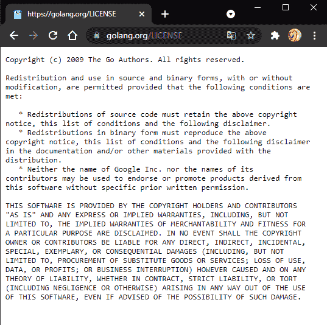

## 可以在哪个操作系统上安装 Go？

Go 是一个可移植的软件，这意味着它不依赖于单一的操作系统。因此，“Go”可以安装在几个操作系统上，如 Windows、Linux、macOS/iOS、Solaris 等。

## 检查系统上是否安装了 Go

建议您检查该软件是否已经安装在您的系统上，因为它将从安装过程中为您节省宝贵的时间和精力。
按照下面给出的说明和相应的图片检查 Go 是否已经安装在您的系统上。

1.  通过在系统的搜索栏中键入“cmd”打开命令提示符。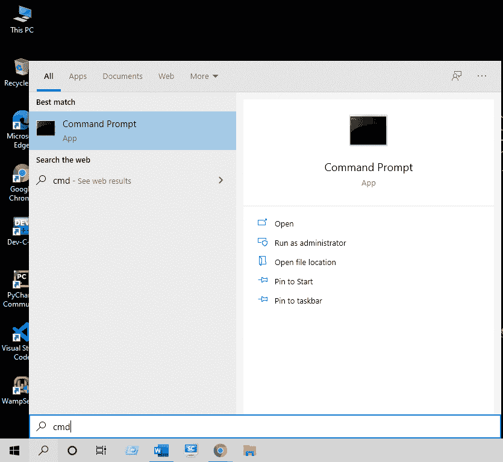
2.  在命令提示符下输入“ **go 版本**，按回车键。
    *   如果你的系统没有安装 Go，那么会显示如下截图所示的消息: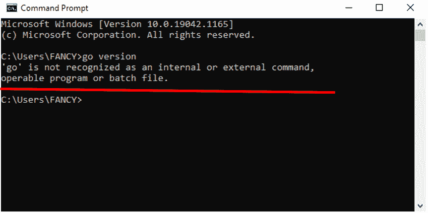
    *   如果你的系统上已经安装了“Go”，那么你系统上当前可用的 Go 版本会显示如下截图所示: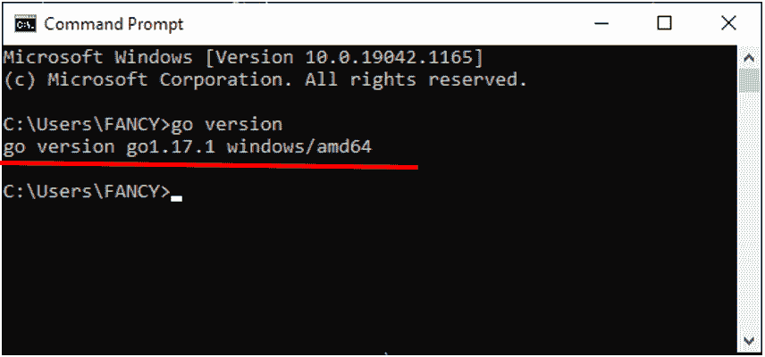

如果您的系统上已经安装了 Go，您可以跳过安装过程，如果您的系统上没有安装 Go，那么让我们开始安装 Go:

## 围棋的安装:

按照下面给出的步骤和相应图片在您的系统中安装 Go:

1.  前往网站[https://golang.org/](https://golang.org/)
2.  点击链接:“**下载开始**”。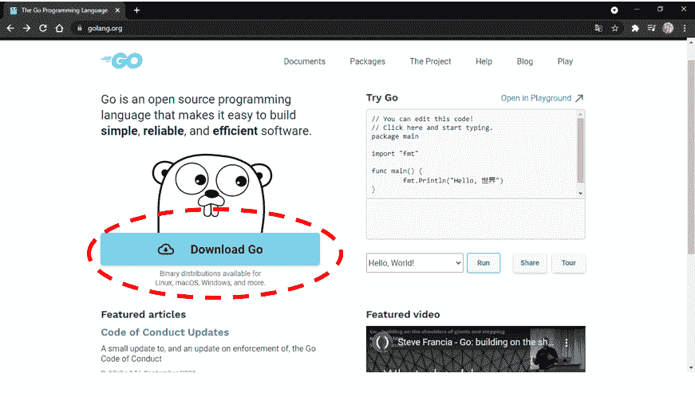
3.  Download the corresponding Go installer for your operating system.

    (针对不同操作系统的 Golang 的其他版本可在同一页面上找到。你也可以下载旧版本的 Golang，但建议使用最新版本)

    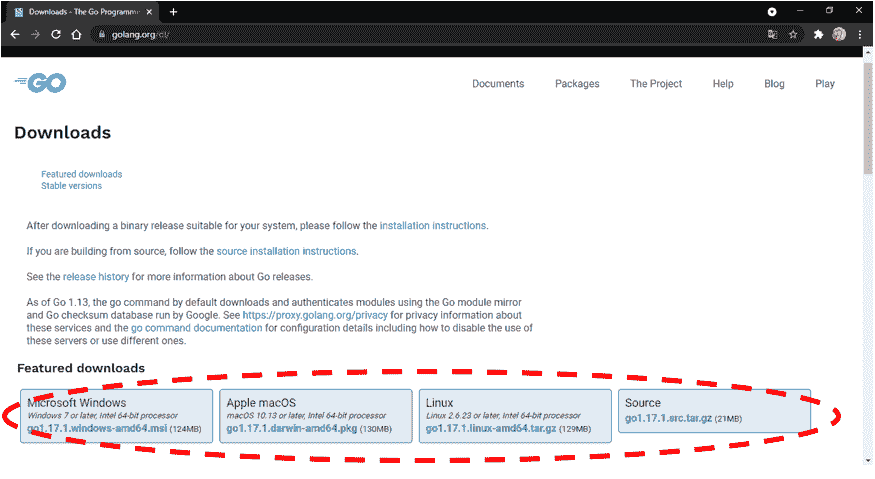
4.  从下载文件夹运行下载的 Go 安装程序。
5.  然后会出现如下所示的对话框，点击**下一步**按钮继续安装过程。
6.  在下一个窗口中，接受最终用户许可协议，然后单击“**下一步**”按钮。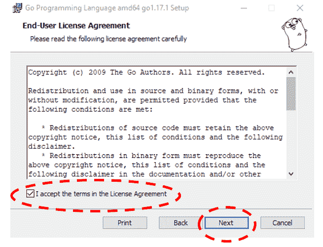
7.  下一步是选择要在系统中安装 Go 的文件夹。
    *   要在默认目标文件夹中继续安装，请单击“**下一步**”按钮。
    *   但是如果你想在另一个文件夹安装 Go，那么点击**更改**……”按钮然后设置位置。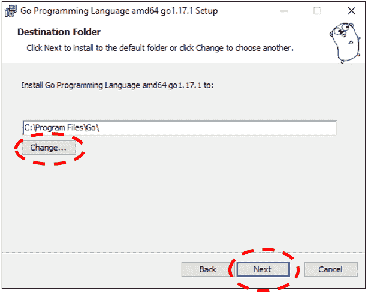
8.  点击**安装**按钮开始安装。
9.  现在安装过程将开始，窗口将显示 Go 安装的当前状态。等待安装完成。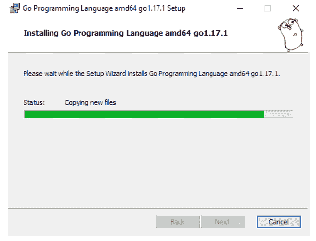
10.  安装完成后，将出现如下所示的窗口，通知您系统中的 Go 安装已成功完成。点击**完成**按钮完成安装。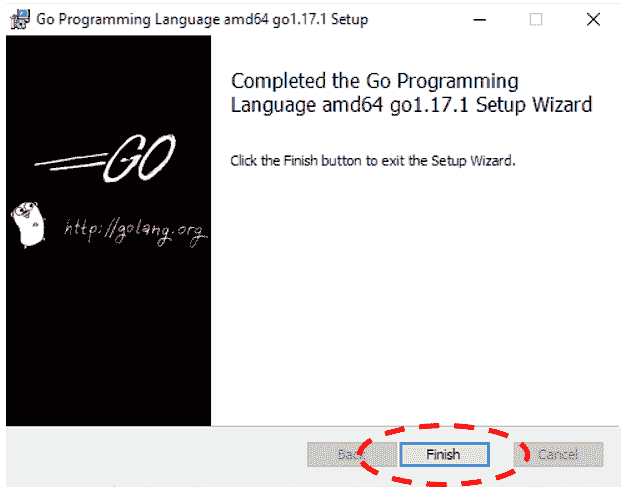
11.  为确保围棋的正确安装，再次打开**命令提示符**，输入以下命令:
    **围棋版本**
12.  如果命令打印了当前安装的 Go 版本，如下图所示，那么 Go 安装成功。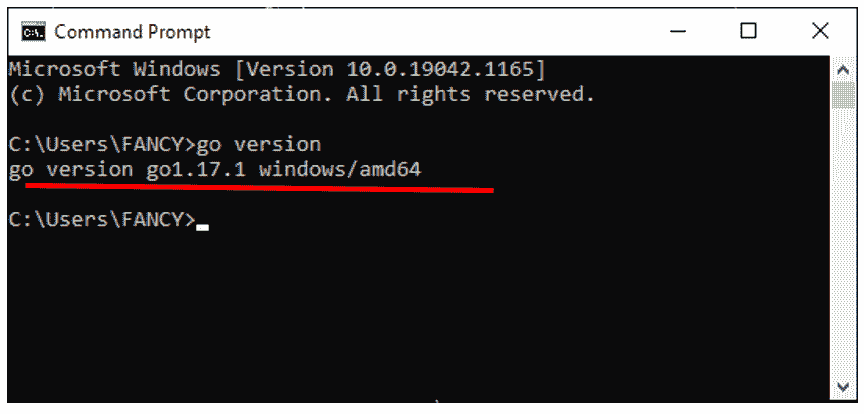

## 使用文本编辑器和命令提示符打印“Hello World”的基本程序:

按照下面给出的步骤和相应的图片创建并执行一个简单的 Go 程序:
我们将使用记事本作为文本编辑器。您也可以使用其他文本编辑器。

1.  首先，让我们为打开的**记事本**创建一个 Go 文件，方法是在系统的搜索栏中键入“记事本”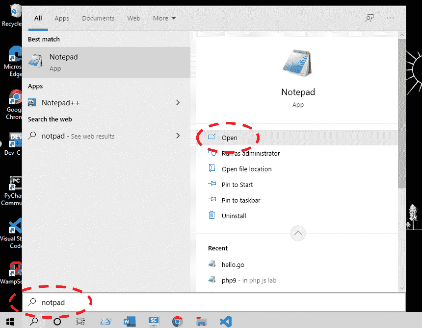
2.  键入或复制以下 Go 命令并粘贴到记事本中。

    ```
     package main  
    import ("fmt")  
    func main(){  
       fmt.Println("Hello, World!")  
    } 

    ```

    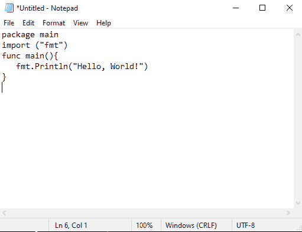
3.  通过按下 **Ctrl + S** 或从**文件**菜单中选择**保存**选项来保存文件。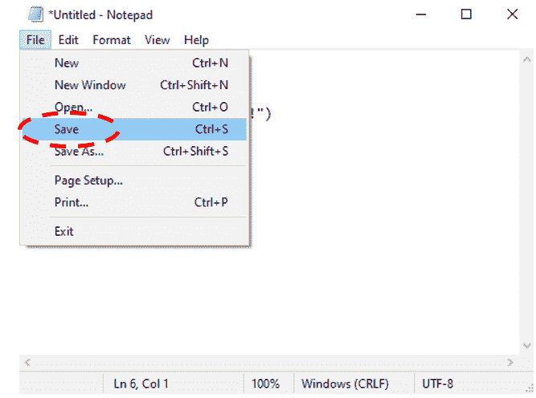
4.  将出现**另存为**窗口。在窗口中，设置保存转到文件的位置，并将文件名键入为 HelloWorld，将扩展名键入为”。GO”。然后将**另存为类型设置为**“所有文件”，如下图截图所示。然后点击**保存**按钮: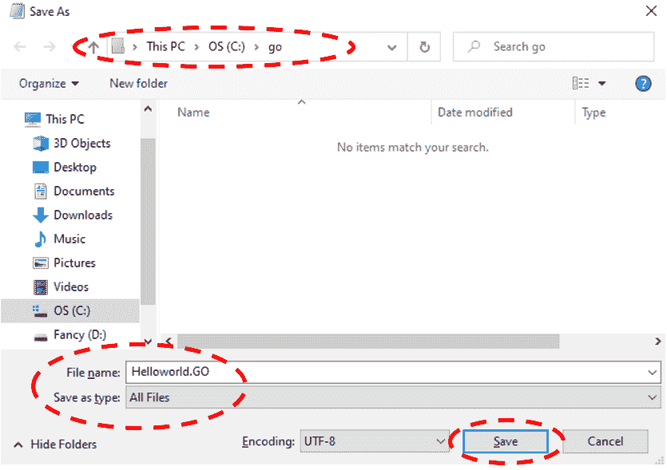
5.  现在通过在搜索栏中键入“ **cmd** ”打开命令提示符。使用“**光盘**”(更改目录)命令打开保存 Go 文件的文件夹。如果你的 Go 文件保存在一个子文件夹中，那么使用“cd”命令打开每个子文件夹，如下图所示: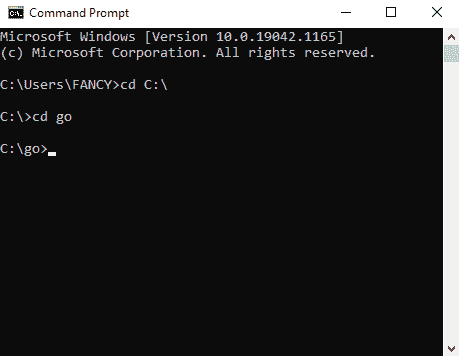
6.  Now type the following command in the Command Prompt and press Enter to run the program.

    **去运行 HelloWorld.go**

    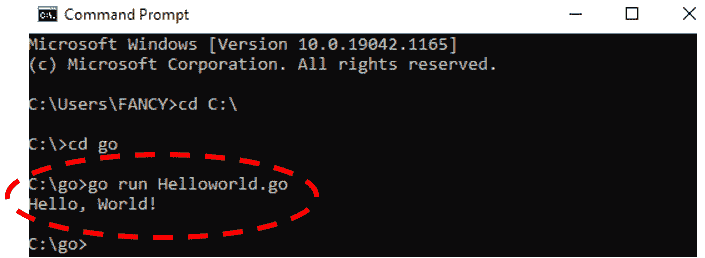
7.  要将同一个程序保存为可执行文件，请键入以下命令并按回车键:**开始构建 HelloWorld.go**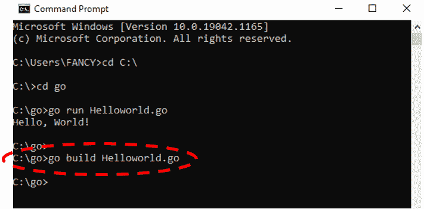
8.  To see the executable file just created, open the folder where the Helloworld (your Go file) file is saved. 

    可以在命令提示符下访问该可执行文件，如下图所示:

    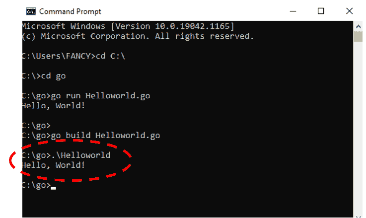