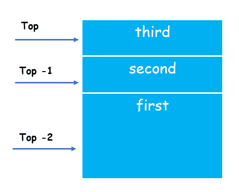

# Golang 延迟

> 原文：<https://learnetutorials.com/golang/defer>

在本教程中，您将学习 Go 编程语言中的延迟语句。从前面的教程中，您学习了其他编程语言中最常见的[控制流语句](../golang/control-flow-statements)，如 [if](../golang/control-flow-statements) 、 [switch](../golang/control-flow-statements) 、 [for loop](../golang/loops-with-examples) 、[for–range loop](../golang/loops-with-examples)。但是**延迟**在 Golang 中并不像其他控制流语句那样常见。

## Golang有什么延迟？

“推迟”这个词的意思是“推迟(一个行动或事件)到以后的时间或推迟”。在 Go 编程语言中，带有 defer 关键字的语句指定某个特定的语句需要推迟或稍后执行，但应该是在退出主循环之前。

*   delay 关键字用于将语句指定为 delay。
*   通常用于 Go 程序中的清理功能。
*   将带有`defer`关键字的语句的执行推迟到调用函数结束
*   返回函数退出前延迟语句的值。
*   这里的 delay 语句可以是函数或表达式。

它被实现为一个堆栈数据结构，除了 delay 关键字函数调用之外，所有函数都以后进先出的方式在堆栈上被调用。只有在返回最后一个函数调用后，才会调用它。

## 迪特如何在Golang工作？

在正常的 Go 应用程序或程序中，控制从我们调用的任何函数的顶部流向底部。通常，函数从第一行开始，一直执行到最后一行。
让我们用一个程序来理解同样的事情。当我们运行下面的代码时，它只是按顺序运行，并将输出打印为“第一”、“第二”、“第三”。

```go
 package main
import "fmt"
func main() {

    fmt.Println("First")
    fmt.Println("Second")
    fmt.Println("Third")

} 

```

**输出:**

```go
 First
Second
Third 
```

`defer keyword`用于区别语句的执行。假设`fmt.Println("Second")`前面放了 defer 关键字，你会注意到第二个会排在第三个之后。

```go
 package main
import "fmt"
func main() {

    fmt.Println("First")
    defer fmt.Println("Second")   //defer keyword
    fmt.Println("Third")

} 

```

**输出:**

```go
 First
Second
Third 
```

defer 关键字执行在函数完成其最终语句之后但在它实际返回之前传递给它的任何函数。所以 main 函数( )的执行方式是打印上面例子“first”中的第一条语句输出。然后在下一条语句中，在函数调用中识别一个 defer 关键字，然后打印最后一条语句“third”。最后，主函数( )退出&检查是否有任何要调用的延迟函数。因为有一个延迟函数，所以继续调用那个函数。

**Note:** Deferring does not move to the end of the main function actually moves it or works after the main function but before the main function returns.

*   延迟关键字按照后进先出或逆序工作。
*   当编译器在函数中遇到 delay 语句时，它会将其推到堆栈数据结构上。
*   遇到的所有延期语句都被推送到堆栈上。
*   当周围函数返回时，堆栈中从上到下开始的所有函数都将在调用函数开始执行之前执行。同样的事情发生在调用函数的时候

## 使用延期语句清理资源

在 Go 编程语言中延迟关键字的主要优势是用于资源清理，如打开文件、处理数据库、网络连接等。一旦在使用某些资源成功完成程序的执行中的程序终止之后，需要关闭每个资源，以避免当一些其他程序正在等待相同的资源时发生资源冲突。
delay 语句通过关闭程序执行过程中打开的所有文件或资源，使 Go 代码无错误。
在Go中，推迟资源清理是常有的事。让我们通过一个例子来了解如何在写入文件时延迟语句。一旦打开一个文件，它需要关闭。

### 写入文件的程序

```go
 package main
import (
    "fmt"
    "log"
    "os"
)

func main() {
    err := writeToFile("Some text")
    if err != nil {
        log.Fatalf(err.Error())
    }
    fmt.Printf("Write to file succesful")
}

func writeToFile(text string) error {
    file, err := os.Open("temp.txt")
    if err != nil {
        return err
    }
    n, err := file.WriteString("Some text")
    if err != nil {
        return err
    }
    fmt.Printf("Number of bytes written: %d", n)
    file.Close()
    return nil
} 

```

上面给出的 Go 代码打开一个文件。功能`writeToFile`打开文件&将一些信息/内容写入文件。完成文件写入后，下一步是关闭文件。写操作期间有可能出现错误。在这种情况下，它将返回一个错误并退出该函数。该函数试图关闭文件，使用的资源被释放回系统。成功完成写入文件后，最终返回一个`nil`值。

对`file.WriteString`的函数调用失败，函数将不关闭文件返回并将资源释放回系统。这个问题可以通过使用 defer 关键字而不是使用`file.Close()`语句来解决。defer 关键字在函数返回之前执行，以避免或修复此类问题。

重写以上代码后看起来像

```go
 package main

import (
    "fmt"
    "log"
    "os"
)

func main() {
    err := writeToFile("Some text")
    if err != nil {
        log.Fatalf(err.Error())
    }
    fmt.Printf("Write to file succesful")
}

func writeToFile(text string) error {
    file, err := os.Open("temp.txt")
    if err != nil {
        return err
    }
    defer file.Close()    //defer statement

    n, err := file.WriteString("Some text")
    if err != nil {
        return err
    }
    fmt.Printf("Number of bytes written: %d", n)
    return nil
} 

```

`defer file.Close ()`打开文件后关闭文件。这将推迟文件的关闭。close()确保文件的关闭是通过写入导致某些错误的同一文件来执行的。

## Golang 中的多个延期关键字

一个 Golang 可以在一个程序中使用多个延期关键字。让我们用下面给出的例子来检查一下，其中执行了三个 delay 语句。堆栈的概念在这里起作用。

*   首先打印第一个 defer 语句。(前 2 名)
*   第二个 defer 语句打印第二个(top-1)
*   第三个 defer 语句打印第三个(顶部)

这些被推到堆栈上。顶部位置保存最后一个打印语句，即第三个。



观察下面代码的输出，它是以相反的顺序打印的，就像它被推到堆栈上一样。延迟的语句以相反的顺序占据上一个语句的上方，导致**后进先出**的方式。

### 具有多个延期关键字的程序

```go
 package main
import "fmt"

func main() {
    defer fmt.Println("First")
    defer fmt.Println("Second")
    defer fmt.Println("Third")
} 

```

**输出:**

```go
 First
Second
Third 
```

## 如何评价延期辩论？

在评估延期语句的过程中评估延期参数。
让我们用一个简单的程序
来理解

```go
 package main
import "fmt"

func main() {
 statement := "Go language in Learn  eTurorials"

 defer fmt.Printf("In defer statement  is: %s\n", statement)
 statement = "Learn  eTurorials"

  } 

```

**输出:**

```go
 In defer statement is: Go language in Learn  eTurorials 
```

在给定的程序中，字符串数据类型的变量`statement`被视为延期语句。用分配给变量语句的值`Go language in Learn eTutorials`来评估延迟语句。defer 语句打印变量`statement`的值。稍后在下一行中，用“`Learn eTutorials`”更改语句变量的值。虽然分配给同一个变量的值发生了变化，但是您可以看到上面代码的输出仅计算 delay 语句变量。