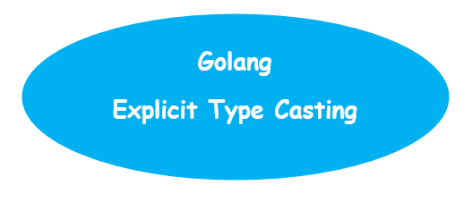
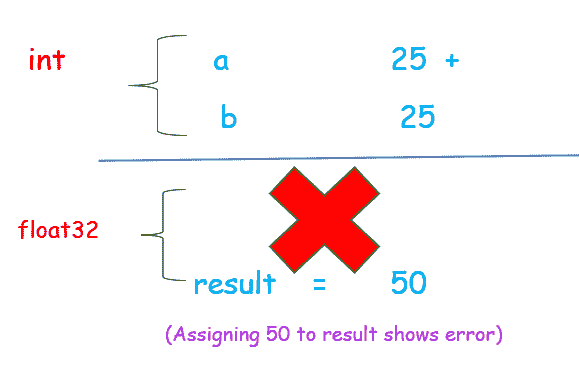

# 格朗的类型铸造

> 原文：<https://learnetutorials.com/golang/type-casting-or-type-convertions>

在本教程中，您将学习 Golang 中的转换类型。Golang 支持不同类型的[数据类型](../golang/data-types)用于字符串、整数、布尔、浮点等变量。不同类型的转换导致不同的结果。

## 格朗的类型铸造是什么？

类型转换或类型转换是将任何定义的数据类型的变量转换为其他数据类型的变量的过程。将数据类型 int 转换为 float (4 到 4.0)、float 转换为 int (4.0 到 4)等示例。
有两种转换类型

1.  隐形的
    *   从一种数据类型到另一种数据类型的自动转换。
    *   数据类型由编译器转换。
    *   也称为类型转换。
2.  明确的
    *   用户手动显式执行数据类型转换。
    *   程序员使用强制转换运算符将数据类型转换为另一种类型。
    *   也称为类型转换。



## 格朗有什么类型转换的需求？

Go 编程语言不支持自动类型转换。考虑执行加法后两个数字的结果，声明为整数数据类型的结果不能存储在声明为浮点类型的变量中。这意味着 Golang 是一种严格类型化的语言，在给变量赋值之前，必须将变量转换为所需的数据类型。

Golang 支持显式类型转换；用户手册需要转换任何变量的类型。

让我们考虑一个例子来理解类型转换的需要。

```
 package main
import "fmt"

func main() {

var a  int = 25
var b int = 25
var result float32
result = a+b
fmt.Println("The result after addition is ", result)

} 

```

**输出:**

```
 _/home/0ax1ZC
./prog.go:10:8: cannot use a + b (type int) as type float32 in assignment 
```

对于上面给出的代码，结果输出显示了一些错误，表明整数类型的 a & b 不能分配给 float32 类型的变量。



让我们看看如何将 int 类型的结果转换为 float，以便将其存储在声明的变量 result 中。代码结果= float32(a)+float32(b)转换为结果输出格式。

例子

```
 package main
import "fmt"

func main() {

    // taking the required data into variables
    var num1 int = 846
    var num2 int = 19
    var sum float32

    // explicit type conversion
    sum = float32(num1) + float32(num2)

    // Displaying the result
    fmt.Printf("Result = %f\n,Type = %T\n", sum,sum)
} 

```

**输出:**

```
 Result = 865.000000
,Type = float32 
```

**注意:** Golang 不支持自动类型转换或隐式类型转换。

## Golang 中类型转换的语法？

下面给出了转换所遵循的基本语法

```
 <varaiable name> := <datatype_name >(value of other type to convert) 
```

**注意:** Go 支持显式类型转换

即类型转换由 java 编译器“自动”执行，而“类型转换”(使用转换操作符)由 java 程序员显式执行。通常分为两类
让我们用一个例子来理解


```
 package main

import (
"fmt"
)

func main() {
var a int = 4 // integer number 4
f := float64(a)
fmt.Println("datatype of int type converted to float type ", f)
fmt.Printf("Type = %T\n",f)

} 

```

**输出:**

```
 datatype of int type converted to float type  4
Type = float64 
```

在上面的例子中，用值 4 声明了一个整数数据类型的变量，使用上面描述的语法将该变量转换为浮点数据类型。