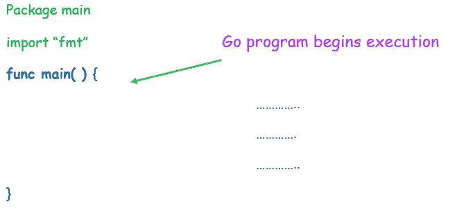
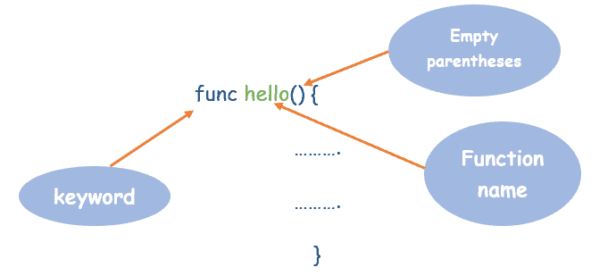
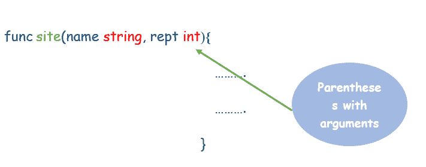
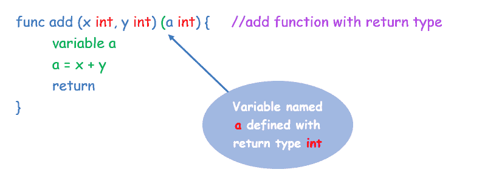

# 在戈朗的作用

> 原文：<https://learnetutorials.com/golang/functions>

在前面的教程中，我们讨论了基本编程，如理解循环或条件语句、声明变量或常数等。在所有用来理解概念的程序中，我们使用了一个函数。函数名为 main，表示为 main()。在本教程中，您将了解函数的类型、如何创建函数及其返回类型等。

## Golang 中有哪些功能？

在 Golang 中，程序的执行从表示为 func main()的主函数开始。



A `function`是组合在一起的一组相似的语句或逻辑语句。考虑一个简单的日常泡茶例子。为了泡茶，你需要遵循一套说明，比如

1.  喝杯水
2.  加入糖和茶叶
3.  加入牛奶
4.  让它煮到茶好了


因此，如果我们将泡茶视为一种功能，将上述步骤视为需要以分组方式执行的语句或指令，则每次都会一起执行所有这些语句。如果在泡茶时加入一些额外的成分，如生姜或豆蔻等，这些陈述(步骤)可能会有一些变化。这些变量可以输入到函数中。我们将在本教程的函数传入部分研究如何传递这些输入和改变流程。

## 如何在 Golang 中声明一个函数？

在 Golang 中声明一个函数，应该使用关键字`func`。

*   关键字 func 后面跟一个函数名，根据访问级别的不同，函数名可以是大写字母(大写)或小写字母(小写)。
*   如果函数名以大写字母作为第一个字符，那么该函数将有一个公共作用域&可以从其他包中访问。
*   在名称之后，有一个括号( )包含了所有需要提供给函数的输入参数，以改变函数的流程。
*   然后开始是一个开放的花括号“{”，结束是一个关闭函数“}”的花括号。

声明函数的语法

```
 func name(parameters){
    body of statements
} 

```

在哪里

*   func 是函数关键字
*   名称是函数名
*   参数是传递给函数的参数，可以是单个或多个具有返回类型的参数，也可以不是。
*   大括号{ }包含调用函数时执行的函数体。

**注意:**需要注意的是，开花括号应该在声明函数名的同一行，不能在另一行。

在 go 语言中，它不像许多其他编程语言那样被允许。让我们看一个简单的程序

```
 package main
import ("fmt")

// main function
func main()  {
  fmt.Println("I am main function ")
} 

```

**输出:**

```
 I am main function 
```

## 如何在 Golang 中调用一个函数？

让我们理解用经典的 hello world 程序调用函数的概念。让我们使用上面解释的语法介绍一个函数 hello，`hello()`。

```
 func hello() {
    fmt.Println("Hello, World!")
} 

```

带空括号的 Golang 函数



我们创建了一个函数 hello()。如果您在 Go 程序中运行此代码，它将不会在程序中执行，因为我们的函数没有完全定义。为了执行和打印或显示输出，我们需要调用程序 main()函数内部的函数。

让我们看看如何调用我们的`main()`功能块中的函数`hello()`。

程序从 main()函数开始执行。main()函数在任何带有 package main 且不接收和返回参数的程序中只出现一次。以下示例显示了在 main()
程序中调用函数 hello()来调用函数的完全可执行代码

```
 package main
import "fmt"

func main() {     //main  function
    hello()       //calling user defined function named hello
}

func hello() {   //created function hello 
    fmt.Println("Hello  World!")
} 

```

**输出:**

```
 Hello, World! 
```

## 如何在 Golang 中调用带参数的函数？

在前一节中，我们讨论了用空括号调用函数。让我们学习如何在定义的函数括号内使用参数。而在括号内定义参数也需要指定其对应的数据类型。
括号内带参数的 Golang 函数



让我们通过下面的示例程序来理解。该程序有一个正在运行的站点()，括号中定义了两个参数。第一个参数是名为 name 的字符串数据类型，第二个参数是名为 rept 的整数类型。当函数`site ("Learn eTutorials", 5)`被调用时，控制转到函数站点，在那里定义在站点函数调用期间要执行的指令集。体内提供的指令是一个`for loop`，循环 5 次名字。

```
 package main
import "fmt"

func main() {
    site("Learn eTutorial", 5)  // calling function with two parameters
}

func site(name string, rept int) {
    for i := 0; i < rept; i++ {
        fmt.Print("\n ",name)
    }
} 

```

**输出:**

```
 Learn eTutorial
 Learn eTutorial
 Learn eTutorial
 Learn eTutorial
 Learn eTutorial 
```

## Golang 中的函数返回类型是什么？

在 Golang 中，函数可以有任何返回类型，任何类型的参数都包含在函数括号中。让我们看看如何声明函数的返回类型。
带有返回类型的语法

```
 func name(parameters) <datatype of return type>{

    body of statements
} 

```

在上面的语法中，`keyword func`定义了一个函数，后面跟一个`function name`，括号中的`arguments or parameters`到目前为止与正常的函数声明类似。在这个语法中，我们提到了一个新的东西，`return type of function `可以是 int，float，我们在基本[数据类型](../golang/data-types)中讨论过的任何数据类型的字符串。


让我们通过一个程序来理解

```
 package main
import "fmt"

func add(x int, y int) int {     //add function

    return x + y
}

func sub(x, y int) int {       //sub function of omit type

    return x - y
}

func main() {

    fmt.Println(add(10, 5))     //calling function add
    fmt.Println(sub(10, 5))    // calling function sub
} 

```

**输出:**

```
 15
 5 
```

**注意:**当函数参数具有相同的数据类型时，其中一个参数可以省略该类型，称为省略类型

在上面的程序中，add()和 sub()是两个函数，有两个整数类型的参数。在 add()中，x 和 y 是整数数据类型的参数，在括号内分别指定为 int x、int y。在 sub()中，两个参数 x 和 y 是

整数类型，但数据类型只指定了一个参数。在这种情况下，如果两个参数具有相同的数据类型，我们可以省略定义任何一个参数数据类型。


可以理解，在这样的定义样式中，不带数据类型的参数与括号中提到的另一个参数具有相似的数据类型。变量 x 的类型被省略。

## Golang 中函数的命名返回变量

在 Golang 中，在函数参数之后，还可以指定函数的返回类型、命名的返回变量。



让我们用一个程序来理解

```
 package main
import "fmt"

func add(x int, y int) (a int) {     //add function with return type variable a
   a = x + y
    return 

}

func sub(x, y int) (b int) {       //sub function of omit type & return variable b
 b = x - y
    return 
}

func main() {
    fmt.Println(add(10, 5))     //calling function add
    fmt.Println(sub(10, 5))    // calling function sub
} 

```

**输出:**

```
 15
 5 
```

上面给出的代码用相应的 add()和 sub()函数声明了整数类型的命名变量 a & b。对应于每个函数的计算存储在变量中，并使用 return 关键字返回值。一旦 main()函数开始执行，就会调用这些函数并显示如上所示的输出。

**注意:**从上面的程序中我们了解到 Golang 支持一个函数中的多个参数。在函数括号内，可以传递多个参数。

## Golang 函数命名约定

*   函数名必须以字母开头，并且可以有任意数量的附加字母和数字。
*   函数名不能以数字开头。
*   函数名中不允许有空格。
*   关键字 func 后面跟一个函数名，根据访问级别的不同，函数名可以是大写字母(大写)或小写字母(小写)。
*   如果函数名以大写字母作为第一个字符，那么该函数将有一个公共作用域&可以从其他包中访问。
*   如果一个名字由多个单词组成，第一个单词之后的每个单词都应该大写，比如:empName、EmpAddress 等。
*   区分大小写(add、Add、ADD 是三个不同的变量)。

## Golang 中的匿名函数是什么？

没有任何命名标识符引用的函数称为匿名函数。匿名函数接受输入并返回输出，类似于标准函数。
程序匿名功能

```
 package main
import "fmt"

var (
   add =func(x int, y int) (a int) {     //add function with return type variable a
  a=x + y
    return 
}
)
func main() { 
    fmt.Println(add(10, 5))     //calling function add

} 

```

**输出:**

```
 15 
```