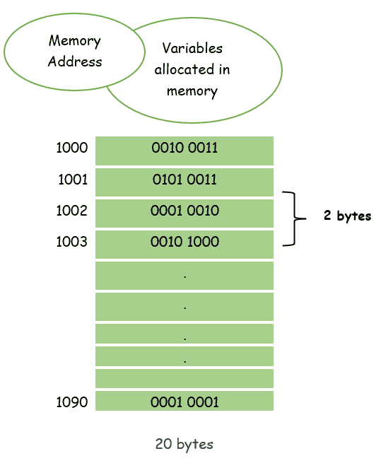
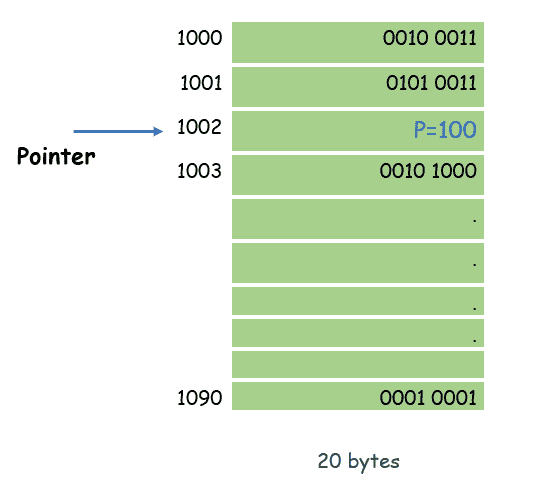
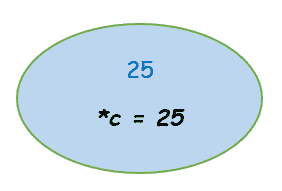
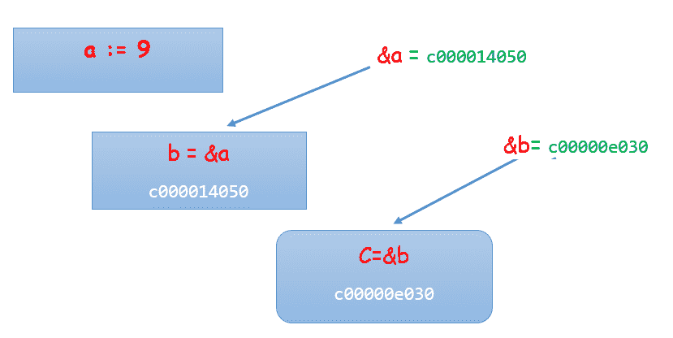

# Golang指针

> 原文：<https://learnetutorials.com/golang/pointers>

在本教程中，我们将学习 Go 编程语言中的指针。在 Golang，用指针编程非常容易。与任何其他语言一样，指针概念很简单:它用于指向需要访问的变量将驻留的内存位置的地址&使用“&”运算符来寻址内存位置。在本教程中，您将学习如何声明和初始化指针。

## Golang的指针是什么？

指针是一种复合数据类型或派生数据类型，用于存储存储在内存位置的任何变量的地址。指针保存或指向另一个变量的内存地址。
指针是一个变量，能够存储它想要指向的对象的初始地址。
让我们简单介绍一下内存地址的概念&变量是如何从内存位置存储和访问的。



考虑一下你的计算机的内存，它能存储 20 字节的信息。每个内存块能够存储一个字节的信息。
我们假设这个内存的起始地址是 1000，结束地址是 1090。假设您想在内存中存储一个整数数据类型的变量。整数将占用 2 个字节的内存，也就是说，它将占用 2 个内存块。
假设取变量“p”存储一个整数。p 存储分配给它的值 100。在这个例子中，假设有一个指针指向存储变量 p 的位置。假设“ptr”是指向变量“p”的基址或初始地址的指针。

*   假设“ptr”指向 1002(初始地址)。
*   这意味着变量 p 以值= 100 存储在该存储单元中。



**注意:**指向表示它只是存储对象的基址或初始地址。我们例子中的对象是“p”

*   指针是一个能够存储一些地址的变量，它指向存储第一个字节的存储位置


让我们看一个简单的程序

```go
 package main
import "fmt"

func main() {
   var a int = 100   
   fmt.Printf("Address of memory location of Variable a : %x\n", &a )
} 

```

**输出:**

```go
 Address of memory location of Variable a : c000014050 
```

程序显示存储变量 a 的内存地址，即存储变量的内存位置 c000014050。

**注意:**指针是一个特殊变量，不是存储整数、字符和浮点数的普通变量。它将存储变量的地址或基址

## Golang 什么时候用指针？

指针在以下情况下使用

*   需要传递大量数据
*   需要改变存储在任何存储位置的数据的值。
*   它们用于访问、分配或修改存储的数据。

## 如何在 Golang 中声明指针？

声明指针的语法

```go
 var <variable_name> *<variable_Type> 

```

其中
var:-关键字声明一个[变量](../golang/variables)
变量 _name:-声明的指针变量的名称。
变量类型:-变量
的数据类型*是用于声明指针变量的星号。

```go
 var  a *int        /* pointer to an integer variable */
var c *float32    /* pointer to a float variable */ 

```

**注意:** -在声明过程中，指针的初始值为零，即默认情况下指针的值设置为零。

```go
 package main
import "fmt"

func main() {
   var a int= 100   /* actual variable declaration */
   var Ptr *int        /* pointer variable declaration */

   Ptr = &a  /* store address of a in pointer variable*/

   fmt.Printf("Address of sampleVariable a value: %x\n", &a  )

   /* address stored in pointer variable */
   fmt.Printf("Address stored in Pointr variable: %x\n", Ptr )

   /* access the value using the pointer */
   fmt.Printf("Value of *Pointr variable: %d\n", *Ptr )
} 

```

**输出:**

```go
 Address of sampleVariable a value: c000014050
Address stored in Pointr variable: c000014050
Value of *Pointr variable: 100 
```

说明

*   指针变量是按照上面的语法声明的。
*   然后使用“&”将变量 a 的存储地址存储在指针 ptr 中。
*   从可用地址访问该值
*   一元运算符*返回位于指定地址的变量值。


## 如何在 Golang 中初始化指针？

指针可以通过两种方式初始化

1.  使用操作员`new`
2.  使用运算符`ambersand ‘&’`

### 显示新操作员的程序

```go
 package main
import "fmt"

func main() {
   c := new(int) // new operator
  *c = 25
  fmt.Println("Return the value stored in c \n" ,*c) //Output will be 25
  fmt.Println("Return the address of c in memory \n", &c)

} 

```

**输出:**

```go
 Return the value stored in c 
 25
Return the address of c in memory 
 0xc00000e030 
```

### 显示& operator 的程序

```go
 package main
import "fmt"

func main() {
    //Declare a pointer
    var b *int
    a := 9
    b = &a
    fmt.Println("return the address of a ",b)
    fmt.Println("return the value stored in a",*b)
    } 

```

**输出:**

```go
 return the address of a  0xc000014050
return the value stored in a 9 
```

| 新操作员 | &操作员 |
| **c:= new(int)****** c = 25***

*   使用新运算符初始化
*   *获取存储在该地址的值

 | **var b * int****a:= 9****【b =&a**

*   指针被声明
*   变量 a 的赋值为 9
*   指针变量 b 存储 a 的地址

 |

**注:**

*   *运算符用于取消引用指针。
*   返回指针引用的值。

## Golang的零分是什么？

指针一旦被声明，它的默认值就是零。让我们看一个例子

```go
 package main
import "fmt"

func main() {
   var  Ptr *int  //pointer declaration
   fmt.Printf("The default Pointr value is nil : %x\n", Ptr  ) //nil value ie 0
} 

```

**输出:**

```go
 The default Pointr value is nil : 0 
```

## Golang 中的解引用指针是什么？

*   *运算符用于取消引用指针。
*   返回指针引用的值。
*   它用于修改指针位置值。

在下面给出的程序中，声明了一个指针变量 b。这进一步被分配了变量 a 的地址，一个操作将变量 a 的地址复制到 b，在下面的例子中，b 在 a.ie 9 中打印或获取值。
接下来，我们用值 3 修改了 b。所以 b 的内存位置用新值更新。b (9)的旧值被修改为最新声明的值(3)。
查看下面的程序，了解相同的内容。

### 程序来理解指针的解引用？

```go
 package main
import "fmt"

func main() {
    //Declare a pointer
    var b *int
    a := 9
    b = &a
     fmt.Println(a)  // prints value of a
    fmt.Println(*b)  // * operator dereference prints value in b = 9
    *b = 3
 fmt.Println(a)  //modified value in b with 3 b= 3
 fmt.Println(*b) // prints b = 3
    } 

```

**输出:**

```go
 9
9
3
3 
```

## 指向 Golang 中指针引用的指针？

在 Golang 中，可以创建指向指针的指针，

`a := 9`
`b = &a`
`c= &b`

b 和 c 是指针变量，b 保存 a 的地址，指针变量 c 保存 b 的地址，b 实际存储变量“a”的地址，赋值为 9。在上面的代码中，c 是一个指向指针的指针。



### 指针指向指针的程序

```go
 package main
import "fmt"

func main() {
 a := 9
 b := &a
 c := &b

 fmt.Printf("Value of a: %d\n", a)
 fmt.Printf("address of a in b: %x\n", b)
 fmt.Printf("pointer to pointer reference in c: %x\n", c)

 fmt.Println()
 fmt.Printf("value in variable a: %d\n", a)
 fmt.Printf("*&a: %d\n", *&a) //value in variable a
 fmt.Printf("*b: %d\n", *b)//value in variable a
 fmt.Printf("**c: %d\n", **c)//value in variable a

 fmt.Println()
 fmt.Printf("displays address of a given &a: %d\n", &a)
 fmt.Printf("b: %d\n", b)//displays address of a
 fmt.Printf("&*b: %d\n", &*b)//displays address of a
 fmt.Printf("*&b: %d\n", *&b)//displays address of a
 fmt.Printf("*c: %d\n", *c)//displays address of a

 fmt.Println()
 fmt.Printf("b: %d\n", &b)
 fmt.Printf("*c: %d\n", c)
 } 

```

**输出:**

```go
 Value of a: 9
address of a in b: c000014050
pointer to pointer reference in c: c00000e030

value in variable a: 9
*&a: 9
*b: 9
**c: 9

displays address of a given &a: 824633802832
b: 824633802832
&*b: 824633802832
*&b: 824633802832
*c: 824633802832

b: 824633778224
*c: 824633778224 
```

从给定的程序中可以清楚地看到，一些操作符产生相同的输出，或者用于等同于其他一些相同的操作。

为了显示变量 a 中的值，a 被赋值为 9。下面给出的符号相当于产生相同的输出。

*   a
*   *&a
*   *b
*   **c

同样，相当于保存 a 地址的变量 b 的显示值的符号是

*   &a
*   b
*   &*b
*   *&b
*   *c

同样，与保存 a 地址的变量 c 的显示值等效的符号是

*   b
*   *c