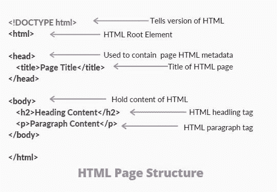

# 超文本标记语言简介

> 原文：<https://learnetutorials.com/html/tutorials-for-beginners>

在这个 HTML 教程中，你将了解 **HTML，HTML 页面的结构，HTML 的历史，HTML 的版本，HTML 的特性**。

## 什么是 HTML？

超文本标记语言是超文本标记语言的缩写。HTML 是万维网的基本构件。超文本是呈现在计算机或其他电子设备上的文本，其中包含对用户可以立即访问的其他文本的引用，通常只需点击鼠标或按键。除了文本，超文本可以包括表格、列表、表格、图像和其他表示元素。这是一种通过互联网共享信息的简单且适应性强的格式。标记语言使用多组标记来表征文档中的文本元素，为网络浏览器提供文档应该如何显示的说明。HTML 是蒂姆·伯纳斯·李在 1990 年创建的。他也被称为“网络之父”万维网联盟(W3C)在 1996 年接管了维护 HTML 规范的责任。HTML 也在 2000 年被确认为国际标准。HTML5 是 HTML 的最新版本。HTML5 允许更快、更健壮的网络开发。

让我们只讨论什么是超文本标记语言和网页。

**超文本**是“文本中的文本”的缩写超文本是有链接的文本。当你点击一个链接，把你带到一个新的网页，你已经使用了超文本。**超文本**是一种连接两个或多个网页(HTML 文档)的方法。

标记语言是一种用于将样式和格式原则应用于文本文档的计算机语言。标记语言增强了文本的交互性和动态性。它可以将文本转换成图形、表格、链接等。

一个**网页**是一个典型的用 HTML 制作然后由网络浏览器翻译的文档。网址可以用来定位网页。静态或动态网页都可以存在。静态网页可以完全用 HTML 创建。

## 网页结构

**<！DOCTYPE >** :要么定义文档类型，要么指示浏览器 HTML 版本。

**< html >** :是 html 文档的根标签。此元素通知浏览器文档是 HTML。HTML 标签之间的文本解释了网页。除了<！DOCTYPE >，是所有其他 HTML 组件的容器。

**<头>** :应该是< html >元素内的第一个元素，应该包含元数据(关于文档的信息)。在打开人体标签之前，它必须关闭。

**<标题>** :顾名思义就是用来把那个 HTML 页面的标题放在浏览器窗口的顶部。它必须被插入标题标签中并立即关闭。这是一个可选元素。

**<正文>** :正文标签之间的文本描述了页面对最终用户可见的正文内容。这个元素包括 HTML 文档的主要内容。

**< h1 >** :一个网页的第一级标题是 HTML 的 desHistory
上世纪 80 年代末，在欧洲核子研究中心做承包商的物理学家蒂姆·伯纳斯·李为欧洲核子研究中心的研究人员设计了一个系统。他在 1989 年的一份备忘录中提出了一个基于互联网的超文本系统。蒂姆·伯纳斯·李被广泛认为是“HTML 之父”蒂姆在 1991 年末提出了一个名为“HTML 标签”的文本，作为对 HTML 的第一个可用的解释。HTML5 是 HTML 的最新形式，我们将在本课程的后面部分看到。

## HTML 的版本都有哪些？

自从 HTML 推出以来，市场上出现了好几个 HTML 版本；下面将简要介绍每个 HTML 版本:

**HTML 1.0**:HTML 最早的版本是 1.0，1991 年推出。这个版本的 HTML 语言只包含基本的或必要的元素。

**HTML 2.0** :这是 HTML 的下一个版本，1995 年推出，是网站设计的标准语言版本。HTML 2.0 可以允许更多的功能，如基于表单的文件上传、文本框、选择按钮等表单组件。

**HTML 3.2** :万维网联盟(W3C)在 1997 年初发布了 HTML 3.2。该版本支持创建表格，并为表单组件引入了更多选项。它还可以处理包含复杂数学方程的网页。直到 1997 年 1 月，它还是任何浏览器的官方标准。现在只有大多数浏览器实际支持它。

**HTML 4.01**:1999 年末 HTML 4.01 推出，是 HTML 语言最稳定的版本。这是当前的官方标准，它包括对级联样式表(CSS)的支持和对不同多媒体组件的脚本编写。

**HTML5** : HTML5 是超文本标记语言(HTML)的最新版本。2008 年 1 月，这个版本的第一版发布。W3C(万维网联盟)和 WHATWG(网络超文本应用技术工作组)是参与创建 HTML 5 版本的两个主要组织，该版本仍在开发过程中。

## HTML 有什么特点？

*   HTML 是一种非常简单直接的语言。理解和修改很简单。
*   因为 HTML 包含各种格式元素，所以创建有效的演示非常简单。
*   因为 HTML 是一种标记语言，所以除了文本之外，它还允许创建灵活的网页。
*   HTML 允许程序员提供到网页的链接(通过 HTML 锚标签)，这提高了用户的浏览兴趣。
*   HTML 是独立于平台的，因为它可以在任何平台上显示，包括 Windows、Linux 和 Macintosh。
*   HTML 允许程序员向网站添加图形、视频和声音，使它们更具吸引力和吸引力。
*   因为 HTML 是一种不区分大小写的语言，所以我们可以同时使用小写和大写的标签。