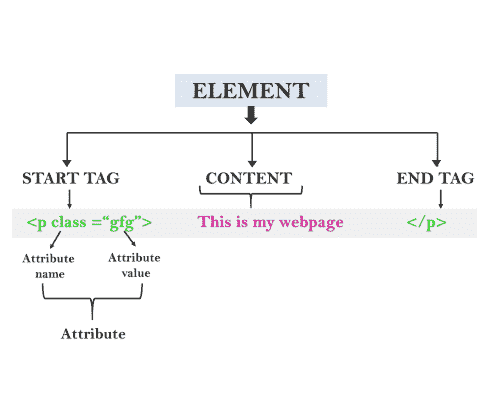

# HTML 构建块

> 原文：<https://learnetutorials.com/html/building-blocks>

在本教程中，我们将讨论 HTML 文档的基础和 HTML 的构建块。

## HTML 的构造块是什么？

HTML 是以 HTML 元素的形式编写的，这些元素是通过使用标记标签形成的。这些标记元素是 HTML 的一个关键特性。每一个标记标签，比如 **< html >、< head >、< body >、< title >、< p >** 等等，都是由一个用尖括号括起来的关键词组成的。HTML 标签通常成对使用，例如 **< html >** 和 *< /html >* 。一对标签中的第一个标签通常被称为开始标签(或开始标签)，而第二个标签被称为结束标签(或结束标签)。开始标记和结束标记是相同的，除了结束标记的左尖括号后面的斜杠(/)向浏览器指示命令已经执行。您可以将相关材料放在开始和结束标签之间。

```html
 <tag name  attribute_name= " attr_value"> content </ tag name> 

```

*   **标签**:一个 HTML 标签包围着素材，赋予它意义。用“<”和“>”括号括起来。
*   **属性**:在 HTML 中，属性给出了关于元素的附加信息，并在开始标记中使用。一个 HTML 属性由两个字段组成:名称和值。
*   **元素**:HTML 元素是 HTML 文件的独立组成部分。在一个 HTML 文件中的标签内写的所有东西都被称为一个 HTML 元素。

