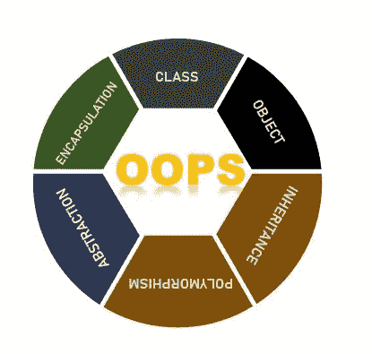
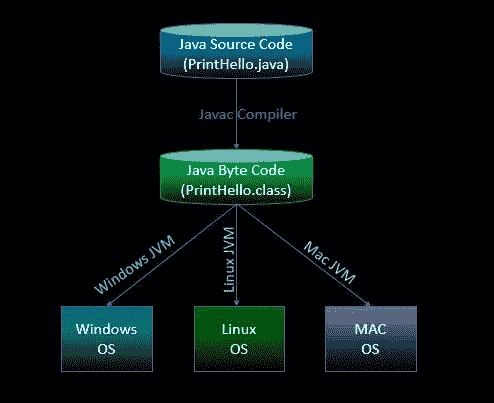

# Java 编程语言简介

> 原文：<https://learnetutorials.com/java/introduction>

Java 是一种强大的面向对象编程语言，由加拿大著名计算机科学家詹姆斯·阿鲁瑟·高斯林于 1995 年在太阳微系统公司与他的同事迈克·谢里丹和帕特里克·诺顿一起开发。高斯林最著名的是“T2”Java 编程语言之父“T3”，他也因对快节奏技术世界的不可思议的创造而被誉为“T4”Dr.Java“T5”。小鹅在设计这种独立于平台的编程语言时，对**只写一次，随处运行**原则有着清晰的认识，这种语言甚至在今天也很突出。

## Java 的历史

在开始使用 java 之前，让我们回到产生这种强大而健壮的编程语言 JAVA 的时代。作为 1991 年一个研究项目的一部分，Java 语言的种子最初被种植在孙的微软首席架构师詹姆斯·阿鲁瑟·高斯林的脑海中。高斯林和他的同事们开始致力于为广泛的网络设备和嵌入式系统开发先进的软件。

在最初阶段，选择的语言是 C++，随着时间的推移，他们意识到 C++在设计和实现上的困难，后来需要一个专属的编程语言平台。因此，Java 编程平台是通过采用各种其他编程语言的设计和架构计划草图来设计的。

首先，这种编程语言被命名为 OAK，以高斯林办公室附近的那棵树命名。但遗憾的是，由于一些版权问题，他们被迫改名。格林、西尔克、脱氧核糖核酸、WRL 等几个名字都在他们的名单上，最终，他们决定给他们的新语言起一个新鲜而温暖的名字，那就是爪哇，一种印度尼西亚咖啡的名字。

## Java 特性/ Java 流行语

Java 的创造者设计了这种美丽的语言，其中包含了一些可区分的特性，这使得这种语言即使在今天也是生动和兼容的。他们的设计目标是开发一种简单、可移植但安全、健壮的技术，在分布式网络的多个平台上有望实现高性能。塑造这种强大语言的独特特征被称为 Java **流行语**。

那么，Java 编程的主要特点是什么？

1.  **Simple **

    Java 编程语言的首要设计目标是语言的简单性。这种语言的设计方式使得任何人都可以快速掌握基本的编程知识，即使是绝对的初学者也可以开始编写代码。

2.  **Object-oriented**

    java 编程语言中包含的另一个重要特性是面向对象编程的概念——从这个意义上说，Java 中的每一件事都是一个集成了数据和行为的对象。Java 的编程系统已经接受了 OOPS 概念，以便在这种快节奏和复杂的基于网络的环境中有效运行。哎呀，概念在下图中是可视化的。

    
3.  **Familiar**

    熟悉的意思是非常熟悉。是的，Java 编程语言对 C 和 C++很熟悉，看起来可能和 C 和 C++很相似。这是因为 java 的风格和语法是从那些语言中借来的，抛弃了所有的复杂性和怀疑的概念。熟悉 C、C++和相关语言的程序员可以毫不费力地迁移到 Java 平台，学习曲线非常短。

4.  **Robust**

    从这个意义上说，Java 是健壮的:

    *   Java 在编译时和运行时仔细检查代码，以消除错误，从而提供容易出错的代码。
    *   Java 能够通过利用垃圾收集器来紧密而有效地管理内存，垃圾收集器定位未使用的对象并删除它们以保护内存中的空间。
    *   借助名为**异常处理**的机制，Java 在处理异常方面也很有效。
    *   Java 也没有显式指针。
5.  **Secure**

    Java 是一种安全的编程语言，因为它的设计方式使得它可以在分布式环境中运行，而不用担心受到入侵者或不可信方的攻击。

    让 Java 成为最安全语言的是编译后开发的字节码。字节码接近机器语言，人类无法读取。因此被任何第三方修改的可能性微乎其微。

    此外，java 程序总是在沙箱(JRE)中运行，与操作系统没有或只有很少的互连，从而防止不可信来源的入侵，因此被广泛用于开发无病毒和无脾气的应用程序。

6.  **Architecture Neutral **

    为了在异构网络环境中部署基于 java 的应用程序，设计了 Java 字节码——一种体系结构中立的中间格式。从图中，很明显 java 源代码被 java 编译器转换成了 Java 字节码。该中间代码可以有效地传输到各种硬件和软件平台。

7.  **Portable**

    Java 技术的另一个明显与架构中立性相关的突出特征是可移植性(平台无关性)，这意味着在一个平台上编写的程序或代码可以在另一个平台上轻松运行，而无需任何更改(或最小的更改)。

    结合了体系结构中立性和可移植性的重要组件是 JVM(Java 虚拟机)。顾名思义，它就像一个虚拟平台，为特定的硬件和软件平台执行特定的实现。参考建筑中性中给出的图表。

8.  **High Performance** 

    Java 技术具有很高的性能。总是通过促进一种策略来保证高性能，通过这种策略，解释器可以全速运行，而不用麻烦运行时环境检查。自动垃圾收集器保证了内存在需要时的可用性，从而加快了性能的提升。

9.  **Interpreted**

    编译器的参与使得 java 成为一种编译语言，在这种语言中，java 源代码被转换成某种称为字节码的机器指令。类似地，JVM 作为解释器的介入使 java 成为一种解释语言。JVM 获取字节代码并在真实的计算机上执行。

10.  **Multithreaded**  

    多线程是 Java 语言的一个重要特性。它只是意味着一次做多件事。多线程 java 应用程序可以同时运行两个或多个线程，从而实现 CPU 的最大利用率和终端用户的高度交互。

11.  **Dynamic** 

    据说 Java 语言是动态的，在某种程度上，尽管编译器毫不妥协地坚持其静态类型检查，但该语言及其运行时系统在链接阶段是动态的。更具体地说，运行时发生的任何事情都被称为是动态的，在 Java 中，人们可以通过网络链接和加载类、代码模块，甚至交互式可执行代码。

## 从 C & C++中丢弃的特性

为了实现 Java 编程语言的简单性，设计人员删除了许多导致冗余和不确定性的特性。下面列出了从 C 和 C++中提取的一些不明确的特性:

Java 有:

*   没有预处理器，没有 typedef，也没有
*   没有复杂的数据类型，如结构、联合和枚举
*   没有指针数据类型
*   无功能
*   没有多重继承
*   没有运算符重载
*   没有转到语句
*   无自动强制

## Java 应用程序:

java 令人难以置信的令人印象深刻的特性使 java 成为“所有编程语言之王”，在技术的各个方面都非常受欢迎，无论是在桌面应用程序、网络开发还是大数据分析方面。Java 自推出以来，一直被选为高级编程语言。下面列出了 10 个运行在 java 上的顶级应用程序及其真实例子。

| SL NO | Java 应用程序 | 例子 |
| one | 桌面图形用户界面应用程序 | Acrobat Reader，ThinkFree |
| Two | 移动应用 | 网飞，谷歌地球，优步 |
| three | 基于网络的应用 | 亚马逊，阔叶 |
| four | 嵌入式系统 | Sim 卡，蓝光光盘播放器 |
| five | 应用服务器 | WebSphere，WebLogic |
| six | 网络服务器 | Apache Tomcat，Rimfax 网络服务器 |
| seven | 企业应用程序 | ERP、CRM |
| eight | 科学应用 | 矩阵实验室 |
| nine | 大数据应用 | Hadoop、Apache HBase |
| Ten | 软件工具 | eclipse，netbeans |

java 并不局限于某个特定的领域，它在各个方面都有自己的基础，因此依赖 Java 的应用程序数不胜数。所以毫无疑问，我们可以说，JAVA 编程语言是每个人的最佳选择，无论是绝对的初学者还是专业人士。