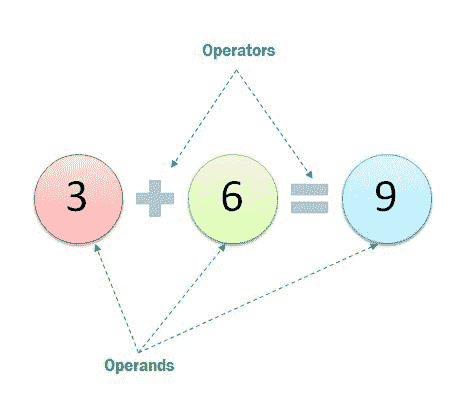
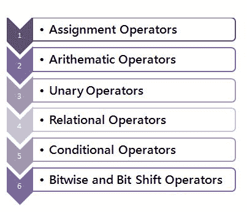
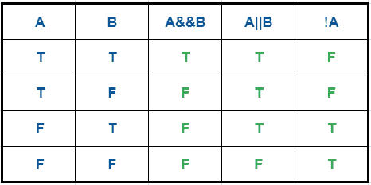
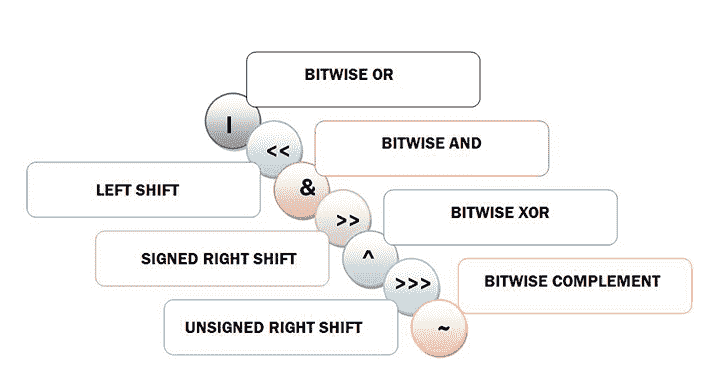
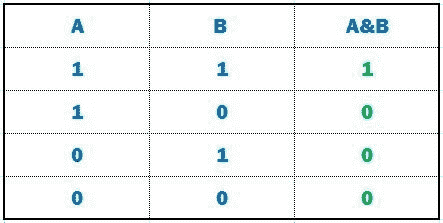
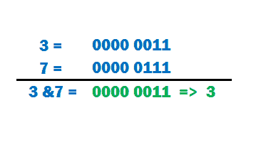
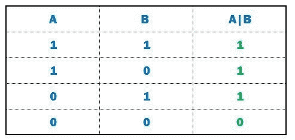
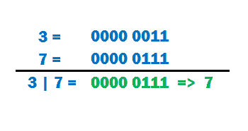

# Java 中的运算符

> 原文：<https://learnetutorials.com/java/operators-and-types>

在本教程中，您将借助简单易行的示例，浏览 Java 中用于处理逻辑、算术等计算的各种运算符。

## 什么是运营商？

运算符是执行某种计算的唯一符号。运算符作用的对象或值称为操作数，运算符和操作数的组合称为表达式。例如，3+6=9 是以 3、6 和 9 作为操作数的表达式，而+和=是运算符。



## 运营商的分类

根据操作的类型，java 操作符分为 6 个主要类别



## Java 算术运算符

java 中的算术运算符用于对变量和数据进行加法、减法、乘法等计算。下面列出了与算术计算相关的常用运算符，以便于参考。

| **操作员** | **表示** | **描述** | **例** |
| + | 添加 | 将两个操作数相加 | 10+2=12 |
| - | 减法 | 从左操作数中减去右操作数 | 10-2=8 |
| * | 增加 | 将两个操作数相乘 | 10*2=20 |
| / | 分开 | 将左操作数除以右操作数 | 10/2=5 |
| % | 系数 | 除法后的余数 | 10%2=0 |

### 示例:算术运算符

```
 public class OpEx {

 public static void main(String[] args) {

  //declaring integer variables
  int a =10, b= 2;

  // + operator for addition
   System.out.println("a + b = " + (a + b));

  //  - operator for subtraction
   System.out.println("a - b = " + (a - b));

  // * operator for multiplication
   System.out.println("a * b = " + (a * b));

  // / operator for division
   System.out.println("a / b = " + (a / b));

  // % operator for division to obtain remainder
  System.out.println("a % b = " + (a % b));
 }

} 

```

**输出:**

```
 a + b = 12
a - b = 8
a * b = 20
a / b = 5
a % b = 0 
```

## Java 关系运算符

关系运算符确实会比较 LHS 和 RHS 上提供的数据，以给出二进制输出，即真或假。下面是使用两个操作数 6 和 9 演示的六个运算符。

| 操作员 | 意义 | 描述 | 例子 |
| == | 等于 | 如果两个操作数相等，则返回真 | 6==9 **返回假** |
| ！= | 不等于 | 如果两个操作数不相等，则返回真 | 6!=9 **返回真** |
| > | 大于 | 如果左操作数大于右操作数，则返回真 | 6>9 **返回假** |
| < | 不到 | 如果左操作数小于右操作数，则返回真 | 6 <9 **返回真** |
| >= | 大于或等于 | 如果左操作数大于或等于右操作数，则返回真 | 6>=9 **返回假** |
| <= | 小于或等于 | 如果左操作数小于或等于右操作数，则返回真 | 6 <=9 **返回真** |

### 示例:关系运算符

```
 public class OpEx {

    public static void main(String[] args) {

        // declaring variables
        int a = 6, b = 9;

        // value of a and b
        System.out.println("a = " + a + " and b = " + b);

        // == operator
        System.out.println(a == b); // 6 == 9 returns false

        // != operator
        System.out.println(a != b); // 6 != 9 returns true

        // > operator
        System.out.println(a > b); // 6 > 9 returns false

        // < operator
        System.out.println(a < b); // 6 < 9 returns true

        // >= operator
        System.out.println(a >= b); // 6 >= 9 returns false

        // <= operator
        System.out.println(a <= b); // 6 <= 9 returns true
    }
} 

```

## Java 逻辑运算符

逻辑运算符执行二进制运算以在机器级别处理数据(逻辑门，如与、或、或非、与非等)。).以下是 java 中三种基本逻辑运算符的描述，它们被广泛用于决策制定。

| **操作员** | **表示** | **描述** | **例** |
| && | 逻辑与/合取 | 当且仅当两个语句都为真时，返回真 | (2<3) &&(3==3)返回真 |
| &#124;&#124; | 逻辑或/析取 | 如果任一语句为真，则返回真 | (2>3) &#124;&#124;(3==3)返回真 |
| ！ | 逻辑非/否定 | 如果操作数是否定的，则返回真 | ！(3==3)返回假 |

逻辑运算符的真值表如下所示:



检查下面的例子来理解逻辑运算符的原理。

### 示例:逻辑运算符

```
 public class OpEx {

    public static void main(String[] args) {

        // && operator
        System.out.println((2 > 3) && (3 == 3)); // false

        // || operator
        System.out.println((2 > 3) || (3 == 3)); // true

        // ! operator
        System.out.println(!(3 == 3)); // false

    }
} 

```

## Java 一元运算符

一元运算符是仅使用一个操作数的运算符。在上一节中，您已经看到了用于否定(！)只作用于一个操作数。类似地，以下是 java 中使用的不同类型的一元运算符。

| 操作员 | 意义 | 描述 | 例子 |
| + | 一元加号 | 表示正数 | +3 |
| - | 一元减操作 | 否定表达式 | -3 |
| ++ | 增量运算符 | 将该值增加 1 | ++4 = 4+1 |
| - | 递减运算符 | 将该值减 1 | --4 = 4-1 |
| ！ | 逻辑补码运算符 | 反转布尔值的值 | ！T = F |

### 示例:一元运算符

```
 Example: Unary Operator

public class OpEx {

 public static void main(String[] args) {

  int status = +1;
        System.out.println(status); // status is now 1

        status--;
        System.out.println(status); // After decrement status is now 0

        status++;
        System.out.println(status);  // after increment status is now 1

        status = -status;
        System.out.println(status);  // result is now -1

        boolean flag = false;
        System.out.println(flag);   // false 
        System.out.println(!flag); // true

  }
 } 

```

## Java 按位移位运算符

这些是最基本和最基本的运算符类型。顾名思义，按位运算符处理位级数据。具体来说，按位运算符在其位级别对整数数据执行运算。

按位运算符有 7 种类型:-



### 按位“与”运算符

第一个运算符“`&`”(按位“与”)是“与”类型，如果两个操作数中都有该位，它会将任意位复制到结果中。更具体地说，位的存在用二进制`1`表示，对应位用二进制`0`表示。这是一个真值表，显示了按位“与”运算符的使用，它与逻辑运算符非常相似。



例如 **3** 的二进制表示为 **0000 0011** ，而 **7** 的二进制表示为 **0000 0111** 。看看 **3 & 7** 会有什么结果:



现在让我们看看如何在 java 中使用 Bitwise AND 运算符:

### 示例:与运算符

```
 public class BAndEx {
    public static void main(String[] args) {
        int x = 3, y = 7;
        System.out.println("x & y = " + (x & y)); // prints 3
    }
} 

```

### 按位或运算符

符号为“1”的按位“或”用作逻辑“或”运算符。它复制一个位(1)，如果它存在于一个或两个操作数中。真值表演示了按位或运算符的工作原理。



让我们试着理解按位“或”运算符如何处理两个二进制数 3 和 7。



下面 java 程序展示了 Bitwise OR 运算符的操作。

### 示例:或运算符

```
 public class BOREx {
    public static void main(String[] args) {
        int x = 3, y = 7;
        System.out.println("x | y = " + (x | y)); // prints 7 
    }
} 

```