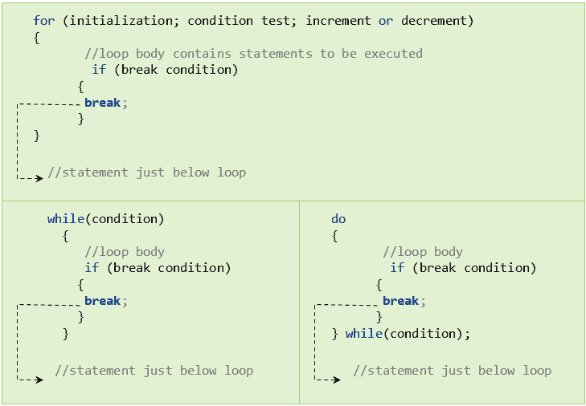

# Java 中的分支语句

> 原文：<https://learnetutorials.com/java/break-continue>

在本教程中，您将通过简单的示例掌握 Java 中的分支语句，如 break、continue 和 return。您还将看到标记和未标记的控制语句是如何工作的。到目前为止，我们已经学习了 java 中的一些基本程序，在分析这些程序时，我们知道每个程序都遵循线性执行，这意味着一个接一个的语句。但是在某些情况下，程序员希望根据一些逻辑条件，将控制指向语句的其他部分，而不是最近的部分。在这种情况下，程序员依赖于分支语句，如`break, continue`和`return`。break and continue 语句可以带有标签，也可以不带标签。

## JAVA BREAK 语句:

在 Java 语言的 50 个关键词中，`break`是跟 loop 一起最常用的关键词。`break`语句用于在我们不确定所需迭代次数或某些特定条件是否满足的情况下，立即跳过或终止代码块或循环执行序列。当关键字`break`后面跟一个分号时，就形成了一个 break 语句。

语法如下:

```java
 break; 

```

更多时候，break 关键字伴随着 switch 语句。break 语句逐个退出每个开关情况。以下示例说明了 switch 语句中 break 的用法。

```java
 public class Signal{

public static void main(String[] args) {
int colour = 2;

switch (colour) {
  case 1:
    System.out.println("Green light!proceed driving");
    break;
  case 2:
    System.out.println("Orange light! proceed with caution");
    break;
  case 3:
    System.out.println("Red Light! stop driving");
    break;
  }
} 

```

这个例子给你输出“橙色的光！小心操作”,因为可变颜色的值为 2。switch 语句将一个一个地查找，直到到达 case 2 以给出期望的输出，然后 break 语句终止该块。

*   **基本上一个 break 语句可以有两种形式:**
*   **未标记的中断语句标记的中断语句**

### 在循环中使用未标记的 break 语句

未标记的 break 语句通常会终止 break 语句所在的循环。break 语句主要用于循环中的 `if`语句和`switch`情况。最初，我们可以看到 break 语句如何在循环中工作来中断循环控制。



1.  **Unlabelled Break Statement in For loop - Example**:

    为了更清楚，请看下面的代码片段，观察 `for`循环控制在遇到`break`语句时是如何终止的。

    ```java
     class UnlabelledBreakInForLoop {
         public static void main(String[] args) {

            for (int i = 1; i <= 3; i++) {
                for (int j = 1; j <= 3; j++) {
                    if (i == 2 ) {
                        break ;
                    }
                    System.out.printf("i = %d, j = %d%n", i, j);
                }
            }

        }

    } 

    ```

    **输出:**

    ```java
     i = 1, j = 1
    i = 1, j = 2
    i = 1, j = 3

    i = 3, j = 1
    i = 3, j = 2
    i = 3, j = 3 
    ```

    在这个例子中，我们提供了一个条件，如果 i = 2，那么它应该打破循环。很明显，一个未标记的 break 语句终止了最里面的循环。从输出可以看出，break 语句终止了与值 2 相关联的内部循环。

2.  **Unlabelled Break Statement in While loop - Example:**

    ```java
     class UnlabelledBreakInWhileLoop{
        public static void main(String[] args) {
           int i = 1;
           while (i<=10) {
                if(i==5) {
                    break;
                } 
           System.out.println(i*i);
            i=i+1;
            } 
           System.out.println("Loop breaks and comes out of the loop ");
        } 
    } 

    ```

    **输出:**

    ```java
     1
    4
    9
    16
    Loop breaks and comes out of the loop 
    ```

3.  **Unlabelled Break Statement in Do While loop - Example:**

    同样，我们可以在 do-while 循环中使用 break 语句。

    ```java
     class UnlabelledBreakInDoWhileLoop{
        public static void main(String[] args) {
           int i = 1;
           do{
                if(i==5) {
                    break;
                } 
                System.out.println(i*i);
                i=i+1;
            }  while (i<=10);
           System.out.println("Loop breaks and comes out of the loop ");
        } 
    } 
    ```

    **输出:**

    ```java
     1
    4
    9
    16
    Loop breaks and comes out of the loop 
    ```

### 循环中标记中断语句的处理

与标签相关联的中断语句通常称为标签中断语句。**标记中断语句**一次性终止整个标记部分。当标签跟随 break 语句时，标签部分从标签开始和结束的点开始。带标签的 break 语句的语法如下:

```java
 break label; 

```

标记中断主要用于嵌套循环，在嵌套循环中终止外部循环变得很方便，并且不需要等待完成整个执行。众所周知，一个未标记的 break 从它所在的循环中退出，该循环总是最里面的循环，而一个标记的 break 语句终止深度嵌套的循环集(外部循环)。

以下示例将让您了解带标签的断点在嵌套循环中是如何工作的。

```java
 class LabelledBreakInForLoop {
     public static void main(String[] args) {

        Outer:
        for (int i = 1; i <= 3; i++) {
            for (int j = 1; j <= 3; j++) {
                if (i == 2 ) {
                    break Outer ;
                }
                System.out.printf("i = %d, j = %d%n", i, j);
            }
        }
      System.out.println("Exited from label");
    }

} 

```

**输出:**

```java
 i = 1, j = 1
i = 1, j = 2
i = 1, j = 3
Exited from label 
```

现在，要更好地理解这个例子，只需回忆一下我们之前研究过的一个未标记 break 语句的例子，并进行比较。这里，当满足条件 i=2 时，整个循环终止，并立即执行循环后的语句。类似地，标记的 break 作用于 while 和 do-while 循环。

## JAVA CONTINUE 语句:

JAVA 语言中用来控制执行的另一个重要关键词是`continue`，它跳过执行的某一部分，继续执行剩下的部分。继续语句总是伴随着决策语句，如 if，if..其他等等。与 break 不同，continue 语句从不结束循环的执行；相反，它跳过满足特定条件的部分的执行，并继续剩余循环的执行。continue 语句的语法如下所示:

```java
 continue; 

```

和 break 一样，我们可以把 continue 想象成两种形式:**未标记的 Continue 和标记的 Continue。**

### 在循环中使用未标记的 continue 语句


在这种情况下，当 if 语句中的指定条件返回 true 时，在“ **continue** ”之后写入的代码块将不会执行。控制返回到下一次迭代，剩余的执行将一直进行到循环结束。

下面是一个打印 1 到 15 之间的偶数的示例程序，循环如下:

1.  **Continue Statement in For loop - Example:**

    假设我们要打印 1 到 15 之间的奇数，循环如下:

    ```java
     public class ContinueInWhileLoop {

       public static void main(String args[]){
     int i=1;
     while (i<=15)
     {
               if (i%2!=0)
               {
             i++;
            continue;
               }
               System.out.print(i+" ");
               i++;
     }
       }
    } 

    ```

    **输出:**

    ```java
     1
    3
    5
    7
    9
    11
    13
    15 
    ```

    请注意，我们在第一个循环“for”中给了`'i`一个初始值`1.`，检查 I 的值是否小于或等于`15`。如 1 < 15 所示，循环内部的代码将在 if 语句检查 I 的值除以 2 是否会使余数为零的地方执行。由于 `i%2`不等于零，当通过 i + +时，它打印值`1.`然后“I”的值从 1 增加到 2。

    现在“`for`”再次检查并找到`2<10`，并且控制移动到`if` ，其检查`2%2`并且接收到的余数为零，条件变为真，并且 continue 语句将跳过它下面的代码并继续递增。

    类似地，3，4，....对 till 15 进行评估，并产生如代码片段所示的输出。简而言之，如果 if 语句中的条件为真，则 continue 跳过输出的打印，如果为假，则 continue 跟随 printing 语句并打印结果。

2.  **Continue Statement in while loop - Example:**

    ```java
     public class ContinueInWhileLoop {

       public static void main(String args[]){
     int i=1;
     while (i<=15)
     {
               if (i%2!=0)
               {
             i++;
            continue;
               }
               System.out.print(i+" ");
               i++;
     }
       }
    } 

    ```

    **输出:**

    ```java
     2 4 6 8 10 12 14 
    ```

3.  **Continue Statement in do-while loop - Example:**

    ```java
     public class ContinueInDoWhileLoop {

       public static void main(String args[]){
     int i=1;
     do
     {
               if (i%2!=0)
               {
             i++;
            continue;
               }
               System.out.print(i+" ");
               i++;
     }while (i<=15);
       }
    } 

    ```

    **输出:**

    ```java
     2 4 6 8 10 12 14 
    ```

### 循环中标记继续语句的处理

另一种在 java 中运行良好的 continue，尤其是在处理嵌套循环时，是带标签的 continue 语句。标记为继续语句的**的语法如下:**

```java
 continue label; 

```

标记为 continue 的语句总是由嵌套循环护送。原因很明显，当嵌套深度较高时，程序的复杂性较高，执行时间也相对较长。要跳过特定外部循环的执行，最简单方便的方法是将外部循环与标签绑定，并将其与 continue 语句一起使用。检查以下示例:

```java
 class LabelledContinueInForLoop {
     public static void main(String[] args) {

        Outer:
        for (int i = 1; i <= 3; i++) {
            for (int j = 1; j <= 3; j++) {
                if (i == 2 ||j==3 ) {
                    continue Outer ;
                }
                System.out.printf("i = %d, j = %d%n", i, j);
            }
        }
      System.out.println("Exited from label");
    }

} 

```

**输出:**

```java
 i = 1, j = 1
i = 1, j = 2
i = 3, j = 1
i = 3, j = 2 
```

在这个嵌套循环中，我们已经将`i`和 j 的值初始化为`1`，并且将 `i`和`j`的限制都设置为`3`。

#### 第一个周期:

for 循环检查 I 的值是否小于或等于`3` 。由于`1<3,`循环中的代码将在我们遇到另一个 for 循环的地方执行。同样，for 循环检查 j 的值是否小于或等于 3。这里也是`1<3` ，所以内部循环中的代码在 if 语句被求值的地方执行。这里 1 不等于 2 或 1 不等于 3，因此 if 语句为假，因此控制转移到 if 的外部语句，并将`i`的值打印为 1，`j`的值打印为 1。当通过`j+ +`时，`j`的值从 1 增加到 2。

#### 第二周期:

现在，内部循环继续执行，j 的值为`2`，并再次进行循环检查`2<3`。然后控制移动到 if，检查`2`是否等于`3`，其评估为假，因此输出被打印。之后，当通过 j `++.`时，j 的值再次增加到`3`

#### 第三周期:

这个周期有点不一样，这里`j`保持数值`3`。即使 for 循环的计算结果为 true，它也无法满足 if 语句中提供的条件，因此 if 语句中的代码会执行，这就是 continue 语句。这意味着当前的执行被跳过，并移动到下一个 j 的值增加到`4.`

#### 第四周期:

现在 `i` 的值增加到 `2`，因为内环超过了限制。同样的过程继续，直到两个循环都退出。现在试着用其他周期来更好地理解这一点。

## JAVA 返回语句:

java 中最后的分支或跳转语句是返回。像 break 和 continue 一样，return 也是 java 中用来控制执行流程的保留关键字。return 语句通常与方法一起出现，它从当前方法中退出，并将控制流转移到调用它的方法。return 语句有两种用法:

1.  没有返回值
2.  带有返回值

不返回值的 return 语句的语法如下:

```java
 return; 

```

返回值的 return 语句的语法如下:

```java
 return sum; 

```

参见下面的例子来验证返回语句的工作情况:

```java
 public class Calc {  

     int Add(int a,int b)  
    {  
        int sum = a+b;
        return sum;  
    }  

  void Mul(int a,int b)  
    {  
        int prod = a*b;
        System.out.printf("Product = %d\n",prod);
        return;  
    }

    public static void main(String[] args) {  
    Calc c =new Calc(); 

    System.out.printf("Sum = %d\n",c.Add(10, 20));  

    c.Mul(30,40);
} 

```

在这个例子中，我们有一个名为`Calc`的类，它包含两种方法:一种是`Add()`做加法，另一种是 Mult()求两个数的乘积。考虑到返回语句，`Add()` 方法向主方法返回一个值，而`Mul()`方法不返回任何值。

仔细观察可以发现**方法的数据类型必须和**方法返回的值的类型相同。在第一种情况下， `Add()`方法返回一个整数，因此该方法的数据类型也是 int。类似地，在下一种情况下，该方法不返回任何值，因此该方法被赋予一个数据类型 void。在我们即将到来的教程中，您将了解更多关于类和方法的信息。