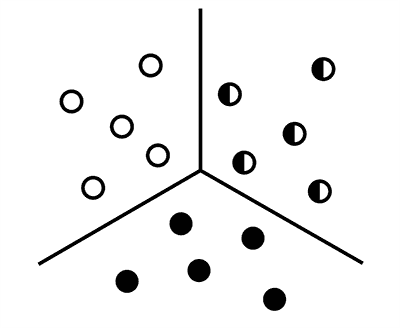
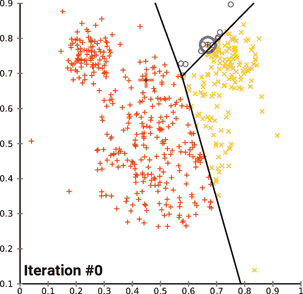
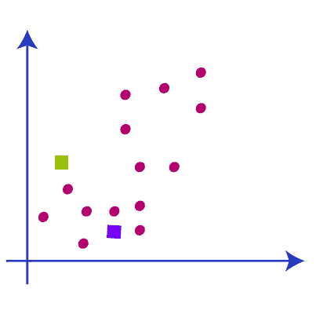
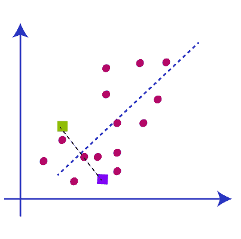
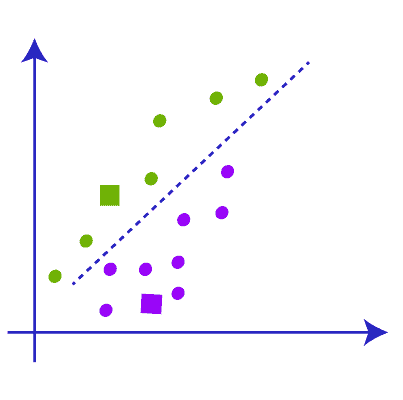
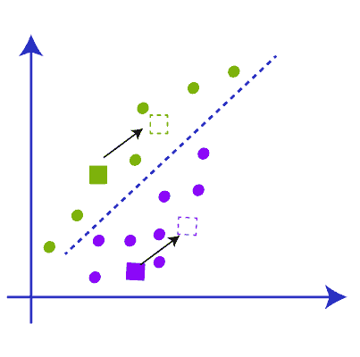
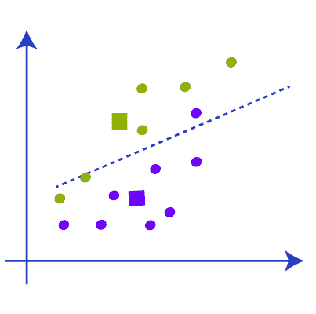
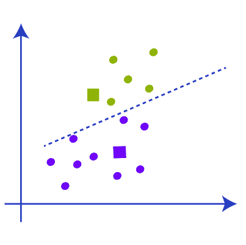
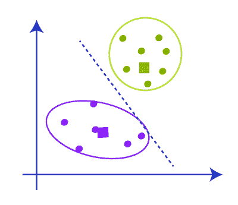
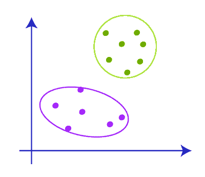

# k-均值聚类

> 原文：<https://learnetutorials.com/machine-learning/k-means-clustering>

我们现在将介绍一个基本的机器学习算法家族，它有许多实际的用例，从搜索引擎到病人诊断:聚类。所以我们需要讨论聚类和聚类的类型。

## 使聚集

机器学习专家的目标是建立一个能给出准确预测的模型。我们已经讨论过这些算法通常有两种类型，即
1。监督机器学习
2。无监督机器学习
K 均值聚类属于无监督学习算法，这意味着不会有标记数据来训练模型。

**聚类**旨在将不同的数据点分组到其他组中彼此相似的集合中。**相似度**，在聚类的上下文中，由坐标系中两个数据点之间的距离来定义。如果我们对给特定数据点分配标签感兴趣，这是一个分类问题。然而，根据应用，聚类也可能是一个无监督的学习问题。

各种类型的聚类是
1。层次聚类:在层次聚类中，它使用树状结构进行聚类。
2。分区聚类:在分区聚类中，数据点被划分为分区。

再次，层次聚类可以进一步分为
1。凝聚聚类
2。分裂聚类

划分聚类分为
1。k 表示聚类
2。模糊 C 均值聚类

几种算法对数据进行不同的聚类，但我们将重点介绍一种简单且广泛使用的算法:K 均值聚类。

## 机器学习中的 K 均值聚类是什么？

K-means 聚类是一种旨在将数据点分成 k 个聚类的方法。注意，参数 k 是用户定义的——我们需要告诉算法数据中有多少组。
例如，如果 k = 2，这意味着只有 2 个簇。如果 k=3，则意味着将有 3 个簇。

使用 k 均值算法，我们可以将数据聚类成不同的组或类别。它帮助我们理解类别，并将未标记的数据分类到这些类别中，而无需使用训练数据集或训练模型。

k-means 聚类是基于质心的，这意味着在 k-means 算法中每个聚类都有一个质心，并且该算法试图减少数据与其数据聚类之间的距离之和。

在该算法中，它采用未标记的数据，并将该数据分成多个由用户使用参数 k 给出的聚类。该过程重复进行，直到得到一个完美的聚类。

**K-means 算法一般有三个步骤:**

1.  随机设置 k 坐标的最佳值为每个聚类的中心(质心)。
2.  对于所有数据点，计算数据点和质心之间的欧几里得距离。
    *   根据群集分配为数据点分配一个标签。
    *   数据点被分配给在数据点和质心之间具有最小欧几里德距离的聚类。
3.  将**质心**重新居中，使质心位于每个 k 簇的所有数据点的中间。

之后，我们将获得具有共同特征的数据点的聚类。下图显示的是 K 均值聚类的一种表现形式。黑色+号是最初随机分配的质心。黑线代表决策边界:算法已经学会将数据点分成不同簇的规则。

对于每次迭代，我们都在计算每个数据点和质心之间的距离。每次迭代后，对不同类的分配都会改变。新的聚类分配会改变质心位置，因为我们正在确定给定聚类的新中心值。

每次迭代后，随着时间的推移，随着算法找到类之间的最佳分离，类分配趋于稳定。模型分配的这种稳定化被称为模型收敛。

## 这个 K 均值聚类算法是如何工作的？

现在我们有了 k-means 聚类的基本概念以及它是如何工作的，现在我们将详细了解 k-means 聚类是如何工作的。

第一步:使用参数 K
决定我们需要的聚类数第二步:选择质心或一些随机点【不需要来自数据集】
第三步:将数据点添加到最近的质心，该质心将来自聚类。
第 4 步:计算方差并针对每个聚类的方差制作质心
第 5 步:将数据点重新分配给新的质心并制作新的聚类
第 6 步:如果有任何重新分配，从第 4 步
开始重复第 7 步:完成模型并准备投入使用。

K 均值聚类工作的详细视图

假设我们有两个数据变量 s1 和 s2。这些数据变量的图形表示如下所示。

现在我们要决定参数 K 的值，这意味着我们必须决定有多少个簇，这里我们提供 k=2。现在我们需要将这些数据点分组到这两个集群中。寻找 k 的值有不同的方法。

下一步是确定质心，到目前为止，我们只是使用一些随机的 k 点作为质心来进行聚类。这些随机点可能来自数据集，也可能来自任何点的外部。在下图中，我们选择了不同于数据集的质心。

下一步是将该图的数据点分配给质心或 k 点。我们使用与计算点之间距离相同的公式。在那之后，我们必须在两个质心之间画一条线，叫做中线。

现在我们有了中值，从图中可以了解到，中值以上的点靠近绿色质心，中值以下的点靠近黄色质心。所以我们根据质心将数据点的颜色改为绿色和蓝色，如下图所示。

现在我们有一些点属于两个质心。现在，我们必须找到最近的聚类，这样我们就可以重复这个过程，找到一个新的质心，它几乎就是图中质心的中心。

现在我们得到了新的质心，我们重复将数据点链接到新质心的过程，并相对于新质心绘制新的中值，如下图所示。

现在，当我们检查上面的图片时，我们可以发现一个黄色数据点低于新的中位数，两个绿色数据点高于中位数。因此，我们必须将这些数据点链接到相应的新质心，如下图所示。

所以在用质心重新链接新的数据点后，集群的重心会发生变化，我们必须重复这个步骤，用新的数据点找到新的质心。如下图所示。

同样，我们必须用新的聚类找到新的中值，并绘制质心之间的中值，如下图所示。我们现在正在重复上述步骤。

现在，当我们检查数据点时，将不会有任何点需要重新分配，因此集群已经完成，我们的模型也几乎完成

在形成集群之后，我们必须移除质心、中间点和所有其他我们创建集群的结构，最终的集群将会是

### 如何求 K 值？

k-means 聚类完全依赖于聚类，它在决定影响模型精度的最佳聚类数时非常重要。有很多方法可以找到 k 值，其中最重要的是

### 肘法

寻找 k 值的最佳个数是一种常用的方法。该方法使用 WCSS 的概念，即“聚类内平方和”，它使用公式来寻找 k 值。

这用于计算 3 个集群的 WCSS 值。

## K 均值聚类的应用

k 均值聚类是一种无监督的机器学习方法，在现实世界中有广泛的适用性，其中一些是

1.  **学习成绩**:根据分数给学生打分
2.  **诊断系统**:创建智能医疗决策支持系统
3.  **搜索引擎**:帮助搜索引擎对搜索结果进行分组。
4.  **无线传感器网络**:帮助计算向其集群收集数据的集群头

## K 均值聚类的优势

1.  易于解释和解决
2.  k 均值聚类比层次聚类更快
3.  易于修改集群
4.  可用于紧凑集群
5.  它可以用于未标记的数据

## K-均值聚类的缺点

K-means 聚类是一种将数据分成组的强大而直观的方法。然而，我们对 K 均值聚类的数据做了几个假设:

**集群大小需要相同。**

在上面的例子中，黄色比蓝色和红色大很多，导致了一些错误的分类。

**数据的方差或数据点的分布需要相同。**

同样，黄色的价差或方差比蓝色和红色的价差更大，导致一些错误分类。

**最后，对于“球形”数据集关系，K-means 往往工作得更好。**

用技术术语来说，这意味着方差需要大致相同。

最后，虽然我们可以使用实际类的数量来指定超参数 k，但我们通常不知道数据中的类的数量。在这些情况下，在无监督的问题中，k 参数可能很难确定。