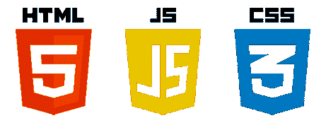
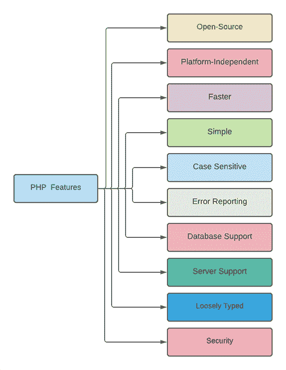
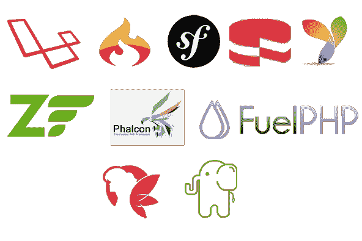

# PHP 简介

> 原文：<https://learnetutorials.com/php/tutorials-for-beginners>

## PHP 是什么？

PHP 是一种服务器脚本语言，主要用于动态和交互式 web 开发。PHP 是“PHP:超文本预处理器”的缩写。它的前身是拉斯马斯·勒德尔夫在 1994 年设计的。PHP 是最流行的服务器端脚本语言。它是第一种可以嵌入 HTML 的服务器端脚本语言。PHP 可以用来管理数据库、会话、cookies，也可以用来开发一个完整的动态网站。PHP 是一种解释的面向对象的脚本语言，不需要编译。PHP 文件可能包含文本、HTML、CSS、JavaScript 和 PHP 代码。PHP 文件有扩展名”。php”。PHP 支持多种协议，如 HTTP、POP3、SNMP、LDAP、IMAP 等。根据研究，大约 75%的网站仍然使用 PHP。PHP 8.0.10 是 PHP 的最新版本。

## 学习 PHP 的先决条件



*   超文本标记语言
*   半铸钢ˌ钢性铸铁(Cast Semi-Steel)
*   Java Script 语言

### 超文本标记语言

HTML 是“超文本标记语言”的缩写。pages.HTML 是开发网站最常用的标准标记语言。一个静态的网站只需要使用 HTML 就可以建立。HTML 使用元素来定义网页的结构。HTML 中的每个标签都有自己的属性。一些基本标签包括:

*   **<！DOCTYPE >** :此标签用于定义 HTML 文档的类型和版本。
*   **< html >** :是定义文档开始和结束的根元素。
*   **< head >** : Head 标签包含文档的所有元数据。
*   **<标题>** :此标签用于定义文档的标题。
*   **< body >** : Body 标签包括网页上可见的所有其他元素和内容

### 半铸钢ˌ钢性铸铁(Cast Semi-Steel)

CSS 是“层叠样式表”的缩写。CSS 用于给 HTML 元素赋予样式。CSS 是设计网页最流行的语言。CSS 有助于轻松设计多个网页的布局。通过使用 CSS，我们可以减少 HTML 属性的使用，这有助于更快地呈现网页。

### Java Script 语言

JavaScript 是一种轻量级、高级、弱类型、解释、面向对象的脚本语言。JavaScript 主要用于使网站具有动态性和交互性。JavaScript 与 HTML 集成在一起，这使得它易于实现。JavaScript 不需要任何其他环境；大多数浏览器都支持它。即使不重新加载，JavaScript 也有助于呈现网页。JavaScript 还用于开发移动应用程序、游戏和桌面应用程序。

## 为什么选择 PHP？

*   PHP 是一种开源和面向对象的脚本语言
*   PHP 是一种解释语言，不需要编译 PHP 文件。
*   PHP 及其框架(如 Laravel、Cake PHP)都是免费使用且容易获得的。
*   PHP 用户友好，对于初学者来说很容易学习。
*   PHP 是独立于平台的，在一个操作系统中开发的应用程序也可以在任何其他操作系统中执行。
*   在 PHP 中，数据加密和验证可以很容易地完成。
*   PHP 可以与目前行业中使用的大多数数据库集成，即 MySQL、PostgreSQL、Oracle 和微软的 SQL Server。
*   PHP 有一个庞大的开发人员社区。
*   PHP 很容易处理文件。
*   PHP 可以用来处理 cookies。
*   PHP 支持目前使用的几乎所有服务器，即 Apache、Wamp、XAMPP 等。

## PHP 的特性



**开源** : PHP 是免费的，任何版本任何人都可以根据自己的需要使用。同样，PHP 框架也是开源的。

**平台无关**:由于 PHP 适用于每一个操作系统，所以在一个操作系统中开发的 PHP 应用程序可以在另一个操作系统上运行。

**更快** : PHP 比类似的脚本语言快很多，而且可以使用自己的内存，所以渲染速度更快，同时也让性能更高。

**Simple** : PHP 是一种非常简单且用户友好的脚本语言。PHP 的语法和其他语言类似，很容易理解。

**区分大小写**:和其他语言一样，PHP 也是区分大小写的。关键字不能用于命名变量和标识符。

**错误报告** : PHP 有一些预定义的错误报告常数，用于在执行时生成警告或错误通知。例如，错误、警告、严格、解析。

**数据库支持** : PHP 支持目前业界使用的大部分数据库，即 MySQL、PostgreSQL、Oracle、微软 SQL Server。
服务器支持:PHP 几乎支持目前使用的所有服务器，如 Apache、WAMP、Nginx 等。

**松散类型**:PHP 中不需要声明变量。在程序执行时，变量的数据类型将根据变量的值自动考虑。

**安全性** : PHP 是开发网站最安全的脚本语言之一。PHP 具有多层安全性，可以降低威胁和恶意软件的风险。

## PHP 框架排名前十的是哪几个？



1.  **Laravel** : Laravel 是目前最流行的开源 PHP 框架。Laravel 于 2011 年推出。Laravel 能够比其他框架更安全、更快速地处理复杂的 web 应用程序。使用 Laravel，开发人员可以轻松实现路由、会话、缓存和身份验证。
2.  **CodeIgniter** :它提供了许多预构建的模块，有助于构建健壮且可重用的组件，并且以其小尺寸而闻名，包括其大小约为 2MB 的文档。
3.  **Symfony** : Symfony 是一个基于 MVC(模型，视图&控制器)架构的 PHP 框架。它于 2005 年推出。尽管它是在大多数其他框架之前引入的，但它仍然是一个可靠和成熟的平台。
4.  **CakePHP** : CakePHP 多用于小项目。这是最简单的学习框架之一。CakePHP 用于开发视觉上令人印象深刻、功能加载的网站。
5.  **Yii** : Yii 代表“对，就是”。Yii 是一个高性能、基于组件的 PHP 框架，用于开发现代 web 应用程序。Yii 可以用来开发所有类型的 web 应用程序。
6.  **Zend 框架:** Zend 是一个面向对象的框架。Zend 使用接口和继承，这使得它具有可扩展性。它主要用于开发复杂的项目。
7.  **Phalcon** : Phalcon 是基于 MVC 架构的全栈 PHP 框架。Phalcon 是 2012 年开发的，它是用 C 和 C++开发的。
8.  **fuelpph**:FulePHP 是 2011 年开发的全栈 PHP 框架。与其他框架不同，它基于 HMVC(分层模型视图控制器)。而且它只需要比别人少的时间和内存。
9.  **PHPixie** : PHPixie 也是基于 HMVC 的。PHPixie 是 2012 年开发的，它主要是为静态网站开发的。
10.  **Slim** : Slim 框架是一个流行的 PHP 微框架，用于开发 web 应用和 API

## 打印 Hello World 的基本程序

```
 <?php
 echo “Hello World !”;
?> 

```