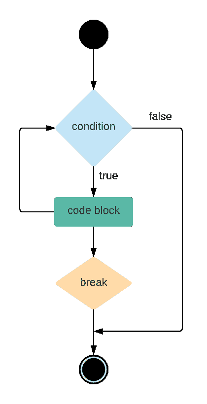
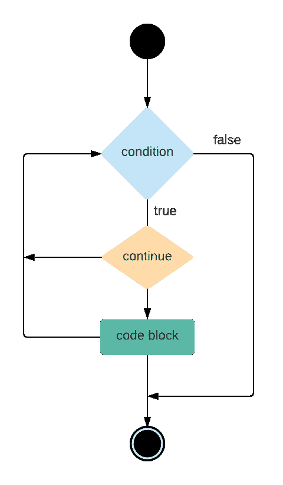

# PHP 中断和继续

> 原文：<https://learnetutorials.com/php/break-and-continue-statement>

在本 PHP 教程中，您将学习 PHP 中条件语句的所有知识。我们将详细讨论中断和继续语句。

## 什么是 PHP 中的 break 语句？

PHP 中的 break 语句用于终止程序的当前流。break 语句主要用于根据指定的条件中断 for、while、do…while、foreach 和 switch 语句的执行。

**语法**

```
 jump statement;  
break; 

```



## 在循环中使用 break 语句

在循环中使用 break 语句时，当它满足 break 语句的条件时，它将终止循环的执行，即使它不满足循环条件。

### 示例:PHP 中的 break 语句

```
 for ($i = 1; $i <= 10; $i++) {    
echo "$i ";    
if ($i == 3) {    
break;    
}    
} 

```

**输出:**

```
 1 2 3 
```

在上面的例子中，我们可以看到循环条件是将变量“I”的值从 1 迭代到 10。在循环的块中，我们打印变量“I”的值，检查条件“i == 3”，在 if 语句的块中，我们使用 break 语句。根据它，如果条件满足，循环应该终止。我们可以看到，循环应该迭代，直到变量“I”的值变成“10”，通过使用 break 语句，它不满足这个条件，并在满足 break 条件时退出循环。

## 在内部循环中使用 break 语句

同样，当我们在内部循环中使用 break 语句时，它只会终止内部循环，不会影响外部循环。

### 示例:PHP 中的 break 语句

```
 for ($i = 1; $i <= 3; $i++) {    
    for ($j = 1; $j <= 5; $j++) {
        echo "$i * $j = ". $i * $j. "\n";
        if ($j == 3) {
            break;
        }
    }    
} 

```

**输出:**

```
 1 * 1 = 1
1 * 2 = 2
1 * 3 = 3
2 * 1 = 2
2 * 2 = 4
2 * 3 = 6
3 * 1 = 3
3 * 2 = 6
3 * 3 = 9 
```

在上面的例子中，我们可以看到循环条件是将变量“I”的值从 1 迭代到 3，同样，内部循环应该在循环块中将变量“j”的值从 1 迭代到 5， 我们正在打印变量“I”和“j”相乘的值，根据循环条件，外部循环应该迭代 3 次，内部循环应该迭代 5 次，但是在上面的例子中，我们可以看到，在内部循环的块中，我们有条件“j == 3”，并且在该条件的块中使用了 break 语句，因此内部循环不会迭代 5 次 我们还可以看到，bike 语句没有影响外部循环，外部循环完成了它的整个迭代。

## 在 switch 语句中使用 break 语句

尽管 break 语句在 switch 语句中是可选的，但还是建议使用它。如果我们不使用**开关**语句中的**断开**语句，即使满足条件，它也会进一步检查整个条件。在另一种情况下，如果我们在满足条件时使用 break 语句，那么即使有更多的条件，它也会直接退出**开关**语句。

### 使用 switch 语句而不中断语句的示例

```
 $ch = 3;  
    switch ($ch)  
    {     
        case 1:   
            echo "Monday ";  
        case 2:   
            echo "Tuesday ";  
        case 3:   
            echo "Wednesday ";  
        case 4:   
            echo "Thursday ";  
        case 5:   
            echo "Friday ";  
        case 6:   
            echo "Saturday ";  
        case 7:   
            echo "Sunday ";  
        default:   
            echo "Wrong Choice ";  
    } 

```

**输出:**

```
 Wednesday Thursday Friday Saturday Sunday Wrong Choice 
```

### 将 switch 语句与 break 语句一起使用的示例

```
 <?php
$ch = 3;  
    switch ($ch)  
    {     
        case 1:   
            echo "Monday";  
            break;  
        case 2:   
            echo "Tuesday";  
            break;  
        case 3:   
            echo "Wednesday";  
            break;  
        case 4:   
            echo "Thursday";  
            break; 
        case 5:   
            echo "Friday";  
            break;  
        case 6:   
            echo "Saturday";  
            break;  
        case 7:   
            echo "Sunday";  
            break; 
        default:   
            echo "Wrong Choice";  
            break;  
    } 

```

**输出:**

```
 Wednesday 
```

上面的例子是为了打印一周中的某一天，我们可以看到，当 break 语句没有被使用时，满足条件后的每个案例都将被执行，而当 break 语句被使用时，它将只执行条件变为真的案例。

## 什么是 PHP 中的 continue 语句？

PHP 中的 continue 语句用于通过在条件满足时跳过当前流来迭代循环。当我们想要进入循环或开关控制结构的下一个迭代时，我们使用 continue 语句。continue 语句主要用于根据指定的条件中断 for、while、do…while 和 switch 语句的执行。

**语法**

```
 jump-statement;  
continue; 

```



## 在循环中使用 continue 语句

当在循环中使用 continue 语句时，当它满足 continue 语句的条件时，它将跳过当前迭代的执行，并继续循环的剩余流程。

```
 <?php
for ($i = 1; $i <= 10; $i++) {    
if ($i == 3) {    
    continue;    
}
echo "$i ";
} 

```

**输出:**

```
 1 2 4 5 6 7 8 9 10 
```

在上面的例子中，我们可以看到循环条件是将变量“I”的值从 1 迭代到 10。在块中，我们检查条件“i == 3”，然后使用 continue 语句，在条件块之后，我们打印变量“I”的值。通过使用 continue 语句，我们跳过迭代的当前流程，执行循环的剩余迭代。正如我们所说的，我们可以看到，在输出中，它在打印值时跳过了输出中的“3”。

在内部循环中使用 continue 语句

同样，当我们在内部循环中使用 continue 语句时，它只会跳过剩余的代码并执行下一次迭代。

```
 for ($i = 1; $i <= 3; $i++) {    
    for ($j = 1; $j <= 3; $j++) {
        if ($i == $j) {
            continue;
        }
        echo "$i $j \n";
    }    
} 

```

**输出:**

```
 1 2 
1 3 
2 1 
2 3 
3 1 
3 2 
```

在上面的例子中，我们可以看到循环条件是将变量“I”的值从 1 迭代到 3，同样，在循环的块中，内部循环应该将变量“j”的值从 1 迭代到 3， 我们正在打印变量“I”和“j”的值，根据循环条件，外部循环应该迭代 3 次，内部循环应该迭代 3 次，但是在上面的例子中，我们可以看到，在内部循环的块中，我们有条件“i == j ”,并且在该条件的块中使用了 continue 语句，因此当变量“I”和“j”的值相等时，程序将跳过打印。