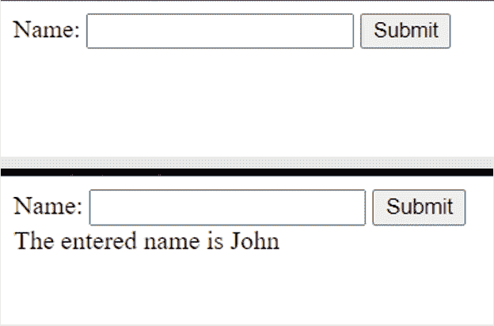

# PHP 超级全局变量

> 原文：<https://learnetutorials.com/php/super-global-variables>

在这篇 PHP 教程中，您将了解到 PHP 中所有的超级全局变量。我们将详细讨论全局变量和各种类型的超全局变量$GLOBALS、$_SERVER、$_REQUEST、$_POST、$_GET、$_FILES、$_ENV、$_COOKIE、$_SESSION。

## PHP 中的超全局变量是什么？

在 PHP 中，超全局变量是内置的预定义全局变量。超级全局可以在整个脚本中找到。这些变量可以从任何函数、类或文件中访问，而不需要任何额外的操作，例如定义任何全局变量等等。它们主要用于在应用程序中从一个页面到另一个页面存储和检索信息。

## PHP 中的各种超全局变量

1.$GLOBALS
2。$_SERVER
3。$_REQUEST
4。$_GET
5。$_POST
6。$_SESSION
7。$_COOKIE
8。$_FILES

## PHP 中的$GLOBALS 是什么？

PHP 中的$GLOBALS 是一个超级全局变量，可以从脚本的任何地方访问。PHP 将所有全局变量保存在数组$GLOBALS[]中，其中索引携带了可能被访问的全局变量的名称。

```php
 $x = 15;
$y = 53; 
function sum() {
  $GLOBALS['z'] = $GLOBALS['x'] + $GLOBALS['y'];
}
sum();
echo $z; 

```

**输出:**

```php
 68 
```

## PHP 中的$_SERVER 是什么？

$_SERVER 是 PHP 中的一个超全局变量，它包含有关头、路径和脚本位置的信息。其中一些组件用于从全局变量$_SERVER 中检索数据。

*   $_SERVER['PHP_SELF'] -它用于返回当前正在执行的脚本的文件名。
*   $_SERVER['SERVER_NAME'] -它用于返回托管网站的服务器的名称。
*   $_SERVER['HTTP_HOST'] -它用于返回当前请求的主机的标头。
*   $_SERVER['SCRIPT_NAME'] -它用于返回当前脚本的路径。

```php
 echo $_SERVER['PHP_SELF'];
echo "<br>";
echo $_SERVER['SERVER_NAME'];
echo "<br>";
echo $_SERVER['HTTP_HOST'];
echo "<br>";
echo $_SERVER['HTTP_REFERER'];
echo "<br>";
echo $_SERVER['HTTP_USER_AGENT'];
echo "<br>";
echo $_SERVER['SCRIPT_NAME']; 

```

**输出:**

```php
 /files/new/server.php
localhost
localhost
http://localhost/files/new/
Mozilla/5.0 (Windows NT 10.0; Win64; x64) AppleWebKit/537.36 (KHTML, like Gecko) Chrome/96.0.4664.45 Safari/537.36
/files/new/server.php 
```

## PHP 中的$_REQUEST 是什么？

$_REQUEST 是一个超全局变量，用于在提交 HTML 表单时收集数据。$_REQUEST 很少被使用，因为$_POST 和$_GET 提供了相同的功能，并且更常用。

```php
 <!DOCTYPE html>
<html>
<body>
<form method="post" action&equals;"<?php echo $_SERVER['PHP_SELF'];?>">
  Name: <input type="text" name="fName">
  <input type="submit">
</form>
<?php
if ($_SERVER["REQUEST_METHOD"] == "POST") {
    $name = $_REQUEST['fName'];
    if (empty($name)) {
        echo "Name field is empty";
    } else {
        echo " The entered name is $name";
    }
}
?>
</body>
</html> 

```

**输出:**



## PHP 中的$_GET 是什么？

$_GET 是一个超全局变量，用于在 HTML 表单提交后收集数据。当窗体使用 get 方法发送数据时，数据在查询字符串中可用，因此不会隐藏值。超全局数组变量$_GET 包含来自网址的值。

```php
 <!DOCTYPE html>
<html>
<body> 
<form method="get" action&equals;"getsup.php">
  Name: <input type="text" name="fName">
  <input type="submit" name="submit">
</form>
<?php
if (isset($_GET['submit'])) {
    $name = $_GET['fName'];
    echo " The entered name is $name";
}
?>
</body>
</html> 
```

**输出:**

```php
  
```

## PHP 中的$_POST 是什么？

$_POST 是一个超全局变量，用于在 HTML 表单提交后收集数据。因为当窗体实现 post 方法来传输数据时，查询字符串中的数据是不可访问的，所以以这种方式维护安全标准。

```php
 <!DOCTYPE html>
<html>
<body>
<form method="post">
  Name: <input type="text" name="fName">
  <input type="submit" name="submit">
</form>
<?php
if (isset($_POST['submit'])) {
    $name = $_POST['fName'];
    echo " The entered name is $name";
}
?>
</body>
</html> 

```

**输出:**

```php
  
```

## PHP 中的$_SESSION 是什么？

一个$_SESSION 变量是一个 PHP 超级全局变量，从网站打开到关闭，它保存并提供关于网站用户的信息。每次有人访问网站时都会启动一个会话。可以在网站的多个页面中访问会话中的值。
要启动会话，我们使用函数 session_start()
要结束会话，我们使用函数 session_destroy()

## PHP 中的$_COOKIE 是什么？

cookie 是服务器放在用户计算机上的一个小文件。它确立了用户的身份。每当发出服务器请求时。通常，cookie 会与请求一起发送。PHP 中的`setcookie()`函数用于创建 cookies。

```php
 <?php
    $cookie_name = "username";
    $cookie_value = "John";
    setcookie($cookie_name, $cookie_value, time()+(86400*30),"/");
?> 
```

**输出:**

```php
  
```

## PHP 中的$_FILES 是什么？

$_FILES 是 PHP 中的一个变量，用于存储使用 HTTP POST 方法上传的对象。这个数组的键是上传文件和访问数据的字段的名称。例如，$_FILES[fileUploaded][name]从 fileUploaded 属性中获取正在上传的文件的名称。
$ _ FILES 有多个元素，如下所示:

*   $_FILES['file']['name'] -用于保存待上传文件的原始名称。
*   $_FILES['file']['type'] -是指正在上传的文件的类型。
*   $_FILES['file']['size'] -它包含以字节为单位的文件大小。
*   $_FILES['file']['tmp_name'] -是指上传到服务器上的存储文件的临时文件名。
*   $_FILE['file']['error'] -它保存文件上载的相关错误代码。