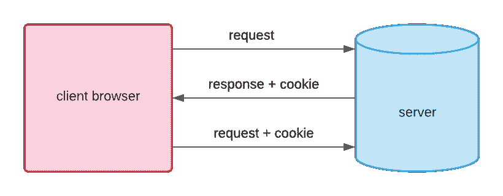

# PHP Cookies

> 原文：<https://learnetutorials.com/php/cookies>

在本 PHP 教程中，您将了解到 PHP 中所有关于 Cookies 的知识。我们还将讨论如何创建 cookie、检查 cookie、访问 cookie 和删除 cookie。

## PHP 中的 Cookies 是什么？

cookie 是一个最小的文件，最大大小接近 4KB，由网络服务器存储在客户端计算机中。它们通常用于保存用户名等信息，这有助于用户在下次访问网站时根据自己的需要查看定制的网页。cookie 只能从发出它的域中读取。cookie 通常放在 HTTP 头中，但是 JavaScript 也可以直接在浏览器上建立 cookie。



## 如何用 PHP 创建 cookies？

为了在 PHP 中创建 cookie，我们使用函数`setcookie()`。必须在创建任何脚本输出之前调用`setcookie()`方法，否则将不会设置 cookie。
语法

```php
 setcookie(name, value, expire, path, domain, security); 

```

在`setcookie()`函数中，我们传递参数:

*   名称–它用于定义 cookie 的名称
*   值–它用于设置 cookie 的值
*   过期–它用于设置过期时间，过期后 cookie 将无法访问
*   路径——指定服务器上可以访问 cookie 的路径
*   域–指定可以访问 cookie 的域
*   安全性–它指定只有当连接是安全的 HTTPS 连接时才应该发送 cookie

例子

```php
 setcookie("username", "john", time()+2*24*60*60); 

```

## PHP 中如何检查 cookie 是否设置？

在尝试访问 cookie 之前，最好检查它是否设置完美。为了检查在 PHP 中是否设置了 cookie，我们使用 is `set()`函数，如果 cookie 可用，该函数将返回真。
示例

```php
if (isset($_COOKIE['username'])) { echo "Cookie is available"; } else { echo "Cookie is not available"; } 

```

**输出:**

```php
 Cookie is not available 
```

## PHP 中如何访问 cookies？

要访问 cookie 值，我们使用 PHP $_COOKIE[]超全局变量或$HTTP_COOKIE_VARS[]变量。它通常是一个关联数组，包含浏览器在当前请求中给出的所有 cookie 值的列表，由 cookie 名称键入。使用正常的数组语法，可以获得单独的 cookie 值。
示例

```php
 <?php

setcookie("username", "john", time() + 2 * 24 * 60 * 60);
?>
<!DOCTYPE html>
<html lang="en">
<head>
    <title>Cookies Sample Program</title>
</head>
<body>
    <?php
    if (isset($_COOKIE['username'])) {
        echo "<h1> The username is " . $_COOKIE['username'] . "</h1>";
    } else {
        echo "Cookie is not available";
    }
    ?>
</body>
</html> 

```

```php
  
```

## PHP 中如何删除或移除 cookies？

要删除 cookie，我们使用相同的`setcookie()`方法。要删除 cookie，`setcookie()`函数与前面定义的 cookie 名称以及附加参数或空字符串一起使用，但这次过期日期必须设置在过去。
示例

```php
 <?php
setcookie("username", "", time() - 60000);
?>
<!DOCTYPE html>
<html lang="en">
<head>
    <title>Cookies Sample Program</title>
</head>
<body>
    <?php
    if (isset($_COOKIE['username'])) {
        echo "<h1> The username is " . $_COOKIE['username'] . "</h1>";
    } else {
        echo "<h1> Cookie is not available... </h1>";
    }
    ?>
</body>
</html> 

```

```php
  
```