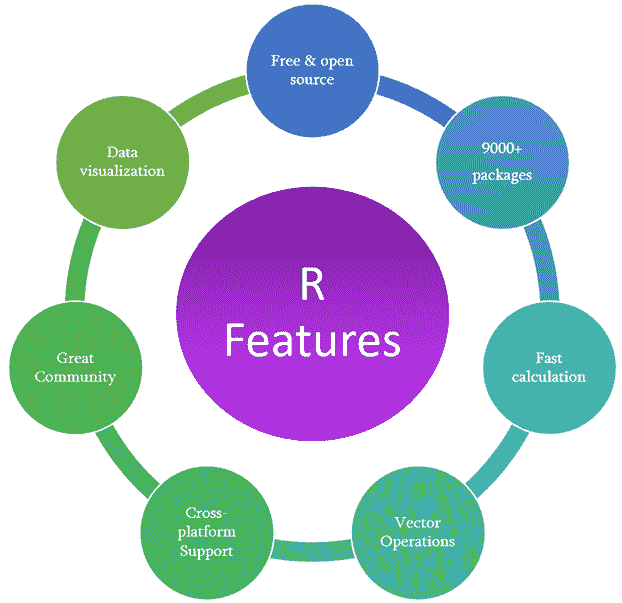
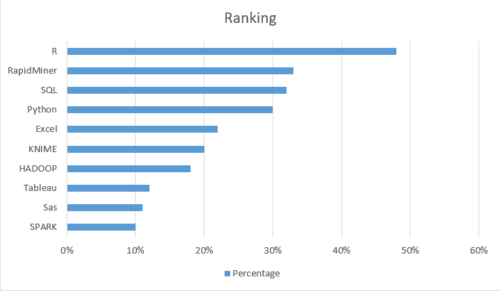

# R 简介

> 原文：<https://learnetutorials.com/r-programming/introduction>

**R** 是由**罗斯·伊哈卡**和**罗伯特·绅士**于 1993 年推出的一种编程语言和自由软件，主要用于统计计算和图形可视化。 **R 是数据科学的语言**。简单来说，数据科学是一个研究领域，它处理海量数据及其分析，以推断看不见的模式、有意义的信息等。在深入研究 R 之前，让我们先了解一下统计学及其在现代的意义。

## 什么是统计？

统计学是一门数学学科，有助于数据的收集、分析、解释、呈现和汇总。数据可以是任何可以用数字、表格或图表或任何类型的分类排列来表示的事实。例如，一个国家的人口或经济是在统计数据的帮助下确定的。
统计范围广泛。随处可见统计学的运用——农业、食品工业、遗传学、心理学、社会学、制造业、商业、制药、天气预报等。

### 统计-编程关系

为了理解统计学和编程语言之间的关系，让我们回到我们之前学习统计学基础的课程。我们熟悉的基本领域包括均值、中位数、众数等。根据定义，平均值是 n 个数的平均值。求 10 个数的平均值很容易，但如果需要求 1000 个或更多个数的平均值，情况就不一样了。在计算器超出极限的情况下，确实需要一个计算机应用程序。

因此，编程应用程序和编程语言在统计学中的参与来处理数据科学。要处理复杂的计算，预编程代码或定制的编程代码是必不可少的，要编写编程代码，你必须熟悉编程语言。这就是为什么统计学学生或研究与开发学生的教学大纲中有编程论文的原因。

### 统计软件列表

我们有很多统计软件可以用来处理数据科学。下面列出了一些常见的统计软件。

*   ADaMsoft
*   分析它
*   数据批次
*   超过
*   矩阵实验室
*   枫树
*   数学软件
*   计算机编程语言
*   r 工作室
*   斯堪的纳维亚航空公司
*   附加电源装置（Supplementary Power Supply Set 的缩写）

如果您有兴趣了解更多不同的统计软件，请参考统计软件的[列表。](https://en.wikipedia.org/wiki/List_of_statistical_software)

在这个统计软件中: **SAS** 、 **MATLAB** 、 **Maple** 、 **Python** 、 **R** 都是包含统计特征的编程语言。该统计软件可以通过编写新代码或修改现有代码，根据需要轻松定制其输出。这使得用户更加友好和方便。

## R 编程之旅

“ *R 是 S 的方言*的意思是 R 是 S 的另一个版本，那么让我们从了解 S 是什么开始我们的旅程吧？ **S 是约翰·钱伯斯于 1978 年在贝尔实验室开发的一种编程语言，用于计算统计分析**。它最初只设计用于内部使用。1988 年晚些时候，他们升级了 S 系统，将代码从 Fortran 重写为 C，并加入了新功能，提供给公众。但是 90 年代和以后的时代并不支持 S 语言，而且 S 语言只能在商业版 S-PLUS 上使用，这限制了它接触普通人。

回到 R，R 是由**罗斯·伊哈卡**和**罗伯特·绅士于 1991 年在奥克兰大学**创建的编程语言和环境，作为他们研究项目的一部分。他们主要依赖于 S 语言，并在 R 中包含了 S 的许多特性，但坚持创建不同版本的 1993 年，罗斯和罗伯特都向公众宣布了他们的第一个创作，1995 年，在马丁·马彻勒的影响下，他们使用 GNU 通用公共许可证使 R 成为一个自由和开源的软件。然后在 1997 年，组建了 R 核心小组，后来又成立了 CRAN ( [综合 R 档案网](http://cran.r-project.org/))。最终，他们在 2000 年发布了第一个 R 1.0.0 版本。

要按时间顺序了解 R 编程的历史，请参考[R 的历史](https://blog.revolutionanalytics.com/2020/07/the-history-of-r-updated-for-2020.html)。

## 为什么 R 编程这么受欢迎？

现在全世界都在夜以继日地分析大数据。从大学到行业，大数据都具有很高的意义，管理大数据的最佳工具是统计计算环境，如 SAS、SPSS、Python、R 等。

最近 R 编程比往年更受欢迎，并上升到最高指数。为什么 R 这么受欢迎？是什么让它要求这么高？是的，这里我们讨论的是 R 编程的一些与众不同的**特性。它们是:**

1.  R 是开源软件，每个人都可以从其官方网站 CRAN 免费下载 R。
2.  R 支持跨平台兼容的特性，这意味着 R 是独立于平台的，因此它可以在任何操作系统上工作，如 Windows、Linux、MAC 等，不会出现故障。
3.  r 有广泛的库支持。CRAN 已经提出了 10，000 多个不同的包和扩展，帮助解决复杂的数据科学问题。
4.  易于与其他技术集成的特性使其功能多样。它可以很容易地与其他数据处理和分发技术(如 Hadoop 和 Spark)、编程语言(如 C、C++、Java、Fortran 等)以及其他框架和软件包集成。
5.  R 的计算速度很快，这说明 R 可以在几秒钟内完成向量、数组、数据帧等简单和复杂的计算。
6.  r 提供了高质量的数据可视化，这是它区别于其他统计计算编程语言的最重要的特性。r 包含大量图形库，如 ggplot2、plotly 等，它们提供交互式图形功能。
7.  R 具有处理各种数据的高度能力，无论是结构化的还是非结构化的，R 都能以有效的方式进行清理和组织。
8.  r 是一种解释的编程语言，因此不需要单独的编译器来使代码成为可执行的形式。R 代码是逐行解释的，并且一步将每一行转换成机器语言。这减少了执行的时间消耗。
9.  r 现在是一种流行的编程语言，拥有一个庞大而活跃的社区。因为它是开源的，所以它的用户很容易访问它，并且使用 R 的用户数量正在急剧增加。用户通过积极参与协调培训课程、研讨会等相互支持。

## R 编程的范围

R 编程的范围是安全的，因为 R 本身已经被证明是数据分析的最佳基本工具。现在，在这个趋势世界中，大多数大公司，如谷歌、亚马逊、脸书、微软、福特汽车公司等，以及数据科学家和统计学家都依赖于这个强大的分析工具，因为它简单，并且具有我们在前面章节中讨论过的其他惊人的特性。在这里，我将让你深入了解 R 编程的职业机会，对你决定从事 R 编程产生积极影响。

根据其调查，R 的使用率比 Python 高 50%，这使得 R 成为更适合数据科学的语言

## r 职业机会

虽然它现在是一种流行的语言，但它对为即将到来的和现有的几代人创造新的有希望的职业机会有巨大的影响。一个有趣的事实是，它不限于特定的领域。让我们看看他们:

*   信息技术产业
*   金融组织
*   卫生组织
*   制造公司
*   电子商务部门
*   学术部门
*   社会化媒体
*   政府组织等。

研发程序员的一些趋势职业职位如下:

**数据科学家**:数据科学家是分析专家，他们收集和分析大量结构化和非结构化数据，为公司或组织解释并创建结果。

**数据分析师**:数据分析师是收集和提取最充分的数据，然后对其进行分析，以创建有助于组织做出准确决策的洞察力的专业人员。

**商业分析师**:根据维基百科，“商业分析师是分析一个组织或商业领域并记录其业务、流程或系统，评估商业模式或其与技术的集成的人。”

**数据可视化专家**:数据可视化专家是那些拥有高度可视化和设计技能的人，能够将分析的结果转化为包含图形、图表等可视化表示的报告，而不是表示原始数据。
定量分析师:定量分析师是那些通过部署复杂的数学模型来帮助组织在风险管理、投资、成本计算等方面做出决策的人。尽管他们有技术技能，但他们应该有扎实的金融知识。

这些是 R 编程所利用的一些职业选择。说到薪酬部分，R 编程承诺的薪资待遇好的超出了你的预期。无论如何，学习 R 编程是值得的。