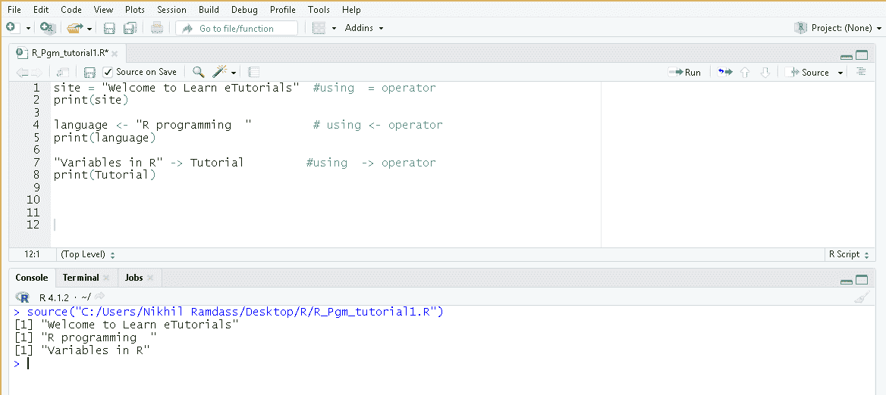
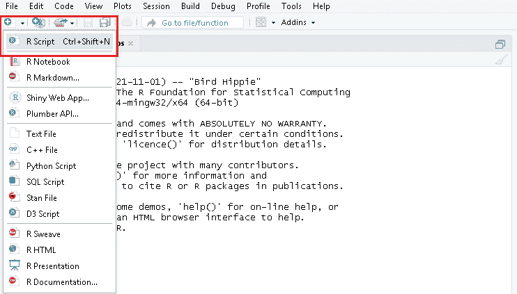
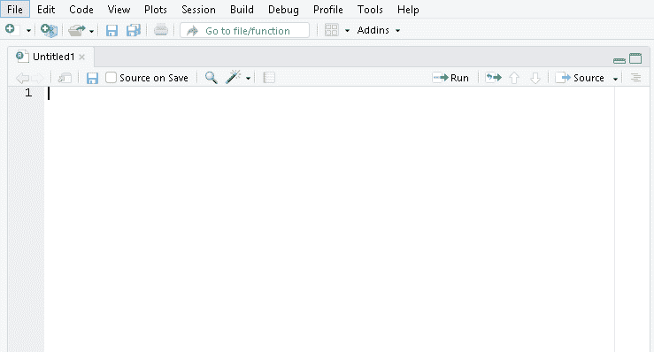
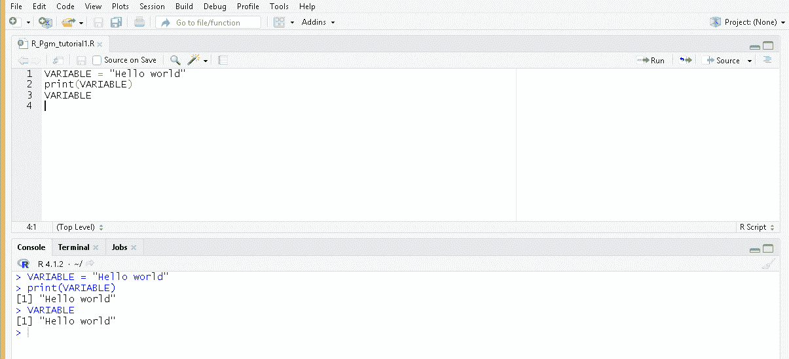
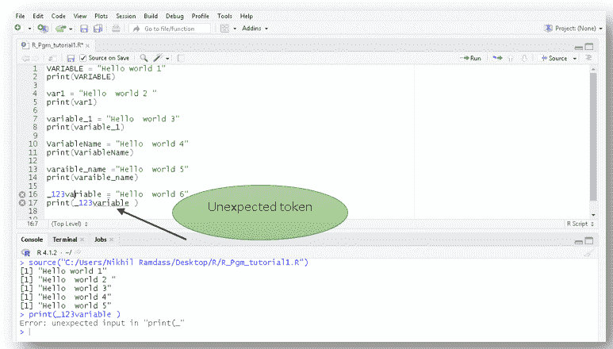

# R 编程中的变量

> 原文：<https://learnetutorials.com/r-programming/variables>

在我们之前的教程([R 编程的语法和基础知识](../r-programming/basics-for-beginners))中，我们深入了解了一个简单的 hello world 程序，它让您简要了解了如何使用 RStudio、基本语法以及如何用 R 编写注释。本教程将带您了解 R 的基础知识之一，即 R 中的变量和常量概念。如果您对 python 有任何先验知识，请转到( [Python](../python) )， [Go](../golang) 编程语言这将是一个很大的优势，在短时间内你将成为 R 语言的大师。其他人不要惊慌 R 是一种简单的语言，任何人都可以像蹒跚学步的孩子学习走路一样学习。 所以让我们跳到我们的教程，一起走。

## R 中的变量是什么？

**变量是保留的存储位置，用于在 R** 中存储数据值或向量或值列表或数据集或对象。像所有其他编程语言一样，内存位置中应该有一些空间可以保存 R 编程中使用的不同值。这些内存位置由一个名称来表示，该名称稍后在程序中调用，用于引用该地址空间并使用其中包含的相应值。每当在 R 程序中创建一个变量时，存储该变量所包含的值的相应存储位置都会被保留。换句话说，创建变量时会保留一个内存位置。

一旦在 R 程序执行期间创建了变量，它就识别变量的数据类型(存储在变量内部的数据类型可以是整数(3)、浮点数(3.9)、字符串(“R”))并分配相应的内存位置。


**注意**:只需理解 R 中变量的概念，忽略图片中变量的语法，你将在本教程接下来的章节中了解到这一点。

## 如何在 R 中声明和初始化变量？

在 R 编程语言中，有三种类型的运算符支持变量的声明和初始化。这三个运算符如下

1.  赋值运算符(=)
2.  向左运算符(
3.  向右运算符(->)

使用上述运算符为变量赋值的**语法**。

```r
 //Assignment Operator (=)
<variable_name>     =    <value >

//Leftward Operator (<-)
<variable_name>    <-    <value>

//Rightward Operator (->)
<value>     ->    <variable_name> 

```

### 在 R 中声明和初始化的程序

```r
 site = "Welcome to Learn eTutorials"  #using  = operator
print(site)

language <- "R programming  "         # using <- operator
print(language)

"Variables in R" -> Tutorial                #using -> operator
print(Tutorial) 

```

**输出:**

```r
 [1] "Welcome to Learn eTutorials"
[1] "R programming  "
[1] "Variables in R" 
```

在上面的程序中，创建了一个字符串数据类型的变量`site`。使用“ **`=`** ”等于或赋值运算符将值“**欢迎学习教程**”赋值给站点变量。类似地，创建了另一种变量语言，它保存值“R **编程**”。在这几行代码中**向左运算符**(“ **`<-`**”)给变量语言赋值。在最后几行代码中，您可以看到程序以初始化值“**R**中的变量”开始，然后是向右运算符“ **`->`** ”，该运算符为变量“教程”赋值。

让我们看看代码片段，看看这些代码是如何工作的



## 如何在 R Script 中编写变量代码？

让我们从经典的[你好世界节目](https://learnetutorials.com/r-programming/programs/hello-world-program)开始。您将创建一个字符串数据类型的变量 hello world，并打印结果语句。为了轻松编辑代码，我们将从熟悉 RStudio 和变量开始。

1.  打开一个 R 脚本文件。
2.  Click the R Script file which pops up with a new panel where you can easily start writing your codes.

    创建一个名为 variable 的变量，存储一个值“hello world！！!"字符串数据类型的。在 R 编程语言中，为了给变量赋值，我们使用了不同的运算符，这将在本教程后面讨论。让我们看一个简单的例子，使用“=”赋值运算符赋值“hello world！！!"to VARIABLE 和`print()`函数显示输出。

    ### 储存你好世界的程序！！！in VARIABLE

    ```r
     VARIABLE = "Hello world"
    print(VARIABLE) 

    ```

3.  在 R Script 文件面板中编写上述代码并运行代码。单击代码右侧的运行标签。
4.  单击运行后，用代码和相应的输出打开控制台。
5.  键入 VARIABLE 并运行代码来观察变化。

## R 中的命名约定

以下是 R 编程语言遵循的命名约定

1.  变量名只包含字母“ **a-z** ”或“ **A-Z** 或数字 **0-9** 以及字符**下划线“_”**。示例站点 _123，站点，站点
2.  变量区分大小写**。示例站点、站点、站点是不同类型的变量&值。**
***   关键字不用作变量。例如，如果，空，真，假*   变量名不允许以数字开头。示例 1 语言*   变量名不允许以下划线开头，它们是导致程序错误的意外标记。示例语言*   变量名可以以点开头。例子。站点 _123*   在 R 中，点(。)和下划线(_)符号只允许用于变量声明。示例语言$1，语言#$1*   变量名可以是大小写字母的混合。例如变量名，变量名称，变量，变量名。** 

 **| 有效惯例 | 无效约定 | 描述 |
| Site_123、site、site、SiteName、Sitename |   | 可用术语 |
| 语言 _1 | _ 语言，语言$1 | 不允许以下划线(_)和点以外的符号开头。 |
| 语言 1 | 1 语言 | 不允许以数字开头 |
| 。站点 _123 | . 123 _ 站点 | 允许以点开头，但不允许点后跟数字。 |

### 用 R 显示命名约定的程序

```r
 VARIABLE = "Hello world 1"
print(VARIABLE)

var1 = "Hello  world 2 "
print(var1)

variable_1 = "Hello  world 3"
print(variable_1)

VariableName = "Hello  world 4"
print(VariableName)

varaible_name ="Hello  world 5"
print(varaible_name)

_123variable = "Hello  world 6"
print(_123variable ) 

```

**输出:**

```r
 [1] "Hello world 1"] "Hello  world 2 "
[1] "Hello  world 3"
[1] "Hello  world 4"
[1] "Hello  world 5"
> print(_123variable )
Error: unexpected input in "print(_"
> 
```

查看代码片段，以便更好地理解代码。



## R 中变量的作用域是什么？

范围被定义为变量的生存期。范围是变量存在或适用的区域。考虑有一个叫`sample()`的函数。在函数`sample()`内部有一个名为**局部变量**的变量。变量**局部变量**的范围仅在函数`sample()`内。这意味着 local_variable 的生存期在该函数内。假设在`sample()`函数之外定义的任何其他函数试图访问这个声明为`sample()`函数本地的变量，它不能访问它。因为变量**局部变量**在块外不可见。这就是变量范围的含义。而在`sample()`函数外部声明的名为 **global_varaiable** 的变量在函数内部和函数外部都很容易访问。

注意:作用域是声明、初始化和使用变量的区域或段。当这个区域或块终止执行时，变量会自动销毁。

| 可变范围类型 | 描述 |
| **全局变量** | 可从程序的任何部分访问和可见的变量。变量的生命周期贯穿于程序执行的全过程。变量可以在函数内部或外部声明。变量可以从任何代码区域修改，可以从函数内部或外部修改。 |
| **局部变量** | 只能在函数或代码段中访问的变量。变量的生命周期或范围被限制在该函数内。变量在函数内部是局部声明的。变量只能在函数内部修改。 |

## 如何在 R 中声明全局变量？

在下面给出的程序中，一个名为**的全局变量**被声明为一个初始化值 45。程序包含一个函数`sample()`，函数内部提供了**全局变量**的打印语句，显示输出如下。稍后在功能`sample()`外的程序中，**全局 _ 变量**值更新为“**你好**”。

这个例子证明了全局变量的作用域在函数的内部和外部，在那里全局声明的变量是可访问和可见的。

### 显示全局变量声明的程序

```r
 # R program to declare  global variables

# global variable
global_variable = 45

# global variable accessed from a function sample()
sample = function(){
print(global_variable)
}
sample() 

# modified  global variable value
global_variable= "hello"
sample() 

```

**输出:**

```r
 [1] 45
[1] "hello" 
```

## 如何在 R 中声明局部变量？

在我们之前讨论的同一个程序中，声明了一个**局部变量**，并在函数`sample()`中赋值为“你好，我是局部变量”。程序执行并显示该值，随后**局部变量**的值在函数`sample()`中被修改为“你好，我的值被修改了”。

局部变量只能在本地访问，并且只能在定义它的函数中修改。

### 显示局部变量声明的程序

```r
 # R program to declare  local variables

# local variable accessed within a function sample()
sample = function(){
local_variable <- "hello i am local variable"
print(local_variable)

# modified local variable value
local_variable  <-"hello my value got modified"
print(local_variable)

} 

```

**输出:**

```r
 [1] "hello i am local variable"
[1] "hello my value got modified" 
```

## R 中变量使用的方法有哪些？

r 编程语言提供了一个对变量进行操作的特定内置函数。内置函数或方法允许确定变量的数据类型，检查程序中当前可用或存在的变量，以及删除或移除程序中不再需要的不必要变量。r 程序还支持一个内置方法来连接一个或多个变量。

让我们看一个表格，它给出了不同方法、它们的用法和语法的简单概念。

| 方法 | 描述 | 句法 |
| 类别() | 确定变量的数据类型 | 类(变量名称) |
| 是() | 检查当前可用的变量 | Is(变量名称) |
| rm() | 移除/删除变量 | 变量名称 |
| 粘贴() | 连接元素 | 粘贴(varaible _ 1，varaible _ 2) |

## 如何识别 R 中一个变量的数据类型？

在 R 编程语言中，变量的数据类型可以通过使用 R 包或标准库支持的内置函数来确定。支持识别变量数据类型的内置函数或方法为`class()`。

```r
 class(variable_name)
• Keyword class defines class() to identify data type of variable 

```

### 识别 R 中变量的数据类型的程序

```r
 site = "Welcome to Learn eTutorials"  #using  = operator
print(site)

language <- "R programming  "         # using <- operator
print(language)

"Variables in R" -> Tutorial                #using -> operator
print(Tutorial)

cat("The class of variable site is ",class(site),"\n")

cat(class(language),"\n")

cat("The class of Tutorial is ", class(Tutorial) , "\n ") 

```

**输出:**

```r
 [1] "Welcome to Learn eTutorials"
[1] "R programming  "
[1] "Variables in R"
The class of variable site is  character 
character 
The class of Tutorial is  character 
```

## 如何在 R 中检查可用变量？

在 R 编程语言中，可用的变量是使用一个名为`ls().`的内置函数来确定的

```r
 ls(variable_name)
• Keyword Is  defines  ls() function to check available variables in R program 

```

```r
 "language" "site.1"   "site.2"   "Tutorial" 

```

这些是在程序执行过程中由下面的程序显示的可用变量或活动变量。

### 检查可用变量的程序

```r
 site.1 = "Welcome to Learn eTutorials"  #using  = operator
print(site.1)

site.2 = "Learn eTutorials"
print(site.2)

language <- "R programming  "         # using <- operator
print(language)

"Variables in R" -> Tutorial                #using -> operator
print(Tutorial)

print(ls())      #To find available variables 

```

**输出:**

```r
 [1] "Welcome to Learn eTutorials"
[1] "Learn eTutorials"
[1] "R programming  "
[1] "Variables in R"
[1] "language" "site.1"   "site.2"   "Tutorial" 
```

## 如何删除 R 中的一个变量？

在 R 编程语言中，不必要的变量或没有功能的变量可以通过使用名为`rm()`的内置函数从程序中移除或删除。

```r
 rm(variable_name)
• Keyword rm defines rm() built in function that removes a variable. 

```

这些是在程序执行过程中由下面的程序显示的可用变量或活动变量。

### 移除/删除 R 中变量的程序

```r
 site.1 = "Welcome to Learn eTutorials"  #using  = operator
print(site.1)

site.2 = "Learn eTutorials"
print(site.2)

language <- "R programming  "         # using <- operator
print(language)

"Variables in R" -> Tutorial                #using -> operator
print(Tutorial) 

```

**输出:**

```r
 [1] "Welcome to Learn eTutorials"
[1] "Learn eTutorials"
[1] "R programming  "
[1] "Variables in R" 
```

让我们添加下面给定的内置函数`rm()`来删除一个变量，其中括号包含了要从程序中删除的变量的名称。

```r
 rm(site)
print(site) 

```

当这些代码行被添加时，名为`site`的变量从程序中移除。程序执行后可以看到下面相应的输出。

```r
 [1] "Welcome to Learn eTutorials"
[1] "Learn eTutorials"
[1] "R programming  "
[1] "Variables in R"
Warning message:
In rm(site) : object 'site' not found
Error in print(site) : object 'site' not found
Execution halted 
```

## 如何在 R 中串联变量？

r 编程语言支持一个称为`paste()`的内置函数来连接程序中的一个或多个变量。两个变量 A & B 分别在&**学习练习场**用值“**学习 R”声明。在该程序中，使用向左运算符将值分配给变量 A & B。**

### R 中连接变量的程序

```r
 A <- "Learn R in"
B <- "Learn eTutorials"

paste(A, B) 

```

当程序执行时，内置的`paste()`方法连接两个变量 A & B，产生如下所示的输出

```r
 [1] "Learn R in Learn eTutorials" 
```

## 如何给多个变量赋值？

r 支持对具有相同值的多个变量进行单行赋值。名为 first_variable、second_variable、third_variable 的三个变量使用左操作符赋值为相同的值，值为“helloo，很容易对！！！!"

### 分配多个变量值程序

```r
 # "Multiple value in single line"
first_variable <- second_variable <- third_varaible <- "helloo it is easy right!!!!"

# Print  values of variables
cat ("The first variable is ",first_variable,"\n")
cat ("The first variable is ",second_variable,"\n")
cat ("The first variable is ",third_varaible,"\n") 

```

**输出:**

```r
 The first variable is helloo it is easy right!!!! 
The first variable is helloo it is easy right!!!! 
The first variable is helloo it is easy right!!!! 
```

## R 中变量的类型有哪些？

r 支持两种类型的变量:

1.  **数值**:数值或数量变量存储数值以执行算术运算，如相加、sub、div、mul 或取平均值等。数值变量进一步分为连续变量和离散变量。
    *   连续变量可以是像高度这样的测量类型，它在给定的范围内取无穷大的值。
    *   离散数字变量是可以计数的特定值集。
2.  **分类**:分类或定性变量采用有限数量的不同类别。**